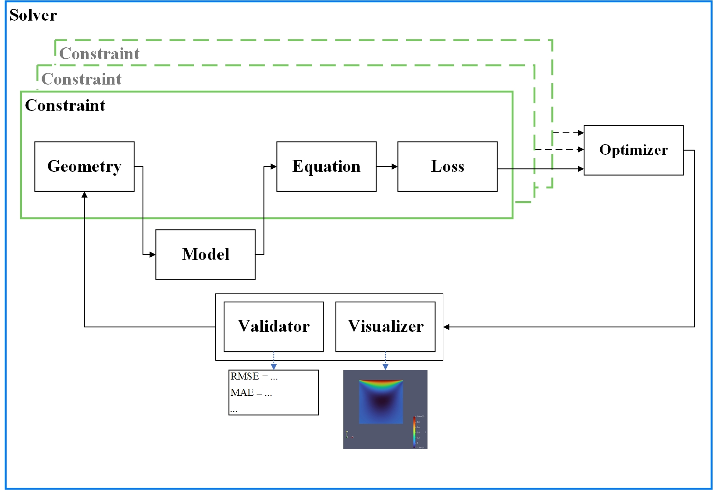
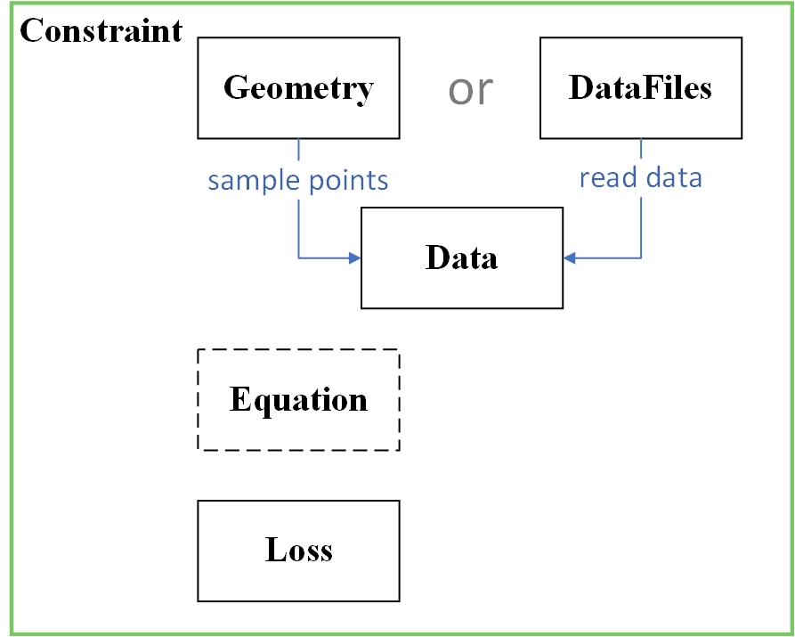
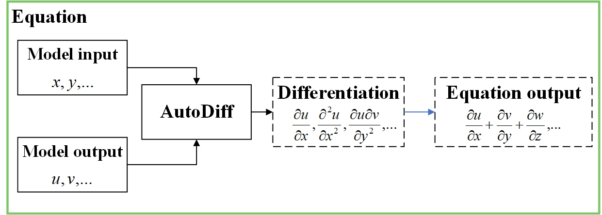

# PaddleScience Introduction

PaddleScience is divided into 12 modules in terms of code structure. From the perspective of a general deep learning workflow, these 12 modules are responsible for input data construction, neural network model construction, loss function construction, optimizer construction, training, evaluation, visualization, etc., respectively. From the perspective of scientific computing, some modules undertake functions different from CV and NLP tasks. For example, the Equation module for physical mechanism-driven tasks defines equation formulas and assists in high-order differential calculations; the Geometry module for geometric scene sampling defines simple and complex geometric shapes and samples internal and boundary data; the Constraint module regards different optimization objectives as a kind of "constraint", allowing the suite to unify three different solving processes: physical mechanism-driven, data-driven, and mathematical-physical fusion, using a single set of training code.

<!-- --8<-- [start:panorama] -->

<!-- --8<-- [end:panorama] -->

## 1. Overall Workflow

<figure markdown>
  { loading=lazy style="height:80%;width:80%"}
</figure>

The figure above is a schematic diagram of the PaddleScience workflow (taking geometry-based problem solving as an example). The process description is as follows:

1.  Geometry is responsible for constructing geometry and sampling on it to complete data construction;
2.  Use the Model module to accept input and get model output;
3.  Scientific computing tasks are special. Model output is often not the end point of forward calculation, and further calculation of variables required by equation formulas according to Equation is needed;
4.  Calculate the loss function and use the framework's automatic differentiation mechanism to calculate the gradients of all parameters;
5.  The above optimization objectives can be applied to different areas of geometry, such as interior and boundary areas, so there can be multiple Constraints in the figure above;
6.  Accumulate the gradients contributed by all Constraints and use them to update model parameters;
7.  If evaluation and visualization functions are enabled during training, the current model will be automatically evaluated and the prediction results will be visualized at a certain frequency;
8.  Solver is the global scheduling module for the operation of the entire suite, responsible for repeating the above process according to the number of rounds and frequency specified by the user.

## 2. Module Introduction

### 2.1 [Arch](./api/arch.md)

The Arch module is responsible for network model assembly, parameter initialization, forward calculation, etc., and has built-in multiple models for users to use.

### 2.2 [AutoDiff](./api/autodiff.md)

The AutoDiff module is responsible for calculating high-order differential functions. It has built-in global singletons `jacobian` and `hessian` based on Paddle's automatic differentiation mechanism for users to use.

### 2.3 [Constraint](./api/constraint.md)

<figure markdown>
  { loading=lazy style="height:50%;width:50%"}
</figure>

In order to unify the three solving methods of physical information-driven, data-driven, and mathematical-physical fusion in the suite, we record the necessary interfaces such as data construction, input-to-output calculation process, and loss function in the Constraint module after they are defined. With these interfaces, Constraint can represent different training objectives, such as:

- `InteriorConstraint` defines that within a given geometric region, according to the given input-to-output calculation process, the loss function is used to optimize the model parameters so that the model output meets the given conditions;
- `BoundaryConstraint` defines that on the boundary of a given geometric region, according to the given input-to-output calculation process, the loss function is used to optimize the model parameters so that the model output meets the given conditions;
- `SupervisedConstraint` defines that on the given supervised data (equivalent to supervised training in CV and NLP), according to the given input-to-output calculation process, the loss function is used to optimize the model parameters so that the model output meets the given conditions.
- ...

This module has two main functions. One is to unify two different optimization paradigms, physical information-driven and data-driven (the former is similar to supervised training, and the latter is similar to unsupervised training), in the code flow. The second is to enable the suite to be applied in scenarios of mathematical-physical fusion. You only need to construct different Constraints separately and let them participate in training together.

### 2.4 Data

The Data module is responsible for data reading, wrapping, and preprocessing, as shown below.

| Submodule Name | Submodule Function |
| :-- | :-- |
| [ppsci.data.dataset](./api/data/dataset.md)| Dataset related |
| [ppsci.data.transform](./api/data/process/transform.md)| Single data sample preprocessing related methods |
| [ppsci.data.batch_transform](./api/data/process/batch_transform.md)| Batch data preprocessing related methods |

### 2.5 [Equation](./api/equation.md)

<figure markdown>
  { loading=lazy style="height:80%;width:80%"}
</figure>

The Equation module is responsible for defining calculation functions for various common equations, such as `NavierStokes` for N-S equations and `Vibration` for vibration equations. Each equation contains calculation functions for related variables internally.

### 2.6 [Geometry](./api/geometry.md)

<figure markdown>
  { loading=lazy style="height:50%;width:50%" }
</figure>

The Geometry module is responsible for defining various common geometric shapes, such as `Interval` line segment geometry, `Rectangle` rectangle geometry, and `Sphere` spherical geometry.

### 2.7 [Loss](./api/loss/loss.md)

The Loss module includes two submodules: [`ppsci.loss.loss`](./api/loss/loss.md) and [`ppsci.loss.mtl`](./api/loss/mtl.md), as shown below.

| Submodule Name | Submodule Function |
| :-- | :-- |
| [ppsci.loss.loss](./api/loss/loss.md)| Loss function related |
| [ppsci.loss.mtl](./api/loss/mtl.md)| Multi-objective optimization related |

### 2.8 Optimizer

The Optimizer module includes two submodules: [`ppsci.optimizer.optimizer`](./api/optimizer.md) and [`ppsci.optimizer.lr_scheduler`](./api/lr_scheduler.md), as shown below.

| Submodule Name | Submodule Function |
| :-- | :-- |
| [ppsci.utils.optimizer](./api/optimizer.md)| Optimizer related |
| [ppsci.utils.lr_scheduler](./api/lr_scheduler.md)| Learning rate scheduler related |

### 2.9 [Solver](./api/solver.md)

The Solver module is responsible for defining the solver as the startup and management engine for training, evaluation, inference, and visualization.

### 2.10 Utils

The Utils module stores some utility classes and functions suitable for multiple scenarios, such as data reading functions in `reader.py`, log printing functions in `logger.py`, and equation calculation classes in `expression.py`.

It is subdivided into the following 8 submodules according to its function:

| Submodule Name | Submodule Function |
| :-- | :-- |
| [ppsci.utils.checker](./api/utils/checker.md)| ppsci installation function check related |
| [ppsci.utils.expression](./api/utils/expression.md)| Responsible for forward calculation of models and equations involved in training, evaluation, and visualization |
| [ppsci.utils.initializer](./api/utils/initializer.md)| Common parameter initialization methods |
| [ppsci.utils.logger](./api/utils/logger.md)| Log printing module |
| [ppsci.utils.misc](./api/utils/misc.md)| Store general functions |
| [ppsci.utils.reader](./api/utils/reader.md)| File reading module |
| [ppsci.utils.writer](./api/utils/writer.md)| File writing module |
| [ppsci.utils.save_load](./api/utils/save_load.md)| Model parameter saving and loading |
| [ppsci.utils.symbolic](./api/utils/symbolic.md)| sympy symbolic calculation function related |

### 2.11 [Validate](./api/validate.md)

The Validator module is responsible for defining various validators for evaluating on specified data (optional, evaluation is not enabled by default during training) and obtaining evaluation metrics.

### 2.12 [Visualize](./api/visualize.md)

The Visualizer module is responsible for defining various visualizers for predicting on specified data after model evaluation (optional, visualization is not enabled by default during training) and saving the results as visualized files.
