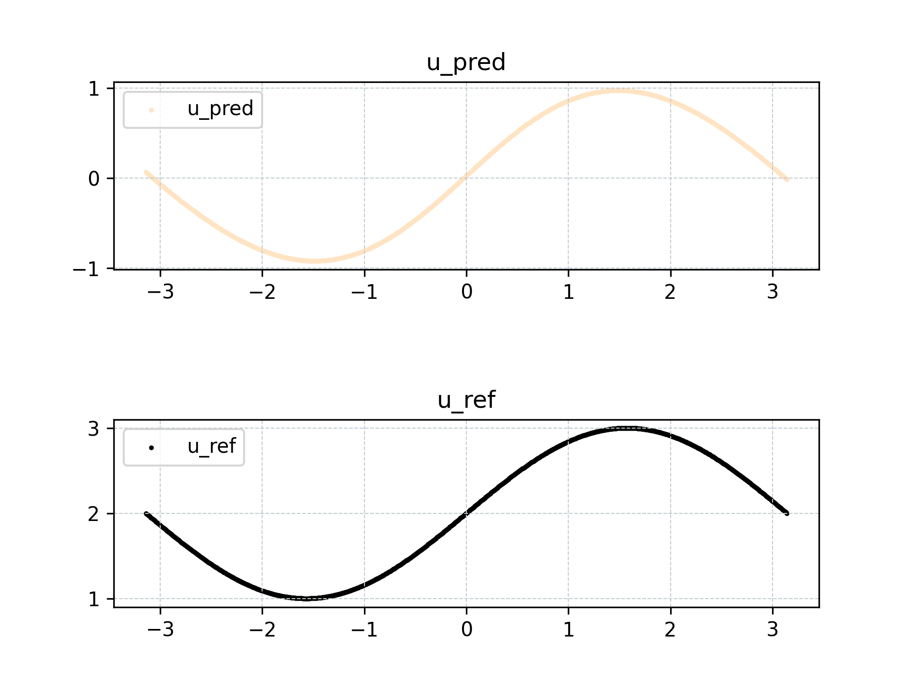
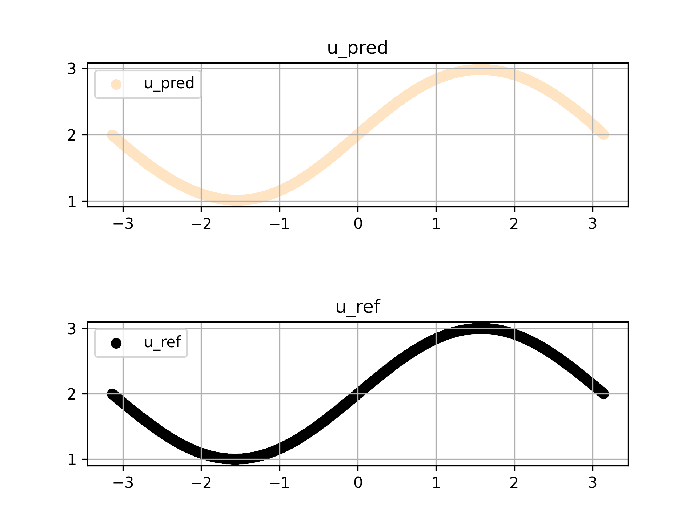

# Quick Start

<a href="https://aistudio.baidu.com/projectdetail/6665190?contributionType=1&sUid=438690&shared=1&ts=1692616326196" class="md-button md-button--primary" style>AI Studio Quick Experience</a>

This guide demonstrates how to use PaddleScience to train a model, solve equation learning and prediction problems, and visualize results through a simple demo and its extension.

## 1. Problem Introduction

Consider the task of using a neural network to fit the function $u=\sin(x)$ over the interval $x \in [-\pi, \pi]$. We explore two scenarios to fit $u=\sin(x)$ as accurately as possible: one where the target function is known, and another where it is unknown.

In the **first scenario**, assuming the analytical solution $u=\sin(x)$ is known, we employ supervised learning. We generate labeled data pairs $(x, u)$ using the formula and train the model to map the independent variable $x$ to the dependent variable $u$.

In the **second scenario**, assuming the analytical solution $u$ is unknown but satisfies a specific differential relationship, we demonstrate how to train the model using a differential equation, specifically $\dfrac{\partial u} {\partial x}=\cos(x)$, along with boundary conditions.

## 2. Scenario 1

Target fitted function:

$$
u=\sin(x), x \in [-\pi, \pi].
$$

We generate $N$ pairs of data $(x_i, u_i), i=1,...,N$ as supervised data for training.

Before writing the code, we first import the necessary packages.

``` py linenums="1"
--8<--
examples/quick_start/case1.py:1:4
--8<--
```

Next, create directories for logging and model checkpoints. This step is standard practice before initializing most training tasks.

``` py linenums="6"
--8<--
examples/quick_start/case1.py:6:13
--8<--
```

Now, we proceed with the core implementation.

First, define the problem domain. We use `ppsci.geometry.Interval` to define a 1D line segment, facilitating the sampling of points $x$ within this domain.

``` py linenums="15"
--8<--
examples/quick_start/case1.py:15:17
--8<--
```

Then define a simple 3-layer MLP model.

``` py linenums="19"
--8<--
examples/quick_start/case1.py:19:20
--8<--
```

This configuration specifies that the model takes the independent variable $x$ as input and outputs the prediction $\hat{u}$.

Next, we define the calculation function for the known solution $u=\sin(x)$ and use it within `ppsci.constraint.InteriorConstraint` to generate label data. `InteriorConstraint` guides model optimization by enforcing consistency between model predictions and label data sampled within the specified geometry.

``` py linenums="22"
--8<--
examples/quick_start/case1.py:22:47
--8<--
```

Here, `interior_constraint` encapsulates the training objective: optimizing the model such that its prediction $\hat{u}$ approximates the label value $u$ as closely as possible within the interval $[-\pi, \pi]$.

We then define the training configuration, including epochs, the optimizer, and the visualizer.

``` py linenums="48"
--8<--
examples/quick_start/case1.py:48:66
--8<--
```

Finally, pass the defined objects to the `Solver` class to initiate model training.

``` py linenums="67"
--8<--
examples/quick_start/case1.py:67:79
--8<--
```

Post-training, we calculate the L2 relative error against the analytical solution using the 1,000 sampled points.

``` py linenums="81"
--8<--
examples/quick_start/case1.py:81:86
--8<--
```

Then visualize the prediction results of these 1000 points.

``` py linenums="88"
--8<--
examples/quick_start/case1.py:88:89
--8<--
```

The training log is displayed below.

``` log
...
...
ppsci INFO: [Train][Epoch  9/10][Iter  80/100] lr: 0.00200, loss: 0.00663, EQ: 0.00663, batch_cost: 0.00180s, reader_cost: 0.00011s, ips: 17756.64, eta: 0:00:00
ppsci INFO: [Train][Epoch  9/10][Iter  90/100] lr: 0.00200, loss: 0.00598, EQ: 0.00598, batch_cost: 0.00180s, reader_cost: 0.00011s, ips: 17793.97, eta: 0:00:00
ppsci INFO: [Train][Epoch  9/10][Iter 100/100] lr: 0.00200, loss: 0.00547, EQ: 0.00547, batch_cost: 0.00179s, reader_cost: 0.00011s, ips: 17864.08, eta: 0:00:00
ppsci INFO: [Train][Epoch 10/10][Iter  10/100] lr: 0.00200, loss: 0.00079, EQ: 0.00079, batch_cost: 0.00182s, reader_cost: 0.00012s, ips: 17547.05, eta: 0:00:00
ppsci INFO: [Train][Epoch 10/10][Iter  20/100] lr: 0.00200, loss: 0.00075, EQ: 0.00075, batch_cost: 0.00183s, reader_cost: 0.00011s, ips: 17482.92, eta: 0:00:00
ppsci INFO: [Train][Epoch 10/10][Iter  30/100] lr: 0.00200, loss: 0.00077, EQ: 0.00077, batch_cost: 0.00182s, reader_cost: 0.00011s, ips: 17539.51, eta: 0:00:00
ppsci INFO: [Train][Epoch 10/10][Iter  40/100] lr: 0.00200, loss: 0.00074, EQ: 0.00074, batch_cost: 0.00182s, reader_cost: 0.00011s, ips: 17587.51, eta: 0:00:00
ppsci INFO: [Train][Epoch 10/10][Iter  50/100] lr: 0.00200, loss: 0.00071, EQ: 0.00071, batch_cost: 0.00182s, reader_cost: 0.00011s, ips: 17563.59, eta: 0:00:00
ppsci INFO: [Train][Epoch 10/10][Iter  60/100] lr: 0.00200, loss: 0.00070, EQ: 0.00070, batch_cost: 0.00182s, reader_cost: 0.00011s, ips: 17604.60, eta: 0:00:00
ppsci INFO: [Train][Epoch 10/10][Iter  70/100] lr: 0.00200, loss: 0.00074, EQ: 0.00074, batch_cost: 0.00181s, reader_cost: 0.00011s, ips: 17699.28, eta: 0:00:00
ppsci INFO: [Train][Epoch 10/10][Iter  80/100] lr: 0.00200, loss: 0.00077, EQ: 0.00077, batch_cost: 0.00180s, reader_cost: 0.00011s, ips: 17764.92, eta: 0:00:00
ppsci INFO: [Train][Epoch 10/10][Iter  90/100] lr: 0.00200, loss: 0.00075, EQ: 0.00075, batch_cost: 0.00180s, reader_cost: 0.00011s, ips: 17795.87, eta: 0:00:00
ppsci INFO: [Train][Epoch 10/10][Iter 100/100] lr: 0.00200, loss: 0.00071, EQ: 0.00071, batch_cost: 0.00179s, reader_cost: 0.00011s, ips: 17872.00, eta: 0:00:00
```

After training, calculate the L2-relative error with the standard solution using the 1000 points just taken.

``` py linenums="81"
--8<--
examples/quick_start/case1.py:81:86
--8<--
```

The results demonstrate that supervised training using the analytical solution yields strong predictive performance, achieving an L2 relative error of 0.02677.

The prediction result visualization is shown below.



The complete code for Scenario 1 is shown below.

``` py linenums="1" title="examples/quick_start/case1.py"
--8<--
examples/quick_start/case1.py
--8<--
```

## 3. Scenario 2

While the supervised approach in Scenario 1 effectively solves the fitting problem, the analytical expression of the target function is often unknown in practice, preventing direct construction of supervised labels.

However, even without an analytical formula, the target function often satisfies specific mathematical relationships, such as differential equations. We can thus optimize the model via "indirect supervision" by enforcing these relationships.

In this scenario, we assume the formula $u=\sin(x)$ is unavailable. Instead, we rely on the following system, comprising a differential equation and a boundary condition:

$$
\begin{cases}
\begin{aligned}
    \dfrac{\partial u} {\partial x} &= \cos(x) \\
    u(-\pi) &= 2
\end{aligned}
\end{cases}
$$

We construct data pairs $(x_i, \cos(x_i))$ for $i=1,...,N$.
The model input and output remain unchanged, but the optimization objective shifts: we aim to minimize the difference between $\dfrac{\partial \hat{u}} {\partial x}$ and $\cos(x)$, while ensuring $\hat{u}(-\pi)$ approximates $2$.

Based on this principle, we adapt the code from Scenario 1 for Scenario 2.

First, since we need to use the first-order differential operation, we need to import the first-order differential API at the beginning of the code.

``` py linenums="1" hl_lines="4"
--8<--
examples/quick_start/case2.py:1:5
--8<--
```

Add a function to calculate the differential label value.

``` py linenums="28" hl_lines="4"
--8<--
examples/quick_start/case2.py:28:30
--8<--
```

Modify the `interior_constraint` to constrain the "first-order derivative of the model output with respect to the input" rather than the output itself.

``` py linenums="33" hl_lines="4"
--8<--
examples/quick_start/case2.py:33:49
--8<--
```

Since differential equations typically involve undetermined coefficients resolved by definite conditions (initial or boundary values), we add a boundary condition constraint, `bc_constraint`, following the `interior_constraint`.

``` py linenums="50"
--8<--
examples/quick_start/case2.py:50:65
--8<--
```

1. Corresponding boundary condition $u(x_0)=sin(x_0)+2$

Then add the boundary constraint `bc_constraint` to `constraint`.

``` py linenums="66" hl_lines="4"
--8<--
examples/quick_start/case2.py:66:70
--8<--
```

Similarly, modify the standard solution drawn by Visualizer to $sin(x)+2$.

``` py linenums="77" hl_lines="5"
--8<--
examples/quick_start/case2.py:77:89
--8<--
```

Execute training after modification.

``` py linenums="91"
--8<--
examples/quick_start/case2.py:91:102
--8<--
```

The training log is displayed below.

``` log
...
...
ppsci INFO: [Train][Epoch  9/10][Iter  90/100] lr: 0.00200, loss: 0.00176, EQ: 0.00087, BC: 0.00088, batch_cost: 0.00346s, reader_cost: 0.00024s, ips: 9527.80, eta: 0:00:00
ppsci INFO: [Train][Epoch  9/10][Iter 100/100] lr: 0.00200, loss: 0.00170, EQ: 0.00087, BC: 0.00083, batch_cost: 0.00349s, reader_cost: 0.00024s, ips: 9452.07, eta: 0:00:00
ppsci INFO: [Train][Epoch 10/10][Iter  10/100] lr: 0.00200, loss: 0.00107, EQ: 0.00072, BC: 0.00035, batch_cost: 0.00350s, reader_cost: 0.00025s, ips: 9424.75, eta: 0:00:00
ppsci INFO: [Train][Epoch 10/10][Iter  20/100] lr: 0.00200, loss: 0.00116, EQ: 0.00083, BC: 0.00033, batch_cost: 0.00350s, reader_cost: 0.00025s, ips: 9441.33, eta: 0:00:00
ppsci INFO: [Train][Epoch 10/10][Iter  30/100] lr: 0.00200, loss: 0.00103, EQ: 0.00079, BC: 0.00024, batch_cost: 0.00355s, reader_cost: 0.00025s, ips: 9291.90, eta: 0:00:00
ppsci INFO: [Train][Epoch 10/10][Iter  40/100] lr: 0.00200, loss: 0.00108, EQ: 0.00078, BC: 0.00030, batch_cost: 0.00353s, reader_cost: 0.00025s, ips: 9348.09, eta: 0:00:00
ppsci INFO: [Train][Epoch 10/10][Iter  50/100] lr: 0.00200, loss: 0.00163, EQ: 0.00082, BC: 0.00082, batch_cost: 0.00350s, reader_cost: 0.00024s, ips: 9416.24, eta: 0:00:00
ppsci INFO: [Train][Epoch 10/10][Iter  60/100] lr: 0.00200, loss: 0.00160, EQ: 0.00083, BC: 0.00077, batch_cost: 0.00353s, reader_cost: 0.00024s, ips: 9345.73, eta: 0:00:00
ppsci INFO: [Train][Epoch 10/10][Iter  70/100] lr: 0.00200, loss: 0.00150, EQ: 0.00082, BC: 0.00068, batch_cost: 0.00351s, reader_cost: 0.00024s, ips: 9393.89, eta: 0:00:00
ppsci INFO: [Train][Epoch 10/10][Iter  80/100] lr: 0.00200, loss: 0.00146, EQ: 0.00081, BC: 0.00064, batch_cost: 0.00350s, reader_cost: 0.00024s, ips: 9424.81, eta: 0:00:00
ppsci INFO: [Train][Epoch 10/10][Iter  90/100] lr: 0.00200, loss: 0.00138, EQ: 0.00081, BC: 0.00058, batch_cost: 0.00349s, reader_cost: 0.00024s, ips: 9444.12, eta: 0:00:00
ppsci INFO: [Train][Epoch 10/10][Iter 100/100] lr: 0.00200, loss: 0.00133, EQ: 0.00079, BC: 0.00054, batch_cost: 0.00349s, reader_cost: 0.00024s, ips: 9461.54, eta: 0:00:00
```

After training, calculate the L2-relative error with the standard solution using the 1000 points just taken.

``` py linenums="104"
--8<--
examples/quick_start/case2.py:104:109
--8<--
```

The model, trained using the differential equation, exhibits strong predictive capability relative to the analytical solution, achieving an L2 relative error of 0.00564.

The prediction result visualization is shown below.



This demonstrates that training with differential relationships, combined with boundary conditions, allows the model to effectively learn the correct solution satisfying both the physics (equation) and the constraints.

The complete code for Scenario 2 is shown below.

``` py linenums="1"
--8<--
examples/quick_start/case2.py
--8<--
```
