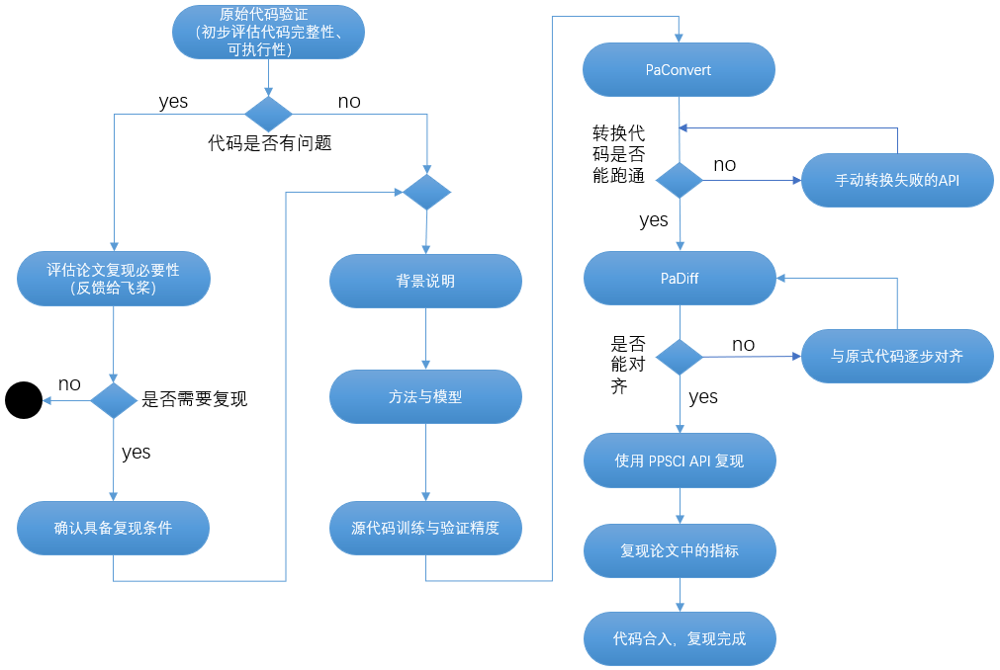

# Model Reproduction Process and Acceptance Criteria

This document describes how to perform model reproduction based on the PaddleScience suite and ultimately contribute to the PaddleScience suite.

## 1. Background

### 1.1 Reproduction Goals

In model reproduction tasks in the field of AI for Science (hereinafter referred to as AI4S), it is usually necessary to reproduce the original code in standard papers based on PaddlePaddle. At the same time, some open tasks may be involved, such as providing construction goals, and participants use PaddlePaddle to create all codes by themselves. Focusing on the above tasks, the following model reproduction process, acceptance criteria and methods are formulated, in which **corresponding explanatory documents must be formed for each process of each stage**.

### 1.2 PaddlePaddle and PaddleScience

Unless otherwise specified, model reproduction requires PaddleScience by default.

- PaddleScience

    An AI4S suite based on PaddlePaddle, providing general functions for the AI4S field, such as complex geometric shape analysis, general differential equations, data-driven/physical mechanism/mathematical-physical fusion solvers, etc., facilitating the development of AI4S field related models. For details, please refer to [PaddleScience Documentation](https://paddlescience-docs.readthedocs.io/zh-cn/latest/).

- PaddlePaddle

    A domestic open source deep learning platform, providing basic functions and general APIs for deep learning, facilitating the development of deep learning models. For details, please refer to [Paddle API Documentation](https://www.paddlepaddle.org.cn/documentation/docs/en/develop/api/index_en.html).

## 2. Reproduction Steps

Prioritize reproduction based on PaddleScience. If the implementation logic of the reproduction code conflicts seriously with PaddleScience, consider using PaddlePaddle API for reproduction.



### 2.1 Baseline Paper Understanding, Original Code Running, Paper Result Reproduction

In this stage, participants need to carefully understand the original paper and the provided code, and explain the paper in chapters such as background, method and model, training and validation, results, outlook and acknowledgement. During the process, the code provided by the paper needs to be verified to confirm that the code is complete and executable, and can obtain the results listed in the paper. **The main purpose of this part is for other users to better understand the significance of this reproduction work**. Key illustrations are as follows:

1. Original Code Verification

    Preliminarily compare with the results provided in the baseline paper to evaluate whether the provided code is complete and executable. Specifically:

    - If there are problems, feedback the paper problems to the PaddlePaddle team. The PaddlePaddle team will evaluate the necessity of paper/model reproduction. If the paper/model is of high value and meets the conditions for reproduction, the reproduction process can be re-entered;
    - If there are no problems, formally enter the paper/model reproduction stage.

2. Background Explanation

    Combining the given paper, explain the domain problems described in the paper (eg. fluid, material, etc.), introduce your own reproduction/development work, that is, have a complete introduction to the abstract and introduction in the baseline paper (open topics describe the background of the topic), and then explain the methods and applied models of the paper.

3. Method and Model

    Explain the theories, methods and principles of the network models used in the baseline paper, that is, explain the core technical part of the paper, and also explain the value reflected by the method and model in the paper (or advantages compared to traditional solving methods, etc.).

4. Training and Validation

    For typical cases provided in the baseline paper, explain the principle of the case as a whole (eg. fluid N-S equation solution), explain the training process (such as dataset source, content, hyperparameter setting, hardware environment and training time, etc.).

### 2.2 Code Reproduction Based on PaddleScience

1. If the source code is implemented using pytorch, you can prioritize using [PaConvert](https://github.com/PaddlePaddle/PaConvert#%E6%9C%80%E8%BF%91%E6%9B%B4%E6%96%B0) to automatically convert pytorch code to paddle code with one click, and cooperate with [PaDiff](https://github.com/PaddlePaddle/PaDiff#%E7%AE%80%E4%BB%8B) to verify the accuracy alignment of the model before and after conversion; if the source code is implemented using non-pytorch (such as tensorflow), you need to list the APIs that need to be reproduced based on PaddlePaddle, and also need to form an API mapping table, manually convert tensorflow API to paddle API based on this mapping table. If PaddlePaddle lacks corresponding APIs, it can be emphasized.

2. PaddlePaddle Code Running

    After completing API-based reproduction, it is necessary to combine the model in the paper to achieve PaddlePaddle-based code running, and use the PaDiff tool to iterate and correct for forward and backward alignment (such as gradual alignment with the original code may be required).

3. Convert PaddlePaddle Code to PaddleScience Code

    To improve code reusability and simplicity, the Paddle implementation needs to be converted into the API implementation provided by the PaddleScience suite. PaddleScience provides general functions for the AI4S field. For the specific process, please refer to: [PaddleScience Development Guide](./development.md).

4. Reproduce Paper Indicator Results

    Combine the typical demo mentioned in the paper to reproduce key indicators, that is, be able to reproduce the indicators in the paper based on PaddlePaddle, such as charts, data, etc., and their convergence trends, values, etc. should be basically consistent (relative error with indicators provided by the author is within ±10%).

5. Code Merging, Complete Reproduction

    If all the above activities are fully achieved, the code for paper/model reproduction can be submitted as a PR to the specified Repo according to the requirements of "Code Specification" below. After passing the review, 90% of the reproduction work can be considered completed, and acceptance can be carried out.

## 3. Acceptance Criteria

### 3.1 Deliverable List

| Deliverable | Specific Content |
| ----- | ---- |
| Model | Code reproduced based on PaddleScience, model pre-training parameters |
| Document     | AIStudio Document, PaddleScience Document |

### 3.2 Specific Evaluation Criteria

#### 3.2.1 Model Correctness Evaluation

Qualitative analysis: The model convergence curve and final effect diagram can be consistent with the paper.
Quantitative analysis: If the paper contains quantitative indicators, the relative error between the reproduction indicator and the paper indicator must satisfy: $\dfrac{|Reproduction Indicator - Source Code Indicator|}{Source Code Indicator} \le 10\%$

#### 3.2.2 Code Specification

The overall code specification follows PEP8 [https://peps.python.org/pep-0008/](https://peps.python.org/pep-0008/). In addition, attention should be paid to:

- In file and folder naming, try to use underscore `_` instead of space, do not use `-`.
- During the model definition process, there needs to be a unified variable (parameter) naming management method, such as trying to manually declare the name of each variable and support variable names, forbidding defining the name as a constant (such as "embedding"), to avoid various strange problems during the code reuse stage.
- For important files, the variable name definition process needs to be able to indicate the meaning through the name, forbidding the use of ambiguous names, such as net.py, aaa.py, etc.
- When defining file (folder) paths in code, `os.path.join` must be used, and `string` addition is forbidden, which will cause the model to lack support for the `windows` environment.
- For important parts of the code, comments need to be added to introduce functions, helping users quickly familiarize themselves with the code structure, including but not limited to:

  - Definition of Dataset, DataLoader.
  - The entire model definition, including input, calculation process, loss, etc.
  - init, save, load, and other io parts.
  - Key states in the middle of running, such as print loss, save model, etc.
- An example that conforms to code specifications is as follows.

    ``` py
    from paddle import io
    from paddle.vision import transforms as T
    from PIL import Image
    import numpy as np


    IMAGE_SIZE = 256


    class PetDataset(io.Dataset):
        """
        Pet Dataset Definition
        """

        def __init__(self, mode="train"):
            """
            Constructor
            """
            if mode not in ["train", "test", "predict"]:
                raise ValueError(
                    f"mode should be 'train' or 'test' or 'predict', but got {mode}"
                )
            self.image_size = IMAGE_SIZE
            self.mode = mode
            self.train_images = []
            self.label_images = []
            with open(f"./{self.mode}.txt", "r") as f:
                for line in f.readlines():
                    image, label = line.strip().split("\t")
                    self.train_images.append(image)
                    self.label_images.append(label)

        def _load_img(self, path, color_mode="rgb", transforms=[]):
            """
            Unified image processing interface encapsulation for regularizing image size and channels
            """
            img = Image.open(path)
            if color_mode == "grayscale":
                # if image is not already an 8-bit, 16-bit or 32-bit grayscale image
                # convert it to an 8-bit grayscale image.
                if img.mode not in ("L", "I;16", "I"):
                    img = img.convert("L")
            elif color_mode == "rgba":
                if img.mode != "RGBA":
                    img = img.convert("RGBA")
            elif color_mode == "rgb":
                if img.mode != "RGB":
                    img = img.convert("RGB")
            else:
                raise ValueError(
                    f"color_mode should be 'grayscale', 'rgb', or 'rgba', but got {color_mode}"
                )
            return T.Compose([T.Resize(self.image_size)] + transforms)(img)

        def __getitem__(self, idx):
            """
            Return image, label
            """
            train_image = self._load_img(
                self.train_images[idx],
                transforms=[T.Transpose(), T.Normalize(mean=127.5, std=127.5)],
            )  # Load original image
            label_image = self._load_img(
                self.label_images[idx], color_mode="grayscale", transforms=[T.Grayscale()]
            )  # Load Label image
            # Return image, label
            train_image = np.array(train_image, dtype="float32")
            label_image = np.array(label_image, dtype="int64")
            return train_image, label_image

        def __len__(self):
            """
            Return total number of datasets
            """
            return len(self.train_images)
    ```

- The provided code can run training and evaluation normally.

#### 3.2.3 Document Specification

AIStudio Document Reference: [PaddleScience-DarcyFlow - PaddlePaddle AI Studio](https://aistudio.baidu.com/aistudio/projectdetail/6184070)

PaddleScience Official Website Documentation Needs to Satisfy:

- After reproduction is completed, a model document needs to be written, which needs to include model introduction, problem definition, problem solving (explain the writing process of training, evaluation and visualization code step by step), complete code, result display diagrams and other chapters.
- At the beginning of the document, you need to add the reproduced paper title, paper address and reference code link, and it is recommended to thank the author of the reference code.
- The code is properly encapsulated, easy to read, and does not use arbitrary variable/class/function naming.
- Comments are clear, not only explaining what was done, but also explaining why it was done.
- If the model depends on dependencies not covered by PaddlePaddle (such as pandas), you need to explain which dependencies need to be installed at the beginning of the document.
- Random control, need to fix the random seed of modules containing random factors as much as possible to ensure that the model can be reproduced normally (PaddleScience suite provides `ppsci.utils.misc.set_random_seed(seed_num)` statement to control global random numbers).
- Hyperparameters: Internal hyperparameters of the model are forbidden to be hard-coded, and should be configured through configuration files as much as possible.
- Attach reference papers, reference code URLs, and download links for reproduced trained model parameters at the end of the document. Overall document writing can refer to: [Document Reference Example (darcy2d)](https://paddlescience-docs.readthedocs.io/zh-cn/latest/zh/examples/darcy2d/).
