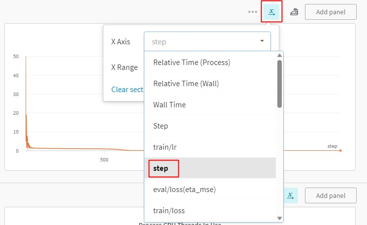

# User Guide

This document describes how to use common basic and advanced features in PaddleScience. Basic features include resuming training from breakpoints, transfer learning, model evaluation, and model inference; advanced features include distributed training (currently only supports data parallelism), mixed precision training, and gradient accumulation.

## 1. Basic Features

### 1.1 Use YAML + hydra

PaddleScience recommends using [YAML](https://pyyaml.org/wiki/PyYAMLDocumentation) files to control processes such as program training, evaluation, and inference. Its main principle is to use the [hydra](https://hydra.cc/) configuration management tool to parse configuration parameters from files in `*.yaml` format and pass them to the running code, so as to flexibly configure fields such as hyperparameters used during program runtime and improve experimental efficiency. This chapter mainly introduces the basic usage of the hydra configuration management tool.

Before using hydra to configure running parameters, please execute the following command to check if `hydra` is installed.

``` sh
pip show hydra-core
```

If not installed, you need to execute the following command to install `hydra`.

``` sh
pip install hydra-core
```

#### 1.1.1 Print Running Configuration

!!! warning

    Please note that the method of printing running configuration in this tutorial is **only for debugging**. Hydra will terminate the program immediately after printing the configuration by default. Therefore, do not add the `-c job` parameter when running the program normally.

Taking the bracket case as an example, its normal running command is: `python bracket.py`. If `-c job` is added to the end of its running command, the configuration parameters parsed from the running configuration file `conf/bracket.yaml` can be printed, as shown below.

``` sh title="$ python bracket.py {++-c job++}"
mode: train
seed: 2023
output_dir: ${hydra:run.dir}
log_freq: 20
NU: 0.3
E: 100000000000.0
...
...
EVAL:
  pretrained_model_path: null
  eval_during_train: true
  eval_with_no_grad: true
  batch_size:
    sup_validator: 128
```

#### 1.1.2 Save Experiment Code Snapshot⭐

Although we provide a running configuration system based on hydra and Omegaconf, modifying source code may still be involved in addition to configuration files, which will also lead to confusion in experimental code versions and difficulty in tracking.

To solve this problem, PaddleScience provides a code difference tracking function. By adding `trace=True` to the end of the running command, the current code snapshot can be automatically saved to the `output_dir/code_snapshot/uncommitted.diff` file, facilitating subsequent tracking and reproduction.

Taking `allen_cahn_piratenet.py` as an example, first confirm that the GitPython package is installed in the Python environment.

``` sh
python -m pip install GitPython
```

Then add the `trace=True` parameter to the end of the running command.

``` sh
python allen_cahn_piratenet.py {++trace=True++}
```

Its printed log is as follows:

``` log hl_lines="1-9"
ppsci MESSAGE: [Code Trace] Git Information:
ppsci MESSAGE:   Branch : support_code_trace
ppsci MESSAGE:   Commit : 5ea90ae584b7fff17ff5aa385ba5abb6c04c268c
ppsci MESSAGE:   Date   : 2025-06-24T20:48:07+08:00
ppsci MESSAGE:   Dirty  : True
ppsci INFO: [Code Trace] Staged changes saved to: outputs_allen_cahn_piratenet/2025-07-02/20-13-46/code_snapshot/staged.diff
ppsci INFO: [Code Trace] To restore your code to this staged version, run: git apply outputs_allen_cahn_piratenet/2025-07-02/20-13-46/code_snapshot/staged.diff
ppsci INFO: [Code Trace] Unstaged changes saved to: outputs_allen_cahn_piratenet/2025-07-02/20-13-46/code_snapshot/unstaged.diff
ppsci INFO: [Code Trace] To restore your code to this unstaged version, run: git apply outputs_allen_cahn_piratenet/2025-07-02/20-13-46/code_snapshot/unstaged.diff
W0702 20:13:46.390472 37150 gpu_resources.cc:114] Please NOTE: device: 0, GPU Compute Capability: 7.0, Driver API Version: 12.0, Runtime API Version: 11.6
ppsci MESSAGE: 'shuffle' and 'drop_last' are both set to False in default as sampler config is not specified.
ppsci INFO: Auto collation is disabled and set num_workers to 0 to speed up batch sampling.
ppsci INFO: Using paddlepaddle develop(f701bb1) on device Place(gpu:0)
ppsci MESSAGE: Set to_static=False for computational optimization.
...
```

After enabling this function, the system will record more detailed code version information in the log and automatically save the snapshot of the current code modification difference to `output_dir/code_snapshot/*.diff`. When needed, you can use the `git apply` command to restore the code to the state at the time of the corresponding snapshot.

!!! warning "Precautions"

    - If you need to track new files, you need to use `git add` to add the new files to the staging area before they can be tracked.
    - To use this function, ensure that the currently developed code base is a git repository and that there is a `.git` folder in the current code base, otherwise it cannot be tracked.

#### 1.1.3 Configure Parameters via Command Line

Still taking the configuration file `bracket.yaml` as an example, the parameter configuration related to the learning rate is as follows.

``` yaml title="bracket.yaml"
...
TRAIN:
  epochs: 2000
  iters_per_epoch: 1000
  save_freq: 20
  eval_during_train: true
  eval_freq: 20
  lr_scheduler:
    epochs: ${TRAIN.epochs} # (1)
    iters_per_epoch: ${TRAIN.iters_per_epoch}
    learning_rate: 0.001
    gamma: 0.95
    decay_steps: 15000
    by_epoch: false
...
```

1. `${...}$` is the reference syntax of omegaconf, which can reference parameters in other positions in the configuration file, avoiding maintaining multiple parameter copies with the same semantics at the same time. Its effect is similar to the anchor syntax of yaml.

It can be seen that the learning rate in the above configuration file is `0.001`. If you need to modify the learning rate to `0.002` to run a new experiment, there are two ways:

- Change `learning_rate: 0.001` in the above configuration file to `learning_rate: 0.002`, and then run the program. Although this method is simple, it is easy to cause experimental confusion when there are many experiments, so it is not recommended.
- Modify it through command line parameters, as shown below.

    ``` sh
    python bracket.py {++TRAIN.lr_scheduler.learning_rate=0.002++}
    ```

    This method temporarily reloads the running configuration through command line parameters without modifying the bracket.yaml file itself, enabling flexible control of runtime configuration and ensuring that different experiments do not interfere with each other.

!!! tip "Set Parameter Values Containing Escape Characters"

    When setting parameters via command line, if the parameter value contains escape characters belonging to [**omegaconf escaping characters**](https://omegaconf.readthedocs.io/en/2.3_branch/grammar.html#escaping-in-unquoted-strings) (`\\`, `[`, `]`, `{`, `}`, `(`, `)`, `:`, `=`, `\`), it is recommended to use `{++\'++}` to surround the parameter value to ensure that the internal characters are not escaped, otherwise it may cause errors when hydra parses parameters, or run the program in an incorrect way. Assuming we need to specify `PATH` as `/workspace/lr=0.1,s=[3]/best_model.pdparams` at runtime, this path contains escape characters `[`, `]` and `=`, so we can write parameters as follows.

    ``` sh
    # Correct way to specify parameters
    python example.py PATH={++\'++}/workspace/lr=0.1,s=[3]/best_model.pdparams{++\'++}

    # Incorrect way to specify parameters
    # python example.py PATH=/workspace/lr=0.1,s=[3]/best_model.pdparams
    # python example.py PATH='/workspace/lr=0.1,s=[3]/best_model.pdparams'
    # python example.py PATH="/workspace/lr=0.1,s=[3]/best_model.pdparams"
    ```

#### 1.1.4 Automate Experiments⭐

As mentioned in [1.1.3 Configure Parameters via Command Line](#113-configure-parameters-via-command-line), you can control the running configuration of multiple groups of experiments by adding appropriate parameters to the end of the program execution command. Next, taking the automatic execution of four groups of experiments as an example, we introduce how to use the [multirun](https://hydra.cc/docs/1.0/tutorials/basic/running_your_app/multi-run/#internaldocs-banner) function of hydra to achieve this goal.

Assume that these four groups of experiments are configured around random seed `seed` and training rounds `epochs`, and the combinations are as follows:

| Experiment ID | seed | epochs |
| :------- | :--- | :----- |
| 1        | 42   | 10     |
| 2        | 42   | 20     |
| 3        | 1024 | 10     |
| 4        | 1024 | 20     |

=== "Serial Experiments"

    Execute the following command to automatically run these 4 groups of experiments sequentially in serial mode.

    ``` sh title="$ python bracket.py {++-m seed=42,1024 TRAIN.epochs=10,20++}"
    [HYDRA] Launching 4 jobs locally
    [HYDRA]        #0 : seed=42 TRAIN.epochs=10
    ...
    [HYDRA]        #1 : seed=42 TRAIN.epochs=20
    ...
    [HYDRA]        #2 : seed=1024 TRAIN.epochs=10
    ...
    [HYDRA]        #3 : seed=1024 TRAIN.epochs=20
    ...
    ```

    The parameter files and log files of multiple groups of experiments are saved in subfolders named after different parameter combinations, as shown below.

    ``` sh title="$ tree PaddleScience/examples/bracket/outputs_bracket/"
    PaddleScience/examples/bracket/outputs_bracket/
    └── 2023-10-14 # (1)
        └── 04-01-52 # (2)
            ├── TRAIN.epochs=10,20,seed=42,1024 # multirun total configuration saving directory
            │   └── multirun.yaml # multirun configuration file (3)
            ├── {==TRAIN.epochs=10,seed=1024==} # Saving directory for Experiment ID 3
            │   ├── checkpoints
            │   │   ├── latest.pdeqn
            │   │   ├── latest.pdopt
            │   │   ├── latest.pdparams
            │   │   └── latest.pdstates
            │   ├── train.log
            │   └── visual
            │       └── epoch_0
            │           └── result_u_v_w_sigmas.vtu
            ├── {==TRAIN.epochs=10,seed=42==} # Saving directory for Experiment ID 1
            │   ├── checkpoints
            │   │   ├── latest.pdeqn
            │   │   ├── latest.pdopt
            │   │   ├── latest.pdparams
            │   │   └── latest.pdstates
            │   ├── train.log
            │   └── visual
            │       └── epoch_0
            │           └── result_u_v_w_sigmas.vtu
            ├── {==TRAIN.epochs=20,seed=1024==} # Saving directory for Experiment ID 4
            │   ├── checkpoints
            │   │   ├── latest.pdeqn
            │   │   ├── latest.pdopt
            │   │   ├── latest.pdparams
            │   │   └── latest.pdstates
            │   ├── train.log
            │   └── visual
            │       └── epoch_0
            │           └── result_u_v_w_sigmas.vtu
            └── {==TRAIN.epochs=20,seed=42==} # Saving directory for Experiment ID 2
                ├── checkpoints
                │   ├── latest.pdeqn
                │   ├── latest.pdopt
                │   ├── latest.pdparams
                │   ├── latest.pdstates
                ├── train.log
                └── visual
                    └── epoch_0
                        └── result_u_v_w_sigmas.vtu
    ```

    1. This folder is automatically created by the program at runtime according to the date, here indicating October 14, 2023
    2. This folder is automatically created by the program at runtime according to the running time (Coordinated Universal Time, UTC), here indicating 04:01:52
    3. This folder is a total configuration directory additionally generated in multirun mode, mainly used to save multirun.yaml, in which the `hydra.overrides.task` field records the original configuration used to combine different running parameters.

=== "Parallel Experiments"

    If you have multiple computing devices on your machine, you can use the `hydra-joblib-launcher` plugin to implement parallel experiments and improve experimental efficiency.

    First check if `hydra-joblib-launcher` is installed.

    ``` sh
    pip install hydra-joblib-launcher --upgrade
    ```

    Secondly, add the following fields at the beginning of your running configuration yaml file.

    ``` yaml title="xxx.yaml" hl_lines="3"
    defaults:
      - ...
      - override hydra/launcher: joblib
      - _self_
    ```

    Finally, execute the following command to run 4 tasks in parallel on devices 3, 4, 5, and 6 at once.

    ``` sh
    {++CUDA_VISIBLE_DEVICES=3,4,6,7++} \
        python main_parallel.py -cn main_parallel -m seed=42,1024 TRAIN.epochs=10,20 \
        {++hydra.launcher.n_jobs=4++}
    ```

    Note: The number of devices and the number of parallel tasks do not need to be equal, but it is recommended that the number of single parallel tasks be less than or equal to the number of devices.

Considering user reading and learning costs, this chapter only introduces commonly used experimental methods. For more advanced usage, please refer to [Hydra Official Tutorial](https://hydra.cc/docs/tutorials/basic/your_first_app/simple_cli/).

### 1.2 Model Export

#### 1.2.1 Paddle Inference Model Export

!!! warning

    A few cases do not support the export function yet, so the export command is not given in the corresponding document.

After training, we usually need to export the model into three files: `*.json`, `*.pdiparams`, and `*.pdiparams.info` for subsequent inference and deployment. Taking the [Aneurysm](./examples/aneurysm.md) case as an example, the general command for exporting the model is as follows.

``` sh
python aneurysm.py mode=export \
    INFER.pretrained_model_path="https://paddle-org.bj.bcebos.com/paddlescience/models/aneurysm/aneurysm_pretrained.pdparams"
```

!!! tip

    Since the YAML files of cases supporting model export have set the default value of `INFER.pretrained_model_path` to the officially provided pre-trained model address, the `INFER.pretrained_model_path=...` parameter can be omitted in the command line when exporting the officially provided pre-trained model.

According to the terminal output information, the exported model will be saved in the relative path of the directory where the export command is executed: `./inference/` folder, as shown below.

``` log
...
ppsci MESSAGE: Inference model has been exported to: ./inference/aneurysm, including *.json, *.pdiparams files.
```

``` sh
./inference/
├── aneurysm.json
├── aneurysm.pdiparams.info
```

!!! Warning

    In Paddle 3.0 and later versions, PIR is set as the default static graph execution mode, so files in `*.pdmodel` format are removed and replaced by `*.json` files.
    For this purpose, PaddleScience has been adapted ([deploy/python_infer/base.py](https://github.com/PaddlePaddle/PaddleScience/blob/develop/deploy/python_infer/base.py#L105-L107)). Users do not need to care about the suffix format. When loading the above files, it will be automatically replaced with the correct suffix name according to whether the Paddle version supports PIR.

#### 1.2.2 ONNX Inference Model Export

Before exporting the ONNX inference model, you need to complete the steps in [1.2.1 Paddle Inference Model Export](#121-paddle-inference-model-export) to obtain `inference/aneurysm.json` and `inference/aneurysm.pdiparams`.

Then install `paddle2onnx>=2.0.0`.

> For more detailed usage, please refer to [**paddle2onnx Official Documentation**](https://github.com/PaddlePaddle/Paddle2ONNX).

``` sh
pip install "paddle2onnx>=2.0.0"
```

Taking the aneurysm case as an example, we introduce two methods: command line direct export and PaddleScience export.

=== "Command Line Export"

    ``` sh
    paddle2onnx \
        --model_dir=./inference/ \
        --model_filename=aneurysm.json \
        --params_filename=aneurysm.pdiparams \
        --save_file=./inference/aneurysm.onnx \
        --opset_version=19 \
        --enable_onnx_checker=True
    ```

    If the export is successful, the output information is as follows.

    ``` log
    [Paddle2ONNX] Start to parse PaddlePaddle model...
    [Paddle2ONNX] Model file path: ./inference/aneurysm.json
    [Paddle2ONNX] Parameters file path: ./inference/aneurysm.pdiparams
    [Paddle2ONNX] Start to parsing Paddle model saved in pir program format...
    [Paddle2ONNX] Start to parsing Paddle Pir model...
    [Paddle2ONNX] PIR Program:
    ...

    [Paddle2ONNX] Load PaddlePaddle pir model successfully
    [Paddle2ONNX] Start getting paramas value name from pir::program
    ...
    [Paddle2ONNX] Construct operation : builtin_split
    [Paddle2ONNX] PaddlePaddle model is exported as ONNX format now.
    ```

=== "PaddleScience Export"

    In the `export` function in aneurysm.py, change the `with_onnx` parameter to `True`,

    ``` py hl_lines="16"
    --8<--
    examples/aneurysm/aneurysm.py:336:350
    --8<--
        solver.export(input_spec, cfg.INFER.export_path, with_onnx=True)
    ```

    Then execute the model export command.

    ``` sh
    python aneurysm.py mode=export
    ```

    If the export is successful, the output information is as follows.

    ``` log
    ppsci MESSAGE: Found /root/.paddlesci/weights/aneurysm_pretrained.pdparams already in /root/.paddlesci/weights, skip downloading.
    ppsci MESSAGE: Finish loading pretrained model from: /root/.paddlesci/weights/aneurysm_pretrained.pdparams
    ppsci INFO: Using paddlepaddle 3.0.0 on device Place(gpu:0)
    ppsci MESSAGE: Set to_static=False for computational optimization.
    /workspace/hesensen/anaconda3/envs/conda_py310/lib/python3.10/site-packages/paddle/jit/api.py:662: UserWarning: Found 'dict' in given outputs, the values will be returned in a sequence sorted in lexicographical order by their keys.
    warnings.warn(
    ppsci MESSAGE: Inference model has been exported to: ./inference/aneurysm, including *.json, *.pdiparams files.
    [Paddle2ONNX] Start to parse PaddlePaddle model...
    [Paddle2ONNX] Model file path: ./inference/aneurysm.json
    [Paddle2ONNX] Parameters file path: ./inference/aneurysm.pdiparams
    [Paddle2ONNX] Start to parsing Paddle model saved in pir program format...
    [Paddle2ONNX] Start to parsing Paddle Pir model...
    [Paddle2ONNX] PIR Program:
    ...

    [Paddle2ONNX] Load PaddlePaddle pir model successfully
    [Paddle2ONNX] Start getting paramas value name from pir::program
    [Paddle2ONNX] Getting paramas value name from pir::program successfully
    ...
    [Paddle2ONNX] PaddlePaddle model is exported as ONNX format now.
    ppsci MESSAGE: ONNX model has been exported to: ./inference/aneurysm.onnx
    ```

### 1.3 Model Inference Prediction

#### 1.3.1 Dynamic Graph Inference

If you need to use the model file `*.pdparams` saved or downloaded after training to perform inference (prediction) directly, you can refer to the following code example.

1. Load parameters in the `*.pdparams` file into the model

    ``` py hl_lines="9 10"
    import ppsci
    import numpy as np

    # Instantiate a model with input as coordinates in three dimensions (x, y, z) and output as velocities in three dimensions (u, v, w)
    model = ppsci.arch.MLP(("x", "y", "z"), ("u", "v", "w"), 5, 64, "tanh")

    # Initialize solver with the model and its corresponding pretrained model path (or download address url)
    solver = ppsci.solver.Solver(
        model=model,
        pretrained_model_path="/path/to/pretrained.pdparams",
    )
    # In Solver(...), parameters will be automatically loaded (downloaded) from the given pretrained_model_path and assigned to the corresponding parameters of the model
    ```

2. Prepare input data for prediction and pass it to `solver.predict` as a dictionary `dict`.

    ``` py hl_lines="12 13 14 15 16"
    N = 100 # Assume predicting the results of 100 samples
    x = np.random.randn(N, 1) # Input data x
    y = np.random.randn(N, 1) # Input data y
    z = np.random.randn(N, 1) # Input data z

    input_dict = {
        "x": x,
        "y": y,
        "z": z,
    }

    output_dict = solver.predict(
        input_dict,
        batch_size=32, # batch_size during inference
        return_numpy=True, # Whether to convert the result to numpy
    )

    # output_dict prediction results are also saved in output_dict in the form of a dictionary, the specific content is as follows
    for k, v in output_dict.items():
        print(f"{k} {v.shape}")
    # "u": (100, 1)
    # "v": (100, 1)
    # "w": (100, 1)
    ```

#### 1.3.2 Inference (Python)

> Paddle Inference is PaddlePaddle's native inference library. Compared with [1.3.1 Dynamic Graph Inference](#131-dynamic-graph-inference), it has faster inference speed and is suitable for rapid deployment on different platforms and different application scenarios. For detailed information, please refer to: [Paddle Inference Documentation](https://paddle-inference.readthedocs.io/en/latest/index.html).

!!! warning

    A few cases do not support export and inference functions yet, so export and inference commands are not given in the corresponding documents.

First, refer to the [1.2 Model Export](#12-model-export) chapter to export `*.json` and `*.pdiparams` files from the `*.pdparams` file.

Taking the [Aneurysm](./examples/aneurysm.md) case as an example, assuming the exported model file is saved in the form of `./inference/aneurysm.*`, the inference code example is as follows.

``` sh
# linux
wget -c https://paddle-org.bj.bcebos.com/paddlescience/datasets/aneurysm/aneurysm_dataset.tar
# windows
# curl https://paddle-org.bj.bcebos.com/paddlescience/datasets/aneurysm/aneurysm_dataset.tar -o aneurysm_dataset.tar
# unzip it
tar -xvf aneurysm_dataset.tar
python aneurysm.py mode=infer
```

The output information is as follows:

``` log
...
...
ppsci INFO: Predicting batch 2880/2894
ppsci INFO: Predicting batch 2894/2894
ppsci MESSAGE: Visualization result is saved to: ./aneurysm_pred.vtu
```

#### 1.3.3 Use Different Inference Configurations

PaddleScience provides a variety of inference configuration combinations, which can be combined via command line. Currently supported inference configurations are as follows:

|  | Native | ONNX | TensorRT | macaRT | oneDNN |
| :--- | :--- | :--- | :--- | :--- | :--- |
| Intel(CPU) | ✅ | ✅ | / | / | ✅ |
| NVIDIA | ✅ | ✅ | ✅ | / | / |
| MetaX | ✅ | ✅ | / | ✅ | / |

Next, taking the aneurysm case and Linux x86_64 + TensorRT 8.6 GA + CUDA 11.6 software and hardware environment as an example, we introduce how to use different inference configurations.

=== "Use Paddle Native Inference"

    Paddle provides native inference functionality, supporting CPU and GPU.

    Run the following command to perform inference:

    ``` sh
    # CPU
    python aneurysm.py mode=infer \
        INFER.device=cpu \
        INFER.engine=native

    # GPU
    python aneurysm.py mode=infer \
        INFER.device=gpu \
        INFER.engine=native
    ```

=== "Use TensorRT Inference"

    TensorRT is a high-performance inference engine launched by NVIDIA, suitable for GPU inference acceleration. PaddleScience supports TensorRT inference function.

    1. Download and unzip the corresponding TensorRT inference library compression package (.tar file) according to your software and hardware environment: <https://developer.nvidia.com/tensorrt#>.
    **It is recommended to use newer versions such as TensorRT 8.x, 7.x**.

    2. In the unzipped files, find the directory where the `libnvinfer.so` file is located and add it to the `LD_LIBRARY_PATH` environment variable.

        ``` sh
        TRT_PATH=/PATH/TO/TensorRT-8.6.1.6
        find $TRT_PATH -name libnvinfer.so

        # /PATH/TO/TensorRT-8.6.1.6/targets/x86_64-linux-gnu/lib/libnvinfer.so   <---- use this path
        export LD_LIBRARY_PATH=/PATH/TO/TensorRT-8.6.1.6/targets/x86_64-linux-gnu/lib/:$LD_LIBRARY_PATH
        ```

    3. [Optional] Ensure that PaddlePaddle with TensorRT inference function is installed.

        === "Pip Installation"

            ``` sh
            # cuda 11.8
            pip install --pre paddlepaddle-gpu -i https://www.paddlepaddle.org.cn/packages/nightly/cu118/
            # cuda 12.3
            pip install --pre paddlepaddle-gpu -i https://www.paddlepaddle.org.cn/packages/nightly/cu123/
            ```

        === "Source Compilation"

            ``` sh hl_lines="11 12"
            git clone https://github.com/PaddlePaddle/Paddle.git -b develop && cd Paddle/
            mkdir build && cd build

            cmake .. -DPY_VERSION=3.10 \
                -DPYTHON_EXECUTABLE=$(which python3) \
                -DWITH_GPU=ON \
                -DWITH_DISTRIBUTE=ON \
                -DWITH_TESTING=OFF \
                -DCMAKE_BUILD_TYPE=Release \
                -DPYTHON_INCLUDE_DIR=$(python3 -c "from distutils.sysconfig import get_python_inc; print(get_python_inc())") \
                -DPYTHON_LIBRARY=$(python3 -c "import sysconfig; print(sysconfig.get_config_var('LIBDIR'))")/libpython3.so \
                -DWITH_TENSORRT=ON \
                -DTENSORRT_ROOT=$TRT_PATH

            pip install python/dist/paddlepaddle_gpu-0.0.0-cp*
            ```

    4. Run the inference function of `aneurysm.py` while specifying the inference engine as TensorRT.

        ``` sh
        # Specify GPU before running, otherwise TensorRT may not start
        export CUDA_VISIBLE_DEVICES=0

        python aneurysm.py mode=infer \
            INFER.device=gpu \
            INFER.engine=tensorrt \
            INFER.min_subgraph_size=5
        ```

=== "Use ONNX Inference"

    ONNX is an open source deep learning inference framework by Microsoft. PaddleScience supports ONNX inference function.

    First, convert `*.json` and `*.pdiparams` to `*.onnx` files according to [1.2.2 ONNX Inference Model Export](#122-onnx-inference-model-export),
    then install the CPU or GPU version of onnxruntime according to the hardware environment:

    ``` sh
    pip install onnxruntime  # CPU
    pip install onnxruntime-gpu  # GPU
    ```

    Finally run the following command to perform inference:

    ``` sh
    # CPU
    python aneurysm.py mode=infer \
        INFER.device=cpu \
        INFER.engine=onnx

    # GPU
    python aneurysm.py mode=infer \
        INFER.device=gpu \
        INFER.engine=onnx
    ```

=== "Use oneDNN Inference"

    oneDNN is a high-performance inference engine launched by Intel, suitable for CPU inference acceleration. PaddleScience supports oneDNN inference function.

    Run the following command to perform inference:

    ``` sh
    python aneurysm.py mode=infer \
        INFER.device=cpu \
        INFER.engine=onednn
    ```

!!! info "Complete Inference Configuration Parameters"

    | Parameter | Default Value | Description |
    | :--- | :--- | :--- |
    | `INFER.device` | `cpu` | Inference device, currently supports `cpu` and `gpu` |
    | `INFER.engine` | `native` | Inference engine, currently supports `native`, `tensorrt`, `onnx` and `onednn` |
    | `INFER.precision` | `fp32` | Inference precision, currently supports `fp32`, `fp16` |
    | `INFER.ir_optim` | `True` | Whether to enable IR optimization |
    | `INFER.min_subgraph_size` | `30` | Minimum subgraph size in TensorRT. TensorRT calculation is attempted for the subgraph only when its size is greater than this value |
    | `INFER.gpu_mem` | `2000` | Initial GPU memory size |
    | `INFER.gpu_id` | `0` | GPU logical device ID |
    | `INFER.max_batch_size` | `1024` | Maximum batch_size during inference |
    | `INFER.num_cpu_threads` | `10` | Number of threads for oneDNN and ONNX during CPU inference |
    | `INFER.batch_size` | `256` | batch_size during inference |

### 1.4 Resume Training from Breakpoint

In the daily training of models, there may be cases where training is interrupted due to machine failure or user manual operation. For this situation, PaddleScience provides the function of resuming training from a breakpoint, that is, various parameters corresponding to the **last trained epoch** will be saved to the following 5 files by default during training:

1. `latest.pdparams`, this file saves all weight parameters of the neural network model.
2. `latest.pdopt`, this file saves all parameters of the optimizer (such as Adam and other optimizers with momentum recording functions).
3. `latest.pdeqn`, this file saves the parameters of all equations. In some inverse problems, if the equation itself contains parameters to be estimated (learnable), then this file will save these parameters.
4. `latest.pdstates`, this file saves all evaluation metrics and epoch numbers corresponding to latest.
5. `latest.pdscaler` (optional), when the Automatic Mixed Precision (AMP) function is enabled, this file saves the parameters inside the `GradScaler` gradient scaler.

=== "Method 1: Command Line Specification [Recommended]"

    If the `cfg` parameter is passed for `Solver` construction in the case code, you can specify `TRAIN.checkpoint_path` as the path where `latest.*` is located (recommended to wrap with `\'`) after the training command, and then execute it, avoiding modifying the case code.

    ``` sh
    python example.py {++TRAIN.checkpoint_path=\'/path/to/latest\'++}
    ```

=== "Method 2: Modify Code"

    Just specify the `checkpoint_path` parameter as the path where `latest.*` is located when instantiating `Solver`, and the above files can be automatically loaded, and training can be continued from the epoch recorded in `latest`.

    ``` py hl_lines="7"
    import ppsci

    ...

    solver = ppsci.solver.Solver(
        ...,
        checkpoint_path="/path/to/latest"
    )
    ```

!!! Warning "Path Filling Precautions"

    Here you only need to fill in the path up to "latest", without adding its suffix. The program will automatically supplement the suffixes corresponding to different files according to "/path/to/latest" to load `latest.pdparams`, `latest.pdopt` and other files.

### 1.5 Transfer Learning

Transfer learning is a widely used and low-cost training method to improve model accuracy. In PaddleScience, you can manually load pre-trained model weights after `model` instantiation and start fine-tuning training; you can also call the `Solver.finetune` interface and specify the `pretrained_model_path` parameter to automatically load pre-trained model weights and start fine-tuning training.

=== "Method 1: Command Line Specification [Recommended]"

    If the `cfg` parameter is passed for `Solver` construction in the case code, you can specify `TRAIN.pretrained_model_path` as the path where pre-trained weights are located (recommended to wrap with `\'`) after the training command, and then execute it, avoiding modifying the case code.

    ``` sh
    python example.py {++TRAIN.pretrained_model_path=\'/path/to/pretrain\'++}
    ```

=== "Method 2: Manually Load Pre-trained Model"

    ``` py hl_lines="8 12"
    import ppsci
    from ppsci.utils import save_load

    ...
    ...

    model = ...
    save_load.load_pretrain(model, "/path/to/pretrain")
    solver = ppsci.solver.Solver(
        ...,
    )
    solver.train()
    ```

=== "Method 3: Call `Solver.finetune` Interface"

    ``` py hl_lines="11"
    import ppsci


    ...
    ...

    model = ...
    solver = ppsci.solver.Solver(
        ...,
    )
    solver.finetune(pretrained_model_path="/path/to/pretrain")
    ```

!!! tip "Transfer Learning Suggestions"

    In transfer learning, compared with completely randomly initialized parameters, the loaded pre-trained model weight parameters are a better initialization state, so there is no need to use a too large learning rate. Instead, the learning rate can be appropriately reduced by 2~10 times to obtain a more stable training process and better accuracy.

### 1.6 Model Evaluation

After the model training is completed, if you want to manually evaluate the accuracy of a model weight file on the dataset, you can choose one of the following methods for evaluation.

=== "Method 1: Command Line Specification [Recommended]"

    If the `cfg` parameter is passed for `Solver` construction in the case code, you can specify `EVAL.pretrained_model_path` as the path where the model weights to be evaluated are located (recommended to wrap with `\'`) through the command line, and specify the mode as `eval`, then execute the evaluation command, avoiding modifying the case code.

    ``` sh
    python example.py {++mode=eval EVAL.pretrained_model_path=\'/path/to/pretrain\'++}
    ```

=== "Method 2: Modify Code"

    Specify the parameter `pretrained_model_path` as the path of the weight file when instantiating `Solver`, and then call `Solver.eval()`.

    ``` py hl_lines="10"
    import ppsci
    import ppsci.utils

    ...
    ...

    solver = ppsci.solver.Solver(
        ...,
        ...,
        pretrained_model_path="/path/to/model"
    )
    solver.eval()
    ```

### 1.7 Experiment Process Visualization⭐

=== "TensorBoardX"

    [TensorBoardX](https://github.com/lanpa/tensorboardX) is a visualization analysis tool written based on TensorBoard. It presents training parameter trends, data samples, model structures, PR curves, ROC curves, high-dimensional data distribution, etc., with rich charts. It helps users clearly and intuitively understand the deep learning model training process and model structure, thereby achieving efficient model tuning.

    PaddleScience supports using TensorBoardX to record basic experimental data during training, including train/eval loss, eval metric, learning rate and other basic information. You can use this function as follows.

    1. Install Tensorboard and TensorBoardX

        ``` sh
        pip install tensorboard tensorboardX
        ```

    2. Enable tensorboardX in the case

        === "Method 1: Command Line Specification [Recommended]"

            If the `cfg` parameter is passed for `Solver` construction in the case code, you can specify `use_tbd` after the training command, and then execute it, avoiding modifying the case code.

            ``` sh
            python example.py {++use_tbd=True++}
            ```

        === "Method 2: Modify Code"

            ``` py hl_lines="3"
            solver = ppsci.solver.Solver(
                ...,
                use_tbd=True,
            )
            ```

    3. Visualize Recorded Data

        According to the above steps, during training, TensorBoardX will automatically record data and save it to the `${solver.output_dir}/tensorboard` directory. The specific path will be automatically printed in the terminal when instantiating `Solver`, as shown below.

        ``` log hl_lines="3" hl_lines="2"
        ppsci MESSAGE: TensorboardX tool is enabled for logging, you can view it by running:
        tensorboard --logdir outputs_VIV/2024-01-01/08-00-00/tensorboard
        ```

        !!! tip

            You can also enter `tensorboard --logdir ./outputs_VIV` to display all training records under the `outputs_VIV` directory on the webpage at once, facilitating comparison.

        Enter the above visualization command in the terminal, and use a browser to enter the visualization address given by TensorBoardX, then you can view the recorded data in the browser, as shown in the figure below.

        

=== "VisualDL"

    [VisualDL](https://www.paddlepaddle.org.cn/paddle/visualdl) is a visualization analysis tool launched by PaddlePaddle. It presents training parameter trends, data samples, model structures, PR curves, ROC curves, high-dimensional data distribution, etc., with rich charts. It helps users clearly and intuitively understand the deep learning model training process and model structure, thereby achieving efficient model tuning.

    PaddleScience supports using VisualDL to record basic experimental data during training, including train/eval loss, eval metric, learning rate and other basic information. You can use this function as follows.

    1. Install VisualDL

        ``` sh
        pip install -U visualdl
        ```

    2. Enable visualDL in the case

        === "Method 1: Command Line Specification [Recommended]"

            If the `cfg` parameter is passed for `Solver` construction in the case code, you can specify `use_vdl` after the training command, and then execute it, avoiding modifying the case code.

            ``` sh
            python example.py {++use_vdl=True++}
            ```

        === "Method 2: Modify Code"

            ``` py hl_lines="3"
            solver = ppsci.solver.Solver(
                ...,
                use_vdl=True,
            )
            ```

    3. Visualize Recorded Data

        According to the above steps, during training, VisualDL will automatically record data and save it to the `${solver.output_dir}/vdl` directory. The specific path will be automatically printed in the terminal when instantiating `Solver`, as shown below.

        ``` log hl_lines="4"
        Please NOTE: device: 0, GPU Compute Capability: 7.0, Driver API Version: 11.8, Runtime API Version: 11.6
        device: 0, cuDNN Version: 8.4.
        ppsci INFO: VisualDL tool enabled for logging, you can view it by running:
        visualdl --logdir outputs_darcy2d/2023-10-08/10-00-00/TRAIN.epochs=400/vdl --port 8080
        ```

        Enter the above visualization command in the terminal, and use a browser to enter the visualization address given by VisualDL, then you can view the recorded data in the browser, as shown in the figure below.

        

=== "WandB"

    [WandB](https://wandb.ai/) is a third-party experiment recording tool that can upload data to the user's private account while recording experimental data to prevent loss of experimental records.

    PaddleScience supports using WandB to record basic experimental data, including train/eval loss, eval metric, learning rate and other basic information. You can use this function as follows.

    1. Install wandb

        ``` sh
        pip install wandb
        ```

    2. Register wandb and log in at the terminal

        ``` sh
        # Log in to wandb to get API key
        wandb login
        # Follow the login prompt, enter the API key and press Enter to confirm
        ```

    3. Enable wandb in the case

        === "Method 1: Command Line Specification [Recommended]"

            If the `cfg` parameter is passed for `Solver` construction in the case code, you can specify `use_wandb` after the training command, and then execute it, avoiding modifying the case code.

            ``` sh
            python example.py {++use_wandb=True++}
            ```

        === "Method 2: Modify Code"

            ``` py hl_lines="3 4 5 6 7 8"
            solver = ppsci.solver.Solver(
                ...,
                use_wandb=True,
                wandb_config={
                    "project": "PaddleScience",
                    "name": "Laplace2D",
                    "dir": OUTPUT_DIR,
                },
                ...
            )
            solver.train()
            ```

        As shown in the code above, specify `use_wandb=True`, set the `project`, `name`, and `dir` fields in the `wandb_config` configuration dictionary, and then start training. The training process will upload recorded data to the wandb server in real time. After training, you can enter the preview address printed in the terminal to view the complete training record curve on the web page.

        !!! warning "Note"

            Since each call to `wandb.log` increments its built-in counter `Step` by 1, when viewing training records on the wandb website, you need to manually change the unit of the x-axis to `step` (all lowercase), as shown below.

            Otherwise, the default unit is the `Step` (uppercase S) field built into wandb, which will cause the displayed steps to be several times more than the actual steps.
            

## 2. Advanced Features

### 2.1 Bayesian Hyperparameter Search

Hydra's automated experiment function can be used with the [optuna](https://optuna.readthedocs.io/en/stable/index.html) hyperparameter tuning tool. After setting the parameters to be adjusted and the maximum number of experiments in the yaml file, the Tree-structured Parzen Estimator (TPE) algorithm can be called for automated parameter tuning, which is more efficient than grid search.

The following takes the viv case as an example to introduce how to use this method in PaddleScience.

1. Install `hydra-core` version 1.1.0 or above and `hydra-optuna` plugin

    ``` sh
    pip install 'hydra-core>=1.1.0' hydra-optuna-sweeper
    ```

2. Modify the `viv.yaml` file, and add the following configuration (highlighted part) under the `defaults:` and `hydra:` fields respectively.

    ``` yaml title="viv.yaml" hl_lines="8 26-34"
    defaults:
      - ppsci_default
      - TRAIN: train_default
      - TRAIN/ema: ema_default
      - TRAIN/swa: swa_default
      - EVAL: eval_default
      - INFER: infer_default
      - override hydra/sweeper: optuna # (1)
      - _self_

    hydra:
      run:
        # dynamic output directory according to running time and override name
        dir: outputs_VIV/${now:%Y-%m-%d}/${now:%H-%M-%S}/${hydra.job.override_dirname}
      job:
        name: ${mode} # name of logfile
        chdir: false # keep current working directory unchanged
      callbacks:
        init_callback:
          _target_: ppsci.utils.callbacks.InitCallback
      sweep:
        # output directory for multirun
        dir: ${hydra.run.dir}
        subdir: ./

      sweeper: # (2)
        direction: minimize # (3)
        study_name: viv_optuna # (4)
        n_trials: 20 # (5)
        n_jobs: 1 # (6)
        params: # (7)
          MODEL.num_layers: choice(2, 3, 4, 5, 6, 7) # (8)
          TRAIN.lr_scheduler.learning_rate: interval(0.0001, 0.005) # (9)
    ```

    1. Specifies using `optuna` for hyperparameter optimization.
    2. `sweeper:`: This line specifies the sweeper plugin used by Hydra for parameter scanning. In this example, it uses Optuna for hyperparameter optimization.
    3. `direction: minimize`: This specifies the target direction of optimization. Minimize means we want to minimize the objective function (e.g., validation loss of the model). If we want to maximize a metric (e.g., accuracy), we can set it to maximize.
    4. `study_name: viv_optuna`: This sets the name of the Optuna Study. This name is used to identify and reference specific studies, helping to track results in future analysis or continued optimization.
    5. `n_trials: 20`: This specifies the total number of trials to run. In this example, Optuna will execute 20 independent trials to find the best hyperparameter combination.
    6. `n_jobs: 1`: This sets the number of trials that can run in parallel. A value of 1 means trials will run sequentially, not in parallel. If your system has multiple CPU cores and you want to parallelize to speed up the search process, you can set this value to a higher number or -1 (meaning use all available CPU cores).
    7. `params:`: This section defines the hyperparameters to be optimized and their search space.
    8. `MODEL.num_layers: choice(2, 3, 4, 5, 6, 7)`: This specifies the optional values for the number of model layers. The choice function indicates that Optuna randomly selects a value from 2, 3, 4, 5, 6, and 7.
    9. `TRAIN.lr_scheduler.learning_rate: interval(0.0001, 0.005)`: This specifies the search range for the learning rate. Interval indicates that the learning rate value will be uniformly selected between 0.0001 and 0.005.

    As shown above, the configuration of the `optuna` plugin is added under the `hydra.sweeper` node, and the parameters to be tuned and their ranges are specified under the `params` node:
    1. Model layers `MODEL.num_layers`, tuned among 6 layer numbers [2, 3, 4, 5, 6, 7].
    2. Learning rate `TRAIN.lr_scheduler.learning_rate`, tuned between 0.0001 ~ 0.005.

    !!! info "Note"

        1. The tuned parameters need to be consistent with the parameter names configured in the yaml file, such as `MODEL.num_layers`, `TRAIN.lr_scheduler.learning_rate`.
        2. The range of tuned parameters is specified according to different semantics. For example, the number of model layers must be an integer, and `choice(...)` can be used to set a finite range; while the learning rate is generally a floating-point number, and `interval(...)` can be used to set its upper and lower bounds.

3. Modify viv.py so that the `main` function decorated by `@hydra.main` returns the experimental indicator result (highlighted part).

    ``` py title="viv.py" hl_lines="13 14 20 21"
    def train(cfg: DictConfig):
        ...
        # initialize solver
        solver = ppsci.solver.Solver(
            model,
            equation=equation,
            validator=validator,
            visualizer=visualizer,
            cfg=cfg,
        )

        # evaluate
        l2_err_eval, _ = solver.eval()
        return l2_err_eval

    ...

    @hydra.main(version_base=None, config_path="./conf", config_name="viv.yaml")
    def main(cfg: DictConfig):
        if cfg.mode == "train":
            return train(cfg)
        elif cfg.mode == "eval":
            evaluate(cfg)
    ```

4. Run the following command to start automated tuning.

    ``` sh
    python viv.py --multirun
    ```

After 20 tuning experiments are completed, an `optimization_results.yaml` file will be generated in the model saving directory, containing the best tuning results, as shown below:

``` yaml
name: optuna
best_params:
  MODEL.num_layers: 7
  TRAIN.lr_scheduler.learning_rate: 0.003982453338298202
best_value: 0.02460772916674614
```

For more detailed information and multi-objective automatic tuning methods, please refer to: [Optuna Sweeper plugin](https://hydra.cc/docs/plugins/optuna_sweeper/) and [Optuna](https://optuna.readthedocs.io/en/stable/).

### 2.2 Distributed Training

#### 2.2.1 Data Parallelism⭐

Next, taking `examples/pipe/poiseuille_flow.py` as an example, we introduce how to correctly use PaddleScience's data parallelism function for training. Distributed training details can be found in: [Paddle - User Guide - Distributed Training - Quick Start - Data Parallelism](https://www.paddlepaddle.org.cn/documentation/docs/en/develop/guides/06_distributed_training/cluster_quick_start_collective_en.html).

1. After constraint instantiation, reassign `ITERS_PER_EPOCH` to the length of the automatically multi-card data split `dataloader`, and then pass it as a parameter to `Solver` (generally, its length is equal to the length of the single-card dataloader divided by the number of cards, rounded up), as shown in the highlighted line in the code.

    ``` py linenums="146" title="examples/pipe/poiseuille_flow.py" hl_lines="28 37"
    # set constraint
    ITERS_PER_EPOCH = int(
        (cfg.N_x * cfg.N_y * cfg.N_p) / cfg.TRAIN.batch_size.pde_constraint
    )

    pde_constraint = ppsci.constraint.InteriorConstraint(
        equation["NavierStokes"].equations,
        {"continuity": 0, "momentum_x": 0, "momentum_y": 0},
        geom=interior_geom,
        dataloader_cfg={
            "dataset": "NamedArrayDataset",
            "num_workers": 1,
            "batch_size": cfg.TRAIN.batch_size.pde_constraint,
            "iters_per_epoch": ITERS_PER_EPOCH,
            "sampler": {
                "name": "BatchSampler",
                "shuffle": False,
                "drop_last": False,
            },
        },
        loss=ppsci.loss.MSELoss("mean"),
        evenly=True,
        name="EQ",
    )
    # wrap constraints together
    constraint = {pde_constraint.name: pde_constraint}

    ITERS_PER_EPOCH = len(pde_constraint.data_loader) # re-assign to ITERS_PER_EPOCH

    # initialize solver
    solver = ppsci.solver.Solver(
        model,
        constraint,
        cfg.output_dir,
        optimizer,
        epochs=cfg.TRAIN.epochs,
        iters_per_epoch=ITERS_PER_EPOCH,
        eval_during_train=cfg.TRAIN.eval_during_train,
        save_freq=cfg.TRAIN.save_freq,
        equation=equation,
    )
    solver.train()
    ```

2. Use distributed training command to start training, taking 4-card data parallel training as an example.

    ``` sh
    # Specify cards 0, 1, 2, 3 to start distributed data parallel training
    CUDA_VISIBLE_DEVICES=0,1,2,3 fleetrun poiseuille_flow.py # (1)
    ```

    1. `fleetrun` can replace `python -m paddle.distributed.launch` to start distributed training. See [Paddle/setup.py](https://github.com/PaddlePaddle/Paddle/blob/9396014e1c811a2ed23eac70df471d024a95939f/setup.py#L2753).


<!-- #### 2.2.2 Model Parallelism

TODO -->

### 2.3 Automatic Mixed Precision Training

Next, we introduce how to correctly use PaddleScience's automatic mixed precision function. The principle of automatic mixed precision can be found in: [Paddle - User Guide - Performance Tuning - Automatic Mixed Precision Training (AMP)](https://www.paddlepaddle.org.cn/documentation/docs/en/develop/guides/performance_improving/amp_en.html#amp).

If you want to enable automatic mixed precision in training, you can choose one of the following methods. `O1` is automatic mixed precision, and `O2` is a more aggressive pure fp16 training mode. `O1` is generally recommended.

=== "Method 1: Command Line Specification [Recommended]"

    If the `cfg` parameter is passed for `Solver` construction in the case code, you can specify `use_amp`, `amp_level` through the command line and then execute the training/evaluation command, avoiding modifying the case code.

    ``` sh
    python example.py {++use_amp=True amp_level=O1++}
    ```

=== "Method 2: Modify Code"

    Add 2 parameters when instantiating `Solver`: `use_amp=True`, `amp_level="O1"` (or `amp_level="O2"`). As shown in the highlighted line in the code, enable the automatic mixed precision function by specifying `use_amp=True`, and then set `amp_level="O1"` to specify the mode used for mixed precision.

    ``` py hl_lines="5 6"
    # initialize solver
    solver = ppsci.solver.Solver(
        ...,
        ...,
        use_amp=True,
        amp_level="O1", # or amp_level="O2"
    )
    ```

### 2.4 Gradient Accumulation

Next, we introduce how to correctly use PaddleScience's gradient accumulation function. The principle of gradient accumulation can be found in: [Paddle - User Guide - Performance Tuning - Automatic Mixed Precision Training (AMP) - Using Gradient Accumulation under Dynamic Graph](https://www.paddlepaddle.org.cn/documentation/docs/en/develop/guides/performance_improving/amp_cn.html#dongtaituxiashiyongtiduleijia).

When instantiating `Solver`, specify the `update_freq` parameter as a positive integer greater than 1. As shown in the highlighted line in the code, `update_freq` can be set to 2 or a larger integer. It is recommended to use 2, 4, 8. At this time, for the training task, the global `batch size` is equivalent to `update_freq * batch size`. Gradient accumulation method can indirectly expand the number of samples in each batch in most scenarios, thereby making each batch distribution closer to the real data distribution and improving the performance of the training task.

=== "Method 1: Command Line Specification [Recommended]"

    If the `cfg` parameter is passed for `Solver` construction in the case code, you can specify `TRAIN.update_freq` after the training command and then execute it, avoiding modifying the case code.

    ``` sh
    python example.py {++TRAIN.update_freq=2++}
    ```

=== "Method 2: Modify Code"

    ``` py hl_lines="5"
    # initialize solver
    solver = ppsci.solver.Solver(
        ...,
        ...,
        update_freq=2, # or 4, 8
    )
    ```

### 2.5 Multi-task Learning

In mechanism-driven and mathematical-physical fusion scenarios, it is often necessary to optimize multiple loss terms at the same time, such as governing equation residual loss, (initial) boundary value condition loss, etc. During the training process, the gradient directions of these loss terms on the parameters may conflict with each other, hindering the convergence of training accuracy, which is exactly the problem that multi-task learning methods can solve. Therefore, PaddleScience introduces several common algorithms in the multi-task learning module, which mainly alleviate this problem by adjusting the weights or generated gradients of different tasks, and ultimately improve model convergence accuracy. Taking the [`Relobralo`](https://paddlescience-docs.readthedocs.io/en/latest/en/api/loss/mtl/#ppsci.loss.mtl.Relobralo) algorithm as an example, the usage is as follows:

1. Instantiate an object of a multi-task learning method

    ``` py hl_lines="3"
    from ppsci.loss import mtl
    model = ...
    num_losses = 2 # number of losses to be optimized
    loss_aggregator = mtl.Relobralo(num_losses)
    ```

2. Pass this object as one of the instantiation parameters of `Solver`

    ``` py hl_lines="4"
    solver = ppsci.solver.Solver(
        ...,
        ...,
        loss_aggregator=loss_aggregator,
    )
    ```

3. Start training. During the training process, `loss_aggregator` will automatically apply the corresponding multi-task learning method to optimize the multiple loss terms obtained.

    ``` py
    solver.train()
    ```

    !!! info "Impact Description"

        Individual multi-task learning methods (such as weight based method) may change the calculation method of the loss function during the **training process**, but are limited to affecting the training process, and the loss calculation method of the model **evaluation process** remains unchanged.

### 2.6 Model Averaging

Model averaging is a low-cost model ensemble method. The main principle is to perform weighted averaging of multiple model weight snapshots during the training process. This "average model" may have better generalization than a model trained in a single epoch.

PaddleScience has built-in two model averaging methods: [Stochastic weight averaging(SWA)](./api/utils/ema.md#ppsci.utils.ema.StochasticWeightAverage) and [Exponential moving average(EMA)](./api/utils/ema.md#ppsci.utils.ema.ExponentialMovingAverage). If the `cfg` parameter is passed for `Solver` construction in the case code, you can specify several necessary parameters related to `TRAIN.swa` or `TRAIN.ema` after the training command, and then execute it.

=== "EMA"

    ``` sh
    python example.py TRAIN.epochs=100 \  # (1)
       TRAIN.ema.use_ema=True \  # (2)
       TRAIN.ema.decay=0.99 \  # (3)
       TRAIN.ema.avg_freq=1  # (4)
    ```

    1. Assuming training rounds is 100
    2. Enable EMA function
    3. Set exponential average decay coefficient to 0.99
    4. Set average interval to 1 epoch

=== "SWA"

    ``` sh
    python example.py TRAIN.epochs=100 \  # (1)
       TRAIN.swa.use_swa=True \  # (2)
       TRAIN.swa.avg_freq=1 \  # (3)
       TRAIN.swa.avg_range=[75,100]  # (4)
    ```

    1. Assuming training rounds is 100
    2. Enable SWA function
    3. Set average interval to 1 epoch
    4. Set the start and end epoch of averaging to 75 to 100

### 2.7 Callback Function

During the training of deep learning models, it is very useful to execute custom logic at specific times. PaddleScience's `Solver` class provides a relatively flexible mechanism allowing users to register and call callback functions at **different stages of training**.

Specifically, we provide the following four interfaces for registering callback functions:

``` py
Solver.register_callback_on_epoch_begin # Called at the beginning of each epoch
Solver.register_callback_on_epoch_end # Called at the end of each epoch
Solver.register_callback_on_iter_begin # Called at the beginning of each iteration
Solver.register_callback_on_iter_end # Called at the end of each iteration
```

Their calling timing in the training process is shown in the following example:

``` py hl_lines="3 6 8 10"
for epoch_id in range(1, num_epochs + 1):
    # train one epoch...
    _invoke_callbacks_on_epoch_begin() # Automatically call callback functions registered via register_callback_on_epoch_begin in registration order here

    for iter_id in range(1, num_iters + 1)
        _invoke_callbacks_on_iter_begin() # Automatically call callback functions registered via register_callback_on_iter_begin in registration order here
        # train one iteration...
        _invoke_callbacks_on_iter_end() # Automatically call callback functions registered via register_callback_on_iter_end in registration order here

    _invoke_callbacks_on_epoch_end() # Automatically call callback functions registered via register_callback_on_epoch_end in registration order here
```

Taking `examples/fsi/viv.py` as an example, assuming we want to print the learnable parameters `k1`, `k2` in the equation every 100 epochs during training, we can add a callback function according to the following example code:

``` py hl_lines="11 12 13 14 15"
# initialize solver
solver = ppsci.solver.Solver(
    model,
    constraint,
    optimizer=optimizer,
    equation=equation,
    validator=validator,
    visualizer=visualizer,
    cfg=cfg,
)
def show_learnable_params(slv):
    if slv.global_step % 100 == 0:
        ppsci.utils.logger.message(f"{equation['VIV'].k1.item():.5f}, {equation['VIV'].k2.item():.5f}")
solver.register_callback_on_iter_begin(show_learnable_params)
```

## 3. Use Nsight for Performance Analysis

Nsight is a development tool suite provided by NVIDIA for developers, providing in-depth tracking, debugging, evaluation and analysis to optimize complex computing applications across NVIDIA GPU and CPU. Detailed documentation can be found in: [Nsight Systems Document](https://docs.nvidia.com/nsight-systems/index.html)

PaddleScience initially supports using Nsight for performance analysis. Taking Linux development environment + laplace2d case as an example, follow the steps below to use the nsight tool to generate a performance analysis report and view the analysis results.

1. Install nsight-system

    Download linux nsight-system software on the development machine: nsight-systems/2023.4.1, and add nsight to the environment variable `PATH`:

    Execute: `PATH=/path/to/nsight-systems/2023.4.1/bin:$PATH`, and install the **same version** of nsight-system software on the windows machine.

2. Run the program with the nsys command to generate a performance analysis file

    ``` sh
    {==NVTX=1 nsys profile -t cuda,nvtx --stats=true -o==} {++laplace2d++} python laplace2d.py
    ```

3. View Analysis Results

    After the program ends, performance analysis data will be printed in the terminal (as shown below), and two files `{++laplace2d++}.nsys-rep` and `{++laplace2d++}.sqlite` will be generated at the relative file path specified by the `-o` parameter above.

    Use NVIDIA Nsight Systems software on windows to open `laplace2d.nsys-rep` to view performance analysis data on a graphical interface.

    ``` log
    ...
    ...
    Only run 25 steps when 'NVTX' is set in environment for nsight analysis. Exit now ......

    Generating '/tmp/nsys-report-18e4.qdstrm'
    [1/7] [========================100%] laplace2d.nsys-rep
    [2/7] [========================100%] laplace2d.sqlite
    [3/7] Executing 'nvtx_sum' stats report

    Time (%)  Total Time (ns)  Instances    Avg (ns)       Med (ns)      Min (ns)     Max (ns)     StdDev (ns)    Style                  Range
    --------  ---------------  ---------  -------------  -------------  -----------  -----------  -------------  -------  ------------------------------------
        15.1      794,212,341         25   31,768,493.6    5,446,410.0    5,328,471  661,841,104  131,265,333.9  PushPop  Loss computation
        14.5      766,452,142         25   30,658,085.7    4,369,873.0    4,281,927  659,795,434  131,070,475.4  PushPop  Constraint EQ
        13.0      687,324,359      1,300      528,711.0       32,567.5       21,218  641,625,892   17,794,532.4  PushPop  matmul dygraph
        12.9      678,475,194          1  678,475,194.0  678,475,194.0  678,475,194  678,475,194            0.0  PushPop  Training iteration 1
        12.8      673,614,062      1,300      518,164.7       19,802.5       14,499  641,525,121   17,792,027.2  PushPop  matmul compute
        3.9      203,945,648         25    8,157,825.9    8,029,819.0    7,797,185    9,119,496      359,173.3  PushPop  Loss backward
        ...
        ...
    ```
