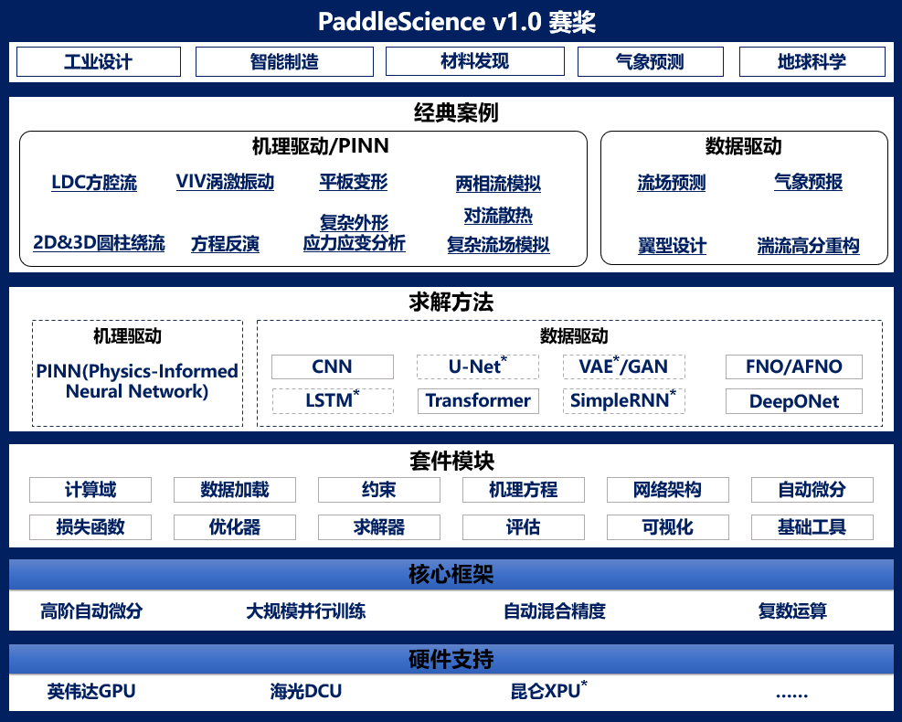

# PaddleScience

> *Developed with [PaddlePaddle](https://www.paddlepaddle.org.cn/)*

PaddleScience 是一个基于深度学习框架 PaddlePaddle 开发的科学计算套件，利用深度神经网络的学习能力和 PaddlePaddle 框架的自动(高阶)微分机制，解决物理、化学、气象等领域的问题。支持物理机理驱动、数据驱动、数理融合三种求解方式，并提供了基础 API 和详尽文档供用户使用与二次开发。

## 特性

- 支持简单几何和复杂 STL 几何的采样与布尔运算。
- 支持包括 Dirichlet、Neumann、Robin 以及自定义边界条件。
- 支持物理机理驱动、数据驱动、数理融合三种问题求解方式。涵盖流体、结构、气象等领域 8+ 案例。
- 支持结果可视化输出与日志结构化保存。
- 完善的 type hints，用户使用和代码贡献全流程文档，经典案例 AI studio 快速体验，降低使用门槛，提高开发效率。
- 更多特性正在开发中...

## 支持

- 如使用过程中遇到问题或想提出开发建议，欢迎在 [**Issue**](https://github.com/PaddlePaddle/PaddleScience/issues/new/choose) 页面新建 issue。

## 贡献代码

PaddleScience 项目欢迎并依赖开发人员和开源社区中的用户，请参阅 [**贡献指南**](https://paddlescience-docs.readthedocs.io/zh/latest/zh/contribute/)。

## 证书

[Apache License 2.0](https://github.com/PaddlePaddle/PaddleScience/blob/develop/LICENSE)
