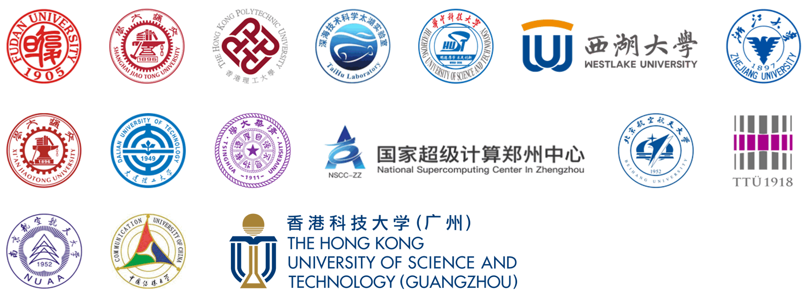

# PaddleScience

--8<--
./README.md:status
--8<--

🔥 [飞桨AI for Science前沿讲座系列课程 & 代码入门与实操课程进行中 ](https://mp.weixin.qq.com/s/n-vGnGM9di_3IByTC56hUw)，清华、北大、中科院等高校机构知名学者分享前沿研究成果，火热报名中。

🔥 [开放原子第二届开源大赛：飞桨科学计算工具组件开发大赛](https://competition.atomgit.com/competitionInfo?id=805ad94637707d062f24e54265d85731)，总奖金25万人民币，火热报名中。

🔥 [PaddlePaddle Hackathon 7th 开源贡献个人挑战赛](https://github.com/PaddlePaddle/Paddle/issues/67603)

🔥 [CIKM 2024: AI辅助的先进空气动力学-优化汽车设计以实现最佳性能](https://competition.atomgit.com/competitionInfo?id=cda4e961b0c25858ca0fd2a4bdf87520)，已进入评奖阶段。

🔥 [IJCAI 2024: 任意三维几何外形车辆的风阻快速预测竞赛](https://competition.atomgit.com/competitionInfo?id=7f3f276465e9e845fd3a811d2d6925b5)，track A, B, C 代码：[paddle实现](https://github.com/PaddlePaddle/PaddleScience/tree/develop/jointContribution/IJCAI_2024) | [pytorch实现](https://competition.atomgit.com/competitionInfo?id=7f3f276465e9e845fd3a811d2d6925b5)(点击**排行榜**可查看各个赛道前10名的代码)

<style>
    .container {
        display: flex;
        justify-content: space-around;
        align-items: center;
        flex-wrap: wrap;
    }
    .card {
        font-family: 'Noto Serif SC', sans-serif;
        border-radius: 10px;
        box-shadow: 0 4px 8px rgba(0, 0, 0, 0.1);
        color: black;
        font-weight: bold;
        height: 100px;
        padding: 20px;
        width: 170px;
        text-align: center;
        transition: border-color 0.1s; /* 边框颜色变化的过渡效果 */
        border: 2px solid transparent; /* 默认透明边框，用于悬浮时边框的平滑过渡 */
        /* text-shadow: 2px 2px 4px rgba(0, 0, 0, 0.5); */
    }
    .card:hover {
        border-color: #7793FF; /* 鼠标悬浮时的深蓝色边框 */
    }
    .card-deepxde {
        background-color: #A6CAFE; /* 浅蓝色背景 */
    }
    .card-deepmd {
        background-color: #A6CAFE; /* 浅蓝色背景 */
    }
    .card-modulus {
        background-color: #A6CAFE; /* 浅蓝色背景 */
    }
    .footer {
        text-align: center;
        margin-top: 30px;
        color: #666;
    }
    .text-large {
        font-size: 14px;
    }
    .text-decoration {
        text-decoration: underline;
    }
</style>

--8<--
./README.md:description
--8<--

--8<--
./docs/zh/overview.md:panorama
--8<--

## 📝案例列表

<style>
    table  th{
        background: #C1E6FE;
    }
</style>

<p align="center"><b>数学(AI for Math)</b></p>

| 问题类型 | 案例名称 | 优化算法 | 模型类型 | 训练方式 | 数据集 | 参考资料 |
|-----|---------|-----|---------|----|---------|---------|
| 亥姆霍兹方程 | [SPINN(Helmholtz3D)](./zh/examples/spinn.md) | 机理驱动 | SPINN | 无监督学习 | - | [Paper](https://arxiv.org/pdf/2306.15969) |
| 相场方程 | [Allen-Cahn](./zh/examples/allen_cahn.md) | 机理驱动 | MLP | 无监督学习 | [Data](https://paddle-org.bj.bcebos.com/paddlescience/datasets/AllenCahn/allen_cahn.mat) | [Paper](https://arxiv.org/pdf/2402.00326) |
| 微分方程 | [拉普拉斯方程](./zh/examples/laplace2d.md) | 机理驱动 | MLP | 无监督学习 | -        | - |
| 微分方程 | [伯格斯方程](./zh/examples/deephpms.md) | 机理驱动 | MLP | 无监督学习 | [Data](https://github.com/maziarraissi/DeepHPMs/tree/master/Data) | [Paper](https://arxiv.org/pdf/1801.06637.pdf) |
| 微分方程 | [非线性偏微分方程](./zh/examples/pirbn.md) | 机理驱动 | PIRBN | 无监督学习 | - | [Paper](https://arxiv.org/abs/2304.06234) |
| 微分方程 | [洛伦兹方程](./zh/examples/lorenz.md) | 数据驱动 | Transformer-Physx | 监督学习 | [Data](https://github.com/zabaras/transformer-physx) | [Paper](https://arxiv.org/abs/2010.03957) |
| 微分方程 | [若斯叻方程](./zh/examples/rossler.md) | 数据驱动 | Transformer-Physx | 监督学习 | [Data](https://github.com/zabaras/transformer-physx) | [Paper](https://arxiv.org/abs/2010.03957) |
| 算子学习 | [DeepONet](./zh/examples/deeponet.md) | 数据驱动 | MLP | 监督学习 | [Data](https://deepxde.readthedocs.io/en/latest/demos/operator/antiderivative_unaligned.html) | [Paper](https://export.arxiv.org/pdf/1910.03193.pdf) |
| 微分方程 | [梯度增强的物理知识融合 PDE 求解](https://github.com/PaddlePaddle/PaddleScience/blob/develop/examples/gpinn/poisson_1d.py) | 机理驱动 | gPINN | 无监督学习 | - |  [Paper](https://doi.org/10.1016/j.cma.2022.114823) |
| 积分方程 | [沃尔泰拉积分方程](./zh/examples/volterra_ide.md) | 机理驱动 | MLP | 无监督学习 | - | [Project](https://github.com/lululxvi/deepxde/blob/master/examples/pinn_forward/Volterra_IDE.py) |
| 微分方程 | [分数阶微分方程](https://github.com/PaddlePaddle/PaddleScience/blob/develop/examples/fpde/fractional_poisson_2d.py) | 机理驱动 | MLP | 无监督学习 | - | - |
| 光孤子 | [Optical soliton](./zh/examples/nlsmb.md) | 机理驱动 | MLP | 无监督学习 | - | [Paper](https://doi.org/10.1007/s11071-023-08824-w)|
| 光纤怪波 | [Optical rogue wave](./zh/examples/nlsmb.md) | 机理驱动 | MLP | 无监督学习 | - | [Paper](https://doi.org/10.1007/s11071-023-08824-w)|
| 域分解 | [XPINN](./zh/examples/xpinns.md) | 机理驱动 | MLP | 无监督学习 | - | [Paper](https://doi.org/10.4208/cicp.OA-2020-0164)|
| 布鲁塞尔扩散系统 | [3D-Brusselator](./zh/examples/brusselator3d.md) | 数据驱动 | LNO | 监督学习 | - | [Paper](https://arxiv.org/abs/2303.10528)|
| 符号回归 | [Transformer4SR](./zh/examples/transformer4sr.md) | 数据驱动 | Transformer | 监督学习 | - | [Paper](https://arxiv.org/abs/2312.04070)|

<br>
<p align="center"><b>技术科学(AI for Technology)</b></p>

| 问题类型 | 案例名称 | 优化算法 | 模型类型 | 训练方式 | 数据集 | 参考资料 |
|-----|---------|-----|---------|----|---------|---------|
| 一维线性对流问题 | [1D 线性对流](./zh/examples/adv_cvit.md) | 数据驱动 | ViT | 监督学习 | [Data](https://github.com/Zhengyu-Huang/Operator-Learning/tree/main/data) | [Paper](https://arxiv.org/abs/2405.13998) |
| 非定常不可压流体 | [2D 方腔浮力驱动流](./zh/examples/ns_cvit.md) | 数据驱动 | ViT | 监督学习 | [Data](https://huggingface.co/datasets/pdearena/NavierStokes-2D) | [Paper](https://arxiv.org/abs/2405.13998) |
| 定常不可压流体 | [Re3200 2D 定常方腔流](./zh/examples/ldc2d_steady.md) | 机理驱动 | MLP | 无监督学习 | - |  |
| 定常不可压流体 | [2D 达西流](./zh/examples/darcy2d.md) | 机理驱动 | MLP | 无监督学习 | - |   |
| 定常不可压流体 | [2D 管道流](./zh/examples/labelfree_DNN_surrogate.md) | 机理驱动 | MLP | 无监督学习 | - | [Paper](https://arxiv.org/abs/1906.02382) |
| 定常不可压流体 | [3D 颅内动脉瘤](./zh/examples/aneurysm.md) | 机理驱动 | MLP | 无监督学习 | [Data](https://paddle-org.bj.bcebos.com/paddlescience/datasets/aneurysm/aneurysm_dataset.tar) | [Project](https://docs.nvidia.com/deeplearning/modulus/modulus-v2209/user_guide/intermediate/adding_stl_files.html)|
| 定常不可压流体 | [任意 2D 几何体绕流](./zh/examples/deepcfd.md) | 数据驱动 | DeepCFD | 监督学习 | - | [Paper](https://arxiv.org/abs/2004.08826)|
| 非定常不可压流体 | [2D 非定常方腔流](./zh/examples/ldc2d_unsteady.md) | 机理驱动 | MLP | 无监督学习 | - | -|
| 非定常不可压流体 | [Re100 2D 圆柱绕流](./zh/examples/cylinder2d_unsteady.md) | 机理驱动 | MLP | 半监督学习 | [Data](https://paddle-org.bj.bcebos.com/paddlescience/datasets/cylinder2d_unsteady_Re100/cylinder2d_unsteady_Re100_dataset.tar) | [Paper](https://arxiv.org/abs/2004.08826)|
| 非定常不可压流体 | [Re100~750 2D 圆柱绕流](./zh/examples/cylinder2d_unsteady_transformer_physx.md) | 数据驱动 | Transformer-Physx | 监督学习 | [Data](https://github.com/zabaras/transformer-physx) | [Paper](https://arxiv.org/abs/2010.03957)|
| 可压缩流体 | [2D 空气激波](./zh/examples/shock_wave.md) | 机理驱动 | PINN-WE | 无监督学习 | [Data](https://aistudio.baidu.com/datasetdetail/167250) | -|
| 飞行器设计 | [MeshGraphNets](https://aistudio.baidu.com/projectdetail/5322713) | 数据驱动 | GNN | 监督学习 | [Data](https://aistudio.baidu.com/datasetdetail/184320) | [Paper](https://arxiv.org/abs/2010.03409)|
| 飞行器设计 | [火箭发动机真空羽流](https://aistudio.baidu.com/projectdetail/4486133) | 数据驱动 | CNN | 监督学习 | [Data](https://aistudio.baidu.com/datasetdetail/167250) | - |
| 飞行器设计 | [Deep-Flow-Prediction](https://aistudio.baidu.com/projectdetail/5671596) | 数据驱动 | TurbNetG | 监督学习 | [Data](https://aistudio.baidu.com/datasetdetail/197778) | [Paper](https://arxiv.org/abs/1810.08217) |
| 通用流场模拟 | [气动外形设计](./zh/examples/amgnet.md) | 数据驱动 | AMGNet | 监督学习 | [Data](https://paddle-org.bj.bcebos.com/paddlescience/datasets/AMGNet/data.zip) | [Paper](https://arxiv.org/abs/1810.08217) |
| 流固耦合 | [涡激振动](./zh/examples/viv.md) | 机理驱动 | MLP | 半监督学习 | [Data](https://github.com/PaddlePaddle/PaddleScience/blob/develop/examples/fsi/VIV_Training_Neta100.mat) | [Paper](https://arxiv.org/abs/2206.03864)|
| 多相流 | [气液两相流](./zh/examples/bubble.md) | 机理驱动 | BubbleNet | 半监督学习 | [Data](https://paddle-org.bj.bcebos.com/paddlescience/datasets/BubbleNet/bubble.mat) | [Paper](https://pubs.aip.org/aip/adv/article/12/3/035153/2819394/Predicting-micro-bubble-dynamics-with-semi-physics)|
| 多相流 | [twophasePINN](https://aistudio.baidu.com/projectdetail/5379212) | 机理驱动 | MLP | 无监督学习 | - | [Paper](https://doi.org/10.1016/j.mlwa.2021.100029)|
| 流场高分辨率重构 | [2D 湍流流场重构](./zh/examples/tempoGAN.md) | 数据驱动 | tempoGAN | 监督学习 | [Train Data](https://paddle-org.bj.bcebos.com/paddlescience/datasets/tempoGAN/2d_train.mat)<br>[Eval Data](https://paddle-org.bj.bcebos.com/paddlescience/datasets/tempoGAN/2d_valid.mat) | [Paper](https://dl.acm.org/doi/10.1145/3197517.3201304)|
| 流场高分辨率重构 | [2D 湍流流场重构](https://aistudio.baidu.com/projectdetail/4493261?contributionType=1) | 数据驱动 | cycleGAN | 监督学习 | [Train Data](https://paddle-org.bj.bcebos.com/paddlescience/datasets/tempoGAN/2d_train.mat)<br>[Eval Data](https://paddle-org.bj.bcebos.com/paddlescience/datasets/tempoGAN/2d_valid.mat) | [Paper](https://arxiv.org/abs/2007.15324)|
| 流场高分辨率重构 | [基于Voronoi嵌入辅助深度学习的稀疏传感器全局场重建](https://aistudio.baidu.com/projectdetail/5807904) | 数据驱动 | CNN | 监督学习 | [Data1](https://drive.google.com/drive/folders/1K7upSyHAIVtsyNAqe6P8TY1nS5WpxJ2c)<br>[Data2](https://drive.google.com/drive/folders/1pVW4epkeHkT2WHZB7Dym5IURcfOP4cXu)<br>[Data3](https://drive.google.com/drive/folders/1xIY_jIu-hNcRY-TTf4oYX1Xg4_fx8ZvD) | [Paper](https://arxiv.org/pdf/2202.11214.pdf) |
| 流场预测 | [Catheter](https://aistudio.baidu.com/projectdetail/5379212) | 数据驱动 | FNO | 监督学习 | [Data](https://aistudio.baidu.com/datasetdetail/291940) | [Paper](https://www.science.org/doi/pdf/10.1126/sciadv.adj1741) |
| 求解器耦合 | [CFD-GCN](./zh/examples/cfdgcn.md) | 数据驱动 | GCN | 监督学习 | [Data](https://aistudio.baidu.com/aistudio/datasetdetail/184778)<br>[Mesh](https://paddle-org.bj.bcebos.com/paddlescience/datasets/CFDGCN/meshes.tar) | [Paper](https://arxiv.org/abs/2007.04439)|
| 受力分析 | [1D 欧拉梁变形](./zh/examples/euler_beam.md) | 机理驱动 | MLP | 无监督学习 | - | - |
| 受力分析 | [2D 平板变形](./zh/examples/biharmonic2d.md) | 机理驱动 | MLP | 无监督学习 | - | [Paper](https://arxiv.org/abs/2108.07243) |
| 受力分析 | [3D 连接件变形](./zh/examples/bracket.md) | 机理驱动 | MLP | 无监督学习 | [Data](https://paddle-org.bj.bcebos.com/paddlescience/datasets/bracket/bracket_dataset.tar) | [Tutorial](https://docs.nvidia.com/deeplearning/modulus/modulus-v2209/user_guide/foundational/linear_elasticity.html) |
| 受力分析 | [结构震动模拟](./zh/examples/phylstm.md) | 机理驱动 | PhyLSTM | 监督学习 | [Data](https://paddle-org.bj.bcebos.com/paddlescience/datasets/PhyLSTM/data_boucwen.mat) | [Paper](https://arxiv.org/abs/2002.10253) |
| 受力分析 | [2D 弹塑性结构](./zh/examples/epnn.md) | 机理驱动 | EPNN | 无监督学习 | [Train Data](https://paddle-org.bj.bcebos.com/paddlescience/datasets/epnn/dstate-16-plas.dat)<br>[Eval Data](https://paddle-org.bj.bcebos.com/paddlescience/datasets/epnn/dstress-16-plas.dat) | [Paper](https://arxiv.org/abs/2204.12088) |
| 受力分析和逆问题 | [3D 汽车控制臂变形](./zh/examples/control_arm.md) | 机理驱动 | MLP | 无监督学习 | - | - |
| 受力分析和逆问题 | [3D 心脏仿真](./zh/examples/heart.md) | 数理融合 | PINN | 监督学习 | - | - |
| 拓扑优化 | [2D 拓扑优化](./zh/examples/topopt.md) | 数据驱动 | TopOptNN | 监督学习 | [Data](https://paddle-org.bj.bcebos.com/paddlescience/datasets/topopt/top_dataset.h5) | [Paper](https://arxiv.org/pdf/1709.09578) |
| 热仿真 | [1D 换热器热仿真](./zh/examples/heat_exchanger.md) | 机理驱动 | PI-DeepONet | 无监督学习 | - | - |
| 热仿真 | [2D 热仿真](./zh/examples/heat_pinn.md) | 机理驱动 | PINN | 无监督学习 | - | [Paper](https://arxiv.org/abs/1711.10561)|
| 热仿真 | [2D 芯片热仿真](./zh/examples/chip_heat.md) | 机理驱动 | PI-DeepONet | 无监督学习 | - | [Paper](https://doi.org/10.1063/5.0194245)|

<br>
<p align="center"><b>材料科学(AI for Material)</b></p>

| 问题类型 | 案例名称 | 优化算法 | 模型类型 | 训练方式 | 数据集 | 参考资料 |
|-----|---------|-----|---------|----|---------|---------|
| 材料设计 | [散射板设计(反问题)](./zh/examples/hpinns.md) | 数理融合 | 数据驱动 | 监督学习 | [Train Data](https://paddle-org.bj.bcebos.com/paddlescience/datasets/hPINNs/hpinns_holo_train.mat)<br>[Eval Data](https://paddle-org.bj.bcebos.com/paddlescience/datasets/hPINNs/hpinns_holo_valid.mat) | [Paper](https://arxiv.org/pdf/2102.04626.pdf) |

<br>
<p align="center"><b>地球科学(AI for Earth Science)</b></p>

| 问题类型 | 案例名称 | 优化算法 | 模型类型 | 训练方式 | 数据集 | 参考资料 |
|-----|---------|-----|---------|----|---------|---------|
| 天气预报 | [Extformer-MoE 气象预报](./zh/examples/extformer_moe.md) | 数据驱动 | FourCastNet | 监督学习 | [enso](https://tianchi.aliyun.com/dataset/98942) | - |
| 天气预报 | [FourCastNet 气象预报](./zh/examples/fourcastnet.md) | 数据驱动 | FourCastNet | 监督学习 | [ERA5](https://app.globus.org/file-manager?origin_id=945b3c9e-0f8c-11ed-8daf-9f359c660fbd&origin_path=%2F~%2Fdata%2F) | [Paper](https://arxiv.org/pdf/2202.11214.pdf) |
| 天气预报 | [NowCastNet 气象预报](./zh/examples/nowcastnet.md) | 数据驱动 | NowCastNet | 监督学习 | [MRMS](https://app.globus.org/file-manager?origin_id=945b3c9e-0f8c-11ed-8daf-9f359c660fbd&origin_path=%2F~%2Fdata%2F) | [Paper](https://www.nature.com/articles/s41586-023-06184-4) |
| 天气预报 | [GraphCast 气象预报](./zh/examples/graphcast.md) | 数据驱动 | GraphCastNet | 监督学习 | - | [Paper](https://arxiv.org/abs/2212.12794) |
| 大气污染物 | [UNet 污染物扩散](https://aistudio.baidu.com/projectdetail/5663515?channel=0&channelType=0&sUid=438690&shared=1&ts=1698221963752) | 数据驱动 | UNet | 监督学习 | [Data](https://aistudio.baidu.com/datasetdetail/198102) | - |
| 天气预报 | [DGMR 气象预报](./zh/examples/dgmr.md) | 数据驱动 | DGMR | 监督学习 | [UK dataset](https://huggingface.co/datasets/openclimatefix/nimrod-uk-1km) | [Paper](https://arxiv.org/pdf/2104.00954.pdf) |
| 地震波形反演 | [VelocityGAN 地震波形反演](./zh/examples/velocity_gan.md) | 数据驱动 | VelocityGAN | 监督学习 | [OpenFWI](https://openfwi-lanl.github.io/docs/data.html#vel) | [Paper](https://arxiv.org/abs/1809.10262v6) |
| 交通预测 | [TGCN 交通流量预测](./zh/examples/tgcn.md) | 数据驱动 | GCN & CNN | 监督学习 | [PEMSD4 & PEMSD8](https://paddle-org.bj.bcebos.com/paddlescience/datasets/tgcn/tgcn_data.zip) | - |

## 🚀快速安装

=== "方式1: 源码安装[推荐]"

    --8<--
    ./README.md:git_install
    --8<--

=== "方式2: pip安装"

    ``` sh
    python -m pip install -U paddlesci
    ```

**完整安装流程**：[安装与使用](./zh/install_setup.md)

--8<--
./README.md:update
--8<--

--8<--
./README.md:feature
--8<--

## 🎈生态工具

--8<--
./README.md:adaptation
--8<--

--8<--
./README.md:support
--8<--

--8<--
./README.md:contribution
--8<--

--8<--
./README.md:collaboration
--8<--

--8<--
./README.md:thanks
--8<--

- PaddleScience 的部分代码由以下优秀开发者贡献（按 [Contributors](https://github.com/PaddlePaddle/PaddleScience/graphs/contributors) 排序）：

    <style>
        .avatar {
            height: 64px;
            width: 64px;
            border: 2px solid rgba(128, 128, 128, 0.308);
            border-radius: 50%;
        }

        .avatar:hover {
            box-shadow: 0 8px 16px 0 rgba(0, 0, 0, 0.4);
            transition: 0.4s;
            transform:translateY(-10px);
        }
    </style>
    <div id="contributors"></div>

## 🤝合作单位



--8<--
./README.md:license
--8<--
