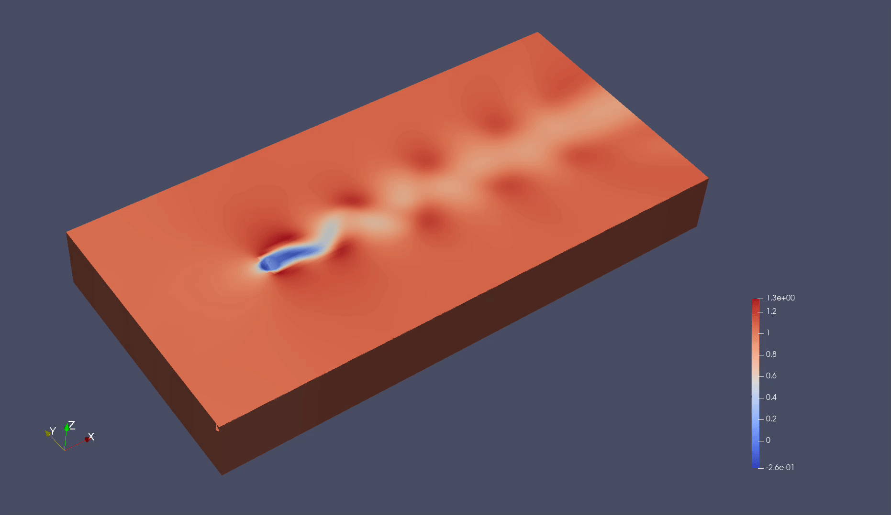

Flow around a Cylinder with Discrete Method
======================

This guide introduces to how to build a PINN model for simulating the flow around a cylinder in PaddleScience.

- **Use case introduction**

The flow around a cylinder problem mimicks a liquid-filled container with a cylinder in the middle. And there is a steady flow of liquid at the inlet. 
The goal is to calculate the velocity and pressure of the liquid at each interior point in the container when the system is in a state of 101s to 110s.

Following graphs show the results generated from training a grid with about 40,000 points. The vertical components of velocity are displayed separately.

- **How to construct a PINN model**

A PINN model is jointly composed using what used to be a traditional PDE setup and a neural net approximating the solution. The PDE part includes specific differential equations enforcing the physical law, a geometry that bounds the problem domain and the initial and boundary value conditions which make it possible to find a solution. The neural net part can take variants of a typical feed forward network widely found in deep learning toolkits.

To obtain the PINN model requires training the neural net. It's in this phase that the information of the PDE gets instilled into the neural net through back propagation. The loss function plays a crucial role in controling how this information gets dispensed emphasizing different aspects of the PDE, for instance, by adjusting the weights for the equation residues and the boundary values.

Once the concept is clear, next let's take a look at how this translates into the cylinder example.

- **Constructing Geometry**

First, define the problem geometry using the `psci.geometry` module interface. In this example,
the geometry is a cuboid with the origin at coordinates (-8, -8, -2) and the extent set
to (25, 8, 2).  There is a cylinder inside the cuboid. 
The cylinder and the cuboid have the same height. 
The center of the cylinder is at (0.0, 0.0) and the radius of the cylinder is 0.5.

    .. code-block::

        cc = (0.0, 0.0)
        cr = 0.5
        geo = psci.geometry.CylinderInCube(
            origin=(-8, -8, -2),
            extent=(25, 8, 2),
            circle_center=cc,
            circle_radius=cr)

Next, add boundaries to the geometry, these boundaries will be used in PDE. 
Note that the `geo.add_boundary` function is only used for boundaries with physical constraints. 
Since there are no physical constraints on the upper and lower surfaces, these physical boundaries do not need to be added.

    .. code-block::
        
        geo.add_boundary(name="left", criteria=lambda x, y, z: abs(x + 8.0) < 1e-4)
        geo.add_boundary(name="right", criteria=lambda x, y, z: abs(x - 25.0) < 1e-4)
        geo.add_boundary(
            name="circle",
            criteria=lambda x, y, z: ((x - cc[0])**2 + (y - cc[1])**2 - cr**2) < 1e-4)

Once the domain are prepared, a discretization recipe should be given. 
Two discretization methods are currently provided, `uniform` and `sampling`.

    .. code-block::

        geo_disc = geo.discretize(npoints=[200, 50, 4], method="uniform")

In some cases, the user is required to provide related data. 
When constructing geometry, load the coordinate information, and its shape is [num_user_point, space_dims]. 
num_user_point represents the number of points loaded by the user, and space_dims represents the space dimensions.

    .. code-block::

        def GetRealPhyInfo(time, need_info=None):
            real_data = np.load("openfoam_cylinder_re100/flow_re100_" + str(int(time)) + "_xyzuvwp.npy")
            real_data = real_data.astype(np.float32)
            if need_info == 'cord':
                return real_data[:, 0:3]
            elif need_info == 'physic':
                return real_data[:, 3:7]
            else:
                return real_data

        geo_disc.user = GetRealPhyInfo(start_time, need_info='cord')

- **Constructing PDE**

After defining Geometry part, define the PDE equations to solve. In this example, the equations are a 
Navier Stokes. This equation is present in the package, and one only needs to
create a `psci.pde.NavierStokes` object to set up the equation. 
The goal is to solve for the physical state from 100s to 110s, so set time_dependent to true. Then, set a specific time interval.

    .. code-block::

        pde = psci.pde.NavierStokes(
            nu=0.01,
            rho=1.0,
            dim=3,
            time_dependent=True,
            weight=[0.01, 0.01, 0.01, 0.01])

        pde.set_time_interval([100.0, 110.0])

Next, add boundaries equations for PDE. 
The boundary equations in PDE are strongly bound to the boundary definitions in geometry. 
The physical information on the three boundaries needs to be set and then added using `pde.add_bc`.

    .. code-block::
     
        bc_left_u = psci.bc.Dirichlet('u', rhs=1.0, weight=1.0)
        bc_left_v = psci.bc.Dirichlet('v', rhs=0.0, weight=1.0)
        bc_left_w = psci.bc.Dirichlet('w', rhs=0.0, weight=1.0)

        bc_right_p = psci.bc.Dirichlet('p', rhs=0.0, weight=1.0)

        bc_circle_u = psci.bc.Dirichlet('u', rhs=0.0, weight=1.0)
        bc_circle_v = psci.bc.Dirichlet('v', rhs=0.0, weight=1.0)
        bc_circle_w = psci.bc.Dirichlet('w', rhs=0.0, weight=1.0)

        pde.add_bc("left", bc_left_u, bc_left_v, bc_left_w)
        pde.add_bc("right", bc_right_p)
        pde.add_bc("circle", bc_circle_u, bc_circle_v, bc_circle_w)

Once the equation and the problem domain are prepared, a discretization recipe should be given. 
This recipe will be used to generate the training data before training starts. 

    .. code-block::

        pde_disc = pde.discretize(
            time_method="implicit", time_step=1, geo_disc=geo_disc)

- **Constructing the neural net**

Now the PDE part is almost done, we move on to constructing the neural net.
It's straightforward to define a fully connected network by creating a `psci.network.FCNet` object.
Following is how we create an FFN of 5 hidden layers with 20 neurons on each, using hyperbolic
tangent as the activation function.

    .. code-block::

        net = psci.network.FCNet(
            num_ins=2,
            num_outs=3,
            num_layers=5,
            hidden_size=20,
            dtype="float32",
            activation='tanh')

Next, one of the most important steps is define the loss function. Here we use L2 loss.

    .. code-block::
     
	    loss = psci.loss.L2(p=2)

By design, the `loss` object conveys complete information of the PDE and hence the
latter is eclipsed in further steps. Now combine the neural net and the loss and we
create the `psci.algorithm.PINNs` model algorithm.

    .. code-block::

        algo = psci.algorithm.PINNs(net=net, loss=loss)

Next, by plugging in an Adam optimizer, a solver is contructed and you are ready
to kick off training. In this example, the Adam optimizer is used and is given
a learning rate of 0.001. 

The `psci.solver.Solver` class bundles the `pde`, which is the training data, the PINNs model, which is called `algo` here,
and the optimizer, into a solver object that exposes the `solve` interface.

    .. code-block::

        opt = psci.optimizer.Adam(learning_rate=0.001, parameters=net.parameters())
        solver = psci.solver.Solver(pde=pde_disc, algo=algo, opt=opt)

When using `discrete-time method`, the physical information of each time period needs to be solved in turn.

3 parts of dataset need to be added to the solver in each moment. 
The physical information of the interior point at the current moment is added through `solver.feed_data_interior_cur`. 
The physical information of the user point at the current moment is added through `solver.feed_data_user_cur`. 
The physical information of the user point at the next moment is added through `solver.feed_data_user_next`.

After all the data is ready, it can be trained with `solver.solve`. 
Finally, the physical information of the next moment is solved.

    .. code-block::

        current_interior = np.zeros((len(pde_disc.geometry.interior), 3)).astype(np.float32)
        current_user = GetRealPhyInfo(start_time, need_info='physic')[:, 0:3]
        for next_time in range(int(pde_disc.time_internal[0])+1, int(pde_disc.time_internal[1])+1):
            solver.feed_data_interior_cur(current_interior)  # add u(n) interior
            solver.feed_data_user_cur(current_user)  # add u(n) user 
            solver.feed_data_user_next(GetRealPhyInfo(next_time, need_info='physic'))  # add u(n+1) user
            next_uvwp = solver.solve(num_epoch = 2000)
            # modify current_info as follows: current_time -> next time
            current_interior = np.array(next_uvwp[0])[:, 0:3]
            current_user = np.array(next_uvwp[-1])[:, 0:3]

`psci.visu.save_vtk` is a helper utility for quick visualization. It saves
the graphs in vtp file which one can play using `Paraview <https://www.paraview.org/>`_.

    .. code-block::
    
        file_path = "train_cylinder_unsteady_re100/cylinder3d_train_rslt_" + str(next_time)
        psci.visu.save_vtk(filename=file_path, geo_disc=pde_disc.geometry, data=next_uvwp)
