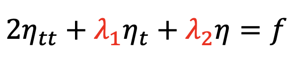

VIV (vortex induced vibration)
======================

This guide introduces how to build a simple VIV model with PaddleScience.

Test for github-bot template check

Test for right description tempalte check
- **Use case introduction**

This demo is a typical application of inverse problem,  vortex induced vibrations of bluff bodies occur when the vortex shedding frequency is close to the natural frequency of the structure, the VIV system is equivalent to a one-dimensional spring-damper system: 

.. image:: ../img/VIV_1D_SpringDamper.png
	   :width: 400
	   :align: center

Given the *λ1*, *λ2* and *ρ*, which represent the natural damping, stiffness of the structure properties and the mass seperately, the problem is set up to predict values of *λ1* and *λ2*, the governing equation is defined as shown below:

	   
The model is based on the assumption that the constant reduction velocity is `Ur=8.5（Ur=u/(fn*d))` corresponding to `Re=500`. The lateral amplitude of cylinder vibration *η* induced by the velocity fluid passing over the cylinder and the corresponding lift force *f* are leveraged as supervised data. 

To verify the function of PINNs algorithm for solving such classical inverse problem, the ground truth of stiffness and damping of the system are fixed previously（*λ1=0，λ2=1.093*）. After training properly, we achieve the relative error lower than 5%, through comparing the value of stiffness and damping predicted from PINN and the ground truth,  which inidicates that the trained model can well simulate the one-dimensional vibration phenomenon of VIV and can predict the physical properties of unknown complicated structure.

- **How to run the model**

    - **Install PaddlePaddle**

    The PaddlePaddle development version need to be installed in this problem. User can choose the appropriate version based on simulating platform (such as in linux os and cuda10.1 platform, 

    .. code-block::

        python -m pip install paddlepaddle-gpu==0.0.0.post101 -f https://www.paddlepaddle.org.cn/whl/linux/gpu/develop.html` can be used for installing), 

    More details can refer to `PaddlePaddle <https://www.paddlepaddle.org.cn/install/quick?docurl=/documentation/docs/zh/develop/install/pip/linux-pip.html/>`_.

    - **Download PaddleScience code**
    
    .. code-block::

        git clone https://github.com/PaddlePaddle/PaddleScience.git

    - **Install required libraries**

    .. code-block::

        cd PaddleScience
        pip install -r requirements 

    - **Set PYTHONPATH**
    
    .. code-block::

        export PYTHONPATH=$PYTHONPATH:/user_path*/PaddleScience/
   
    - **Training** The trained model is saved under checkpoint path.
   
    .. code-block::

        cd examples/fsi/
        python viv_inverse_train.py

    - **Prediction**
    
    .. code-block::

        cd examples/fsi/
        python viv_inverse_predict.py

- **Construct the model**

    Basically, the model is composed with 4 main parts: dataloader, pinn_solver, trainning and predicting logistic.

    - **dataloader: loading data**

    For training, *η* and *f* were obtained from CFD tools and saved in the *./examples/fsi/VIV_Training.mat* file, they are loaded as shown below:

    .. code-block::

        t_eta, eta, t_f, f, tmin, tmax = data.build_data()

    - **pinn_solver: define the pinn neural network**

    Since only the lateral vibration of the structure is considered and the inlet velocity is constant, time(*t*) is the only input dimension of the neural network and the output is the vibration amplitude of the structure.

    FCNet is employed by default as the neural network with 6 layers and 30 neurons  built for each layer, and the Neural Network is defined in the file `./examples/fsi/viv_inverse_train.py` as shown below:

    .. code-block::

        PINN = psolver.PysicsInformedNeuralNetwork(layers=6, 
            hidden_size=30, num_ins=1, num_outs=1, 
            t_max=tmax, t_min=tmin, N_f=f.shape[0], checkpoint_path='./checkpoint/', 
            net_params=net_params)

    - **pinn_solver: define the PDE**

    PDE is defined in `./paddlescience/module/fsi/viv_pinn_solver.py` as shown below:

    .. code-block::

        def neural_net_equations(self, t, u=None):
            eta = self.net.nn_func(t)
            eta_t = self.autograd(eta, t)
            eta_tt = self.autograd(eta_t, t, create_graph=False)

            rho = 2.0
            k1_ = paddle.exp(self.k1)
            k2_ = paddle.exp(self.k2)
            f = rho*eta_tt + k1_*eta_t + k2_*eta
            return eta, f

    - **pinn_solver: define the loss weights**

    In this demo, the eta_weight and eq_weight are set as 100 and 1 seperately.

    .. code-block::

        self.eta_weight = 100

    - **Training**

    The adam optimizer is employed with learning rate 1e-5 are presented as below shown:

    .. code-block::

        # Training
        batchsize = 150
        scheduler = paddle.optimizer.lr.StepDecay(learning_rate=1e-3, step_size=20000, gamma=0.9)
        adm_opt = paddle.optimizer.Adam(scheduler, weight_decay=None,parameters=PINN.net.parameters())
        PINN.train(num_epoch=100000, batchsize=batchsize, optimizer=adm_opt, scheduler=scheduler)
        adm_opt = psci.optimizer.Adam(learning_rate=1e-5, weight_decay=None,parameters=PINN.net.parameters())
        PINN.train(num_epoch=100000, batchsize=batchsize, optimizer=adm_opt)

    - **Prediction**

    After training, the model is saved in the checkpoint foler, set `net_params` and execute `python viv_inverse_predict.py` to get predictions. 

    .. code-block::

        net_params = './checkpoint/net_params_100000'
        predict(net_params=net_params)

    The result is shown as below:

    .. image:: ../img/viv.png
	   :width: 400
	   :align: center

    .. image:: ../img/viv_f.png
	   :width: 400
	   :align: center
