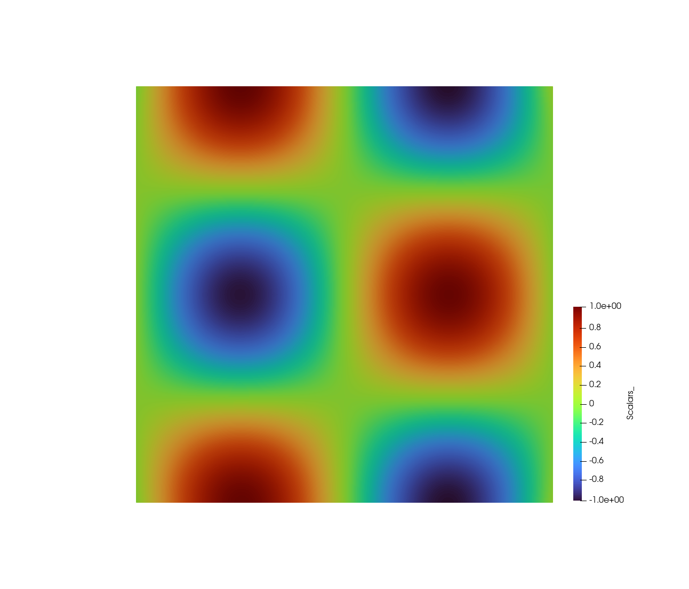

多孔介质中的达西渗流（Darcy Flow in Porous Medium）
=====================================================

本指南介绍了如何在PaddleScience中建立一个PINN模型去模拟2D达西渗流（Darcy flow）。

- **用例**

本样例模拟了以下问题的求解(压强)

    .. math::
            u + \nabla p & =  0, \ (x,y) \in (0,1) \times (0,1),  \\
            \nabla \cdot u & =  f, \ (x,y) \in (0,1) \times (0,1), 

等价于

    .. math::
        \Delta u = -f, \ (x,y) \in (0,1) \times (0,1).

函数f(x,y)为

    .. math::
       f(x,y) = 8 \pi^2 sin(2\pi x) cos(2 \pi y).

Dirichlet边界条件被设置为

    .. math::
       p(x,y) & =  sin(2\pi x) cos(2\pi y), \  x=1 \ \text{or} \ y=1.

下图展示了在100×100的网格上的训练结果。

		   

- **如何构建PINN模型**

PINN模型由传统PDE体系和神经网络共同组成来近似求解。PDE部分包括执行物理定律的特定微分方程、限定了问题域的几何图形，以及使其有可能找到解的初始条件和边界条件。神经网络部分可以采用深度学习工具包中广泛提供的前馈神经网络(FFN)变体。

为了获得PINN模型，我们需要对神经网络进行训练。正是在这个阶段中，PDE的信息通过反向传播被灌送到神经网络中。而损失函数的重要作用则体现在控制如何分配这些信息，以此来强调PDE的不同方面，例如，损失函数可以调整方程残差的权重和边界值。

既然相关概念已经明确，接下来让我们一窥如何建立二维达西渗流的PINN模型吧。

- **构建PDE**

首先，使用 `psci.geometry` 进行定义几何问题。在下面例子中，定义的几何是一个左下角坐标为(0.0, 0.0)，右上角坐标(1.0, 1.0) 的矩形。

    .. code-block::

       geo = psci.geometry.Rectangular(
       space_origin=(0.0, 0.0), space_extent=(1.0, 1.0))

接下来，定义PDE方程，在样例中，要定义的方程是二维拉普拉斯方程，我们可以通过实例化 `psci.pde.Laplace2D` 对象来设置。

    .. code-block::

       pdes = psci.pde.Laplace2D()

在定义好方程和问题域之后，我们需要给出一个离散化方法。该方法将用于在训练开始前生成训练数据。目前，二维的区域可以被离散化为N×M的网格，在本例中为101×101。

    .. code-block::

       pdes, geo = psci.discretize(pdes, geo, space_steps=(101, 101))

如上所述，有效的问题设置依赖于对边界和初始值的充分约束。在本例中， `GenBC` 能生成给定边界的初始值，再通过调用 `pdes.set_bc_value()` 可将初始值传给PDE求解器。
值得注意的是，通常情况下，我们将生成边界和初始值的函数传入求解器，而不是传入具体的值。

    .. code-block::

       pdes.set_bc_value(bc_value=bc_value)

- **构建神经网络**

现在PDE的部分已经完成，接下来构建神经网络。我们可以简单地通过实例化 `psci.network.FCNet` 来定义全连接网络。下面我们定义了一个以双曲正弦函数(tanh)为激活函数、拥有5层隐藏层的FFN，其中每个隐藏层有20个神经元。

    .. code-block::

        net = psci.network.FCNet(
            num_ins=2,
	        num_outs=1,
	        num_layers=5,
	        hidden_size=20,
	        dtype="float32",
	        activation="tanh")

接下来，最重要步骤便是定义损失函数。这里我们使用L2损失，其边界值使用给定权重。

    .. code-block::

       loss = psci.loss.L2(pdes=pdes,
           geo=geo,
           eq_weight=0.01,
           bc_weight=bc_weight,
           synthesis_method='norm')

由于loss的设计可以很好的传递PDE的完整信息，因此我们在后续步骤不再需要显式地调用PDE。现在我们结合神经网络和损失函数，直接创建一个 `psci.algorithm.PINNs` 的实例。

    .. code-block::

       algo = psci.algorithm.PINNs(net=net, loss=loss)

接下来，通过对求解器插入一个Adam优化器，我们便可以开始训练了。本例中，Adam优化器的学习率设置为0.001。
`psci.solver.Solver` 类将PINN模型（示例代码中为algo）和优化器（示例代码中为opt）绑定到求解器上，该求解器拥有接口solve来进行求解以得到近似解。
`solver.solve` 接收三个关键字参数： `num_epoch` 指定训练周期有多少epoch， `batch_size` 指定每次训练迭代的数据量大小，不指定则默认为全部， `checkpoint_freq` 指定保存模型参数的频率。

    .. code-block::

       opt = psci.optimizer.Adam(learning_rate=0.001, parameters=net.parameters())
       solver = psci.solver.Solver(algo=algo, opt=opt)
       solution = solver.solve(num_epoch=30000)

最后， `solver.solve` 返回一个能计算几何体中给定点对应结果的函数。调用该函数，并且传递一个geometry对象，便可以得到最终的numpy结果，然后，你可以对其进行验证或可视化。

`psci.visu.save_vtk` 是一个快速可视化的辅助工具，它可以将图像保存在vtp文件中，该文件类型可使用 `Paraview <https://www.paraview.org/>`_ 查看。

    .. code-block::

        rslt = solution(geo)
        psci.visu.save_vtk(geo, rslt, 'rslt_darcy_2d')
        np.save(rslt, 'rslt_darcy_2d.npy')
