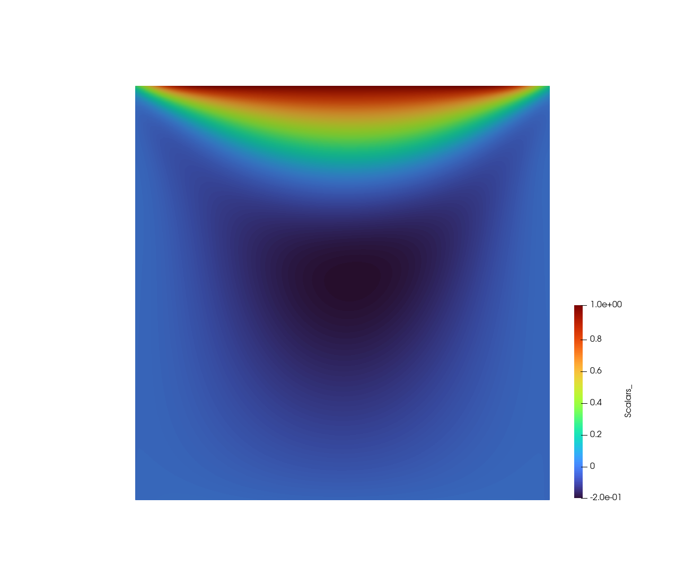
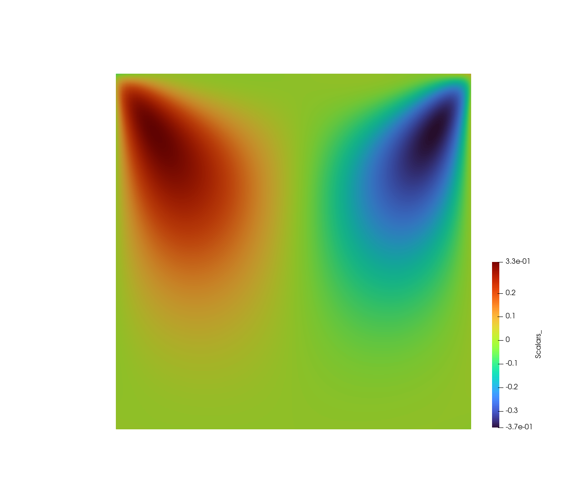

顶盖驱动方腔流
======================

本指南介绍如何在PaddleScience中建立一个PINN模型，并以此来模拟二维顶盖驱动方腔(LDC)流。

- **用例介绍**

LDC问题模拟了一个充满液体的容器， 其上盖在水平方向以恒定的速度移动，目标是计算系统处于稳定状态时容器内各点的液体速度。

下图展示了在100×100的网格上的训练结果，两图分别表示速度的垂直和水平分量。

- **如何构建PINN模型**

PINN模型由传统PDE体系和神经网络共同组成来近似求解。PDE部分包括执行物理定律的特定微分方程、限定了问题域的几何图形，以及使其有可能找到解的初始条件和边界条件。神经网络部分可以采用深度学习工具包中广泛提供的前馈神经网络(FFN)变体。

为了获得PINN模型，我们需要对神经网络进行训练。正是在这个阶段中，PDE的信息通过反向传播被灌送到神经网络中。而损失函数的重要作用则体现在控制如何分配这些信息，以此来强调PDE的不同方面，例如，损失函数可以调整方程残差的权重和边界值。

既然相关概念已经明确，接下来让我们一窥如何建立ldc2d的PINN模型吧。

- **构建PDE**

    .. code-block::

        geo = psci.geometry.Rectangular(
        space_origin=(-0.05, -0.05), space_extent=(0.05, 0.05))

首先，使用 `psci.geometry` 模块来定义所要求解的几何体。在本例中，我们使用一个左下角位于(-0.05, -0.05)、右上角位于(0.05, 0.05) 的矩形。
接下来，定义需要求解的偏微分方程(PDE)。在本例中，我们使用二维纳维-斯托克斯方程。该方程已被封装在PaddleScience中，只需简单地实例化一个`psci.pde.NavierStokes2D`对象来建立方程即可。

    .. code-block::
        
        pdes = psci.pde.NavierStokes2D(nu=0.01, rho=1.0)

在定义好方程和问题域之后，我们需要给出一个离散化方法。该方法将用于在训练开始前生成训练数据。目前，二维的区域可以被离散化为N×M的网格，在本例中为101×101。

    .. code-block::

        pdes, geo = psci.discretize(pdes, geo, space_steps=(101, 101))

如上所述，有效的问题设置依赖于对边界和初始值的充分约束。在本例中， `GenBC` 能生成给定边界的初始值，再通过调用 `pdes.set_bc_value()` 可将初始值传给PDE求解器。
值得注意的是，通常情况下，我们将生成边界和初始值的函数传入求解器，而不是传入具体的值。

    .. code-block::

        def GenBC(xy, bc_index):
            bc_value = np.zeros((len(bc_index), 2)).astype(np.float32)
            for i in range(len(bc_index)):
                id = bc_index[i]
                if abs(xy[id][1] - 0.05) < 1e-4:
                    bc_value[i][0] = 1.0
                    bc_value[i][1] = 0.0
                else:
                    bc_value[i][0] = 0.0
                    bc_value[i][1] = 0.0
            return bc_value

	bc_value = GenBC(geo.space_domain, geo.bc_index)
        pdes.set_bc_value(bc_value=bc_value, bc_check_dim=[0, 1])

- **构建神经网络**

现在PDE的部分已经完成，接下来构建神经网络。我们可以简单地通过实例化 `psci.network.FCNet` 来定义全连接网络。下面我们定义了一个以双曲正弦函数(tanh)为激活函数、拥有5层隐藏层的FFN，其中每个隐藏层有20个神经元。

    .. code-block::

        net = psci.network.FCNet(
            num_ins=2,
            num_outs=3,
            num_layers=5,
            hidden_size=20,
            dtype="float32",
            activation='tanh')

接下来，最重要步骤便是定义损失函数。这里我们使用L2损失，其边界值使用给定权重。

    .. code-block::

        bc_bc_weight = GenBCWeight(geo.space_domain, geo.bc_index)
	
        loss = psci.loss.L2(pdes=pdes,
                            geo=geo,
                            eq_weight=0.01,
                            bc_weight=bc_weight,
                            synthesis_method='norm')

由于loss的设计可以很好的传递PDE的完整信息，因此我们在后续步骤不再需要显式地调用PDE。现在我们结合神经网络和损失函数，直接创建一个 `psci.algorithm.PINNs` 的实例。

    .. code-block::

        algo = psci.algorithm.PINNs(net=net, loss=loss)

接下来，通过对求解器插入一个Adam优化器，我们便可以开始训练了。本例中，Adam优化器的学习率设置为0.001。
`psci.solver.Solver` 类将PINN模型（示例代码中为algo）和优化器（示例代码中为opt）绑定到求解器上，该求解器拥有接口solve来进行求解以得到近似解。
`solver.solve` 接收三个关键字参数： `num_epoch` 指定训练周期有多少epoch， `batch_size` 指定每次训练迭代的数据量大小，不指定则默认为全部， `checkpoint_freq` 指定保存模型参数的频率。

    .. code-block::

        opt = psci.optimizer.Adam(learning_rate=0.001, parameters=net.parameters())
        solver = psci.solver.Solver(algo=algo, opt=opt)
        solution = solver.solve(num_epoch=30000)

最后， `solver.solve` 返回一个能计算几何体中给定点对应结果的函数。调用该函数，并且传递一个geometry对象，便可以得到最终的numpy结果，然后，你可以对其进行验证或可视化。

`psci.visu.save_vtk` 是一个快速可视化的辅助工具，它可以将图像保存在vtp文件中，该文件类型可使用 `Paraview <https://www.paraview.org/>`_ 查看。

    .. code-block::
    
        rslt = solution(geo)
        u = rslt[:, 0]
        v = rslt[:, 1]
        u_and_v = np.sqrt(u * u + v * v)
        psci.visu.save_vtk(geo, u, filename="rslt_u")
        psci.visu.save_vtk(geo, v, filename="rslt_v")
        psci.visu.save_vtk(geo, u_and_v, filename="u_and_v")
