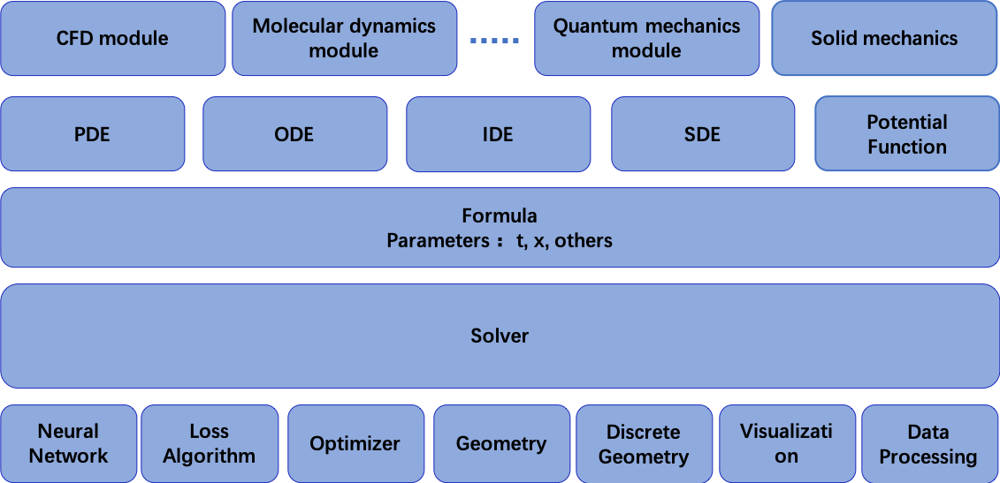

欢迎来到PaddleScience的文档
=========================================

PaddleScience是一个用于开发基于PaddlePaddle的AI驱动的科学计算应用的SDK和库。目前版本为v0.1。

PaddleScience通过可重用的软件组件扩展了PaddlePaddle框架，用于开发新的科学计算应用。这种新的应用包括内嵌物理知识神经网络、基于神经网络的PDE求解器、用于CFD(Computational Fluid Dynamics)的机器学习等等。

PaddleScience目前正在积极开发中。其设计和API也在不断发展演进。

- **核心特征和组织**

    PaddleScience目前专注于PINNs模型。其核心组成如下。

  - Geometry，一个声明性接口。用于定义几何学结构，支持自动离散化。

  - PDE，符号形式下的偏微分方程。特定的PDEs派生出基础PDE class。目前包括两个原生的PDE：Laplace2d和NavierStokes2d。

  - Loss，定义了训练过程中的损失函数。默认使用L2 loss。目前，总损失为方程损失、边界条件损失和初始条件损失三者的加权和。

  - Optimizer，指定训练使用的优化器。默认为Adam。未来将会支持更多的优化器，如BFGS等。

  - Solver，以批处理的方式来管理训练数据的训练。

  - Visualization，用于简单可视化几何图形和数据。

  - 各组件组织情况如下图所示。

* GitHub: https://github.com/PaddlePaddle/PaddleScience
* Gitee:  https://gitee.com/paddlepaddle/PaddleScience

.. toctree::
   :maxdepth: 2

   :caption: 快速开始
   安装 <getting_started/installation>
   运行样例 <getting_started/howto>
   
.. toctree::

   :maxdepth: 2
   :caption: API 参考

   paddlescience.pde <api/pde>
   paddlescience.geometry <api/geometry>
   paddlescience.discretize <api/discretize>
   paddlescience.network <api/network>
   paddlescience.loss <api/loss>
   paddlescience.algorithm <api/algorithm>
   paddlescience.optimizer <api/optimizer>
   paddlescience.solver <api/solver>
   paddlescience.visu <api/visu>

   
.. toctree::
   :maxdepth: 2
   :caption: 样例 / 演示

   顶盖驱动方腔流  <examples/ldc2d>
   多孔介质中的达西渗流 <examples/darcy>

	     
索引和表格
====================
* :ref:`genindex`
* :ref:`modindex`
* :ref:`search`