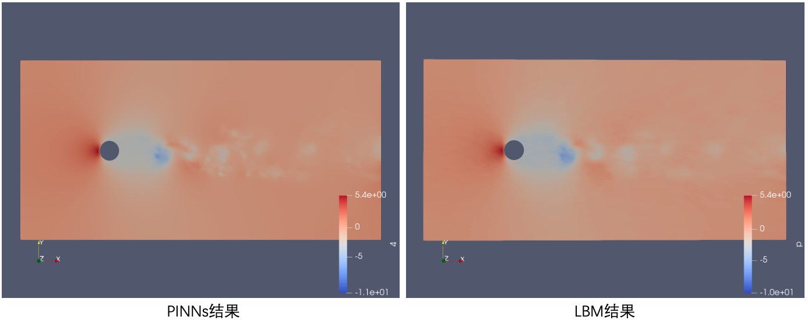

# Re 3900 3D瞬态圆柱绕流

<a href="https://aistudio.baidu.com/aistudio/projectdetail/6160381?contributionType=1&sUid=438690&shared=1&ts=1683961158552" class="md-button md-button--primary" style>AI Studio快速体验</a>

## 1. 问题简介

圆柱绕流在工程中十分常见，如桥墩，电缆，海底电缆管道，海底石油管道，海洋平台支架等圆形截面的工程结构经常会处于流体绕流的工况，高雷诺数三维圆柱绕流，而随着流体雷诺数的增加，粘性力超过惯性力占主导地位，此时流体从层流向更复杂的湍流过度，此时流线变得无序混乱，周期性的产生和耗散大量尺寸不一的旋涡。

流态转变时的雷诺数值称为临界雷诺数。一般雷诺数Re>4000为湍流状态，Re=2320～4000为过渡状态。而临界雷诺数Re=3900，作为流体力学领域的一个经典案例，对我们研究湍流的发展和规律有着重要意义。


对于非定常高雷诺数绕流流动,在传统数值方面,可以采用DNS方法，该方法受限于计算量较大，对数据存储要求高。另一方面，作为现代工业流体软件核心，可以采用雷诺平均方法(RANS), 但是，非定常RANS方法无法预测小涡。而LES方法需要近壁面精细网格，还有其他的方法诸如LBM方法、混合的DES以及衍生方法、SPH方法等等求解流体问题。


<figcaption>2016 D’Alessandro.V, Openfoam</figcaption>


在实验方面，一般采用粒子图像测速（PIV）和热线法测量，测试到圆柱不同距离的流线速度，但是实验测量的分辨率受到设备限制，无法在有限实验经费内实现高测量分辨率。


<figcaption>1994 Ong.L, PIV+HWM</figcaption>


## 2. 问题定义
问题假设：三维，瞬态，不可压缩，温度不变，有粘性，牛顿流体, 忽略重力等体积力
|符号|$u$|$v$|$w$|$p$|$x$|$y$|$z$|$t$|$\rho$|$\mu$
|----|----|----|----|----|----|----|----|----|----|----|
|含义|x方向速度|y方向速度|z方向速度|压力|x方向位移|y方向位移|z方向位移|时间|密度|动力粘性系数
|单位|$m/s$|$m/s$|$m/s$|$Pa$|$m$|$m$|$m$|$s$|$kg/m^3$|$N\cdot s/m^2$

纳维尔斯托克斯方程组 Navier-Stokes Equations：\
质量守恒：

$$
\frac{\partial u}{\partial x} + \frac{\partial v}{\partial y} +\frac{\partial w}{\partial z} = 0
$$

$x$ 动量守恒：

$$
\frac{\partial u}{\partial t}  + u\frac{\partial u}{\partial x} + v\frac{\partial u}{\partial y} + w\frac{\partial u}{\partial z} = -\frac{1}{\rho} \frac{\partial p}{\partial x} + \mu(\frac{\partial^2 u}{\partial x^2}+ \frac{\partial^2 u}{\partial y^2}+ \frac{\partial^2 u}{\partial z^2})
$$

$y$ 动量守恒：

$$
\frac{\partial u}{\partial t}  + u\frac{\partial v}{\partial x} + v\frac{\partial v}{\partial y} + w\frac{\partial v}{\partial z} = -\frac{1}{\rho} \frac{\partial p}{\partial x} + \mu(\frac{\partial^2 v}{\partial x^2}+ \frac{\partial^2 v}{\partial y^2}+ \frac{\partial^2 v}{\partial z^2})
$$

$z$ 动量守恒：

$$
\frac{\partial u}{\partial t}  + u\frac{\partial v}{\partial x} + v\frac{\partial v}{\partial y} + w\frac{\partial v}{\partial z} = -\frac{1}{\rho} \frac{\partial p}{\partial x} + \mu(\frac{\partial^2 v}{\partial x^2}+ \frac{\partial^2 v}{\partial y^2}+ \frac{\partial^2 v}{\partial z^2})
$$
**设特征速度值为：$U_0=0.1m/s$， 特征长度:$L_0=80m$**

$$t_0 = \dfrac{L_0}{U_0}$$

$$x_0=y_0=z_0 = L_0$$

$$u_0=v_0=w_0 = U_0$$

$$p_0 = \rho {U_0}^2$$

**定义：**

无量纲时间: $t^* = \dfrac{t}{t_0}$

无量纲坐标：$x^* = \dfrac{x}{x_0}$,  $y^* = \dfrac{y}{y_0}$,  $z^* = \dfrac{z}{z_0}$

无量纲速度: $u^* = \dfrac{u}{u_0}$,  $v^* = \dfrac{v}{v_0}$,  $w^* = \dfrac{w}{w_0}$

无量纲压力 $P = \dfrac{p}{p_0}$

雷诺数 $Re = \dfrac{\rho U_0 L}{\mu}$

对于流体域（六面体）边界和流体域内部几何体（圆柱）边界，则需施加 Dirichlet 边界条件

流体域入口（-x方向）边界$u = 1\ m/s,\ v = 0\ m/s,\ w = 0\ m/s$\
流体域出口（x方向）压力边界：$p = 0\ Pa$\
流体域顶部（y方向）无摩擦边界：$u = 1\ m/s,\ v = 0\ m/s,\ w = 0\ m/s$\
流体域底部（y方向）无摩擦边界：$u = 1\ m/s,\ v = 0\ m/s,\ w = 0\ m/s$\
流体域底部（y方向）无摩擦边界：$u = 1\ m/s,\ v = 0\ m/s,\ w = 0\ m/s$\
几何体（圆柱曲面）无滑移边界：$u = 0\ m/s,\ v = 0\ m/s,\ w = 0\ m/s$

## 3. 问题求解

接下来开始讲解如何将问题一步一步地转化为 PaddleScience 代码，用深度学习的方法求解该问题。 为了快速理解 PaddleScience，接下来仅对模型构建、方程构建、计算域构建等关键步骤进行阐述，而其余细节请参考[API文档](../api/arch.md)。

### 3.1 模型构建

在本问题中，每一个已知的坐标点 $(x,y,z,t)$ 都有流向速度$u$、垂直速度$v$，展向速度$w$和压力$p$ 四个待求解的物理量，我们在这里使用比较简单的 MLP(Multilayer Perceptron, 多层感知机) 来表示坐标点 $(x,y,z,t)$到物理量的映射函数 $(u,v,w,p)$，即：
$$
x,y,z,t=f(u,v,w,p)
$$

上式中 $f$ 即为 MLP 模型本身，用 PaddleScience 代码表示如下

``` py linenums="32"
model = ppsci.arch.MLP(
    input_keys=("t", "x", "y"), output_keys=("u", "v", "p"), num_layers=5, hidden_size=50, activation="tanh", skip_connection=False, weight_norm=False
)
```

为了在计算时，准确快速地访问具体变量的值，我们在这里指定网络模型的输入变量名是 `["t", "x", "y", "z"]`，输出变量名是 `["u", "v", "w", "p"]`，这些命名与后续代码保持一致。

接着通过指定 MLP 的层数、神经元个数以及激活函数，我们就实例化出了一个拥有 5 层隐藏神经元，每层神经元数为 50，使用 `tanh` 作为激活函数的神经网络模型 `model`。

### 3.2 方程构建

由于本案例使用的是 `Navier-Stokes` 方程的2维瞬态形式，因此可以直接使用 PaddleScience 内置的 `NavierStokes`类。

``` py linenums="36"
equation = {"NavierStokes": ppsci.equation.NavierStokes(nu=0.02, rho=1.0, dim=3, time=True)}
```

在实例化 `NavierStokes` 类时需指定必要的参数：动力粘度 $\mu=1.0 * 0.1 * 80 / 3900$, 流体密度 $\rho=1.0$。

### 3.3 计算域构建

本文中案例的流体域由 `vtu` 格式文件储存的点云构成，因此可以直接使用 PaddleScience 内置的点云几何 `PointCloud`表示计算域。

``` py linenums="39"
geom = {
        "interior": ppsci.geometry.PointCloud(
            interior=normalize(interior_data),
            coord_keys=("t", "x", "y", "z"),
        )
    }
```
### 3.4 约束构建

根据 [2. 问题定义](#2) 得到的无量纲公式和和边界条件，对应了在计算域中指导模型训练的三类约束条件，即：

1. 流体域内部点上的无量纲 Navier-Stokes <font color=#FF000 >方程约束</font>。

2. 施加在流体域出入口、圆柱表面、流体域上下滑移面的 Dirichlet <font color=#FF000 >边界条件</font>。

3. 施加在初始时刻流体域内部点上的<font color=#FF000 >初始边界条件</font>。

4. 施加在部分流体域内部点上的无量纲<font color=#FF000 >监督约束</font>。

接下来使用 PaddleScience 内置的 `InteriorConstraint` 和 `SupervisedConstraint` 来实现这三类约束条件。

#### 3.4.1 内部点约束

以作用在流体域内部点上的 `InteriorConstraint` 为例，代码如下：

``` py linenums="88"
pde_constraint = ppsci.constraint.InteriorConstraint(
        output_exper=equation["NavierStokes"].equations,
        label_dict={"continuity": 0, "momentum_x": 0, "momentum_y": 0, "momentum_z": 0},
        geom=geom["interior"],
        evenly=True,
        dataloader_cfg={
            **train_dataloader_cfg,
            "iters_per_epoch": int(geom["interior"].len / batchsize_interior),
            "dataset": "NamedArrayDataset",
            "batch_size": batchsize_interior,
        },
        loss=ppsci.loss.MSELoss("mean", 1),
        name="INTERIOR",
    )
```

- 第一个参数是`InteriorConstraint` 的方程表达式，用于描述如何计算约束目标，此处填入在 [3.2 方程构建](#32) 章节中实例化好的 `equation["NavierStokes"].equations`。
- 第二个参数是约束变量的目标值，在本问题中我们希望 Navier-Stokes 方程产生的三个中间结果 `continuity`, `momentum_x`, `momentum_y`, `momentum_z` 守恒，因此将它们的目标值(方程左侧减去方程右侧的值)全部设为 0。
- 第三个参数是约束方程作用的计算域，此处填入在 [3.3 计算域构建](#33) 章节实例化好的 `geom["interior"]` 即可。
- 第四个参数是在计算域上的采样方式，`evenly=True` 时不进行采样。
- 第五个参数是在计算域上的采样配置，此处我们使用分batch数据集训练，因此 `dataset` 字段设置为 "NamedArrayDataset" 且 `batch_size` 设为 `batchsize_interior`。
- 第六个参数是损失函数，此处我们选用常用的MSE函数，且 `reduction` 设置为 `"mean"`，即我们会将参与计算的所有数据点产生的损失项求和取平均。
- 第七个参数是约束条件的名字，我们需要给每一个约束条件命名，方便后续对其索引。此处我们命名为 "INTERIOR" 即可。

#### 3.4.2 初值约束、边界条件、监督数据约束（设置方法相同）

我们还需要构建流体域的流入流出边界、圆柱边界、上下表面边界共五个边界的约束。以 `bc_inlet_cylinder` 边界约束为例，由于作用区域是边界且边界上的数据由 `vtu` 文件记录，因此我们使用 `SupervisedConstraint` 类。
``` py
bc_cylinder = ppsci.constraint.SupervisedConstraint(
        dataloader_cfg={
            **train_dataloader_cfg,
            "dataset": {
                "name": "VtuDataset",
                "file_path": "data/sample_points/cylinder_txyz.vtu",
                "input_keys": model.input_keys,
                "label_keys": ("u", "v", "w"),
                "labels": {"u": 0, "v": 0, "w": 0},
                "transforms": [norm_cfg],
            },
            "batch_size": batchsize_cylinder,
        },
        loss=ppsci.loss.MSELoss("mean", 5),
        name="BC_CYLINDER",
    )
```
- 第一个参数为 `dataloader_cfg`，即 `dataloader` 构造的参数，包括 `dataset` 的名称，读取数据的地址 `file_path` ，输入数据，和数据的标签，以及无量纲化的系数 `transforms` 和数据分割成batch的 `batch_size`
- 第二个参数是损失函数，此处我们选用常用的MSE函数，且 `reduction` 设置为 `"mean"`，即我们会将参与计算的所有数据点产生的损失项求和取平均；
- 第三个参数是约束条件的名字，我们需要给每一个约束条件命名，方便后续对其索引。此处我们命名为 "BC_CYLINDER" 即可。

其余约束按照相同原理构建。

### 3.5 超参数设定

接下来我们需要指定训练轮数和学习率，此处我们按实验经验，使用 `4e5` 轮训练轮数，评估间隔为 `1e3` ，学习率设为 0.001。

``` py linenums="169"
epochs = 400000

learning_rate = 0.001

# batch size
batchsize_interior = 4000
batchsize_inlet = 256
batchsize_outlet = 256
batchsize_cylinder = 256
batchsize_top = 1280
batchsize_bottom = 1280
batchsize_ic = 6400
batchsize_supervised = 6400
```

### 3.6 优化器构建

训练过程会调用优化器来更新模型参数，此处选择较为常用的 `Adam` 优化器。使用余弦退火（CosineAnnealingLR）学习率调节算法。
``` py linenums="173"
lr_scheduler = ppsci.optimizer.lr_scheduler.Cosine(
        epochs=epochs,
        iters_per_epoch=1,
        learning_rate=0.001,
        warmup_epoch=int(epochs * 0.125),
    )()

# set optimizer
optimizer = ppsci.optimizer.Adam(learning_rate=lr_scheduler)((model,))
```

### 3.7 评估器构建

在训练过程中通常会按一定轮数间隔，用验证集（测试集）评估当前模型的训练情况，因此使用 `ppsci.validate.GeometryValidator` 构建评估器。

``` py linenums="176"
# set visualizer(optional)
    eval_dataloader_cfg = {
        "sampler": {
            "name": "BatchSampler",
            "shuffle": False,
            "drop_last": False,
        },
        "num_workers": 0,
    }
    validator = {
        "Residual": ppsci.validate.SupervisedValidator(
            dataloader_cfg={
                **eval_dataloader_cfg,
                "dataset": {
                    "name": "VtuDataset",
                    "file_path": ref_file,
                    "input_keys": model.input_keys,
                    "label_keys": ("u", "v", "w"),
                    "time_step": TIME_STEP,
                    "time_index": (0,),
                    "transforms": [norm_cfg],
                },
                "total_size": len(next(iter(lbm_0_dict.values()))),
                "batch_size": 1024,
            },
            loss=ppsci.loss.MSELoss("mean"),
            metric={"MSE": ppsci.metric.MSE()},
            name="Residual",
        ),
    }
```

方程设置与 [约束构建](#32) 的设置相同，表示如何计算所需评估的目标变量；

此处我们为 `momentum_x`, `continuity`, `momentum_y`, `momentum_z` 三个目标变量设置标签值为 0(向量)；

计算域与 [约束构建](#32) 的设置相同，表示在指定计算域上进行评估；

采样点配置则需要指定总的评估点数 `total_size`，此处我们设置为读取文件的数据长度；

评价指标 `metric` 选择 `ppsci.metric.MSE` 即可；

其余配置与 [约束构建](#32) 的设置类似。

### 3.8 *可视化器构建

在模型评估时，如果评估结果是可以可视化的数据，我们可以选择合适的可视化器来对输出结果进行可视化。

本文中的输出数据是流体控制域内的三维点集，每个时刻 $t$ 第 $i$ 个点的坐标是 $(x^t_i, y^t_i, z^t_i)$，对应值是 $(u^t_i, v^t_i, w^t_i, p^t_i)$，因此我们只需要将评估的输出数据按时刻保存成 100 个 `vtu` 格式文件，最后用开源的paraview可视化软件打开查看即可。代码如下, 此处我们在 $t_0$ 时刻的点坐标位置获取 $t_0$ ~ $t_{99}$ 序列的解：

``` py linenums="194"
# set visualizer(optional)
onestep_input, _ = reader.load_vtk_file(ref_file, 0, [0], model.input_keys, ())
data_len_for_onestep = len(next(iter(onestep_input.values())))
input_dict = {
    "t": np.concatenate(
        [np.full((data_len_for_onestep, 1), t, "float32") for t in time_tmp], axis=0
    ),
    "x": np.tile(onestep_input["x"], (len(time_tmp), 1)),
    "y": np.tile(onestep_input["y"], (len(time_tmp), 1)),
    "z": np.tile(onestep_input["z"], (len(time_tmp), 1)),
}
input_dict = normalize(input_dict)
_, label = reader.load_vtk_file(
    ref_file, TIME_STEP, time_list, model.input_keys, model.output_keys
)

denormalize = transform.Scale(norm_factor)
visualizer = {
    "visulzie_uvwp": ppsci.visualize.Visualizer3D(
        input_dict,
        {
            "u": lambda out: out["u"] * norm_factor["u"],
            "v": lambda out: out["v"] * norm_factor["v"],
            "w": lambda out: out["w"] * norm_factor["w"],
            "p": lambda out: out["p"] * norm_factor["p"],
        },
        600000,
        label,
        time_list,
        len(time_list),
        "result_uvwp",
    )
}
```

### 3.9 模型训练、评估与可视化

完成上述设置之后，只需要将上述实例化的对象按顺序传递给 `ppsci.solver.Solver`，然后启动训练、评估、可视化。

``` py linenums="207"
--8<--
# initialize solver
solver = ppsci.solver.Solver(
    model,
    constraint,
    output_dir,
    optimizer,
    lr_scheduler,
    epochs,
    1,
    save_freq=1000,
    eval_during_train=False,
    eval_freq=1000,
    equation=equation,
    geom=None,
    validator=validator,
)

# train model
solver.train()

# visualize model
solver.visualize()

--8<--
```

## 4. 完整代码

``` py linenums="1" title="cylinder2d_unsteady_Re100.py"
--8<--
examples/cylinder/3d_unsteady_discrete/cylinder3d_unsteady.py
--8<--
```

## 5. 结果展示

???+ info "说明"

    本案例只作为demo展示，尚未进行充分调优，下方部分展示结果可能与 OpenFOAM 存在一定差别。


<figcaption>x方向速度 $u$ ：PINNs(left) LBM(right)</figcaption>


<figcaption>压力 $p$ : PINNs(left) LBM(right)</figcaption>
