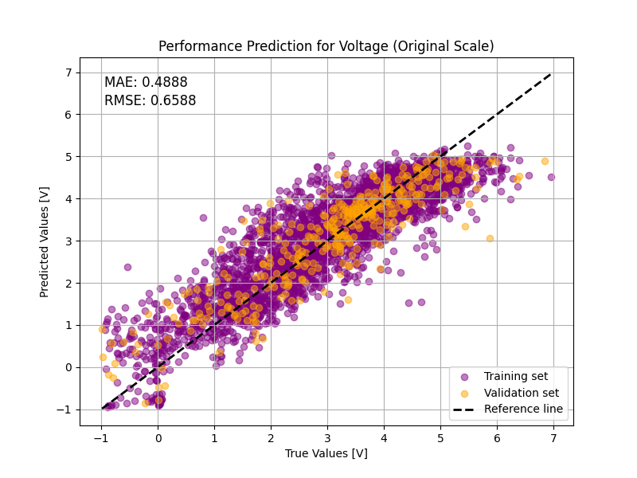
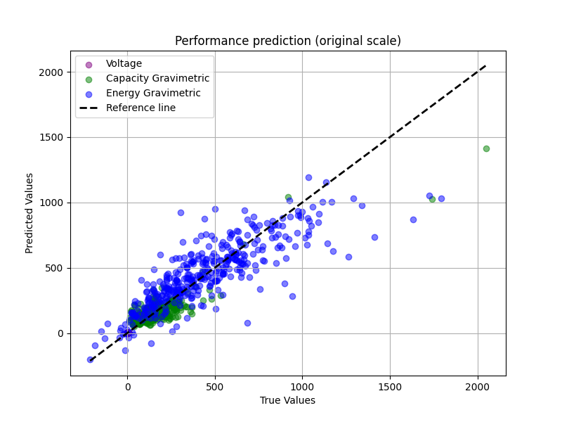
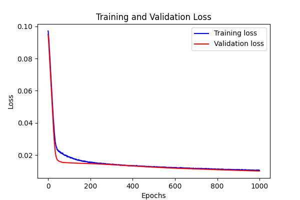

# Battery_LI（锂离子电池电极材料性能预测）

## 概述
该多层感知器（MLP）模型旨在利用从材料项目（Materials Project）数据集中提取的特征，预测锂离子电池电极材料的电化学性能。输入特征包括化学计量属性、晶体结构特性、电子结构属性和其他电池属性。输出为平均电压、比能量和比容量。

## 数据集介绍
关于数据集，请查看该文件，MP_data_down_loading(train+validate).csv

数据读取需要额外安装依赖 `bayesian-optimization`，请运行安装命令 `pip install bayesian-optimization`。

## 模型

要查看该模型的具体实现，请参考以下代码文件：`MLP_LI.py`

## 模型训练命令
=== "模型训练命令"

    ``` sh
    python MLP_LI.py
    ```

## 训练好的模型权重文件

| 预训练模型                        |
|-----------------------------------|
| [MLP_LI_pretrained.pdparams](https://paddle-org.bj.bcebos.com/paddlescience/models/MLP_LI/MLP_LI_pretrained.pdparams) |


## 模型性能

模型在测试集上的表现如下：

- **Test Loss**: 0.0035
- **电压 RMSE（原始尺度）**: 0.659
- **比容量 RMSE（原始尺度）**: 79.215
- **比能量 RMSE（原始尺度）**: 176.573
- **平均 RMSE（原始尺度）**: 85.482

此外，模型在各个输出指标上的平均绝对误差（MAE）如下：

- **电压 MAE（原始尺度）**: 0.489
- **比容量 MAE（原始尺度）**: 50.363
- **比能量 MAE（原始尺度）**: 127.038
- **平均 MAE（原始尺度）**: 59.297

这些结果表明模型在预测电压方面具有较高的精度，而在预测比容量和比能量方面还有一定的改进空间。

### 图表

#### 1. 电压的性能预测（原始尺度）
此图展示了电压的性能预测。预测值与真实值的比较用于评估模型的准确性。



#### 2. 性能预测（原始尺度）
此图展示了模型对所有三个电化学性能（电压、比能量和比容量）的整体预测表现。



#### 3. 初始训练损失
以下图显示了在初始训练阶段的训练和验证损失变化情况（按Epochs）。



## 结论
该 MLP 模型在提供的数据集上表现出较强的预测能力，尤其是在电压的预测上。然而，在比容量和比能量的预测上还有进一步改进的空间。未来可以通过更丰富的特征工程、更复杂的模型架构以及优化的超参数调整来提高模型的预测性能。

## 下一步
1. 考虑增加额外的特征或进行特征工程，以提高模型预测的准确性。
2. 尝试不同的神经网络架构或优化策略，以改进性能。
3. 继续进行超参数优化，以获得更好的模型性能。


## 参考资料

Yang, X., Li, Y., Liu, Z., & Zhang, W. (2022)