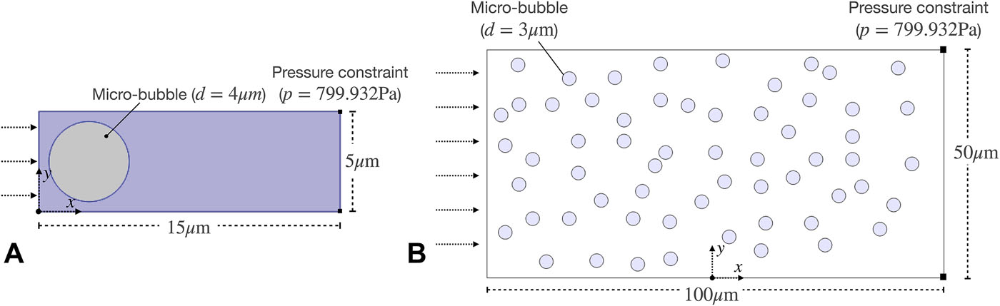
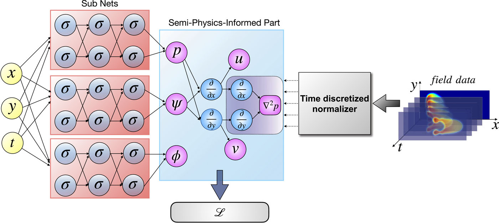
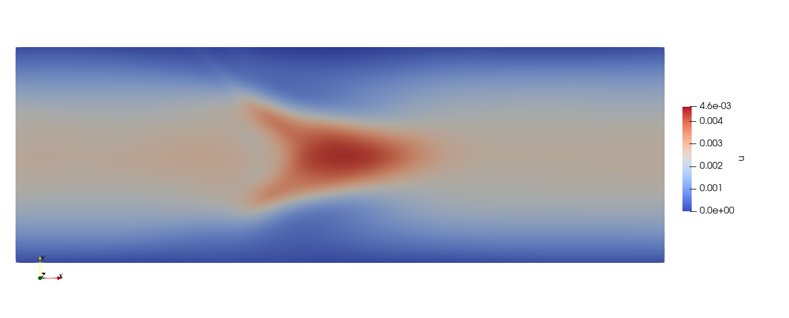
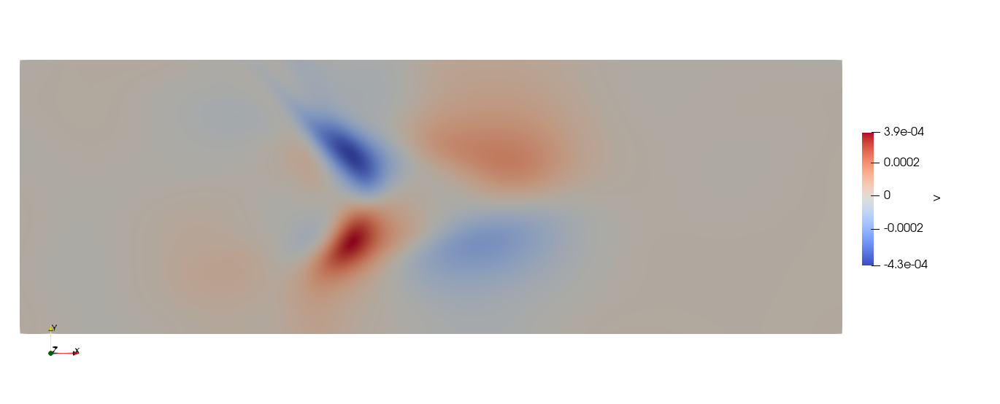
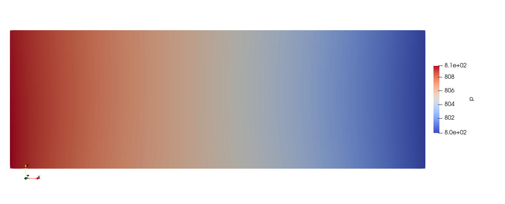
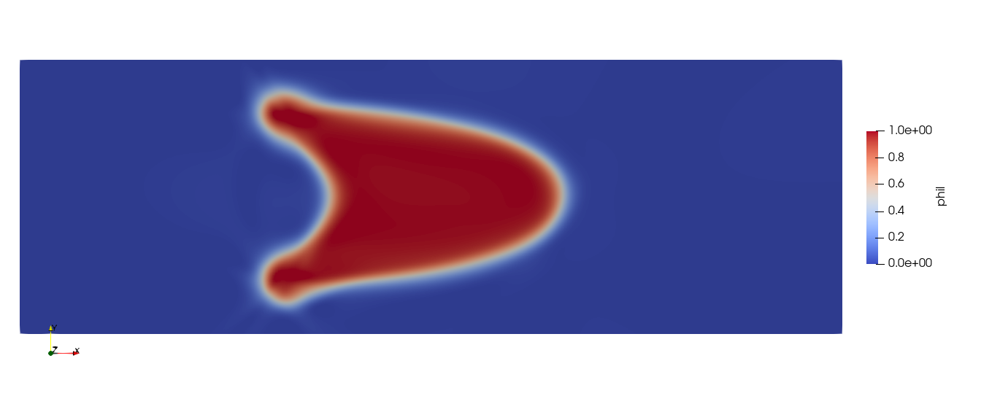

# Bubble_flow

## 1. 问题简介

多相流是指由两种或两种以上的不同相态物质组成的流动体系。在多相流中，各相之间有明显的界面，并且各自保持相对独立的物质特性，如气-液、气-固、液-液、液-固等。

气泡流作为多相流的典型代表，已广泛应用于生物医学工程，例如血脑屏障和药物输送。由于气泡流是一种具有高密度梯度的经典流体力学问题，因此经常被用于测试算法的有效性。气泡流可以分为单气泡流(图 A )和多气泡流(图 B )。

<figure markdown>
  { loading=lazy style="height:80%;width:80%" align="center" }
</figure>

尽管 PINNs 方法取得了重大发展，但损失函数中物理方程的考虑通常需要物理量的高阶微分。在两相流中，不同流体界面处的相位值呈现出从 0 到 1 的剧烈变化，使得梯度的计算变得非常困难。因此，高分辨率训练数据将是算法成功的先决条件，特别是对于具有高梯度的变量。这将大大增加深度学习的计算量。然而，许多实验很难获得高分辨率的数据。

为此，我们不采用完整的流体动力学方程来监督训练过程，而是基于部分物理信息来获得令人满意的结果。具体来说，我们仅将流体连续性条件（ $\nabla u =0$ ）和压力泊松方程（表示为 $\mathcal{P}$⁠ ) 代入损失函数，可以将其描述为具有半物理信息的神经网络—— Semi-PINNs。

## 2. 问题定义
### 2.1. 气泡流控制方程
气泡流在许多生物应用中经常遇到。两相流（空气和水）由 Navier–Stokes 方程控制，

$$
\begin{cases}
\begin{aligned}
  \nabla \cdot \boldsymbol{u}&=0, \\
  \rho\left(\frac{\partial \boldsymbol{u}}{\partial t}+(\boldsymbol{u} \cdot \nabla) \boldsymbol{u}\right)&=-\nabla p+\mu \nabla^2 \boldsymbol{u},
\end{aligned}
\end{cases}
$$

其中 $\rho$ 是流体密度，$\boldsymbol {u} = ( u , v )$ 是二维速度矢量，$p$ 是流体压力，$\mu$ 是动力粘度。空气和水之间的界面由某个水平集或全局定义函数的等值线表示，即定义二维空间中的水平集函数 $\phi = \phi ( x , y , t )$。对于水来说 $\phi=0$，对于空气来说 $\phi=1$。在整个界面中，有从 0 到 1 的光滑过渡，界面由水平集 $\phi= 0.5$ 定义。

设 $\rho_l$ 为水（液体）密度，$\rho_g$ 为空气（气体）密度，$\mu_l$ 为水粘度，$\mu_g$ 为空气粘度。流体中的密度和粘度可以通过水平集函数表示为：

$$\begin{aligned}
\rho & =\rho_l+\phi\left(\rho_g-\rho_l\right), \\
\mu & =\mu_l+\phi\left(\mu_g-\mu_l\right) .
\end{aligned}$$

为了模拟液体和气体之间的界面，水平集函数 $\phi = \phi ( x , y , t )$ 定义为

$$\frac{\partial \phi}{\partial t}+\boldsymbol{u} \cdot \nabla \phi=\gamma \nabla \cdot\left(\epsilon_{l s} \nabla \phi-\phi(1-\phi) \frac{\nabla \phi}{|\nabla \phi|}\right),$$

其中左端描述了界面的运动，而右端旨在保持界面紧凑，使数值稳定。$\gamma$ 是初始化参数，决定了水平集函数的重新初始化或稳定量，$\epsilon_{l s}$ 是控制界面厚度的参数，它等于网格最大尺寸。

### 2.2. BubbleNet（Semi-PINNs方法）

- 引入流函数 $\psi$ 用于预测速度场 $u$、$v$，即

$$u=\frac{\partial \psi}{\partial y},\quad  v=-\frac{\partial \psi}{\partial x},$$

流函数的引入避免了损失函数中速度向量的梯度计算，提高了神经网络的效率。

- 引入压力泊松方程，以提高预测的准确性，即对动量方程等号两端同时求散度：

$$\nabla^2 p=\rho \frac{\nabla \cdot \mathbf{u}}{\Delta t}-\rho \nabla \cdot(\mathbf{u} \cdot \nabla \mathbf{u})+\mu \nabla^2(\nabla \cdot \mathbf{u}) = -\rho \nabla \cdot(\mathbf{u} \cdot \nabla \mathbf{u}).$$

- 时间离散归一化（TDN），即

$$\mathcal{W}=\frac{\mathcal{U}-\mathcal{U}_{\min }}{\mathcal{U}_{\max }-\mathcal{U}_{\min }},$$

其中 $\mathcal{U}=(u, v, p, \phi)$ 是从气泡流模拟中获得的粗化数据，$\mathcal{U}_{\min },~\mathcal{U}_{\max }$ 分别为每个时间步粗化CFD数据的最大值和最小值。如此处理的原因在于流场中的物理量变化较大，TDN 将有助于消除物理量变化造成的不准确性。

- 使用均方误差（MSE）来计算损失函数中预测和训练数据的偏差，损失函数表示为

$$\mathcal{L}=\frac{1}{m} \sum_{i=1}^m\left(\mathcal{W}_{\text {pred }(i)}-\mathcal{W}_{\text {train }(i)}\right)^2+\frac{1}{m} \sum_{i=1}^m\left(\nabla^2 p_{(i)}\right)^2,$$

其中 $\mathcal{W}=(u, v, p, \phi)$ 表示归一化后的数据集。

## 3. 问题求解

接下来开始讲解如何将问题一步一步地转化为 PaddleScience 代码，用深度学习的方法求解该问题。为了快速理解 PaddleScience，接下来仅对模型构建、约束构建等关键步骤进行阐述，而其余细节请参考[API文档](../api/arch.md)。

### 3.1 数据处理

数据集是通过用细网格下的 CFD 结果获得的，包含未归一化的 $x,~y,~t,~u,~v,~p,~\phi$，以字典的形式存储在 `.mat` 文件中。

运行本问题代码前请下载[数据集](https://paddle-org.bj.bcebos.com/paddlescience/datasets/BubbleNet/bubble.mat)

下载后，我们需要首先对数据集进行时间离散归一化（TDN）处理，同时构造训练集和验证集。

``` py linenums="39"
--8<--
examples/bubble/bubble.py:39:83
--8<--
```

### 3.2 模型构建

气泡流问题的模型结构图为：

<figure markdown>
  { loading=lazy style="height:80%;width:80%" align="center" }
</figure>

在气泡流问题中，每一个已知的坐标点 $(t, x, y)$ 都有自身的流函数 $\psi$、压力 $p$ 和 水平集函数 $\phi$ 三个待求解的未知量，我们在这里使用 3 个并行的的 MLP(Multilayer Perceptron, 多层感知机) 来表示 $(t, x, y)$ 分别到 $(\psi, p, \phi)$ 的映射函数 $f_i: \mathbb{R}^3 \to \mathbb{R}$，即：

$$
\begin{aligned}
\psi &= f_1(t, x, y),\\
p &= f_2(t, x, y),\\
\phi &= f_3(t, x, y).
\end{aligned}
$$

上式中 $f_1,f_2,f_3$ 分别为一个 MLP 模型，三者共同构成了一个 Model List，用 PaddleScience 代码表示如下

``` py linenums="85"
--8<--
examples/bubble/bubble.py:85:88
--8<--
```

使用  `transform_out` 函数实现流函数 $\psi$ 到速度 $u,~v$ 的变换，代码如下

``` py linenums="90"
--8<--
examples/bubble/bubble.py:90:97
--8<--
```

同时需要对模型 `model_psi` 注册相应的 transform ，然后将 3 个 MLP 模型组成 Model List

``` py linenums="99"
--8<--
examples/bubble/bubble.py:99:101
--8<--
```

这样我们就实例化出了一个拥有 3 个 MLP 模型，每个 MLP 包含 9 层隐藏神经元，每层神经元数为 30，使用 "tanh" 作为激活函数，并包含输出 transform 的神经网络模型 `model_list`。

### 3.3 计算域构建

本文中单气泡流的训练区域由字典 `train_input` 储存的点云构成，因此可以直接使用 PaddleScience 内置的点云几何 `PointCloud` 读入数据，组合成时间-空间的计算域。

验证区域在以 [0, 0], [15, 5] 为对角线的二维矩形区域，且时间域为 126 个时刻 [0, 1, ..., 124, 125]，因此可以直接使用 PaddleScience 内置的空间几何 `Rectangle` 和时间域 `TimeDomain`，组合成时间-空间的 `TimeXGeometry` 计算域。代码如下

``` py linenums="103"
--8<--
examples/bubble/bubble.py:103:115
--8<--
```

???+ tip "提示"

    `Rectangle` 和 `TimeDomain` 是两种可以单独使用的 `Geometry` 派生类。

    如输入数据只来自于二维矩形几何域，则可以直接使用 `ppsci.geometry.Rectangle(...)` 创建空间几何域对象；

    如输入数据只来自一维时间域，则可以直接使用 `ppsci.geometry.TimeDomain(...)` 构建时间域对象。

### 3.4 约束构建

根据 [2.2. BubbleNet（Semi-PINNs方法）](#22) 定义的损失函数表达式，对应了在计算域中指导模型训练的两个约束条件，接下来使用 PaddleScience 内置的 `InteriorConstraint` 和 `BoundaryConstraint` 构建上述两种约束条件。

在定义约束之前，需要给每一种约束指定采样点个数，这表示某种约束在其对应计算域内采样数据的数量，以及指定通用的采样配置。

``` py linenums="117"
--8<--
examples/bubble/bubble.py:117:134
--8<--
```

#### 3.4.1 内部点约束

以作用在矩形内部点上的 `InteriorConstraint` 为例，代码如下：

``` py linenums="136"
--8<--
examples/bubble/bubble.py:136:150
--8<--
```

`InteriorConstraint` 的第一个参数是方程表达式，用于计算方程结果，此处计算损失函数表达式第二项中 $\nabla^2 p_{(i)}$；

第二个参数是约束变量的目标值，在本问题中我们希望 $\nabla^2 p_{(i)}$ 的结果被优化至 0，因此将目标值设为 0；

第三个参数是约束方程作用的计算域，此处填入在 [3.3 计算域构建](#33) 章节实例化好的 `geom["time_rect"]` 即可；

第四个参数是在计算域上的采样配置，此处我们使用全量数据点训练，因此 `dataset` 字段设置为 "IterableNamedArrayDataset" 且 `iters_per_epoch` 也设置为 1，采样点数 `batch_size` 设为 228595(表示99x99的等间隔网格，共有 15 个时刻的网格)；

第五个参数是损失函数，此处我们选用常用的MSE函数，且 `reduction` 设置为 `"mean"`，即我们会将参与计算的所有数据点产生的损失项的平均值；

第六个参数是约束条件的名字，我们需要给每一个约束条件命名，方便后续对其索引。此处我们命名为 "EQ" 即可。

#### 3.4.2 监督约束

同时在训练数据上以监督学习方式进行训练，此处采用监督约束 `SupervisedConstraint`：

``` py linenums="153"
--8<--
examples/bubble/bubble.py:153:157
--8<--
```

`SupervisedConstraint` 的第一个参数是监督约束的读取配置，此处填入在 [3.4 约束构建](#34) 章节中实例化好的 `train_dataloader_cfg`；

第二个参数是损失函数，此处我们选用常用的MSE函数，且 `reduction` 为 `"mean"`，即我们会将参与计算的所有数据点产生的损失项求和取平均；

第三个参数是约束条件的名字，我们需要给每一个约束条件命名，方便后续对其索引。此处我们命名为 "Sup" 即可。

在微分方程约束和监督约束构建完毕之后，以我们刚才的命名为关键字，封装到一个字典中，方便后续访问。

``` py linenums="159"
--8<--
examples/bubble/bubble.py:159:163
--8<--
```

### 3.5 超参数设定

接下来我们需要指定训练轮数和学习率，此处我们按实验经验，使用一万轮训练轮数，评估间隔为一千轮，学习率设为 0.001。

``` py linenums="165"
--8<--
examples/bubble/bubble.py:165:167
--8<--
```

### 3.6 优化器构建

训练过程会调用优化器来更新模型参数，此处选择较为常用的 `Adam` 优化器。

``` py linenums="168"
--8<--
examples/bubble/bubble.py:168:169
--8<--
```

### 3.7 评估器构建

在训练过程中通常会按一定轮数间隔，用验证集（测试集）评估当前模型的训练情况，因此使用 `ppsci.validate.SupervisedValidator` 构建评估器。

``` py linenums="171"
--8<--
examples/bubble/bubble.py:171:193
--8<--
```

配置与 [3.4 约束构建](#34) 的设置类似。

### 3.8 模型训练、评估与可视化

完成上述设置之后，只需要将上述实例化的对象按顺序传递给 `ppsci.solver.Solver`，然后启动训练、评估、可视化。

``` py linenums="195"
--8<--
examples/bubble/bubble.py:195:223
--8<--
```

### 3.9 结果可视化
本文中的可视化数据是一个区域内的二维点集，每个时刻 $t$ 的坐标是 $(x^t_i, y^t_i)$，对应值是 $(u^t_i, v^t_i, p^t_i,\phi^t_i)$，在此我们对预测的 $(u^t_i, v^t_i, p^t_i,\phi^t_i)$ 进行反归一化，最终我们将反归一化后的数据按时刻保存成 126 个 **vtu格式** 文件，最后用可视化软件打开查看即可。代码如下：
``` py linenums="225"
--8<--
examples/bubble/bubble.py:225:254
--8<--
```

## 4. 完整代码

``` py linenums="1" title="bubble.py"
--8<--
examples/bubble/bubble.py
--8<--
```

## 5. 结果展示

???+ info "说明"

    本案例只作为demo展示，尚未进行充分调优，下方部分展示结果可能与 OpenFOAM 存在一定差别。

<figure markdown>
  { loading=lazy style="margin:0 auto"}
  <figcaption>在时刻 t=50 时的速度 u</figcaption>
</figure>

<figure markdown>
  { loading=lazy style="margin:0 auto"}
  <figcaption>在时刻 t=50 时的速度 v</figcaption>
</figure>

<figure markdown>
  { loading=lazy style="margin:0 auto"}
  <figcaption>在时刻 t=50 时的压力 p</figcaption>
</figure>

<figure markdown>
  { loading=lazy style="margin:0 auto"}
  <figcaption>在时刻 t=50 时的水平集函数 phi </figcaption>
</figure>

## 6. 参考资料

参考文献： [Predicting micro-bubble dynamics with semi-physics-informed deep learning](https://doi.org/10.1063/5.0079602)

参考代码： [Semi-PINNs](https://github.com/hanfengzhai/BubbleNet)
