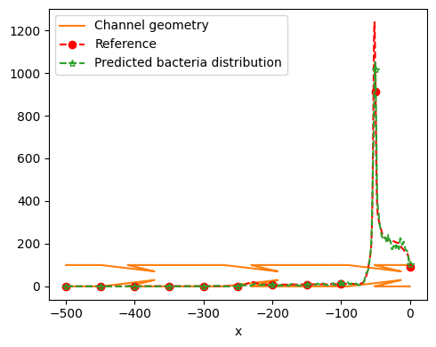
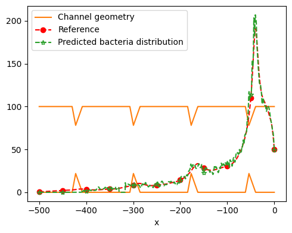

# Catheter

<a href="https://aistudio.baidu.com/aistudio/projectdetail/6169897?sUid=455441&shared=1&ts=1684122038217" class="md-button md-button--primary" style>AI Studio 快速体验</a>

=== "模型训练命令"

    ``sh     python geofno.py    ``

=== "模型评估命令"

    ``sh     python geofno.py mode=eval    ``

| 预训练模型                                                                                              |
| :------------------------------------------------------------------------------------------------------ |
| [GeoFno.pdparams](https://paddle-org.bj.bcebos.com/paddlescience/models/GeoFNO/GeoFNO_pretrained.pdparams) |

## 1. 背景简介

[论文](https://www.science.org/doi/pdf/10.1126/sciadv.adj1741)提出了一种基于人工智能的导尿管几何设计方法，可以有效抑制细菌逆流，从而预防 CAUTI。该方法通过流体动力学和粒子动力学模拟研究细菌运动机制，并使用人工智能模型优化导尿管几何形状，使其能够最大程度地抑制细菌逆流。实验结果表明，该设计能够将细菌逆流的程度降低一到两个数量级，具有安全、有效、易于实施和成本低等优点，有望成为未来 CAUTI 预防的重要手段。

本案例通过深度学习的方式对论文所提及的模型进行复现。

## 2. 问题定义

为了描述了细菌在流体中的主动运动，通常使用 ABP 模型进行表示：

$$
\frac{d\vec{q}}{dt} = \frac{1}{2} \vec{\omega} + \frac{2}{\tau_R} \eta(t) \times \vec{q}
$$

其中

- `dt(q)` 代表细菌方向变化率
- `ω ⃗ ` 代表流体涡量
- `η(t)` 代表高斯噪声
- `q` 代表细菌方向向量

## 3. 问题求解

接下来开始讲解如何将问题一步一步地转化为 PaddleScience 代码，用深度学习的方法进行优化设计，有效抑制细菌逆流，预防 CAUTI。
为了快速理解 PaddleScience，接下来仅对模型构建、方程构建、计算域构建等关键步骤进行阐述，而其余细节请参考 [API 文档](../api/arch.md)。

### 3.1 数据集介绍

本案例数据集使用论文作者所提供的数据集，共 8 个 npy 文件，[下载地址](https://aistudio.baidu.com/datasetdetail/291940)

数据文件说明如下：

`./data.zip/training/`

|          字段名          |        说明        |
| :----------------------: | :----------------: |
| x_1d_structured_mesh.npy | 形状为(2001, 3003) |
| y_1d_structured_mesh.npy | 形状为(2001, 3003) |
|      data_info.npy      |  形状为(7, 3003)  |
|   density_1d_data.npy   | 形状为(2001, 3003) |

`./data.zip/test/`

|          字段名          |       说明       |
| :----------------------: | :---------------: |
| x_1d_structured_mesh.npy | 形状为(2001, 300) |
| y_1d_structured_mesh.npy | 形状为(2001, 300) |
|      data_info.npy      |  形状为(7, 300)  |
|   density_1d_data.npy   | 形状为(2001, 300) |

在加载数据之后，需要将 x、y 进行合并，同时对于合并后的训练数据重新 `reshape` 为 `(1000, 2001, 2)` 的格式，具体代码如下

```py
--8<--
examples/geofno/geofno.py:29:61
--8<--
```

### 3.2 GeoFNO 模型

GeoFNO 是一种基于 **几何聚焦傅里叶神经算子 (Geo-FNO** ) 的机器学习模型，它将几何形状转换到傅里叶空间，从而更好地捕捉形状的特征，并利用傅里叶变换的可逆性，可以将结果转换回物理空间。

根据论文所提供 pytorch 模型代码，现用 PaddleScience 代码表示如下

```py
--8<--
examples/geofno/catheter.py:64:146
--8<--
```

为了在计算时，准确快速地访问具体变量的值，我们在这里指定网络模型的输入变量名是 `("input",)`，输出变量名是 `("output",)`，这些命名与后续代码保持一致。

接着通过指定 FNO1d 的层数、特征通道数，神经元个数，并通过加载上文所提及的初始化权重模型，我们就实例化出了一个神经网络模型 `model`。

### 3.3 约束构建

#### 3.3.1 监督约束

由于我们以监督学习方式进行训练，此处采用监督约束 `SupervisedConstraint`：

```py
--8<--
examples/geofno/geofno.py:76:92
--8<--
```

`SupervisedConstraint` 的第一个参数是监督约束的读取配置，里面包好数据的 `label`，已便后续进行索引使用。同时定义了数据的 batch_size 以及其他相关配置；

第二个参数是损失函数，此处我们选用论文代码仓中的 `LPLoss`损失函数，其定义可看 [Loss 构建](#36)；

第三个参数是约束条件的名字，我们需要给每一个约束条件命名，方便后续对其索引。

### 3.4 优化器构建

训练过程会调用优化器来更新模型参数，此处选择较为常用的 `Adam` 优化器，同时使用 `PaddleScience` 中的 `Step` 生成动态学习率。

```py
--8<--
examples/geofno/geofno.py:100:102
--8<--
```

### 3.5 评估器构建

在训练过程中通常会按一定轮数间隔，用验证集（测试集）评估当前模型的训练情况，因此使用 `ppsci.validate.SupervisedValidator` 构建评估器。

```py
--8<--
examples/geofno/geofno.py:110:127
--8<--
```

评价指标 `metric` 选择 `ppsci.metric.L2Rel` 即可。

其余配置与 [约束构建](#33) 的设置类似。

### 3.6 loss 构建

在论文中所给的损失函数公式为：

$$
L(Y, \hat{Y}) = \left( \frac{1}{n} \sum_{i=1}^{n} \|\hat{y}_i - y_i\|_p^p \right)^{\frac{1}{p}}
$$

loss 构建代码如下：

```py
--8<--
examples/geofno/utilities3.py:8:56
--8<--
```

### 3.7 模型训练、评估

完成上述设置之后，只需要将上述实例化的对象按顺序传递给 `ppsci.solver.Solver`，然后启动训练、评估。

```py
--8<--
examples/geofno/geofno.py:130:141
--8<--
```

## 4. 完整代码

=== "geofno.py"

```py
--8<--
examples/geofno/geofno.py
--8<--
```

=== "catheter.py"

```py
--8<--
examples/geofno/catheter.py
--8<--
```

=== "utilities3.py"

```py
--8<--
examples/geofno/utilities3.py
--8<--
```

## 5. 结果展示

下方展示了训练后模型对测试数据的第一次预测结果以及最后一次预测结果。

=== "第一次预测结果"

   

=== "最后一次预测结果"

   

可以看到模型预测结果与真实结果基本一致，模型泛化效果良好。

## 6. 参考资料

参考文献： [AI-aided geometric design of anti-infection catheters](https://www.science.org/doi/pdf/10.1126/sciadv.adj1741)

参考代码： [Geo-FNO-catheter](https://github.com/zongyi-li/Geo-FNO-catheter)
