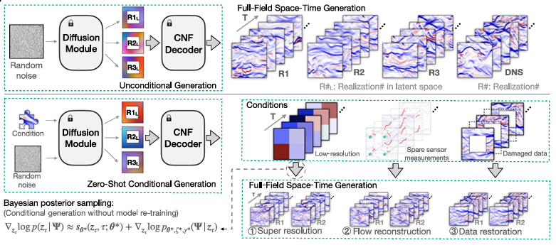

# AI辅助的时空湍流生成：条件神经场潜在扩散模型（CoNFILD）

Distributed under a Creative Commons Attribution license 4.0 (CC BY).

## 1. 背景简介
### 1.1 论文信息
| 年份           | 期刊                | 作者                                                                                             | 引用数 | 论文PDF与补充材料                                                                                   |
|----------------|---------------------|--------------------------------------------------------------------------------------------------|--------|----------------------------------------------------------------------------------------------------|
| 2024年1月3日   | Nature Communications | Pan Du, Meet Hemant Parikh, Xiantao Fan, Xin-Yang Liu, Jian-Xun Wang                             | 15     | [论文链接](https://doi.org/10.1038/s41467-024-54712-1) <br> [代码仓库](https://github.com/jx-wang-s-group/CoNFILD) |

### 1.2 作者介绍
- **通讯作者**：Jian-Xun Wang（王建勋）<br> 所属机构：美国圣母大学航空航天与机械工程系、康奈尔大学机械与航空航天工程系<br> 研究方向：湍流建模、生成式AI、物理信息机器学习<br>

- **其他作者**：<br> Pan Du、Meet Hemant Parikh（共同一作）：圣母大学博士生，研究方向为生成式模型与计算流体力学<br> Xiantao Fan、Xin-Yang Liu：圣母大学研究助理，负责数值模拟与数据生成

### 1.3 模型&复现代码
| 问题类型               | 在线运行                                                                                                                   | 神经网络架构           | 评估指标              |
|------------------------|----------------------------------------------------------------------------------------------------------------------------|------------------------|-----------------------|
| 时空湍流生成           | [aistudio](https://aistudio.baidu.com/projectdetail/8933946)                                                                 | 条件神经场+潜在扩散模型 | MSE: 0.041（速度场） |

=== "模型训练命令"
```bash
git clone https://github.com/PaddlePaddle/PaddleScience.git
cd PaddleScience/examples/confild
python confild.py mode=train
```

=== "预训练模型快速评估"

``` sh
python confild.py mode=eval
```

## 2. 问题定义
### 2.1 研究背景
湍流模拟在航空航天、海洋工程等领域至关重要，但传统方法如直接数值模拟（DNS）和大涡模拟（LES）计算成本高昂，难以应用于高雷诺数或实时场景。现有深度学习模型多基于确定性框架，难以捕捉湍流的混沌特性，且在复杂几何域中表现受限。

### 2.2 核心挑战
1. **高维数据**：三维时空湍流数据维度高达 \(O(10^9)\)，传统生成模型内存需求巨大。
2. **随机性建模**：需同时捕捉湍流的多尺度统计特性与瞬时动态。
3. **几何适应性**：需支持不规则计算域与自适应网格。

### 2.3 创新方法
提出**条件神经场潜在扩散模型（CoNFILD）**，通过三阶段框架解决上述挑战：
1. **神经场编码**：将高维流场压缩为低维潜在表示，压缩比达0.002%-0.017%。
2. **潜在扩散**：在潜在空间进行概率扩散过程，学习湍流统计分布。
3. **零样本条件生成**：结合贝叶斯推理，无需重新训练即可实现传感器重建、超分辨率等任务。


*框架示意图：CNF编码器将流场映射到潜在空间，扩散模型生成新潜在样本，解码器重建物理场*

## 3. 模型构建
### 3.1 条件神经场（CNF）
- **架构**：基于SIREN网络，采用正弦激活函数捕捉周期性特征。
- **数学表示**：
  $$
  \mathscr{E}(\mathbf{X},\mathbf{L}) = \text{SIREN}(\mathbf{x}) + \text{FILM}(\mathbf{L})
  $$
  其中FILM（Feature-wise Linear Modulation）通过潜在向量\(\mathbf{L}\)调节每层偏置。

### 3.2 潜在扩散模型
- **前向过程**：逐步添加高斯噪声，潜在表示\(\mathbf{z}_0 \rightarrow \mathbf{z}_T\)。
- **逆向过程**：训练U-Net预测噪声，通过迭代去噪生成新样本：
  $$
  \mathbf{z}_{t-1} = \frac{1}{\sqrt{\alpha_t}} \left( \mathbf{z}_t - \frac{1-\alpha_t}{\sqrt{1-\bar{\alpha}_t}} \epsilon_\theta(\mathbf{z}_t, t) \right) + \sigma_t \epsilon
  $$

### 3.3 零样本条件生成
- **贝叶斯后验采样**：基于稀疏观测\(\Psi\)，通过梯度修正潜在空间采样：
  $$
  \nabla_{\mathbf{z}_t} \log p(\mathbf{z}_t|\Psi) \approx \nabla_{\mathbf{z}_t} \log p(\Psi|\mathbf{z}_t) + \nabla_{\mathbf{z}_t} \log p(\mathbf{z}_t)
  $$

## 4. 问题求解
### 4.1 数据集准备
数据文件说明如下:
```
data # CNF的训练数据集
|
|-- data.npy # 要拟合的数据
| 
|-- coords.npy # 查询坐标
```

在加载数据之后，需要进行normalization，以便于训练。具体代码如下：
```python
class Normalizer_ts(object):
    def __init__(self, params=[], method="-11", dim=None):
        self.params = params
        self.method = method
        self.dim = dim

    def fit_normalize(self, data):
        assert type(data) == paddle.Tensor
        if len(self.params) == 0:
            if self.method == "-11" or self.method == "01":
                if self.dim is None:
                    self.params = paddle.max(x=data), paddle.min(x=data)
                else:
                    self.params = (
                        paddle.max(keepdim=True, x=data, axis=self.dim),
                        paddle.argmax(keepdim=True, x=data, axis=self.dim),
                    )[0], (
                        paddle.min(keepdim=True, x=data, axis=self.dim),
                        paddle.argmin(keepdim=True, x=data, axis=self.dim),
                    )[
                        0
                    ]
            elif self.method == "ms":
                if self.dim is None:
                    self.params = paddle.mean(x=data, axis=self.dim), paddle.std(
                        x=data, axis=self.dim
                    )
                else:
                    self.params = paddle.mean(
                        x=data, axis=self.dim, keepdim=True
                    ), paddle.std(x=data, axis=self.dim, keepdim=True)
            elif self.method == "none":
                self.params = None
        return self.fnormalize(data, self.params, self.method)

    def normalize(self, new_data):
        if not new_data.place == self.params[0].place:
            self.params = self.params[0].to(new_data.place), self.params[1].to(
                new_data.place
            )
        return self.fnormalize(new_data, self.params, self.method)

    def denormalize(self, new_data_norm):
        if not new_data_norm.place == self.params[0].place:
            self.params = self.params[0].to(new_data_norm.place), self.params[1].to(
                new_data_norm.place
            )
        return self.fdenormalize(new_data_norm, self.params, self.method)

    def get_params(self):
        if self.method == "ms":
            print("returning mean and std")
        elif self.method == "01":
            print("returning max and min")
        elif self.method == "-11":
            print("returning max and min")
        elif self.method == "none":
            print("do nothing")
        return self.params

    @staticmethod
    def fnormalize(data, params, method):
        if method == "-11":
            return (data - params[1].to(data.place)) / (
                params[0].to(data.place) - params[1].to(data.place)
            ) * 2 - 1
        elif method == "01":
            return (data - params[1].to(data.place)) / (
                params[0].to(data.place) - params[1].to(data.place)
            )
        elif method == "ms":
            return (data - params[0].to(data.place)) / params[1].to(data.place)
        elif method == "none":
            return data

    @staticmethod
    def fdenormalize(data_norm, params, method):
        if method == "-11":
            return (data_norm + 1) / 2 * (
                params[0].to(data_norm.place) - params[1].to(data_norm.place)
            ) + params[1].to(data_norm.place)
        elif method == "01":
            return data_norm * (
                params[0].to(data_norm.place) - params[1].to(data_norm.place)
            ) + params[1].to(data_norm.place)
        elif method == "ms":
            return data_norm * params[1].to(data_norm.place) + params[0].to(
                data_norm.place
            )
        elif method == "none":
            return data_norm
```

### 4.2 CoNFiLD 模型
CoNFiLD 模型基于贝叶斯后验采样，将稀疏传感器测量数据作为条件输入。通过训练好的无条件扩散模型作为先验，在扩散后验采样过程中，考虑测量噪声引入的不确定性。利用状态到观测映射，根据条件向量与流场的关系，通过调整无条件得分函数，引导生成与传感器数据一致的全时空流场实现重构，并且能提供重构的不确定性估计。代码如下：

```python
class SIRENAutodecoder_film(paddle.nn.Layer):
    """
    siren network with author decoding

    Args:
        input_keys (Tuple[str,...], optional): Key to get the input tensor from the dict.
        output_keys (Tuple[str,...], optional): Key to save the output tensor into the dict.
        in_coord_features (int, optional): Number of input coordinates features
        in_latent_features (int, optional): Number of input latent features
        out_features (int, optional): Number of output features
        num_hidden_layers (int, optional): Number of hidden layers
        hidden_features (int, optional): Number of hidden features
        outermost_linear (bool, optional): Whether to use linear layer at the end. Defaults to False.
        nonlinearity (str, optional): Nonlinearity to use. Defaults to "sine".
        weight_init (Callable, optional): Weight initialization function. Defaults to None.
        bias_init (Callable, optional): Bias initialization function. Defaults to None.
        premap_mode (str, optional): Feature mapping mode. Defaults to None.

    Examples:
        >>> model = ppsci.arch.SIRENAutodecoder_film(
                input_keys=["input1", "input2"],
                output_keys=("output",),
                in_coord_features=2,
                in_latent_features=128,
                out_features=3,
                num_hidden_layers=10,
                hidden_features=128,
            )
        >>> input_data = {"input1": paddle.randn([10, 2]), "input2": paddle.randn([10, 128])}
        >>> out_dict = model(input_data)
        >>> for k, v in out_dict.items():
        ...     print(k, v.shape)
        output [22, 918, 3]
    """

    def __init__(
        self,
        input_keys,
        output_keys,
        in_coord_features,
        in_latent_features,
        out_features,
        num_hidden_layers,
        hidden_features,
        outermost_linear=False,
        nonlinearity="sine",
        weight_init=None,
        bias_init=None,
        premap_mode=None,
        **kwargs,
    ):
        super().__init__()
        self.input_keys = input_keys
        self.output_keys = output_keys

        self.premap_mode = premap_mode
        if self.premap_mode is not None:
            self.premap_layer = FeatureMapping(
                in_coord_features, mode=premap_mode, **kwargs
            )
            in_coord_features = self.premap_layer.dim
        self.first_layer_init = None
        self.nl, nl_weight_init, first_layer_init = NLS_AND_INITS[nonlinearity]
        if weight_init is not None:
            self.weight_init = weight_init
        else:
            self.weight_init = nl_weight_init
        self.net1 = paddle.nn.LayerList(
            sublayers=[BatchLinear(in_coord_features, hidden_features)]
            + [
                BatchLinear(hidden_features, hidden_features)
                for i in range(num_hidden_layers)
            ]
            + [BatchLinear(hidden_features, out_features)]
        )
        self.net2 = paddle.nn.LayerList(
            sublayers=[
                BatchLinear(in_latent_features, hidden_features, bias_attr=False)
                for i in range(num_hidden_layers + 1)
            ]
        )
        if self.weight_init is not None:
            self.net1.apply(self.weight_init)
            self.net2.apply(self.weight_init)
        if first_layer_init is not None:
            self.net1[0].apply(first_layer_init)
            self.net2[0].apply(first_layer_init)
        if bias_init is not None:
            self.net2.apply(bias_init)

    def forward(self, input_data):
        coords = input_data[self.input_keys[0]]
        latents = input_data[self.input_keys[1]]
        if self.premap_mode is not None:
            x = self.premap_layer(coords)
        else:
            x = coords

        for i in range(len(self.net1) - 1):
            x = self.net1[i](x) + self.net2[i](latents)
            x = self.nl(x)
        x = self.net1[-1](x)
        return {self.output_keys[0]: x}

    def disable_gradient(self):
        for param in self.parameters():
            param.stop_gradient = not False
```
为了在计算时，准确快速地访问具体变量的值，我们在这里指定网络模型的输入变量名是 ["confild_x", "latent_z"]，输出变量名是 ["confild_output"]，这些命名与后续代码保持一致。

4.3 模型训练、评估
完成上述设置之后，只需要将上述实例化的对象按照文档进行组合，然后启动训练、评估。
```python
def signal_train(cfg, normed_coords, normed_fois, spatio_axis, out_normalizer):
    cnf_model = SIRENAutodecoder_film(**cfg.CONFILD)
    latents_model = LatentContainer(**cfg.Latent)

    dataset = basic_set(normed_fois, normed_coords)
    criterion = paddle.nn.MSELoss()

    # set loader
    train_loader = DataLoader(
        dataset=dataset, batch_size=cfg.TRAIN.batch_size, shuffle=True
    )
    test_loader = DataLoader(
        dataset=dataset, batch_size=cfg.TRAIN.test_batch_size, shuffle=False
    )
    # set optimizer
    cnf_optimizer = ppsci.optimizer.Adam(cfg.TRAIN.lr.cnf, weight_decay=0.0)(cnf_model)
    latents_optimizer = ppsci.optimizer.Adam(cfg.TRAIN.lr.latents, weight_decay=0.0)(
        latents_model
    )

    for i in range(cfg.TRAIN.epochs):
        cnf_model.train()
        latents_model.train()
        if i != 0:
            cnf_optimizer.step()
            cnf_optimizer.clear_grad(set_to_zero=False)
        train_loss = []
        for batch_coords, batch_fois, idx in train_loader:
            idx = {"latent_x": idx}
            batch_latent = latents_model(idx)
            if isinstance(batch_coords, list):
                batch_coords = [i for i in batch_coords]
            data = {
                "confild_x": batch_coords,
                "latent_z": batch_latent["latent_z"],
            }
            batch_output = cnf_model(data)
            loss = criterion(batch_output["confild_output"], batch_fois)
            latents_optimizer.clear_grad(set_to_zero=False)
            loss.backward()
            latents_optimizer.step()
            train_loss.append(loss.item())
        epoch_loss = paddle.stack(x=train_loss).mean()
        print("epoch {}, train loss {}".format(i + 1, epoch_loss))
        if i % 100 == 0:
            test_error = []
            cnf_model.eval()
            latents_model.eval()
            with paddle.no_grad():
                for test_coords, test_fois, idx in test_loader:
                    if isinstance(test_coords, list):
                        test_coords = [i for i in test_coords]
                    prediction = out_normalizer.denormalize(
                        cnf_model(
                            {
                                "confild_x": test_coords,
                                "latent_z": latents_model({"latent_x": idx})[
                                    "latent_z"
                                ],
                            }
                        )
                    )
                    target = out_normalizer.denormalize(test_fois)
                    error = rMAE(prediction=prediction, target=target, dims=spatio_axis)
                    test_error.append(error)
                test_error = paddle.concat(x=test_error).mean(axis=0)
                print("test MAE: ", test_error)
        if i % 1000 == 0:
            paddle.save(cnf_model.state_dict(), f"cnf_model_{i}.pdparams")
            paddle.save(latents_model.state_dict(), f"latents_model_{i}.pdparams")
```

## 5. 实验结果
