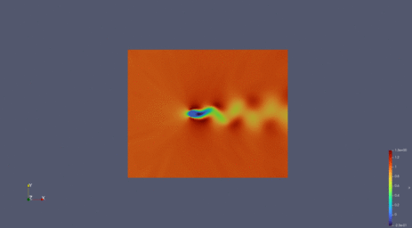

# 2D-Cylinder(2D Flow Around a Cylinder)

<a href="https://aistudio.baidu.com/aistudio/projectdetail/6160381?contributionType=1&sUid=438690&shared=1&ts=1683961158552" class="md-button md-button--primary" style>AI Studio快速体验</a>

## 1. 问题简介

2D Flow Around a Cylinder，中文名称可译作“2维圆柱绕流”，是指二维圆柱低速定常绕流的流型只与 $Re$ 数有关。在 $Re \le 1$ 时，流场中的惯性力与粘性力相比居次要地位，圆柱上下游的流线前后对称，阻力系数近似与 $Re$ 成反比(阻力系数为 10~60)，此 $Re$ 数范围的绕流称为斯托克斯区；随着 $Re$ 的增大，圆柱上下游的流线逐渐失去对称性。

## 2. 问题定义

质量守恒：

$$
\dfrac{\partial u}{\partial x} + \dfrac{\partial v}{\partial y} = 0
$$

$x$ 动量守恒：

$$
\dfrac{\partial u}{\partial t} + u\dfrac{\partial u}{\partial x} + v\dfrac{\partial u}{\partial y} = -\dfrac{1}{\rho}\dfrac{\partial p}{\partial x} + \nu(\dfrac{\partial ^2 u}{\partial x ^2} + \dfrac{\partial ^2 u}{\partial y ^2})
$$

$y$ 动量守恒：

$$
\dfrac{\partial v}{\partial t} + u\dfrac{\partial v}{\partial x} + v\dfrac{\partial v}{\partial y} = -\dfrac{1}{\rho}\dfrac{\partial p}{\partial y} + \nu(\dfrac{\partial ^2 v}{\partial x ^2} + \dfrac{\partial ^2 v}{\partial y ^2})
$$

**令：**

$t^* = \dfrac{L}{U_0}$

$x^*=y^* = L$

$u^*=v^* = U_0$

$p^* = \rho {U_0}^2$

**定义：**

无量纲时间 $\tau = \dfrac{t}{t^*}$

无量纲坐标 $x：X = \dfrac{x}{x^*}$；无量纲坐标 $y：Y = \dfrac{y}{y^*}$

无量纲速度 $x：U = \dfrac{u}{u^*}$；无量纲速度 $y：V = \dfrac{v}{u^*}$

无量纲压力 $P = \dfrac{p}{p^*}$

雷诺数 $Re = \dfrac{L U_0}{\nu}$

则可获得如下无量纲Navier-Stokes方程，施加于流体域内部：

质量守恒：

$$
\dfrac{\partial U}{\partial X} + \dfrac{\partial U}{\partial Y} = 0
$$

$x$ 动量守恒：

$$
\dfrac{\partial U}{\partial \tau} + U\dfrac{\partial U}{\partial X} + V\dfrac{\partial U}{\partial Y} = -\dfrac{\partial P}{\partial X} + \dfrac{1}{Re}(\dfrac{\partial ^2 U}{\partial X^2} + \dfrac{\partial ^2 U}{\partial Y^2})
$$

$y$ 动量守恒：

$$
\dfrac{\partial V}{\partial \tau} + U\dfrac{\partial V}{\partial X} + V\dfrac{\partial V}{\partial Y} = -\dfrac{\partial P}{\partial Y} + \dfrac{1}{Re}(\dfrac{\partial ^2 V}{\partial X^2} + \dfrac{\partial ^2 V}{\partial Y^2})
$$

对于流体域边界和流体域内部圆周边界，则需施加 Dirichlet 边界条件：

流体域入口边界：

$$
u=1, v=0
$$

圆周边界：

$$
u=0, v=0
$$

流体域出口边界：

$$
p=0
$$

## 3. 问题求解

接下来开始讲解如何将问题一步一步地转化为 PaddleScience 代码，用深度学习的方法求解该问题。
为了快速理解 PaddleScience，接下来仅对模型构建、方程构建、计算域构建等关键步骤进行阐述，而其余细节请参考 [API文档](../api/arch.md)。

### 3.1 模型构建

在 2D-Cylinder 问题中，每一个已知的坐标点 $(t, x, y)$ 都有自身的横向速度 $u$、纵向速度 $v$、压力 $p$
三个待求解的未知量，我们在这里使用比较简单的 MLP(Multilayer Perceptron, 多层感知机) 来表示 $(t, x, y)$ 到 $(u, v, p)$ 的映射函数 $f: \mathbb{R}^3 \to \mathbb{R}^3$ ，即：

$$
u, v, p = f(t, x, y)
$$

上式中 $f$ 即为 MLP 模型本身，用 PaddleScience 代码表示如下

``` py linenums="33"
--8<--
examples/cylinder/2d_unsteady/cylinder2d_unsteady_Re100.py:33:36
--8<--
```

为了在计算时，准确快速地访问具体变量的值，我们在这里指定网络模型的输入变量名是 `["t", "x", "y"]`，输出变量名是 `["u", "v", "p"]`，这些命名与后续代码保持一致。

接着通过指定 MLP 的层数、神经元个数以及激活函数，我们就实例化出了一个拥有 9 层隐藏神经元，每层神经元数为 50，使用 "tanh" 作为激活函数的神经网络模型 `model`。

### 3.2 方程构建

由于 2D-Cylinder 使用的是 Navier-Stokes 方程的2维瞬态形式，因此可以直接使用 PaddleScience 内置的 `NavierStokes`。

``` py linenums="37"
--8<--
examples/cylinder/2d_unsteady/cylinder2d_unsteady_Re100.py:37:38
--8<--
```

在实例化 `NavierStokes` 类时需指定必要的参数：动力粘度 $\nu=0.02$, 流体密度 $\rho=1.0$。

### 3.3 计算域构建

本文中 2D-Cylinder 的计算域由 CSV 文件储存的点云构成，因此可以直接使用 PaddleScience 内置的点云几何 `PointCloud` 和时间域 `TimeDomain`，组合成时间-空间的 `TimeXGeometry` 计算域。

``` py linenums="40"
# set timestamps
TIME_START, TIME_END = 1, 50
NUM_TIMESTAMPS = 50
TRAIN_NUM_TIMESTAMPS = 30

train_timestamps = np.linspace(
    TIME_START, TIME_END, NUM_TIMESTAMPS, endpoint=True
).astype("float32")
train_timestamps = np.random.choice(train_timestamps, TRAIN_NUM_TIMESTAMPS)
train_timestamps.sort()
t0 = np.array([TIME_START], dtype="float32")

val_timestamps = np.linspace(
    TIME_START, TIME_END, NUM_TIMESTAMPS, endpoint=True
).astype("float32")

logger.info(f"train_timestamps: {train_timestamps.tolist()}")
logger.info(f"val_timestamps: {val_timestamps.tolist()}")

# set time-geometry
geom = {
    "time_rect": ppsci.geometry.TimeXGeometry(
        ppsci.geometry.TimeDomain(
            TIME_START,
            TIME_END,
            timestamps=np.concatenate((t0, train_timestamps), axis=0),
        ),
        ppsci.geometry.PointCloud(
            reader.load_csv_file(
                "./datasets/domain_train.csv",
                ("x", "y"),
                alias_dict={"x": "Points:0", "y": "Points:1"},
            ),
            ("x", "y"),
        ),
    ),
    "time_rect_eval": ppsci.geometry.PointCloud(
        reader.load_csv_file(
            "./datasets/domain_eval.csv",
            ("t", "x", "y"),
        ),
        ("t", "x", "y"),
    ),
}
```

1. 评估数据点已包含时间戳信息，因此无需额外再与 `TimeDomain` 组合成 `TimeXGeometry`，只需使用 `PointCloud` 读入数据即可。

???+ tip "提示"

    `PointCloud` 和 `TimeDomain` 是两种可以单独使用的 `Geometry` 派生类。

    如输入数据只来自于点云几何，则可以直接使用 `ppsci.geometry.PointCloud(...)` 创建空间几何域对象；

    如输入数据只来自一维时间域，则可以直接使用 `ppsci.geometry.TimeDomain(...)` 构建时间域对象。

### 3.4 约束构建

根据 [2. 问题定义](#2) 得到的无量纲公式和和边界条件，对应了在计算域中指导模型训练的三个约束条件，即：

1. 施加在流体域内部点上的无量纲 Navier-Stokes 方程约束（经过简单移项）

    $$
    \dfrac{\partial U}{\partial X} + \dfrac{\partial U}{\partial Y} = 0
    $$

    $$
    \dfrac{\partial U}{\partial \tau} + U\dfrac{\partial U}{\partial X} + V\dfrac{\partial U}{\partial Y} + \dfrac{\partial P}{\partial X} - \dfrac{1}{Re}(\dfrac{\partial ^2 U}{\partial X^2} + \dfrac{\partial ^2 U}{\partial Y^2}) = 0
    $$

    $$
    \dfrac{\partial V}{\partial \tau} + U\dfrac{\partial V}{\partial X} + V\dfrac{\partial V}{\partial Y} + \dfrac{\partial P}{\partial Y} - \dfrac{1}{Re}(\dfrac{\partial ^2 V}{\partial X^2} + \dfrac{\partial ^2 V}{\partial Y^2}) = 0
    $$

    为了方便获取中间变量，`NavierStokes` 类内部将上式左侧的结果分别命名为 `continuity`, `momentum_x`, `momentum_y`。

2. 施加在流体域入口、内部圆周、流体域出口的 Dirichlet 边界条件约束

    流体域入口边界：

    $$
    u=1, v=0
    $$

    流体域出口边界：

    $$
    p=0
    $$

    圆周边界：

    $$
    u=0, v=0
    $$

3. 施加在初始时刻流体域内部点上的初值条件约束：

    $$
    u=u_{t0}, v=v_{t0}, p=p_{t0}
    $$

接下来使用 PaddleScience 内置的 `InteriorConstraint` 和 `SupervisedConstraint` 构建上述两种约束条件。

在定义约束之前，需要给每一种约束指定采样点个数，表示每一种约束在其对应计算域内采样数据的数量，以及通用的采样配置。

``` py linenums="85"
--8<--
examples/cylinder/2d_unsteady/cylinder2d_unsteady_Re100.py:85:92
--8<--
```

#### 3.4.1 内部点约束

以作用在流体域内部点上的 `InteriorConstraint` 为例，代码如下：

``` py linenums="94"
--8<--
examples/cylinder/2d_unsteady/cylinder2d_unsteady_Re100.py:94:106
--8<--
```

`InteriorConstraint` 的第一个参数是方程表达式，用于描述如何计算约束目标，此处填入在 [3.2 方程构建](#32) 章节中实例化好的 `equation["NavierStokes"].equations`；

第二个参数是约束变量的目标值，在本问题中我们希望 Navier-Stokes 方程产生的三个中间结果 `continuity`, `momentum_x`, `momentum_y` 被优化至 0，因此将它们的目标值全部设为 0；

第三个参数是约束方程作用的计算域，此处填入在 [3.3 计算域构建](#33) 章节实例化好的 `geom["time_rect"]` 即可；

第四个参数是在计算域上的采样配置，此处我们使用全量数据点训练，因此 `dataset` 字段设置为 "IterableNamedArrayDataset" 且 `iters_per_epoch` 也设置为 1，采样点数 `batch_size` 设为 9420 * 30(表示一个时刻产生 9420 个数据点，共有 30 个时刻)；

第五个参数是损失函数，此处我们选用常用的MSE函数，且 `reduction` 设置为 `"mean"`，即我们会将参与计算的所有数据点产生的损失项求和取平均；

第六个参数是约束条件的名字，我们需要给每一个约束条件命名，方便后续对其索引。此处我们命名为 "EQ" 即可。

#### 3.4.2 边界约束

同理，我们还需要构建流体域的流入边界、流出边界、圆周边界共三个边界的 Dirichlet 边界约束。以 `bc_inlet_cylinder` 边界约束为例，由于作用区域是边界且边界上的数据由 CSV 文件记录，因此我们使用 `SupervisedConstraint` 类，并按照如下规则指定第一个参数 `dataloader_cfg` 配置字典：

- 该配置字典的第一个参数为包含 CSV 文件的路径 `./datasets/domain_inlet_cylinder.csv` 在内的配置字典；

- 该配置字典的第一个参数指定数据加载方式，此处我们使用 `IterableCSVDataset` 作为全量数据加载器；

- 该配置字典的第二个参数指定数据的加载路径，此处填写 `./datasets/domain_inlet_cylinder.csv`；

- 该配置字典的第三个参数指定要从文件中读取的输入列，对应转换后关键字，此处填写为 `("x", "y")`；

- 该配置字典的第四个参数指定要从文件中读取的标签列，对应转换后关键字，此处填写为 `("u", "v")`；

- 考虑到同一个变量在不同 CSV 文件中可能具有不同的字段名，而且有的字段名过长在编写代码时容易写错，因此该配置字典的第五个参数用于指定字段列的别名，此处填写为 `{"x": "Points:0", "y": "Points:1", "u": "U:0", "v": "U:1"}`；

- 该配置字典的第六个参数指定每个标签在计算损失时的权重，此处我们放大 "u" 和 "v" 的权重至 10，填写 `{"u": 10, "v": 10}`；

- 该配置字典的第七个参数指定数据读取是否涉及时间信息，此处我们设定为训练时间戳，即填写 `train_timestamps`；

第二个参数是损失函数，此处我们选用常用的MSE函数，且 `reduction` 设置为 `"mean"`，即我们会将参与计算的所有数据点产生的损失项求和取平均；

第三个参数是约束条件的名字，我们需要给每一个约束条件命名，方便后续对其索引。此处我们命名为 "BC_inlet_cylinder" 即可。

剩下的 `bc_outlet` 按照相同原理构建，代码如下所示：

``` py linenums="107"
--8<--
examples/cylinder/2d_unsteady/cylinder2d_unsteady_Re100.py:107:135
--8<--
```

#### 3.4.3 初值约束

对于 $t=t_0$ 时刻的流体域内的点，我们还需要对 $u$, $v$, $p$ 施加初值约束，代码如下：

``` py linenums="136"
--8<--
examples/cylinder/2d_unsteady/cylinder2d_unsteady_Re100.py:136:150
--8<--
```

#### 3.4.4 监督约束

本案例在流体域内部加入了一定数量的监督点来保证模型最终的收敛情况，因此最后还需要加入一个监督约束，数据同样来自 CSV 文件，代码如下：

``` py linenums="151"
--8<--
examples/cylinder/2d_unsteady/cylinder2d_unsteady_Re100.py:151:165
--8<--
```

在微分方程约束、边界约束、初值约束、监督约束构建完毕之后，以我们刚才的命名为关键字，封装到一个字典中，方便后续访问。

``` py linenums="166"
--8<--
examples/cylinder/2d_unsteady/cylinder2d_unsteady_Re100.py:166:173
--8<--
```

### 3.5 超参数设定

接下来我们需要指定训练轮数和学习率，此处我们按实验经验，使用两万轮训练轮数，评估间隔为四百轮，学习率设为 0.001。

``` py linenums="175"
--8<--
examples/cylinder/2d_unsteady/cylinder2d_unsteady_Re100.py:175:177
--8<--
```

### 3.6 优化器构建

训练过程会调用优化器来更新模型参数，此处选择较为常用的 `Adam` 优化器。

``` py linenums="179"
--8<--
examples/cylinder/2d_unsteady/cylinder2d_unsteady_Re100.py:179:180
--8<--
```

### 3.7 评估器构建

在训练过程中通常会按一定轮数间隔，用验证集（测试集）评估当前模型的训练情况，因此使用 `ppsci.validate.GeometryValidator` 构建评估器。

``` py linenums="182"
--8<--
examples/cylinder/2d_unsteady/cylinder2d_unsteady_Re100.py:182:198
--8<--
```

方程设置与 [约束构建](#32) 的设置相同，表示如何计算所需评估的目标变量；

此处我们为 `momentum_x`, `continuity`, `momentum_y` 三个目标变量设置标签值为 0；

计算域与 [约束构建](#32) 的设置相同，表示在指定计算域上进行评估；

采样点配置则需要指定总的评估点数 `total_size`，此处我们设置为 9662 \* 50(9420个流体域内的点+161个流体域流入边界点+81个流体域流出边界点，共 50 个评估时刻)；

评价指标 `metric` 选择 `ppsci.metric.MSE` 即可；

其余配置与 [约束构建](#32) 的设置类似。

### 3.8 可视化器构建

在模型评估时，如果评估结果是可以可视化的数据，我们可以选择合适的可视化器来对输出结果进行可视化。

本文中的输出数据是一个区域内的二维点集，每个时刻 $t$ 的坐标是 $(x^t_i, y^t_i)$，对应值是 $(u^t_i, v^t_i, p^t_i)$，因此我们只需要将评估的输出数据按时刻保存成 50 个 **vtu格式** 文件，最后用可视化软件打开查看即可。代码如下：

``` py linenums="200"
--8<--
examples/cylinder/2d_unsteady/cylinder2d_unsteady_Re100.py:200:212
--8<--
```

### 3.9 模型训练、评估与可视化

完成上述设置之后，只需要将上述实例化的对象按顺序传递给 `ppsci.solver.Solver`，然后启动训练、评估、可视化。

``` py linenums="214"
--8<--
examples/cylinder/2d_unsteady/cylinder2d_unsteady_Re100.py:214:
--8<--
```

## 4. 完整代码

``` py linenums="1" title="cylinder2d_unsteady_Re100.py"
--8<--
examples/cylinder/2d_unsteady/cylinder2d_unsteady_Re100.py
--8<--
```

## 5. 结果展示

???+ info "说明"

    本案例只作为demo展示，尚未进行充分调优，下方部分展示结果可能与 OpenFOAM 存在一定差别。

<figure markdown>
  { loading=lazy }
  <figcaption>模型预测结果 u</figcaption>
</figure>
</figure>
