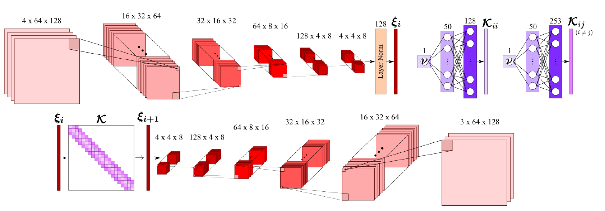
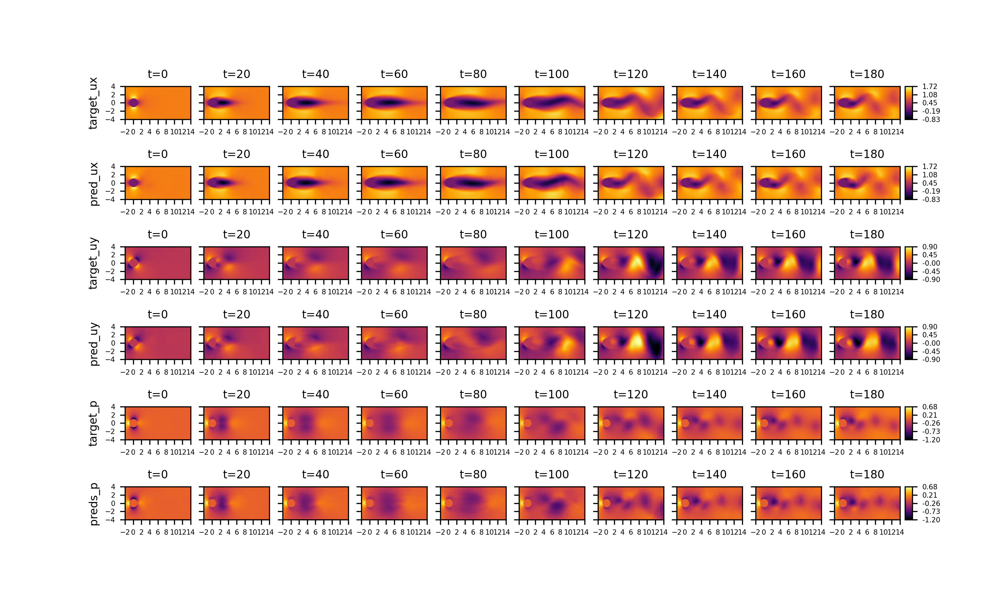

# 2D-Cylinder(2D Flow Around a Cylinder)

## 1. 问题简介

2D Flow Around a Cylinder，中文名称可译作“2维圆柱绕流”，是指二维圆柱低速定常绕流的流型只与 $Re$ 数有关。在 $Re \le 1$ 时，流场中的惯性力与粘性力相比居次要地位，圆柱上下游的流线前后对称，阻力系数近似与 $Re$ 成反比(阻力系数为 10~60)，此 $Re$ 数范围的绕流称为斯托克斯区；随着 $Re$ 的增大，圆柱上下游的流线逐渐失去对称性。

## 2. 问题定义

质量守恒：

$$
\frac{\partial u}{\partial x} + \frac{\partial v}{\partial y} = 0
$$

$x$ 动量守恒：

$$
\frac{\partial u}{\partial t} + u\frac{\partial u}{\partial x} + v\frac{\partial u}{\partial y} = -\frac{1}{\rho}\frac{\partial p}{\partial x} + \nu(\frac{\partial ^2 u}{\partial x ^2} + \frac{\partial ^2 u}{\partial y ^2})
$$

$y$ 动量守恒：

$$
\frac{\partial v}{\partial t} + u\frac{\partial v}{\partial x} + v\frac{\partial v}{\partial y} = -\frac{1}{\rho}\frac{\partial p}{\partial y} + \nu(\frac{\partial ^2 v}{\partial x ^2} + \frac{\partial ^2 v}{\partial y ^2})
$$

**令：**

$t^* = \frac{L}{U_0}$

$x^*=y^* = L$

$u^*=v^* = U_0$

$p^* = \rho {U_0}^2$

**定义：**

无量纲时间 $\tau = \frac{t}{t^*}$

无量纲坐标 $x：X = \frac{x}{x^*}$；无量纲坐标 $y：Y = \frac{y}{y^*}$

无量纲速度 $x：U = \frac{u}{u^*}$；无量纲速度 $y：V = \frac{v}{u^*}$

无量纲压力 $P = \frac{p}{p^*}$

雷诺数 $Re = \frac{L U_0}{\nu}$

则可获得如下无量纲Navier-Stokes方程，施加于流体域内部：

质量守恒：

$$
\frac{\partial U}{\partial X} + \frac{\partial U}{\partial Y} = 0
$$

$x$ 动量守恒：

$$
\frac{\partial U}{\partial \tau} + U\frac{\partial U}{\partial X} + V\frac{\partial U}{\partial Y} = -\frac{\partial P}{\partial X} + \frac{1}{Re}(\frac{\partial ^2 U}{\partial X^2} + \frac{\partial ^2 U}{\partial Y^2})
$$

$y$ 动量守恒：

$$
\frac{\partial V}{\partial \tau} + U\frac{\partial V}{\partial X} + V\frac{\partial V}{\partial Y} = -\frac{\partial P}{\partial Y} + \frac{1}{Re}(\frac{\partial ^2 V}{\partial X^2} + \frac{\partial ^2 V}{\partial Y^2})
$$

对于流体域边界和流体域内部圆周边界，则需施加 Dirichlet 边界条件：

流体域入口边界：

$$
u=1, v=0
$$

圆周边界：

$$
u=0, v=0
$$

流体域出口边界：

$$
p=0
$$

## 3. 问题求解

接下来开始讲解如何基于 PaddleScience 代码，用深度学习的方法求解该问题。本案例基于论文 [Transformers for Modeling Physical Systems](https://arxiv.org/abs/2010.03957) 方法进行求解，关于该方法的理论部分请参考[此文档](../lorenz/#31)或[原论文](https://arxiv.org/abs/2010.03957)。接下来首先会对使用的数据集进行介绍，然后对该方法两个训练步骤（Embedding 模型训练、Transformer 模型训练）的监督约束构建、模型构建等进行阐述，而其余细节请参考 [API文档](../api/arch.md)。

### 3.1 数据集介绍

数据集采用了 [Transformer-Physx](https://github.com/zabaras/transformer-physx) 中提供的数据。该数据集中的数据使用 OpenFOAM 求得，每个时间步大小为0.5，$Re$ 从以下范围中随机选取：

$$Re \sim(100, 750)$$

数据集的划分如下：

|数据集 |流场仿真的数量|时间步的数量|
|:----:|:---------:|:--------:|
|训练集 |27         |400       |
|验证集 |6          |400       |
|测试集 |7          |400       |

该数据集可以从[此处](https://zenodo.org/record/5148524#.ZDe77-xByrc)下载。

### 3.2 Embedding 模型

首先展示代码中定义的各个参数变量，每个参数的具体含义会在下面使用到时进行解释。

``` py linenums="51" title="examples/cylinder/2d_unsteady/transformer_physx/train_enn_v2.py"
--8<--
examples/cylinder/2d_unsteady/transformer_physx/train_enn_v2.py:51:62
--8<--
```

#### 3.2.1 约束构建

本案例基于数据驱动的方法求解问题，因此需要使用 PaddleScience 内置的 `SupervisedConstraint` 构建监督约束。在定义约束之前，需要首先指定监督约束中用于数据加载的各个参数，代码如下：

``` py linenums="67" title="examples/cylinder/2d_unsteady/transformer_physx/train_enn_v2.py"
--8<--
examples/cylinder/2d_unsteady/transformer_physx/train_enn_v2.py:67:84
--8<--
```

其中，"dataset" 字段定义了使用的 `Dataset` 类名为 `CylinderDataset`，另外还指定了该类初始化时参数的取值：

1. `file_path`：代表训练数据集的文件路径，指定为变量 `train_file_path` 的值；
2. `input_keys`：代表模型输入数据的变量名称，此处填入变量 `input_keys`；
3. `label_keys`：代表真实标签的变量名称，此处填入变量 `output_keys`；
4. `block_size`：代表使用多长的时间步进行训练，指定为变量 `train_block_size` 的值；
5. `stride`：代表连续的两个训练样本之间的时间步间隔，指定为16；
6. `weight_dict`：代表模型输出各个变量与真实标签损失函数的权重，此处使用 `output_keys`、`weights` 生成。

"sampler" 字段定义了使用的 `Sampler` 类名为 `BatchSampler`，另外还指定了该类初始化时参数 `drop_last`、`shuffle` 均为 `True`。

`train_dataloader_cfg` 还定义了 `batch_size`、`num_workers` 的值。

定义监督约束的代码如下：

``` py linenums="86" title="examples/cylinder/2d_unsteady/transformer_physx/train_enn_v2.py"
--8<--
examples/cylinder/2d_unsteady/transformer_physx/train_enn_v2.py:86:94
--8<--
```

`SupervisedConstraint` 的第一个参数是数据的加载方式，这里使用上文中定义的 `train_dataloader_cfg`；

第二个参数是损失函数的定义，这里使用带有 L2Decay 的 MSELoss，类名为 `MSELossWithL2Decay`，`regularization_dict` 设置了正则化的变量名称和对应的权重；

第三个参数表示在训练时如何计算需要被约束的中间变量，此处我们约束的变量就是网络的输出；

第四个参数是约束条件的名字，方便后续对其索引。此处命名为 "Sup"。

#### 3.2.2 模型构建

在该案例中，Embedding 模型使用了卷积神经网络实现 Embedding 模型，如下图所示。

<figure markdown>
  { loading=lazy }
  <figcaption>Embedding 网络模型</figcaption>
</figure>

用 PaddleScience 代码表示如下：

``` py linenums="99" title="examples/cylinder/2d_unsteady/transformer_physx/train_enn_v2.py"
--8<--
examples/cylinder/2d_unsteady/transformer_physx/train_enn_v2.py:99:105
--8<--
```

其中，`CylinderEmbedding` 的前两个参数在前文中已有描述，这里不再赘述，网络模型的第三、四个参数是训练数据集的均值和方差，用于归一化输入数据。计算均值、方差的的代码表示如下：

``` py linenums="28" title="examples/cylinder/2d_unsteady/transformer_physx/train_enn_v2.py"
--8<--
examples/cylinder/2d_unsteady/transformer_physx/train_enn_v2.py:28:45
--8<--
```

#### 3.2.3 学习率与优化器构建

本案例中使用的学习率方法为 `ExponentialDecay`，学习率大小设置为0.001。优化器使用 `Adam`，梯度裁剪使用了 Paddle 内置的 `ClipGradByGlobalNorm` 方法。用 PaddleScience 代码表示如下：

``` py linenums="107" title="examples/cylinder/2d_unsteady/transformer_physx/train_enn_v2.py"
--8<--
examples/cylinder/2d_unsteady/transformer_physx/train_enn_v2.py:107:121
--8<--
```

#### 3.2.4 评估器构建

本案例训练过程中会按照一定的训练轮数间隔，使用验证集评估当前模型的训练情况，需要使用 `SupervisedValidator` 构建评估器。代码如下：

``` py linenums="123" title="examples/cylinder/2d_unsteady/transformer_physx/train_enn_v2.py"
--8<--
examples/cylinder/2d_unsteady/transformer_physx/train_enn_v2.py:123:150
--8<--
```

`SupervisedValidator` 评估器与 `SupervisedConstraint` 比较相似，不同的是评估器需要设置评价指标 `metric`，在这里使用 `ppsci.metric.MSE` 。

#### 3.2.5 模型训练与评估

完成上述设置之后，只需要将上述实例化的对象按顺序传递给 `ppsci.solver.Solver`，然后启动训练、评估。

``` py linenums="153" title="examples/cylinder/2d_unsteady/transformer_physx/train_enn_v2.py"
--8<--
examples/cylinder/2d_unsteady/transformer_physx/train_enn_v2.py:153:
--8<--
```

### 3.3 Transformer 模型

上文介绍了如何构建 Embedding 模型的训练、评估，在本节中将介绍如何使用训练好的 Embedding 模型训练 Transformer 模型。因为训练 Transformer 模型的步骤与训练 Embedding 模型的步骤基本相似，因此本节在两者的重复部分的各个参数不再详细介绍。首先将代码中定义的各个参数变量展示如下，每个参数的具体含义会在下面使用到时进行解释。

``` py linenums="58" title="examples/cylinder/2d_unsteady/transformer_physx/train_transformer_v2.py"
--8<--
examples/cylinder/2d_unsteady/transformer_physx/train_transformer_v2.py:58:74
--8<--
```

#### 3.3.1 约束构建

Transformer 模型同样基于数据驱动的方法求解问题，因此需要使用 PaddleScience 内置的 `SupervisedConstraint` 构建监督约束。在定义约束之前，需要首先指定监督约束中用于数据加载的各个参数，代码如下：

``` py linenums="82" title="examples/cylinder/2d_unsteady/transformer_physx/train_transformer_v2.py"
--8<--
examples/cylinder/2d_unsteady/transformer_physx/train_transformer_v2.py:82:99
--8<--
```

数据加载的各个参数与 Embedding 模型中的基本一致，不再赘述。需要说明的是由于 Transformer 模型训练的输入数据是 Embedding 模型 Encoder 模块的输出数据，因此我们将训练好的 Embedding 模型作为 `CylinderDataset` 的一个参数，在初始化时首先将训练数据映射到编码空间。

定义监督约束的代码如下：

``` py linenums="101" title="examples/cylinder/2d_unsteady/transformer_physx/train_transformer_v2.py"
--8<--
examples/cylinder/2d_unsteady/transformer_physx/train_transformer_v2.py:101:106
--8<--
```

#### 3.3.2 模型构建

在该案例中，Transformer 模型的输入输出都是编码空间中的向量，使用的 Transformer 结构如下：

<figure markdown>
  { loading=lazy }
  <figcaption>Transformer 网络模型</figcaption>
</figure>

用 PaddleScience 代码表示如下：

``` py linenums="111" title="examples/cylinder/2d_unsteady/transformer_physx/train_transformer_v2.py"
--8<--
examples/cylinder/2d_unsteady/transformer_physx/train_transformer_v2.py:111:119
--8<--
```

类 `PhysformerGPT2` 除了需要填入 `input_keys`、`output_keys` 外，还需要设置 Transformer 模型的层数 `num_layers`、上下文的大小 `num_ctx`、输入的 Embedding 向量的长度 `embed_size`、多头注意力机制的参数 `num_heads`，在这里填入的数值为6、16、128、4。

#### 3.3.3 学习率与优化器构建

本案例中使用的学习率方法为 `CosineWarmRestarts`，学习率大小设置为0.001。优化器使用 `Adam`，梯度裁剪使用了 Paddle 内置的 `ClipGradByGlobalNorm` 方法。用 PaddleScience 代码表示如下：

``` py linenums="121" title="examples/cylinder/2d_unsteady/transformer_physx/train_transformer_v2.py"
--8<--
examples/cylinder/2d_unsteady/transformer_physx/train_transformer_v2.py:121:135
--8<--
```

#### 3.3.4 评估器构建

训练过程中会按照一定的训练轮数间隔，使用验证集评估当前模型的训练情况，需要使用 `SupervisedValidator` 构建评估器。用 PaddleScience 代码表示如下：

``` py linenums="137" title="examples/cylinder/2d_unsteady/transformer_physx/train_transformer_v2.py"
--8<--
examples/cylinder/2d_unsteady/transformer_physx/train_transformer_v2.py:137:163
--8<--
```

#### 3.3.5 可视化器构建

本案例中可以通过构建可视化器在模型评估时将评估结果可视化出来，由于 Transformer 模型的输出数据是预测的编码空间的数据无法直接进行可视化，因此需要额外将输出数据使用 Embedding 网络的 Decoder 模块变换到物理状态空间。

在本文中首先定义了对 Transformer 模型输出数据变换到物理状态空间的代码：

``` py linenums="32" title="examples/cylinder/2d_unsteady/transformer_physx/train_transformer_v2.py"
--8<--
examples/cylinder/2d_unsteady/transformer_physx/train_transformer_v2.py:32:52
--8<--
```

``` py linenums="78" title="examples/cylinder/2d_unsteady/transformer_physx/train_transformer_v2.py"
--8<--
examples/cylinder/2d_unsteady/transformer_physx/train_transformer_v2.py:78:79
--8<--
```

可以看到，程序首先载入了训练好的 Embedding 模型，然后在 `OutputTransform` 的 `__call__` 函数内实现了编码向量到物理状态空间的变换。

在定义好了以上代码之后，就可以实现可视化器代码的构建了：

``` py linenums="165" title="examples/cylinder/2d_unsteady/transformer_physx/train_transformer_v2.py"
--8<--
examples/cylinder/2d_unsteady/transformer_physx/train_transformer_v2.py:165:193
--8<--
```

首先使用上文中的 `mse_validator` 中的数据集进行可视化，另外还引入了 `vis_data_nums` 变量用于控制需要可视化样本的数量。最后通过 `VisualizerScatter3D` 构建可视化器。

#### 3.3.6 模型训练、评估与可视化

完成上述设置之后，只需要将上述实例化的对象按顺序传递给 `ppsci.solver.Solver`，然后启动训练、评估。

``` py linenums="193" title="examples/cylinder/2d_unsteady/transformer_physx/train_transformer_v2.py"
--8<--
examples/cylinder/2d_unsteady/transformer_physx/train_transformer_v2.py:193:
--8<--
```

## 4. 完整代码

``` py linenums="1" title="examples/cylinder/2d_unsteady/transformer_physx/train_transformer_v2.py"
--8<--
examples/cylinder/2d_unsteady/transformer_physx/train_transformer_v2.py
--8<--
```

``` py linenums="1" title="examples/cylinder/2d_unsteady/transformer_physx/train_transformer_v2.py"
--8<--
examples/cylinder/2d_unsteady/transformer_physx/train_transformer_v2.py
--8<--
```

## 5. 结果展示

<figure markdown>
  { loading=lazy }
  <figcaption>模型预测结果（"pred_states"）与传统数值微分结果（"states"）</figcaption>
</figure>
