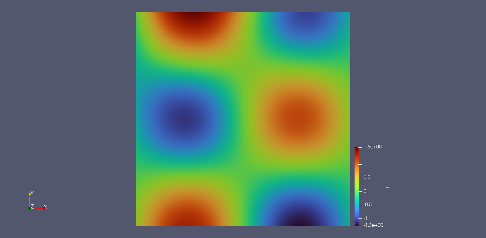

# 2D-Darcy

<a href="https://aistudio.baidu.com/aistudio/projectdetail/6184070?contributionType=1&sUid=438690&shared=1&ts=1684239806160" class="md-button md-button--primary" style>AI Studio快速体验</a>

## 1. 问题简介

2D-Darcy，达西渗流（Darcy flow）的一种，流体在多孔介质中流动时，渗流速度小，流动服从达西定律，渗流速度和压力梯度之间呈线性关系，这种流动称为线性渗流。

## 2. 问题定义

假设达西流模型中，每个位置 $(x,y)$ 上的流速 $\mathbf{u}$ 和压力 $p$ 之间满足以下关系式：

$$
\begin{cases}
\begin{aligned}
\mathbf{u}+\nabla p =& 0,(x,y)\in (0,1)\times (0,1) \\
\nabla \cdot \mathbf{u} =& f,(x,y)\in (0,1)\times (0,1) \\
p(x,y) =& \sin(2 \pi x )\cos(2 \pi y), x=1 \lor  y=1
\end{aligned}
\end{cases}
$$

## 3. 问题求解

接下来开始讲解如何将问题一步一步地转化为 PaddleScience 代码，用深度学习的方法求解该问题。
为了快速理解 PaddleScience，接下来仅对模型构建、方程构建、计算域构建等关键步骤进行阐述，而其余细节请参考 [API文档](../api/arch.md)。

### 3.1 模型构建

在 darcy-2d 问题中，每一个已知的坐标点 $(x, y)$ 都有对应的待求解的未知量 $p$
，我们在这里使用比较简单的 MLP(Multilayer Perceptron, 多层感知机) 来表示 $(x, y)$ 到 $p$ 的映射函数 $f: \mathbb{R}^2 \to \mathbb{R}^1$ ，即：

$$
p = f(x, y)
$$

上式中 $f$ 即为 MLP 模型本身，用 PaddleScience 代码表示如下

``` py linenums="30"
--8<--
examples/darcy/darcy2d.py:30:31
--8<--
```

为了在计算时，准确快速地访问具体变量的值，我们在这里指定网络模型的输入变量名是 `("x", "y")`，输出变量名是 `"p"`，这些命名与后续代码保持一致。

接着通过指定 MLP 的层数、神经元个数，我们就实例化出了一个拥有 5 层隐藏神经元，每层神经元数为 20 的神经网络模型 `model`。

### 3.2 方程构建

由于 2D-Poisson 使用的是 Poisson 方程的2维形式，因此可以直接使用 PaddleScience 内置的 `Poisson`，指定该类的参数 `dim` 为2。

``` py linenums="33"
--8<--
examples/darcy/darcy2d.py:33:34
--8<--
```

### 3.3 计算域构建

本文中 2D darcy 问题作用在以 (0.0, 0.0),  (1.0, 1.0) 为对角线的二维矩形区域，
因此可以直接使用 PaddleScience 内置的空间几何 `Rectangle` 作为计算域。

``` py linenums="36"
--8<--
examples/darcy/darcy2d.py:36:37
--8<--
```

### 3.4 约束构建

在本案例中，我们使用了两个约束条件在计算域中指导模型的训练分别是作用于采样点上的 darcy 方程约束和作用于边界点上的约束。

在定义约束之前，需要给每一种约束指定采样点个数，表示每一种约束在其对应计算域内采样数据的数量，以及通用的采样配置。

``` py linenums="39"
--8<--
examples/darcy/darcy2d.py:39:50
--8<--
```

#### 3.4.1 内部点约束

以作用在内部点上的 `InteriorConstraint` 为例，代码如下：

``` py linenums="52"
--8<--
examples/darcy/darcy2d.py:52:69
--8<--
```

`InteriorConstraint` 的第一个参数是方程表达式，用于描述如何计算约束目标，此处填入在 [3.2 方程构建](#32) 章节中实例化好的 `equation["darcy"].equations`；

第二个参数是约束变量的目标值，在本问题中我们希望 Poisson 方程产生的结果 `darcy` 被优化至与其标准解一致，因此将它的目标值全设为 `poisson_ref_compute_func` 产生的结果；

第三个参数是约束方程作用的计算域，此处填入在 [3.3 计算域构建](#33) 章节实例化好的 `geom["rect"]` 即可；

第四个参数是在计算域上的采样配置，此处我们使用全量数据点训练，因此 `dataset` 字段设置为 "IterableNamedArrayDataset" 且 `iters_per_epoch` 也设置为 1，采样点数 `batch_size` 设为 9801(表示99x99的采样网格)；

第五个参数是损失函数，此处我们选用常用的MSE函数，且 `reduction` 设置为 `"sum"`，即我们会将参与计算的所有数据点产生的损失项求和；

第六个参数是选择是否在计算域上进行等间隔采样，此处我们选择开启等间隔采样，这样能让训练点均匀分布在计算域上，有利于训练收敛；

第七个参数是约束条件的名字，我们需要给每一个约束条件命名，方便后续对其索引。此处我们命名为 "EQ" 即可。

#### 3.4.2 边界约束

同理，我们还需要构建矩形的四个边界的约束。但与构建 `InteriorConstraint` 约束不同的是，由于作用区域是边界，因此我们使用 `BoundaryConstraint` 类，代码如下：

``` py linenums="70"
--8<--
examples/darcy/darcy2d.py:70:117
--8<--
```

`BoundaryConstraint` 类第一个参数表示我们直接对网络模型的输出结果 `out["p"]` 作为程序运行时的约束对象；

第二个参数是指我们约束对象的真值如何获得，这里我们直接通过其解析解进行计算，定义解析解的代码如下：

``` py
lambda _in: np.sin(2.0 * np.pi * _in["x"]) * np.cos(2.0 * np.pi * _in["y"])
```

`BoundaryConstraint` 类其他参数的含义与 `InteriorConstraint` 基本一致，这里不再介绍。

在微分方程约束、边界约束、初值约束构建完毕之后，以我们刚才的命名为关键字，封装到一个字典中，方便后续访问。

``` py linenums="118"
--8<--
examples/ldc/ldc2d_steady_Re10.py:118:125
--8<--
```

### 3.5 超参数设定

接下来我们需要指定训练轮数和学习率，此处我们按实验经验，使用一万轮训练轮数。

``` py linenums="127"
--8<--
examples/darcy/darcy2d.py:127:128
--8<--
```

### 3.6 优化器构建

训练过程会调用优化器来更新模型参数，此处选择较为常用的 `Adam` 优化器。

``` py linenums="130"
--8<--
examples/darcy/darcy2d.py:130:131
--8<--
```

### 3.7 评估器构建

在训练过程中通常会按一定轮数间隔，用验证集（测试集）评估当前模型的训练情况，因此使用 `ppsci.validate.GeometryValidator` 构建评估器。

``` py linenums="133"
--8<--
examples/darcy/darcy2d.py:133:150
--8<--
```

### 3.8 可视化器构建

在模型评估时，如果评估结果是可以可视化的数据，我们可以选择合适的可视化器来对输出结果进行可视化。

本文中的输出数据是一个区域内的二维点集，因此我们只需要将评估的输出数据保存成 **vtu格式** 文件，最后用可视化软件打开查看即可。代码如下：

``` py linenums="152"
--8<--
examples/darcy/darcy2d.py:152:162
--8<--
```

### 3.9 模型训练、评估与可视化

完成上述设置之后，只需要将上述实例化的对象按顺序传递给 `ppsci.solver.Solver`，然后启动训练、评估、可视化。

``` py linenums="164"
--8<--
examples/darcy/darcy2d.py:164:
--8<--
```

## 4. 完整代码

``` py linenums="1" title="darcy2d.py"
--8<--
examples/darcy/darcy2d.py
--8<--
```

## 5. 结果展示

<figure markdown>
  { loading=lazy }
  <figcaption>模型预测压力 p</figcaption>
</figure>
