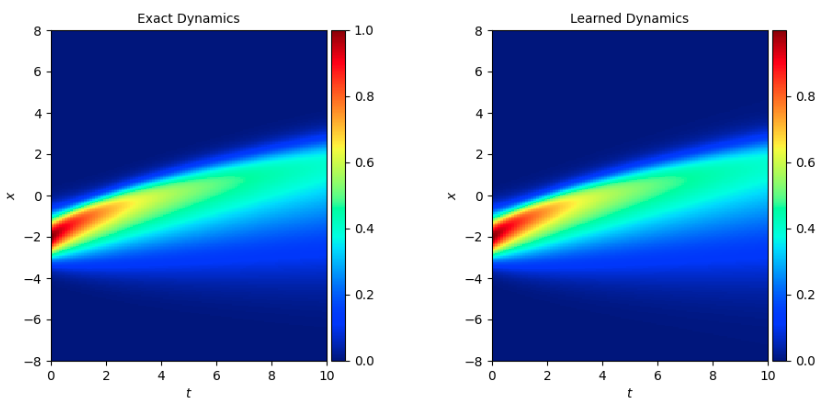
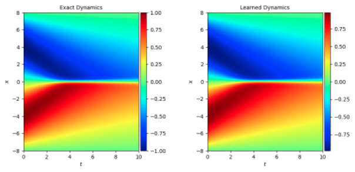

# DeepHPMs(Deep Hidden Physics Models)

<a href="https://aistudio.baidu.com/aistudio/projectdetail/6508962" class="md-button md-button--primary" style>AI Studio快速体验</a>

## 1. 问题简介

传统的 PINNs(Physics-informed neural networks)会将 PDE 作为 loss 的一项参与到网络训练中去，这就要求 PDE 公式为已知的先验条件，当 PDE 公式未知时，这种方法就不能实现。

DeepHPMs 着眼于 PDE 公式未知的情况，通过深度学习网络，从实验产生的高维数据中发现物理规律，即非线性 PDE 方程，并用一个深度学习网络来表征这个 PDE 方程，再将这个 PDE 网络替代传统 PINNs 方法中的 PDE 公式，对新的数据进行预测。

本问题对 Burgers, Korteweg- de Vries (KdV), Kuramoto-Sivashinsky, nonlinear Schro ̈dinger 和 Navier- Stokes equations 多种 PDE 方程进行了研究，本文档主要针对 Burgers 方程进行说明。


## 2. 问题定义

伯格斯方程(Burgers equation) 是一个模拟冲击波的传播和反射的非线性偏微分方程，该方程认为输出的解 $u$ 与输入的位置、时间参数 $(x, t)$ 之间的关系为：

$$
u_t + \lambda_1 u u_x - \lambda_2 u_{xx} = 0
$$

其中 $u_t$ 为 $u$ 对 $t$ 的偏导数，$u_x$ 为 $u$ 对 $x$ 的偏导数，$u_{xx}$ 为 $u$ 对 $x$ 的二阶偏导数。

通过深度学习网络表示 PDE，即 $u_t$ 是输入为 $u, u_x, u_{xx}$ 的网络的输出：

$$
u_t = \mathcal{N}(u, u_x, u_{xx})
$$

## 3. 问题求解

接下来开始讲解如何将问题一步一步地转化为 PaddleScience 代码，用深度学习的方法求解该问题。为了快速理解 PaddleScience，接下来仅对模型构建、方程构建、计算域构建等关键步骤进行阐述，而其余细节请参考 [API文档](../api/arch.md)。

### 3.1 数据集介绍

数据集为处理好的 burgers 数据集，包含不同初始化条件下模拟数据的 $x, t, u$ 以字典的形式存储在 `.mat` 文件中。

运行本问题代码前请下载 [模拟数据集1](https://paddle-org.bj.bcebos.com/paddlescience/datasets/DeepHPMs/burgers_sine.mat) 和 [模拟数据集2](https://paddle-org.bj.bcebos.com/paddlescience/datasets/DeepHPMs/burgers.mat)， 下载后分别存放在路径：

``` py linenums="55"
--8<--
examples/deephpms/burgers.py:55:56
--8<--
```

### 3.2 模型构建

本问题共包含 3 个深度学习网络，分别为数据驱动的 Net1，表征 PDE 方程的 Net2 以及用于推理新数据的 Net3。

Net1 通过数据驱动的方式，使用输入的某种模拟情况 1 下的少量随机数据进行训练，学习数据规律，从而得到该模拟情况下其他所有数据的数值 $u$。输入为模拟情况 1 数据的 $x, t$，输出为 $u$，是一个$(x, t)$ 到 $u$ 的映射函数 $f_1: \mathbb{R}^2 \to \mathbb{R}^1$。

对 Net1 前向推理得到的 $u$ 值，计算其对 $x, t$ 的偏导数 $u_t, u_x, u_{xx}$，并将计算得到的值当作真实物理值，作为输入和标签传到 Net2 中，通过优化 loss，训练 Net2。对于 Net2，输入为 Net1 推理得到的 $u$ 以及它对x的偏导数 $u_x, u_{xx}$，输出为 PDE 的运算结果 $f_{pde}$，这个值应该与 $u_t$ 接近，即 $u_t$ 是 $f_{pde}$ 的 label。映射函数为 $f_2: \mathbb{R}^3 \to \mathbb{R}^1$。

最后，将训练好的 Net2 当作 PDE 公式，将新的模拟情况 2 下的少量数据作为输入，与 Net3 一起进行类似 PINNs 的训练，最终得到可以对模拟情况 2 进行预测的深度学习网络 Net3。对于 Net3，输入为模拟情况 2 数据的 $x, t$，输出为 $u$，是一个$(x, t)$ 到 $u$ 的映射函数 $f_3: \mathbb{R}^2 \to \mathbb{R}^1$。

因为训练中后一个阶段网络需要使用前一个阶段网络的前向推理值，因此本问题使用 Model List 来实现，上式中 $f_1,f_2,f_3$ 分别为一个 MLP 模型，三者共同构成了一个 Model List，用 PaddleScience 代码表示如下

``` py linenums="68"
--8<--
examples/deephpms/burgers.py:68:71
--8<--
```

注意到部分网络的输入由之前的网络计算得到，而不仅仅是数据中 $(x, t)$ 这两个变量，这也就意味着我们需要对部分网络输入进行 transform。

### 3.3 transform构建

对于 Net1，输入为 $(x, t)$ 本来不需要 transform，但由于训练中根据数据的定义域对输入数据进行了数值变换，因此同样需要transform，同样，Net3 也需要对输入进行数值变换的 transform

``` py linenums="73"
--8<--
examples/deephpms/burgers.py:73:79
--8<--
```

对于 Net2，因为它的输入为 $u, u_x, u_{xx}$ 而 $u$ 为其他两个网络的输出，只要进行 Net2 的前向推理，就需要 transform，因此需要两种 transform。同时，在训练 Net3 之前，需要重新注册 transform

``` py linenums="81"
--8<--
examples/deephpms/burgers.py:81:94
--8<--
```

然后依次注册 transform 后，将3 个 MLP 模型组成 Model List

``` py linenums="96"
--8<--
examples/deephpms/burgers.py:96:102
--8<--
```

注意 Net3 开始训练前，重新注册 Net2 的transform

``` py linenums="243"
--8<--
examples/deephpms/burgers.py:243:244
--8<--
```

这样我们就实例化出了一个拥有 3 个 MLP 模型，每个 MLP 包含 4 层隐藏神经元，每层神经元数为 50，使用 "sin" 作为激活函数，并包含输入 transform 的神经网络模型 `model list`。

### 3.4 参数和超参数设定

我们需要指定问题相关的参数，如数据集路径、输出文件路径、定义域的值等

``` py linenums="53"
--8<--
examples/deephpms/burgers.py:53:66
--8<--
```

同时需要指定训练轮数和学习率等超参数

``` py linenums="104"
--8<--
examples/deephpms/burgers.py:104:107
--8<--
```

### 3.5 优化器构建

本问题提供了两种优化器，分别为 Adam 优化器和 LBFGS 优化器，训练时只选择其中一种，需要将另一种优化器注释掉。

``` py linenums="109"
--8<--
examples/deephpms/burgers.py:109:118
--8<--
```

### 3.6 约束构建

本问题分为三个训练阶段，部分采用监督学习的方式，对 $u$ 进行约束，部分采用无监督学习的方式，约束结果满足 PDE 公式。

无监督仍然可以采用监督约束 `SupervisedConstraint`，在定义约束之前，需要给监督约束指定文件路径等数据读取配置，因为数据集中没有标签数据，因此在数据读取时我们需要使用训练数据充当标签数据，并注意在之后不要使用这部分“假的”标签数据，例如

``` py linenums="180"
--8<--
examples/deephpms/burgers.py:180:188
--8<--
```

`du_t` 值读取了 `t` 的值，是“假的”标签数据。

#### 3.6.1 第一阶段约束构建

第一阶段对 Net1 的训练是纯监督学习，此处采用监督约束 `SupervisedConstraint`

``` py linenums="121"
--8<--
examples/deephpms/burgers.py:121:138
--8<--
```

`SupervisedConstraint` 的第一个参数是监督约束的读取配置，配置中 `“dataset”` 字段表示使用的训练数据集信息，其各个字段分别表示：

1. `name`： 数据集类型，此处 `"IterableMatDataset"` 表示不分 batch 顺序读取的 `.mat` 类型的数据集；
2. `file_path`： 数据集文件路径；
3. `input_keys`： 输入变量名；
4. `label_keys`： 标签变量名；
5. `alias_dict`： 变量别名。

第二个参数是损失函数，由于是纯数据驱动，此处使用 `MSE`。

第三个参数是方程表达式，用于描述如何计算约束目标，计算后的值将会按照指定名称存入输出列表中，从而保证 loss 计算时可以使用这些值。

第四个参数是约束条件的名字，我们需要给每一个约束条件命名，方便后续对其索引。

在约束构建完毕之后，以我们刚才的命名为关键字，封装到一个字典中，方便后续访问。

#### 3.6.2 第二阶段约束构建

第二阶段对 Net2 的训练是无监督学习，但仍可采用监督约束 `SupervisedConstraint`，要注意上述提到的给定“假的”标签数据

``` py linenums="179"
--8<--
examples/deephpms/burgers.py:179:199
--8<--
```

各个参数含义与 [第一阶段约束构建](#361) 一致，唯一的区别是这个约束中的第二个参数，损失函数，采用 PaddleScience 预留的自定义 loss 函数类 `FunctionalLoss`，该类支持编写代码时自定义 loss 的计算方法，而不是使用诸如 `MSE` 等现有方法。本约束中的自定义 loss 函数代码请参考 [自定义 loss 和 metric](#38)。

在约束构建完毕之后，以我们刚才的命名为关键字，封装到一个字典中，方便后续访问。

#### 3.6.3 第三阶段约束构建

第三阶段 Net3 的训练复杂，包含了对部分初始点的监督学习、与 PDE 有关的无监督学习以及与边界条件有关的无监督学习，这里仍采用监督约束 `SupervisedConstraint`，同样要注意给定“假的”标签数据，各参数含义同上

``` py linenums="246"
--8<--
examples/deephpms/burgers.py:246:303
--8<--
```

在约束构建完毕之后，以我们刚才的命名为关键字，封装到一个字典中，方便后续访问。

### 3.7 评估器构建

与约束同理，虽然本问题部分采用监督学习的方式，部分采用无监督学习的方式，但仍可以使用 `ppsci.validate.SupervisedValidator` 构建评估器，参数含义也与[约束构建](#36)，唯一的区别是评价指标 `metric`

#### 3.7.1 第一阶段评估器构建

评价指标 `metric` 为 `L2` 正则化函数

``` py linenums="140"
--8<--
examples/deephpms/burgers.py:140:158
--8<--
```

#### 3.7.2 第二阶段评估器构建

评价指标 `metric` 为 `FunctionalMetric`，这是 PaddleScience 预留的自定义 metric 函数类，该类支持编写代码时自定义 metric 的计算方法，而不是使用诸如 `MSE`、 `L2` 等现有方法。自定义 metric 函数代码请参考下一部分 [自定义 loss 和 metric](#38)。

``` py linenums="201"
--8<--
examples/deephpms/burgers.py:201:222
--8<--
```

#### 3.7.3 第三阶段评估器构建

因为第三阶段评价时只需要对训练得到的点的值进行评价，而不需要对边界条件满足程度或 PDE 满足程度进行评价，因此评价指标 `metric` 为 `L2` 正则化函数

``` py linenums="305"
--8<--
examples/deephpms/burgers.py:305:325
--8<--
```

### 3.8 自定义 loss 和 metric

由于本问题包含无监督学习，数据中不存在标签数据，loss 和 metric 根据 PDE 计算得到，因此需要自定义 loss 和 metric。方法为先定义相关函数，再将函数名作为参数传给 `FunctionalLoss` 和 `FunctionalMetric`。

需要注意自定义 loss 和 metric 函数的输入输出参数需要与 PaddleScience 中如 `MSE` 等其他函数保持一致，即输入为模型输出 `output_dict` 等字典变量，loss 函数输出为 loss 值 `paddle.Tensor`，metric 函数输出为字典 `Dict[str, paddle.Tensor]`。

与 PDE 相关的自定义 loss 函数为

``` py linenums="25"
--8<--
examples/deephpms/burgers.py:25:27
--8<--
```

与 PDE 相关的自定义 metric 函数为

``` py linenums="30"
--8<--
examples/deephpms/burgers.py:30:35
--8<--
```

与边界条件相关的自定义 loss 函数为

``` py linenums="38"
--8<--
examples/deephpms/burgers.py:38:49
--8<--
```

### 3.9 模型训练、评估

完成上述设置之后，只需要将上述实例化的对象按顺序传递给各个阶段 `ppsci.solver.Solver`，然后启动训练、评估。

第一阶段训练、评估

``` py linenums="160"
--8<--
examples/deephpms/burgers.py:160:176
--8<--
```

第二阶段训练、评估

``` py linenums="224"
--8<--
examples/deephpms/burgers.py:224:240
--8<--
```

第三阶段训练、评估

``` py linenums="327"
--8<--
examples/deephpms/burgers.py:327:343
--8<--
```

### 3.10 可视化

本问题训练结束后，使用第三阶段网络 Net3 对模拟情况 2 的数据进行推理，结果为 $u|_{(x,t)}$ 值，可以通过 matplotlib 等库将结果画出。代码中不再包含这部分可视化代码。

## 4. 完整代码

``` py linenums="1" title="burgers.py"
--8<--
examples/deephpms/burgers.py
--8<--
```

## 5. 结果展示

模拟数据集 1 是 burgers_sine.mat，模拟数据集 2 是 burgers.mat 时：

<figure markdown>
  { loading=lazy }
  <figcaption> 真实 u 值和推理 u 值对比</figcaption>
</figure>

模拟数据集 1、2 都是 burgers_sine.mat 时：

<figure markdown>
  { loading=lazy }
  <figcaption> 真实 u 值和推理 u 值对比</figcaption>
</figure>

## 6. 参考文献

参考文献： [Deep Hidden Physics Models: Deep Learning of Nonlinear Partial Differential Equations](https://arxiv.org/abs/1801.06637)

参考代码： [DeepHPMs](https://github.com/maziarraissi/DeepHPMs)
