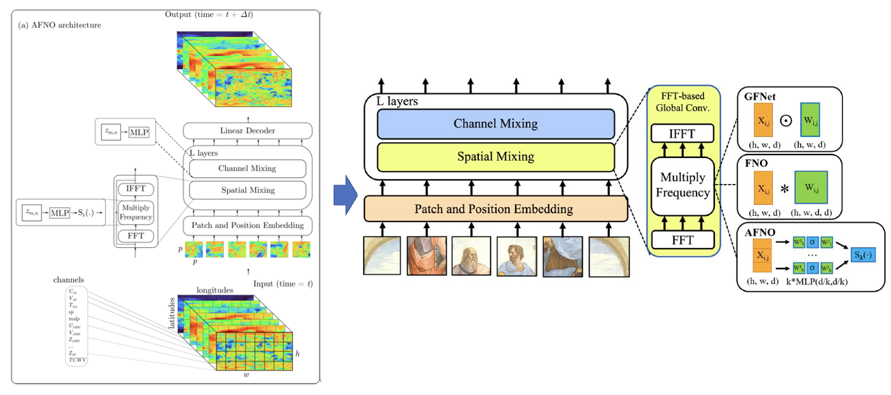
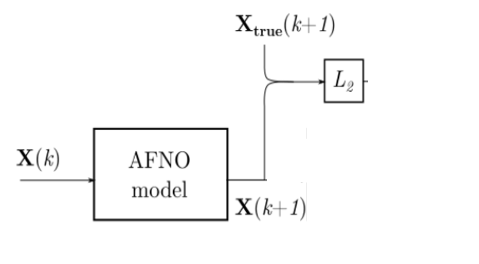
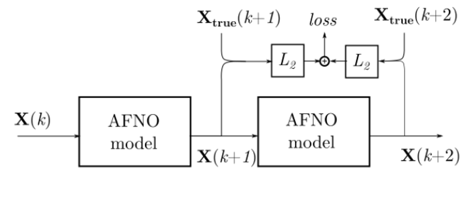
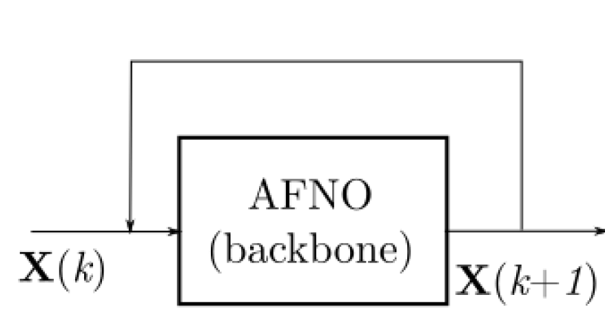
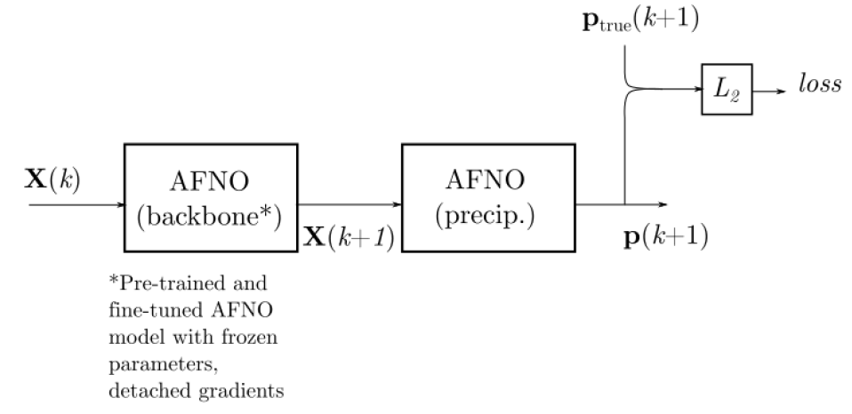
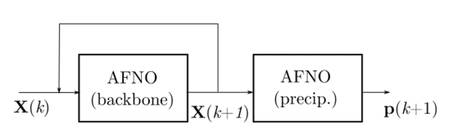
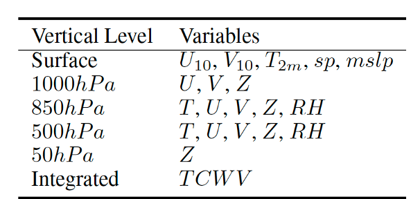
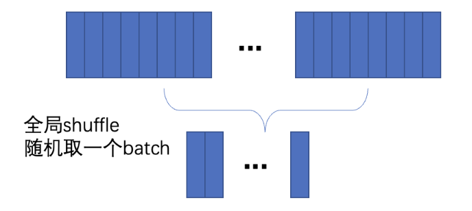

# FourCastNet

## 1. 背景简介

在天气预报任务中，有基于物理信息驱动和数据驱动两种方法实现天气预报。基于物理信息驱动的方法，例如 IFS 模型，往往依赖物理方程，通过建模大气变量之间的物理关系实现天气预报；在 IFS 这个模型当中，使用了分布在 50 多个垂直高度上的总共 150 多个大气变量，去实现大气变量的预测工作。基于数据驱动的方法不依赖物理方程，而需要大量的训练数据，一般将神经网络看作一个黑盒结构，训练网络学习输入数据与输出数据之间的函数函数关系，实现给定输入条件下对于输出数据的预测。FourCastNet 算法是基于数据驱动的方法，相比于 IFS 模型，它仅仅使用了 5 个垂直高度上的 20 个大气变量进行模型的训练，使用的大气变量的个数要少很多，而且推理速度更快。

## 2. 模型原理

本章节仅对 FourCastNet 的模型原理进行简单的介绍，详细的理论推导请阅读[论文](https://arxiv.org/abs/2202.11214)。

FourCastNet 的网络模型使用了 AFNO 网络，这是一个应用在图像分割领域的一个网络。这个网络基于 FNO 和 VIT 这两个方法，借鉴了 FNO 中使用傅立叶变换完成不同 token 信息交互的方法，缓解了 VIT 中 self-attention 计算量大的问题，这个问题在高分辨率输入数据的情况下尤为明显。关于 [AFNO](https://openreview.net/pdf?id=EXHG-A3jlM)、[FNO](https://arxiv.org/abs/2010.08895)、[VIT](https://arxiv.org/pdf/2010.11929.pdf) 的相关原理也请阅读对应论文。

模型的总体结构如图所示：

<figure markdown>
  { loading=lazy style="margin:0 auto"}
  <figcaption>FourCastNet 网络模型</figcaption>
</figure>

FourCastNet论文中训练了风速模型和降雨量模型，接下来将介绍这两个模型的训练、推理过程。

### 2.1 风速模型的训练、推理过程

模型的训练过程主要分为两个步骤：模型预训练、模型微调。

模型预训练阶段是基于随机初始化的网络权重对模型进行训练，如下图所示，其中 $X(k)$ 表示第 $k$ 时刻的大气数据，$X(k+1)$ 表示第 $k+1$ 时刻模型预测的大气数据，$X_{true}(k+1)$ 表示第 $k+1$ 时刻的真实大气数据。最后网络模型预测的输出和真值计算 L2 损失函数。

<figure markdown>
  { loading=lazy style="margin:0 auto;height:40%;width:40%"}
  <figcaption>风速模型预训练</figcaption>
</figure>

模型训练的第二个阶段是模型微调，这个阶段的训练主要是为了提高模型在中长期天气预报的精度。具体的，当模型输入 $k$ 时刻的数据，预测了 $k+1$ 时刻的数据后，再使用预测的得到的 $k+1$ 时刻的数据作为模型输入预测 $k+2$ 时刻的数据，这样把预测得到的两个时刻的数据都用真值进行约束，提高了模型长时预测的能力。

<figure markdown>
  { loading=lazy style="margin:0 auto;height:40%;width:40%"}
  <figcaption>风速模型微调</figcaption>
</figure>

在推理阶段，给定 $k$ 时刻的数据，可以通过不断迭代，得到 $k+1$、$k+1$、$k+3$ 等时刻的预测结果。

<figure markdown>
  { loading=lazy style="margin:0 auto;height:40%;width:40%"}
  <figcaption>风速模型推理</figcaption>
</figure>

### 2.2 降雨量模型的训练、推理过程

降雨量模型的训练依赖于风速模型，如下图所示，使用 $k$ 时刻的大气变量数据 $X(k)$ 输入训练好的风速模型，得到风速模型预测的 $k+1$ 时刻的大气变量数据 $X(k+1)$。降雨量模型以 $X(k+1)$ 为输入，输出为预测的 $k+1$ 时刻的降雨量数据 $p(k+1)$。模型训练时 $p(k+1)$ 与真值数据 $p_{true}(k+1)$ 计算 L2 损失函数约束网络训练。

<figure markdown>
  { loading=lazy style="margin:0 auto;height:40%;width:40%"}
  <figcaption>降雨量模型训练</figcaption>
</figure>

需要注意的是在降雨量模型的训练过程中，风速模型的参数处于冻结状态不参与梯度传播和反向计算。

在推理阶段，给定 $k$ 时刻的数据，可以通过不断迭代，利用风速模型得到 $k+1$、$k+1$、$k+3$ 等时刻的大气变量预测数据，然后使用该数据作为降雨量模型的输入预测对应时刻的降雨量数据。

<figure markdown>
  { loading=lazy style="margin:0 auto;height:40%;width:40%"}
  <figcaption>降雨量模型推理</figcaption>
</figure>

## 3. 风速模型实现

接下来开始讲解如何基于 PaddleScience 代码，实现 FourCastNet 风速模型的训练与推理。由于完整复现需要 5+TB 的存储空间和 64 卡的训练资源，需要的资源非常大，因此如果仅仅是学习 FourCastNet 的算法原理，非常建议对训练数据集进行缩减（例如仅使用近五年的训练数据）以减小学习成本。接下来首先会对使用的数据集进行介绍，然后对该方法两个训练步骤（模型预训练、模型微调）的监督约束构建、模型构建等进行阐述。关于该案例中的其余细节请参考 [API文档](../api/arch.md)。

### 3.1 数据集介绍

数据集采用了 [FourCastNet](https://github.com/NVlabs/FourCastNet) 中处理好的 ERA5 数据集。该数据集的分辨率大小为 0.25，每个变量的数据大小为 720*1440，其中单个数据点代表的实际距离为 30km 左右。FourCastNet 使用了 1979-2018 年的数据，根据年份划分为了训练集、验证集、测试集，划分结果如下：

|数据集 |年份        |
|:----:|:---------:|
|训练集 |1979-2015  |
|验证集 |2016-2017  |
|测试集 |2018       |

该数据集可以从[此处](https://app.globus.org/file-manager?origin_id=945b3c9e-0f8c-11ed-8daf-9f359c660fbd&origin_path=%2F~%2Fdata%2F)下载。

模型训练使用了分布在 5 个压力层上的 20 个大气变量，如下表所示，

<figure markdown>
  { loading=lazy }
  <figcaption>20 个大气变量</figcaption>
</figure>

其中 $T$、$U$、$V$ 、$Z$、$RH$ 分别代表指定垂直高度上的温度、纬向风速、经向风速、位势和相对湿度；$U_{10}$/$V_{10}$、$T_{2m}$则代表距离地面 10 米的纬向风速/经向风速和距离地面 2 米的温度。$sp$ 代表地面气压，$mslp$ 代表平均海平面气压。$TCWV$ 代表整层气柱水汽总量。

对每天 24 个小时的数据间隔 6 小时采样，得到 0.00h/6.00h/12.00h/18.00h 时刻全球 20 个大气变量的数据，使用这样的数据进行模型的训练与推理。即输入0.00h 时刻的 20 个大气变量的数据，模型输出预测得到的 6.00h 时刻的 20 个大气变量的数据。

### 3.2 模型预训练

首先展示代码中定义的各个参数变量，每个参数的具体含义会在下面使用到时进行解释。

``` py linenums="30" title="examples/fourcastnet/train_pretrain.py"
--8<--
examples/fourcastnet/train_pretrain.py:30:51
--8<--
```

#### 3.2.1 约束构建

本案例基于数据驱动的方法求解问题，因此需要使用 PaddleScience 内置的 `SupervisedConstraint` 构建监督约束。在定义约束之前，需要首先指定监督约束中用于数据加载的各个参数，首先介绍数据预处理部分，代码如下：

``` py linenums="55" title="examples/fourcastnet/train_pretrain.py"
--8<--
examples/fourcastnet/train_pretrain.py:55:69
--8<--
```

数据预处理部分总共包含 3 个预处理方法，分别是:

1. `SqueezeData`: 对训练数据的维度进行压缩，如果输入数据的维度为 4，则将第 0 维和第 1 维的数据压缩到一起，最终将输入数据的维度变换为 3。
2. `CropData`: 从训练数据中裁剪指定位置的数据。因为 ERA5 数据集中的原始数据大小为 721*1440，本案例根据原始论文设置，将训练数据裁剪为 720*1440。
3. `Normalize`: 根据训练数据集上的均值、方差对数据进行归一化处理。

由于完整复现 FourCastNet 需要 5+TB 的存储空间和 64 卡的 GPU 资源，需要的存储资源比较多，因此有以下两种训练方式（实验证明两种训练方式的损失函数收敛曲线基本一致，当存储资源比较有限时，可以使用方式 b）。

方式 a： 当存储资源充足时，可以将全部训练数据存储到每台训练机器上（每台机器需要 5+TB 的存储空间），启动训练程序进行训练，此时训练过程中数据的加载是使用全局 shuffle 的方式进行，如下图所示，每个 batch 中的训练数据数据是随机从全量数据集中抽取样本组成的。

<figure markdown>
  { loading=lazy }
  <figcaption>全局 shuffle</figcaption>
</figure>

这种方式下，数据加载的代码如下：

``` py linenums="74" title="examples/fourcastnet/train_pretrain.py"
--8<--
examples/fourcastnet/train_pretrain.py:74:90
--8<--
```

其中，"dataset" 字段定义了使用的 `Dataset` 类名为 `ERA5Dataset`，"sampler" 字段定义了使用的 `Sampler` 类名为 `BatchSampler`，设置的 `batch_size` 为 1，`num_works` 为 8。

方式 b：在存储资源有限时，需要将数据集平均分配存储到每个训练机器上，本案例提供了随机采样数据的程序可以使用 ppsci/fourcastnet/sample_data.py，可以根据需要进行修改。本案例默认使用方式 a, 因此使用方式 b 进行模型训练时需要手动将 `USE_SAMPLED_DATA` 设置为 `True`。方式 b 训练过程中数据的加载是使用局部 shuffle 的方式进行，如下图所示，将训练数据平均分配到了 8 台机器上，训练时从每台机器上随机抽取 1/8 个 batch 的数据组成 1 个完整的 batch 进行训练。在 8 机条件下，每台机器需要约 1.2TB 的存储空间，相比于方式 a，方式 b 大大减小了对存储空间的依赖。

<figure markdown>
  { loading=lazy }
  <figcaption>局部 shuffle</figcaption>
</figure>

这种方式下，数据加载的代码如下：

``` py linenums="92" title="examples/fourcastnet/train_pretrain.py"
--8<--
examples/fourcastnet/train_pretrain.py:92:109
--8<--
```

其中，"dataset" 字段定义了使用的 `Dataset` 类名为 `ERA5SampledDataset`，"sampler" 字段定义了使用的 `Sampler` 类名为 `DistributedBatchSampler`，设置的 `batch_size` 为 1，`num_works` 为 8。

当不需要完整复现 FourCastNet 时，直接使用本案例的默认设置（方式 a）即可，

定义监督约束的代码如下：

``` py linenums="110" title="examples/fourcastnet/train_pretrain.py"
--8<--
examples/fourcastnet/train_pretrain.py:110:116
--8<--
```

`SupervisedConstraint` 的第一个参数是数据的加载方式，这里使用上文中定义的 `train_dataloader_cfg`；

第二个参数是损失函数的定义，这里使用 `L2RelLoss`；

第三个参数是约束条件的名字，方便后续对其索引。此处命名为 "Sup"。

#### 3.2.2 模型构建

在该案例中，风速模型基于 AFNONet 网络模型，用 PaddleScience 代码表示如下：

``` py linenums="163" title="examples/fourcastnet/train_pretrain.py"
--8<--
examples/fourcastnet/train_pretrain.py:163:164
--8<--
```

其中，`input_keys` 和 `output_keys` 分别代表网络模型输入、输出变量的名称。

#### 3.2.3 学习率与优化器构建

本案例中使用的学习率方法为 `Cosine`，学习率大小设置为 2.5e-4。优化器使用 `Adam`，用 PaddleScience 代码表示如下：

``` py linenums="166" title="examples/fourcastnet/train_pretrain.py"
--8<--
examples/fourcastnet/train_pretrain.py:166:173
--8<--
```

#### 3.2.4 评估器构建

本案例训练过程中会按照一定的训练轮数间隔，使用验证集评估当前模型的训练情况，需要使用 `SupervisedValidator` 构建评估器。代码如下：

``` py linenums="121" title="examples/fourcastnet/train_pretrain.py"
--8<--
examples/fourcastnet/train_pretrain.py:121:161
--8<--
```

`SupervisedValidator` 评估器与 `SupervisedConstraint` 比较相似，不同的是评估器需要设置评价指标 `metric`，在这里使用了 3 个评价指标分别是 `MAE`、`LatitudeWeightedRMSE` 和 `LatitudeWeightedACC`。

#### 3.2.5 模型训练与评估

完成上述设置之后，只需要将上述实例化的对象按顺序传递给 `ppsci.solver.Solver`，然后启动训练、评估。

``` py linenums="175" title="examples/fourcastnet/train_pretrain.py"
--8<--
examples/fourcastnet/train_pretrain.py:175:
--8<--
```

### 3.3 模型微调

上文介绍了如何对风速模型进行预训练，在本节中将介绍如何利用预训练的模型进行微调。因为风速模型预训练的步骤与微调的步骤基本相似，因此本节在两者的重复部分不再介绍，而仅仅介绍模型微调特有的部分。首先将代码中定义的各个参数变量展示如下，每个参数的具体含义会在下面使用到时进行解释。

``` py linenums="64" title="examples/fourcastnet/train_finetune.py"
--8<--
examples/fourcastnet/train_finetune.py:64:88
--8<--
```

微调模型的程序新增了 `NUM_TIMESTAMPS` 参数，用于控制模型微调训练时迭代的时间步的个数。这个参数首先会在数据加载的设置中用到，用于设置数据集产生的真值的时间步大小，代码如下：

``` py linenums="108" title="examples/fourcastnet/train_finetune.py"
--8<--
examples/fourcastnet/train_finetune.py:108:126
--8<--
```

另外，与预训练不同的是，微调的模型构建需要设置 `num_timestamps` 参数，用于控制模型输出的预测结果的时间步大小，代码如下：

``` py linenums="184" title="examples/fourcastnet/train_finetune.py"
--8<--
examples/fourcastnet/train_finetune.py:184:185
--8<--
```

训练微调模型的程序中增加了在测试集上评估模型性能的代码和可视化代码，接下来将对这两部分进行详细介绍。

#### 3.3.1 测试集上评估模型

根据论文中的设置，在测试集上进行模型评估时，`num_timestamps` 设置的为 32，相邻的两个测试样本的间隔为 8。

构建模型的代码为：

``` py linenums="216" title="examples/fourcastnet/train_finetune.py"
--8<--
examples/fourcastnet/train_finetune.py:216:221
--8<--
```

构建评估器的代码为：

``` py linenums="223" title="examples/fourcastnet/train_finetune.py"
--8<--
examples/fourcastnet/train_finetune.py:223:240
--8<--
```

#### 3.3.2 可视化器构建

风速模型使用自回归的方式进行推理，需要首先设置模型推理的输入数据，代码如下：

``` py linenums="242" title="examples/fourcastnet/train_finetune.py"
--8<--
examples/fourcastnet/train_finetune.py:242:252
--8<--
```

``` py linenums="29" title="examples/fourcastnet/train_finetune.py"
--8<--
examples/fourcastnet/train_finetune.py:29:54
--8<--
```

以上的代码中会根据设置的时间参数 `DATE_STRINGS` 读取对应的数据用于模型的输入，另外 `get_vis_datas` 函数内还读取了对应时刻的真值数据，这些数据也将可视化出来，方便与模型的预测结果进行对比。

由于模型对风速的纬向和经向分开预测，因此需要把这两个方向上的风速合成为真正的风速，代码如下：

``` py linenums="254" title="examples/fourcastnet/train_finetune.py"
--8<--
examples/fourcastnet/train_finetune.py:254:270
--8<--
```

最后，构建可视化器的代码如下：

``` py linenums="271" title="examples/fourcastnet/train_finetune.py"
--8<--
examples/fourcastnet/train_finetune.py:271:287
--8<--
```

以上构建好的模型、评估器、可视化器将会传递给 `ppsci.solver.Solver` 用于在测试集上评估性能和进行可视化。

``` py linenums="289" title="examples/fourcastnet/train_finetune.py"
--8<--
examples/fourcastnet/train_finetune.py:289:
--8<--
```

## 4. 降雨量模型实现

首先展示代码中定义的各个参数变量，每个参数的具体含义会在下面使用到时进行解释。

``` py linenums="66" title="examples/fourcastnet/train_precip.py"
--8<--
examples/fourcastnet/train_precip.py:66:94
--8<--
```

### 4.1 约束构建

本案例基于数据驱动的方法求解问题，因此需要使用 PaddleScience 内置的 `SupervisedConstraint` 构建监督约束。在定义约束之前，需要首先指定监督约束中用于数据加载的各个参数，首先介绍数据预处理部分，代码如下：

``` py linenums="98" title="examples/fourcastnet/train_precip.py"
--8<--
examples/fourcastnet/train_precip.py:98:115
--8<--
```

数据预处理部分总共包含 4 个预处理方法，分别是:

1. `SqueezeData`: 对训练数据的维度进行压缩，如果输入数据的维度为 4，则将第 0 维和第 1 维的数据压缩到一起，最终将输入数据的维度变换为 3。
2. `CropData`: 从训练数据中裁剪指定位置的数据。因为 ERA5 数据集中的原始数据大小为 721*1440，本案例根据原始论文设置，将训练数据裁剪为 720*1440。
3. `Normalize`: 根据训练数据集上的均值、方差对数据进行归一化处理，这里通过 `apply_keys` 字段设置了该预处理方法仅仅应用到输入数据上。
4. `Log1p`: 将数据映射到对数空间，这里通过 `apply_keys` 字段设置了该预处理方法仅仅应用到真值数据上。

数据加载的代码如下：

``` py linenums="117" title="examples/fourcastnet/train_precip.py"
--8<--
examples/fourcastnet/train_precip.py:117:135
--8<--
```

其中，"dataset" 字段定义了使用的 `Dataset` 类名为 `ERA5Dataset`，"sampler" 字段定义了使用的 `Sampler` 类名为 `BatchSampler`，设置的 `batch_size` 为 1，`num_works` 为 8。

定义监督约束的代码如下：

``` py linenums="136" title="examples/fourcastnet/train_precip.py"
--8<--
examples/fourcastnet/train_precip.py:136:142
--8<--
```

`SupervisedConstraint` 的第一个参数是数据的加载方式，这里使用上文中定义的 `train_dataloader_cfg`；

第二个参数是损失函数的定义，这里使用 `L2RelLoss`；

第三个参数是约束条件的名字，方便后续对其索引。此处命名为 "Sup"。

### 4.2 模型构建

在该案例中，需要首先定义风速模型的网络结构并加载训练好的参数，然后定义降雨量模型，用 PaddleScience 代码表示如下：

``` py linenums="187" title="examples/fourcastnet/train_precip.py"
--8<--
examples/fourcastnet/train_precip.py:187:190
--8<--
```

其中，`input_keys` 和 `output_keys` 分别代表网络模型输入、输出变量的名称。

### 4.3 学习率与优化器构建

本案例中使用的学习率方法为 `Cosine`，学习率大小设置为 5e-4。优化器使用 `Adam`，用 PaddleScience 代码表示如下：

``` py linenums="192" title="examples/fourcastnet/train_precip.py"
--8<--
examples/fourcastnet/train_precip.py:192:199
--8<--
```

### 4.4 评估器构建

本案例训练过程中会按照一定的训练轮数间隔，使用验证集评估当前模型的训练情况，需要使用 `SupervisedValidator` 构建评估器。代码如下：

``` py linenums="147" title="examples/fourcastnet/train_precip.py"
--8<--
examples/fourcastnet/train_precip.py:147:185
--8<--
```

`SupervisedValidator` 评估器与 `SupervisedConstraint` 比较相似，不同的是评估器需要设置评价指标 `metric`，在这里使用了 3 个评价指标分别是 `MAE`、`LatitudeWeightedRMSE` 和 `LatitudeWeightedACC`。

### 4.5 模型训练与评估

完成上述设置之后，只需要将上述实例化的对象按顺序传递给 `ppsci.solver.Solver`，然后启动训练、评估。

``` py linenums="202" title="examples/fourcastnet/train_precip.py"
--8<--
examples/fourcastnet/train_precip.py:202:218
--8<--
```

### 4.6 测试集上评估模型

根据论文中的设置，在测试集上进行模型评估时，`NUM_TIMESTAMPS` 设置为 6，相邻的两个测试样本的间隔为 8。

构建模型的代码为：

``` py linenums="221" title="examples/fourcastnet/train_precip.py"
--8<--
examples/fourcastnet/train_precip.py:221:227
--8<--
```

构建评估器的代码为：

``` py linenums="230" title="examples/fourcastnet/train_precip.py"
--8<--
examples/fourcastnet/train_precip.py:230:247
--8<--
```

### 4.7 可视化器构建

降雨量模型使用自回归的方式进行推理，需要首先设置模型推理的输入数据，代码如下：

``` py linenums="250" title="examples/fourcastnet/train_precip.py"
--8<--
examples/fourcastnet/train_precip.py:250:260
--8<--
```

``` py linenums="29" title="examples/fourcastnet/train_precip.py"
--8<--
examples/fourcastnet/train_precip.py:29:56
--8<--
```

以上的代码中会根据设置的时间参数 `DATE_STRINGS` 读取对应的数据用于模型的输入，另外 `get_vis_datas` 函数内还读取了对应时刻的真值数据，这些数据也将可视化出来，方便与模型的预测结果进行对比。

由于模型对降雨量进行了对数处理，因此需要将模型结果重新映射回线性空间，代码如下：

``` py linenums="262" title="examples/fourcastnet/train_precip.py"
--8<--
examples/fourcastnet/train_precip.py:262:275
--8<--
```

最后，构建可视化器的代码如下：

``` py linenums="277" title="examples/fourcastnet/train_precip.py"
--8<--
examples/fourcastnet/train_precip.py:277:293
--8<--
```

以上构建好的模型、评估器、可视化器将会传递给 `ppsci.solver.Solver` 用于在测试集上评估性能和进行可视化。

``` py linenums="297" title="examples/fourcastnet/train_precip.py"
--8<--
examples/fourcastnet/train_precip.py:297:
--8<--
```

## 5. 完整代码

``` py linenums="1" title="examples/fourcastnet/train_pretrain.py"
--8<--
examples/fourcastnet/train_pretrain.py
--8<--
```

``` py linenums="1" title="examples/fourcastnet/train_finetune.py"
--8<--
examples/fourcastnet/train_finetune.py
--8<--
```

``` py linenums="1" title="examples/fourcastnet/train_precip.py"
--8<--
examples/fourcastnet/train_precip.py
--8<--
```

## 6. 结果展示

<figure markdown>
  { loading=lazy style="margin:0 auto;"}
  <figcaption>风速模型预测结果与真值结果</figcaption>
</figure>

<figure markdown>
  { loading=lazy style="margin:0 auto;"}
  <figcaption>降雨量模型预测结果与真值结果</figcaption>
</figure>
