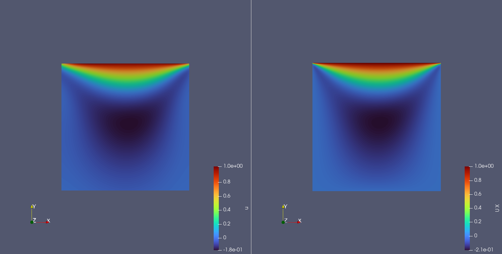
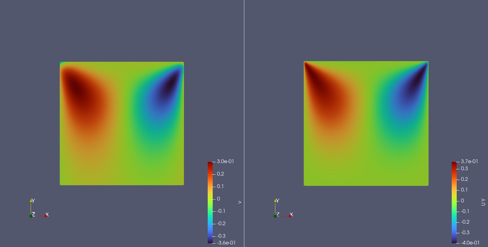
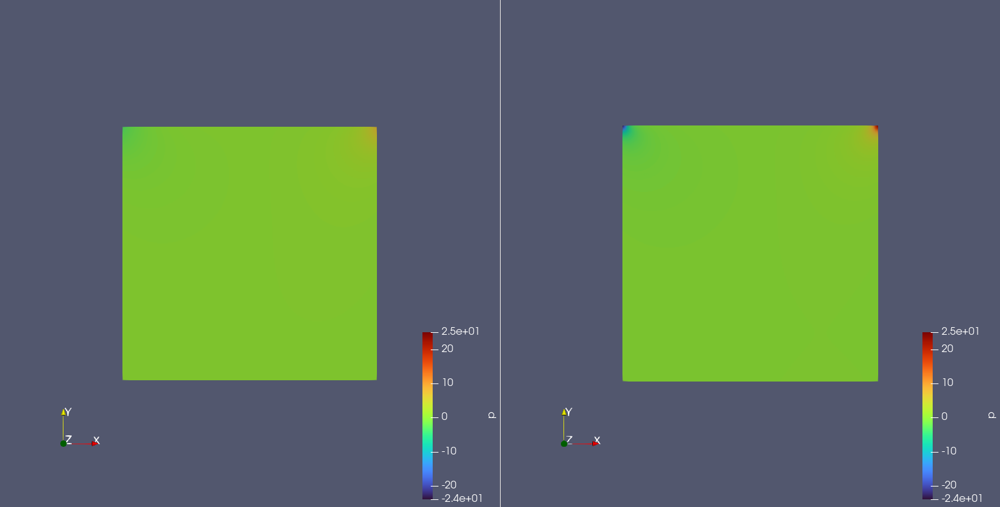

# 2D-LDC(2D Lid Driven Cavity Flow)

## 1. 问题简介

Lid Driven Cavity Flow，中文名称可译作“顶盖驱动方腔流”。一般指顶部平板以恒定速度驱动规则区域内封闭的不可压流体（例如水）的流动，在方腔流的流动中可以观察到几乎所有可能发生在不可压流体中的流动现象。

## 2. 问题定义

质量守恒：

$$
\frac{\partial u}{\partial x} + \frac{\partial v}{\partial y} = 0
$$

$x$ 动量守恒：

$$
\frac{\partial u}{\partial t} + u\frac{\partial u}{\partial x} + v\frac{\partial u}{\partial y} = -\frac{1}{\rho}\frac{\partial p}{\partial x} + \nu(\frac{\partial ^2 u}{\partial x ^2} + \frac{\partial ^2 u}{\partial y ^2})
$$

$y$ 动量守恒：

$$
\frac{\partial v}{\partial t} + u\frac{\partial v}{\partial x} + v\frac{\partial v}{\partial y} = -\frac{1}{\rho}\frac{\partial p}{\partial y} + \nu(\frac{\partial ^2 v}{\partial x ^2} + \frac{\partial ^2 v}{\partial y ^2})
$$

**令：**

$t^* = \frac{L}{U_0}$

$x^*=y^* = L$

$u^*=v^* = U_0$

$p^* = \rho {U_0}^2$

**定义：**

无量纲时间 $\tau = \frac{t}{t^*}$

无量纲坐标 $x：X = \frac{x}{x^*}$；无量纲坐标 $y：Y = \frac{y}{y^*}$

无量纲速度 $x：U = \frac{u}{u^*}$；无量纲速度 $y：V = \frac{v}{u^*}$

无量纲压力 $P = \frac{p}{p^*}$

雷诺数 $Re = \frac{L U_0}{\nu}$

则可获得如下无量纲Navier-Stokes方程：

质量守恒：

$$
\frac{\partial U}{\partial X} + \frac{\partial U}{\partial Y} = 0
$$

$x$ 动量守恒：

$$
\frac{\partial U}{\partial \tau} + U\frac{\partial U}{\partial X} + V\frac{\partial U}{\partial Y} = -\frac{\partial P}{\partial X} + \frac{1}{Re}(\frac{\partial ^2 U}{\partial X^2} + \frac{\partial ^2 U}{\partial Y^2})
$$

$y$ 动量守恒：

$$
\frac{\partial V}{\partial \tau} + U\frac{\partial V}{\partial X} + V\frac{\partial V}{\partial Y} = -\frac{\partial P}{\partial Y} + \frac{1}{Re}(\frac{\partial ^2 V}{\partial X^2} + \frac{\partial ^2 V}{\partial Y^2})
$$

对于矩形边界，则需施加 Dirichlet 边界条件：

上边界：

$$
u=1, v=0
$$

下边界

$$
u=v=0
$$

左边界：

$$
u=v=0
$$

右边界：

$$
u=v=0
$$

## 3. 问题求解

接下来开始讲解如何将问题一步一步地转化为 PaddleScience 代码，用深度学习的方法求解该问题。
为了快速理解 PaddleScience，接下来仅对模型构建、方程构建、计算域构建等关键步骤进行阐述，而其余细节请参考API文档或查看文末的FAQ

### 3.1 模型构建

在 2D-LDC 问题中，对于每一个已知的坐标点 $(t, x, y)$ 都有自身的横向速度 $u$、纵向速度 $v$、压力信息 $p$
三个待求解的未知量，因此我们在这里使用比较简单的 MLP(Multilayer Perceptron, 多层感知机) 来自动对这一过程进行建模
即

$$
u, v, p = f(t, x, y)
$$

上式中 $f$ 即为 MLP 模型本身，用 PaddleScience 代码表示如下

``` py linenums="1"
--8<--
examples/ldc/ldc2d_unsteady_Re10.py:26:29
--8<--
```

为了在计算时，准确快速地访问具体变量的值，我们在这里指定网络模型的输入变量名是 `["t", "x", "y"]`，输出变量名是 `["u", "v", "p"]`，这些命名与后续代码保持一致。

接着通过指定 MLP 的层数、神经元个数以及激活函数，我们就实例化出了一个拥有 9 层隐藏神经元，每层神经元数为 50，使用 "tanh" 作为激活函数的神经网络模型 `model`。

### 3.2 方程构建

由于 2D-LDC 使用的是 Navier-Stokes 方程的2维瞬态形式，因此可以直接使用 PaddleScience 内置的 `NavierStokes`

``` py linenums="1"
--8<--
examples/ldc/ldc2d_unsteady_Re10.py:30:31
--8<--
```

在实例化 `NavierStokes` 类时需指定必要的参数：动力粘度 $\nu=0.01$, 流体密度 $\rho=1.0$

### 3.3 计算域构建

本文中 2D-LDC 问题作用在以 [-0.05, -0.05], [0.05, 0.05] 为对角线的二维矩形区域，且时间域为 16 个时刻 [0.0, 0.1, ..., 1.4, 1.5]
因此可以直接使用 PaddleScience 内置的空间几何 `Rectangle` 和时间域 `TimeDomain`，组合成时间-空间的 `TimeXGeometry` 计算域。

``` py linenums="1"
--8<--
examples/ldc/ldc2d_unsteady_Re10.py:35:41
--8<--
```

???+ tip

    `Rectangle` 和 `TimeDomain` 本身是两种可以单独使用的 Geometry 派生类，如输入数据只来自于空间几何，则可以直接使用 `ppsci.geometry.Rectangle(...)` 构建空间几何域对象；如输入数据只来自时间域，则可以直接使用 `ppsci.geometry.TimeDomain(...)` 构建时间域对象

### 3.4 约束构建

根据 [2. 问题定义](#2) 得到的无量纲公式和和边界条件，对应了在计算域中指导模型训练的两个约束条件，即

1. 施加在矩形内部点上的无量纲 Navier-Stokes 方程约束（经过简单移项）

    $$
    \frac{\partial U}{\partial X} + \frac{\partial U}{\partial Y} = 0
    $$

    $$
    \frac{\partial U}{\partial \tau} + U\frac{\partial U}{\partial X} + V\frac{\partial U}{\partial Y} + \frac{\partial P}{\partial X} - \frac{1}{Re}(\frac{\partial ^2 U}{\partial X^2} + \frac{\partial ^2 U}{\partial Y^2}) = 0
    $$

    $$
    \frac{\partial V}{\partial \tau} + U\frac{\partial V}{\partial X} + V\frac{\partial V}{\partial Y} + \frac{\partial P}{\partial Y} - \frac{1}{Re}(\frac{\partial ^2 V}{\partial X^2} + \frac{\partial ^2 V}{\partial Y^2}) = 0
    $$

    上式左侧的结果分别记为 `continuity`, `momentum_x`, `momentum_y`

2. 施加在矩形上、下、左、右边界上的 Dirichlet 边界条件约束

    $$
    上边界：u=1,v=0
    $$

    $$
    下边界：u=0,v=0
    $$

    $$
    左边界：u=0,v=0
    $$

    $$
    右边界：u=0,v=0
    $$

接下来使用 PaddleScience 内置的 `InteriorConstraint` 和 `BoundaryConstraint` 构建上述两种约束条件

#### 3.4.1 内部点约束

以作用在矩形内部点上的 `InteriorConstraint` 为例，代码如下

``` py linenums="1"
# set constraint
pde_constraint = ppsci.constraint.InteriorConstraint(
    equation["NavierStokes"].equations,
    {"continuity": 0, "momentum_x": 0, "momentum_y": 0},
    geom["time_rect"],
    {**train_dataloader_cfg, **{"batch_size": npoint_pde * ntime_pde}},
    ppsci.loss.MSELoss("sum"),
    evenly=True,
    weight_dict={
        "continuity": 0.0001, # (1)
        "momentum_x": 0.0001, # (2)
        "momentum_y": 0.0001, # (3)
    },
    name="EQ",
)
```

1. 本案例中PDE约束损失的数量级远大于边界约束损失，因此需要给PDE约束权重设置一个较小的值，有利于模型收敛
2. 本案例中PDE约束损失的数量级远大于边界约束损失，因此需要给PDE约束权重设置一个较小的值，有利于模型收敛
3. 本案例中PDE约束损失的数量级远大于边界约束损失，因此需要给PDE约束权重设置一个较小的值，有利于模型收敛

`InteriorConstraint` 的第一个参数是约束方程，用于描述如何计算约束目标，此处填入在 [3.2 方程构建](#32) 章节中实例化好的 `equation["NavierStokes"].equations`；

第二个参数是约束变量的目标值，在本问题中我们希望 Navier-Stokes 方程产生的三个中间结果 `continuity`, `momentum_x`, `momentum_y` 被优化至 0，因此将它们的目标值全部设为 0；

第三个参数是约束方程作用的计算域，此处填入在 [3.3 计算域构建](#33) 章节实例化好的 `geom["time_rect"]` 即可；

第四个参数是在计算域上的采样配置，此处我们使用全量数据点训练，因此 `dataset` 字段设置为 "IterableNamedArrayDataset" 且 `iters_per_epoch` 也设置为 1，采样点数 `batch_size` 设为 9801(模拟99x99的等间隔网格)；

第五个参数是损失函数，此处我们选用常用的MSE函数，且 `reduction` 设置为 `"sum"`，即我们会将参与计算的所有数据点产生的损失项求和；

第六个参数是选择是否在计算域上进行等间隔采样，此处我们选择开启等间隔采样，这样能让训练点均匀分布在计算域上，有利于训练收敛；

第七个参数是权重系数，该配置可以精确调整每一个变量参与损失计算时的权重，设置为 0.0001 是一个比较合适的值；

第八个参数是约束条件的名字，我们需要给每一个约束条件命名，方便后续对其索引。此处我们命名为 "EQ" 即可。

#### 3.4.2 边界约束

同理，我们还需要构建矩形的上、下、左、右四个边界的 Dirichlet 边界约束。但与构建 `InteriorConstraint` 约束不同的是，由于作用区域是边界，因此我们使用 `BoundaryConstraint` 类。

其次约束的目标变量也不同，Dirichlet 条件约束对象是 MLP 模型输出的 $u$ 和 $v$（本文不对 $p$ 做约束），因此第一个参数使用 lambda 表达式直接返回 MLP 的输出结果 `out["u"]` 和 `out["v"]` 作为程序运行时的约束对象。

然后给 $u$ 和 $v$ 设置约束目标值，请注意在 `bc_top` 上边界中，$u$ 的约束目标值要设置为 1。

采样点与损失函数配置和 `InteriorConstraint` 类似，点数设置为 100 左右即可。

由于 `BoundaryConstraint` 默认会在所有边界上进行采样，而我们需要对四个边界分别进行约束，因此需通过设置 `criteria` 参数，进一步细化出四个边界，如上边界就是符合 $y = 0.05$ 的边界点集

```py linenums="1"
--8<--
examples/ldc/ldc2d_unsteady_Re10.py:74:109
--8<--
```

#### 3.4.3 初值约束

最后我们还需要对 $t=t_0$ 时刻的矩形内部点施加 N-S 方程约束，代码如下

``` py linenums="1"
--8<--
examples/ldc/ldc2d_unsteady_Re10.py:110:118
--8<--
```

在微分方程约束、边界约束、初值约束构建完毕之后，以我们刚才的命名为关键字，封装到一个字典中，方便后续访问。

```py linenums="1"
--8<--
examples/ldc/ldc2d_unsteady_Re10.py:119:127
--8<--
```

### 3.4 超参数设定

接下来我们需要指定训练轮数和学习率，此处我们按实验经验，使用两万轮训练轮数和 Cosine 余弦衰减学习率

```py linenums="1"
--8<--
examples/ldc/ldc2d_unsteady_Re10.py:129:136
--8<--
```

### 3.5 优化器构建

训练过程会调用优化器来更新模型参数，此处选择较为常用的 `Adam` 优化器。

```py linenums="1"
--8<--
examples/ldc/ldc2d_unsteady_Re10.py:138:139
--8<--
```

### 3.6 评估器构建

在训练过程中通常会按一定轮数间隔，用验证集（测试集）评估当前模型的训练情况，因此使用 `ppsci.validate.GeometryValidator` 构建评估器

```py linenums="1"
--8<--
examples/ldc/ldc2d_unsteady_Re10.py:141:159
--8<--
```

方程设置与约束构建章节的设置相同，表示如何计算所需评估的目标变量；

此处我们为 `momentum_x`, `continuity`, `momentum_y` 三个目标变量设置标签值为0

计算域与约束构建章节的设置相同，表示在指定计算域上进行评估

采样点配置则需要指定总的评估点数 `total_size`，此处我们设置为 9801(99x99)。

评价指标 `metric` 选择 `ppsci.metric.MSE` 即可。

其余配置与约束构建章节的设置类似

### 3.7 可视化器构建

在模型评估时，如果评估结果是可以可视化的数据，则我们可以选择合适的可视化器来对输出结果进行可视化。

本文中的输出数据是一个区域内的二维点集，每个时刻的坐标是 $(x^t_i,y^t_i)$，对应值是 $(u^t_i, v^t_i)$，因此我们只需要将评估的输出数据按时刻保存成 16 个 **vtu格式** 文件，最后用可视化软件打开查看即可。代码如下

```py linenums="1"
--8<--
examples/ldc/ldc2d_unsteady_Re10.py:161:199
--8<--
```

### 3.8 模型训练、评估与可视化

完成上述设置之后，只需要将上述实例化的对象按顺序传递给 `ppsci.solver.Solver`，然后指定训练日志、模型参数保存目录，最后启动训练、评估、可视化即可

```py linenums="1"
--8<--
examples/ldc/ldc2d_unsteady_Re10.py:201:
--8<--
```

## 4. 完整代码

```py linenums="1" title="ldc2d_steady_Re10.py"
--8<--
examples/ldc/ldc2d_unsteady_Re10.py
--8<--
```

## 5. 结果展示

???+ note

    本案例尚未对模型和训练等方面进行调优，部分展示结果可能与openfoam存在一定差别

<figure markdown>
  
  <figcaption>左：模型预测结果u，右：openfoam结果u</figcaption>
</figure>

<figure markdown>
  
  <figcaption>左：模型预测结果v，右：openfoam结果v</figcaption>
</figure>

<figure markdown>
  
  <figcaption>左：模型预测结果p，右：openfoam结果p</figcaption>
</figure>
