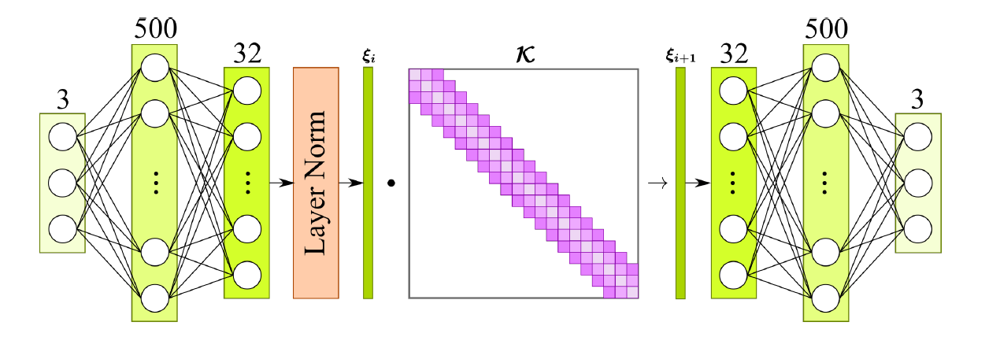
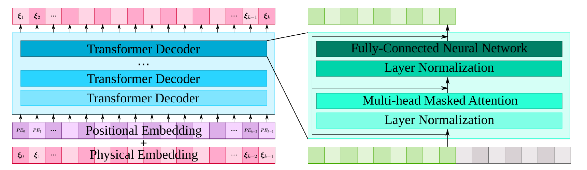

# Lorenz System

## 1. 问题简介

Lorenz System，中文名称可译作“洛伦兹系统”，又称“洛伦兹混沌系统”，最早由美国气象学家爱德华·洛伦兹（Edward N.Lorenz）在1963年的一篇文章中提出。著名的“蝴蝶效应”，即“一只南美洲亚马逊河流域热带雨林中的蝴蝶，偶尔扇动几下翅膀，可以在两周以后引起美国得克萨斯州的一场龙卷风”，也是最早起源于这篇文章。洛伦兹系统对数值扰动极为敏感，是评估机器学习（深度学习）模型准确性的良好基准。

## 2. 问题定义

洛伦兹系统的状态方程：

$$
\frac{\partial x}{\partial t} = \sigma(y - x)
$$

$$
\frac{\partial y}{\partial t} = x(\rho - z) - y
$$

$$
\frac{\partial z}{\partial t} = xy - \beta z
$$

当参数取以下值时，系统表现出经典的混沌特性：

$$\rho = 28, \sigma = 10, \beta = \frac{8}{3}$$

在这个案例中，要求给定初始时刻点的坐标，预测未来一段时间内点的运动轨迹。

## 3. 问题求解

接下来开始讲解如何基于 PaddleScience 代码，用深度学习的方法求解该问题。本案例基于论文[Transformers for Modeling Physical Systems](https://arxiv.org/abs/2010.03957)方法进行求解，接下来首先会对该论文的理论方法进行简单介绍，然后对使用的数据集进行介绍，最后对该方法两个训练步骤（Embedding 模型训练、Transformer 模型训练）的监督约束构建、模型构建等进行阐述，而其余细节请参考 [API文档](../api/arch.md)。

### 3.1 方法介绍

Transformer 结构在NLP、CV领域中取得了巨大的成功，但是其在建模物理系统方面还没有得到更多的探索。在[Transformers for Modeling Physical Systems](https://arxiv.org/abs/2010.03957)这篇文章中，作者提出了基于Transformer的网络结构用于建模物理系统。实验结果表明，提出的方法能够准确的建模不同的动态系统，并且比其他传统的方法更好。

如下图所示，该方法主要包含两个网络模型：Embedding模型和Transformer模型。其中，Embedding模型的Encoder模块负责将物理状态变量进行编码映射为编码向量，Decoder模块则负责将编码向量映射为物理状态变量；Transformer模型作用于编码空间，其输入是Embedding模型Encoder模块的输出，利用当前时刻的编码向量预测下一时刻的编码向量，由预测的编码向量可以通过Embedding模型的Decoder模块得到对应的物理状态变量。在模型训练时，首先训练Embedding模型，然后将Embedding模型的参数冻结训练Transformer模型。关于该方法的详细细节请参考论文[Transformers for Modeling Physical Systems](https://arxiv.org/abs/2010.03957)。

<figure markdown>
  { loading=lazy }
  <figcaption>左：Embedding网络结构，右：Transformer网络结构</figcaption>
</figure>

### 3.2 数据集介绍

数据集采用了[Transformer-Physx](https://github.com/zabaras/transformer-physx)中提供的数据。该数据集中的数据使用龙格－库塔（Runge-Kutta）传统数值求解法求得，每个时间步大小为0.01，初始位置随机从以下的范围中选取：

$$x_{0} \sim(-20, 20), y_{0} \sim(-20, 20), z_{0} \sim(10, 40)$$

数据集的划分如下：

|数据集 |时间序列的数量|时间步的数量|
|:----:|:---------:|:--------:|
|训练集 |2048       |256       |
|验证集 |64         |1024      |
|测试集 |256        |1024      |

该数据集可以从[此处](https://zenodo.org/record/5148524#.ZDe77-xByrc)下载。

### 3.2 Embedding模型

首先将代码中定义的各个参数变量展示如下，每个参数的具体含义会在下面使用到时进行解释。

``` py linenums="41" title="examples/lorenz/train_enn_v2.py"
--8<--
examples/lorenz/train_enn_v2.py:41:52
--8<--
```

#### 3.2.1 约束构建

本案例基于数据驱动的方法求解问题，因此需要使用PaddleScience内置的 `SupervisedConstraint` 构建监督约束。在定义约束之前，需要首先指定监督约束中用于数据加载的各个参数，代码如下：

``` py linenums="56" title="examples/lorenz/train_enn_v2.py"
--8<--
examples/lorenz/train_enn_v2.py:56:72
--8<--
```

其中，"dataset" 字段定义了使用的 `Dataset` 类名为 `LorenzDataset`，另外还指定了该类初始化时参数的取值：

1.  `file_path`：代表训练数据集的文件路径，指定为变量`train_file_path`的值。
2.  `block_size`：代表使用多长的时间步进行训练，指定为变量`train_block_size`的值。
3.  `stride`：代表连续的两个训练样本之间的时间步间隔，指定为16。

"sampler" 字段定义了使用的 `Sampler` 类名为 `BatchSampler`，，另外还指定了该类初始化时参数 `drop_last`、`shuffle`均为`True`。

`train_dataloader` 还定义了`batch_size`、`num_workers`、`use_shared_memory`的值。

定义监督约束的代码如下：

``` py linenums="74" title="examples/lorenz/train_enn_v2.py"
--8<--
examples/lorenz/train_enn_v2.py:74:86
--8<--
```

`SupervisedConstraint` 的第一个参数是训练数据集的文件路径，此处填入变量`train_file_path`；

第二个参数是输入数据的变量名称，此处填入变量`input_keys`；

第三个参数是模型输出的变量名称，因为在本案例中需要额外对模型的Koopman矩阵进行约束，因此在训练时需要额外输出该变量，此处填入变量`output_keys`与`regularization_key`；

第四个参数此处没有用到，传入空字典；

第五个参数是数据的加载方式，这里使用上文中定义的`train_dataloader`；

第六个参数是损失函数的定义，这里使用带有L2Decay的MSELoss，类名为`MSELossWithL2Decay`，`regularization_dict`设置了正则化的变量名称和对应的权重；

第七个参数定义了模型输出各个变量与真实标签损失函数的权重；

第八个参数是约束条件的名字，方便后续对其索引。此处命名为 "Sup"。

#### 3.2.2 模型构建

在该案例中，Embedding模型的输入输出都是物理空间中点的位置坐标$(x, y, z)$，使用了全连接层实现Embedding模型，如下图所示。

<figure markdown>
  { loading=lazy }
  <figcaption>Embedding网络模型</figcaption>
</figure>

用PaddleScience代码表示如下：

``` py linenums="91" title="examples/lorenz/train_enn_v2.py"
--8<--
examples/lorenz/train_enn_v2.py:91:95
--8<--
```

其中，`LorenzEmbedding`的前两个参数在前文中已有描述，这里不再赘述，网络模型的第三、四个参数是训练数据集的均值和方差，用于归一化输入数据。计算均值、方差的的代码表示如下：

``` py linenums="28" title="examples/lorenz/train_enn_v2.py"
--8<--
examples/lorenz/train_enn_v2.py:28:35
--8<--
```

#### 3.2.3 学习率与优化器构建

本案例中使用的学习率方法为`ExponentialDecay`，学习率大小设置为0.001。优化器使用`Adam`，梯度裁剪使用了Paddle内置的`ClipGradByGlobalNorm`方法。用PaddleScience代码表示如下

``` py linenums="97" title="examples/lorenz/train_enn_v2.py"
--8<--
examples/lorenz/train_enn_v2.py:97:111
--8<--
```

#### 3.2.4 评估器构建

本案例训练过程中会按照一定的训练轮数间隔，使用验证集评估当前模型的训练情况，需要使用`SupervisedValidator`构建评估器。代码如下：

``` py linenums="113" title="examples/lorenz/train_enn_v2.py"
--8<--
examples/lorenz/train_enn_v2.py:113:141
--8<--
```

`SupervisedValidator`评估器与`SupervisedConstraint`比较相似，不同的是评估器需要设置评价指标`metric`，在这里使用`ppsci.metric.MSE` 。

#### 3.2.5 模型训练与评估
完成上述设置之后，只需要将上述实例化的对象按顺序传递给 `ppsci.solver.Solver`，然后启动训练、评估。

``` py linenums="143" title="examples/lorenz/train_enn_v2.py"
--8<--
examples/lorenz/train_enn_v2.py:143:167
--8<--
```

### 3.3 Transformer模型

上文介绍了如何构建Embedding模型的训练、评估，在本节中将介绍如何使用训练好的Embedding模型训练Transformer模型。因为训练Transformer模型的步骤与训练Embedding模型的步骤基本相似，因此本节在两者的重复部分的各个参数不再详细介绍。首先将代码中定义的各个参数变量展示如下，每个参数的具体含义会在下面使用到时进行解释。

``` py linenums="58" title="examples/lorenz/train_transformer_v2.py"
--8<--
examples/lorenz/train_transformer_v2.py:58:75
--8<--
```

#### 3.3.1 约束构建
Transformer模型同样基于数据驱动的方法求解问题，因此需要使用PaddleScience内置的 `SupervisedConstraint` 构建监督约束。在定义约束之前，需要首先指定监督约束中用于数据加载的各个参数，代码如下：

``` py linenums="79" title="examples/lorenz/train_transformer_v2.py"
--8<--
examples/lorenz/train_transformer_v2.py:79:99
--8<--
```

数据加载的各个参数与Embedding 模型中的基本一致，不再赘述。需要说明的是由于Transformer模型训练的输入数据是Embedding模型Encoder模块的输出数据，因此我们将训练好的Embedding模型作为`LorenzDataset`的一个参数，在初始化时首先将训练数据映射到编码空间。

定义监督约束的代码如下：

``` py linenums="101" title="examples/lorenz/train_transformer_v2.py"
--8<--
examples/lorenz/train_transformer_v2.py:101:111
--8<--
```

#### 3.3.2 模型构建
在该案例中，Transformer模型的输入输出都是编码空间中的向量，使用的Transformer结构如下：

<figure markdown>
  { loading=lazy }
  <figcaption>Transformer网络模型</figcaption>
</figure>

用PaddleScience代码表示如下：

``` py linenums="116" title="examples/lorenz/train_transformer_v2.py"
--8<--
examples/lorenz/train_transformer_v2.py:116:124
--8<--
```

类 `PhysformerGPT2` 除了需要填入`input_keys` `output_keys` 外，还需要设置Transformer模型的层数 `num_layers`、上下文的大小`num_ctx`、输入的Embedding向量的长度`embed_size`、多头注意力机制的参数`num_heads`，在这里填入的数值为4，64，32，4。

#### 3.3.3 学习率与优化器构建

本案例中使用的学习率方法为`CosineWarmRestarts`，学习率大小设置为0.001。优化器使用`Adam`，梯度裁剪使用了Paddle内置的`ClipGradByGlobalNorm`方法。用PaddleScience代码表示如下：

``` py linenums="126" title="examples/lorenz/train_transformer_v2.py"
--8<--
examples/lorenz/train_transformer_v2.py:126:140
--8<--
```

#### 3.3.4 评估器构建

训练过程中会按照一定的训练轮数间隔，使用验证集评估当前模型的训练情况，需要使用`SupervisedValidator`构建评估器。用PaddleScience代码表示如下：

``` py linenums="142" title="examples/lorenz/train_transformer_v2.py"
--8<--
examples/lorenz/train_transformer_v2.py:142:170
--8<--
```

#### 3.3.5 可视化器构建

本案例中可以通过构建可视化器在模型评估时将评估结果可视化出来，由于Transformer模型的输出数据是预测的编码空间的数据无法直接进行可视化，因此需要额外将输出数据使用Embedding网络的Decoder模块变换到物理状态空间。

在本文中首先定义了对Transformer模型输出数据变换到物理状态空间的代码：

``` py linenums="31" title="examples/lorenz/train_transformer_v2.py"
--8<--
examples/lorenz/train_transformer_v2.py:31:49
--8<--
```

``` py linenums="79" title="examples/lorenz/train_transformer_v2.py"
--8<--
examples/lorenz/train_transformer_v2.py:79:80
--8<--
```

可以看到，程序首先载入了训练好的Embedding模型，然后在`OutputTransform`的`__call__`函数内实现了编码向量到物理状态空间的变换。

在定义好了以上代码之后，就可以实现可视化器代码的构建了：

``` py linenums="172" title="examples/lorenz/train_transformer_v2.py"
--8<--
examples/lorenz/train_transformer_v2.py:172:190
--8<--
```

首先使用上文中的mse_validator中的数据集进行可视化，另外还引入了`vis_data_nums`变量用于控制需要可视化样本的数量。最后通过`VisualizerScatter3D`构建可视化器。

#### 3.3.5 模型训练、评估与可视化
完成上述设置之后，只需要将上述实例化的对象按顺序传递给 `ppsci.solver.Solver`，然后启动训练、评估。

``` py linenums="192" title="examples/lorenz/train_transformer_v2.py"
--8<--
examples/lorenz/train_transformer_v2.py:192:222
--8<--
```

## 4. 完整代码

``` py linenums="1" title="lorenz/train_enn_v2.py"
--8<--
examples/lorenz/train_enn_v2.py
--8<--
```

``` py linenums="1" title="lorenz/train_transformer_v2.py"
--8<--
examples/lorenz/train_transformer_v2.py
--8<--
```

## 5. 结果展示

<figure markdown>
  { loading=lazy }
  <figcaption>模型预测结果（"pred_states"）与传统数值微分结果（"states"）</figcaption>
</figure>

<figure markdown>
  { loading=lazy }
  <figcaption>模型预测结果（"pred_states"）与传统数值微分结果（"states"）</figcaption>
</figure>
