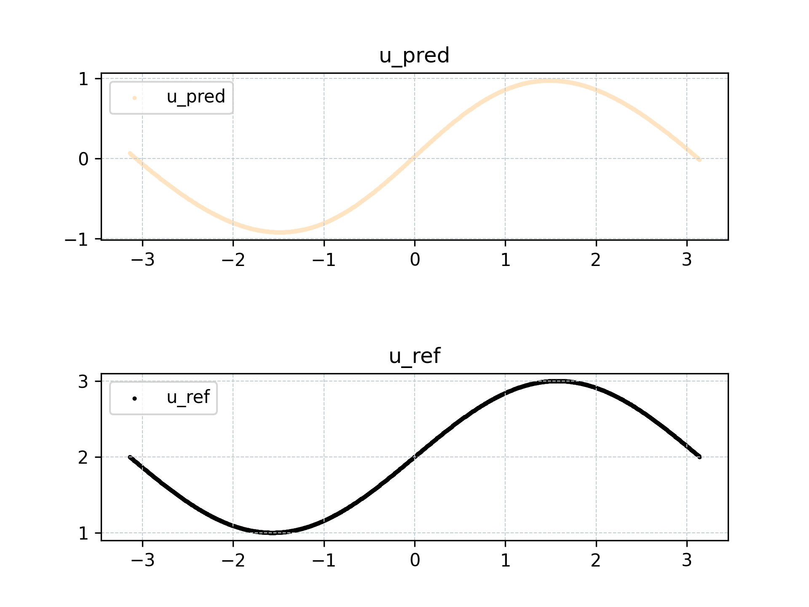
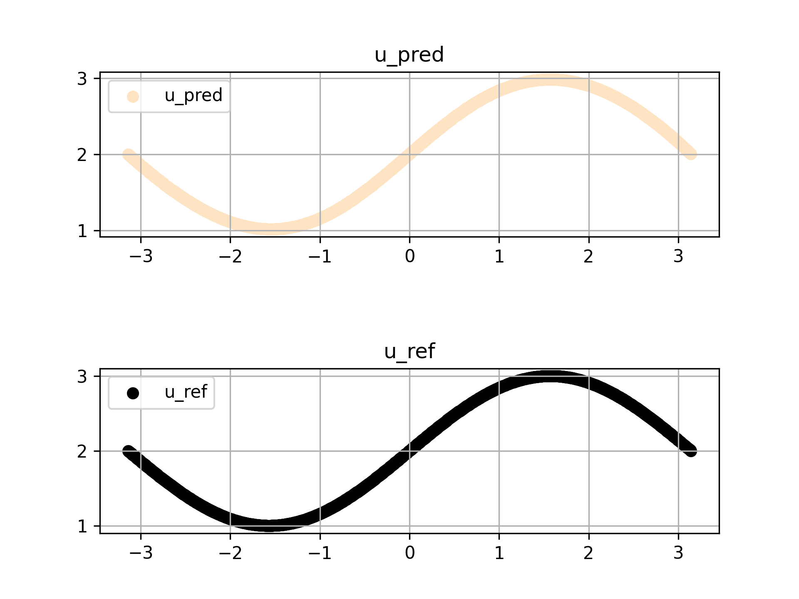

# 快速开始

<a href="https://aistudio.baidu.com/projectdetail/6665190?contributionType=1&sUid=438690&shared=1&ts=1692616326196" class="md-button md-button--primary" style>AI Studio快速体验</a>

本文通过一个简单的 demo 及其扩展问题，介绍如何使用 PaddleScience 训练模型，解决一类方程学习与预测问题，并可视化预测结果。

## 1. 问题简介

假设我们希望用神经网络模型去拟合 $x \in [-\pi, \pi]$ 区间内，$u=\sin(x)$ 这一函数。在拟合函数已知和未知两种情形下，如何去尽可能地准确拟合 $u=\sin(x)$。

第一种场景下，假设已知目标函数 $u$ 的解析解就是 $u=\sin(x)$，我们采用监督训练的思路，直接用该公式生成标签因变量 $u$，与自变量 $x$ 共同作为监督数据对模型进行训练。

第二种场景下，假设不知道目标函数 $u$ 的解析解，但我们知道其满足某种微分关系，我们这里以其中一个满足条件的微分方程 $\dfrac{\partial u} {\partial x}=\cos(x)$ 为例，介绍如何生成数据进行训练。

## 2. 场景一

目标拟合函数：

$$
u=\sin(x), x \in [-\pi, \pi].
$$

我们生成 $N$ 组数据对 $(x_i, u_i), i=1,...,N$ 作为监督数据进行训练即可。

在撰写代码之前，我们首先导入必要的包。

``` py linenums="1"
--8<--
examples/quick_start/case1.py:1:4
--8<--
```

然后创建日志和模型保存目录供训练过程记录和保存使用，这一步是绝大部分案例在正式开始前都需要进行的操作。

``` py linenums="6"
--8<--
examples/quick_start/case1.py:6:13
--8<--
```

接下来正式开始撰写代码。

首先定义问题区间，我们使用 `ppsci.geometry.Interval` 定义一个线段几何形状，方便后续在该线段上对 $x$ 进行采样。

``` py linenums="15"
--8<--
examples/quick_start/case1.py:15:17
--8<--
```

然后定义一个简单的 3 层 MLP 模型。

``` py linenums="19"
--8<--
examples/quick_start/case1.py:19:20
--8<--
```

上述代码表示模型接受自变量 $x$ 作为输入，输出预测结果 $\hat{u}$

然后我们定义已知的 $u=\sin(x)$ 计算函数，作为 `ppsci.constraint.InteriorConstraint` 的参数，用于计算标签数据，`InteriorConstraint` 表示以给定的几何形状或数据集中的数据作为输入，联合给定的标签数据，指导模型进行优化。

``` py linenums="22"
--8<--
examples/quick_start/case1.py:22:47
--8<--
```

此处的 `interior_constraint` 表示一个训练目标，即我们希望在 $[-\pi, \pi]$ 这段区间内，优化模型让模型的预测结果 $\hat{u}$ 尽可能地接近它的标签值 $u$。

接下来就可以开始定义模型训练相关的内容，比如训练轮数、优化器、可视化器。

``` py linenums="48"
--8<--
examples/quick_start/case1.py:48:66
--8<--
```

最后将上述定义的对象传递给训练调度类 `Solver`，即可开始模型训练

``` py linenums="67"
--8<--
examples/quick_start/case1.py:67:79
--8<--
```

训练完毕后再用刚才取的 1000 个点与标准解计算 L2-相对误差

``` py linenums="81"
--8<--
examples/quick_start/case1.py:81:86
--8<--
```

再对这 1000 个点的预测结果进行可视化

``` py linenums="88"
--8<--
examples/quick_start/case1.py:88:89
--8<--
```

训练记录下所示

``` log
...
...
ppsci INFO: [Train][Epoch  9/10][Iter  80/100] lr: 0.00200, loss: 0.00663, EQ: 0.00663, batch_cost: 0.00180s, reader_cost: 0.00011s, ips: 17756.64, eta: 0:00:00
ppsci INFO: [Train][Epoch  9/10][Iter  90/100] lr: 0.00200, loss: 0.00598, EQ: 0.00598, batch_cost: 0.00180s, reader_cost: 0.00011s, ips: 17793.97, eta: 0:00:00
ppsci INFO: [Train][Epoch  9/10][Iter 100/100] lr: 0.00200, loss: 0.00547, EQ: 0.00547, batch_cost: 0.00179s, reader_cost: 0.00011s, ips: 17864.08, eta: 0:00:00
ppsci INFO: [Train][Epoch 10/10][Iter  10/100] lr: 0.00200, loss: 0.00079, EQ: 0.00079, batch_cost: 0.00182s, reader_cost: 0.00012s, ips: 17547.05, eta: 0:00:00
ppsci INFO: [Train][Epoch 10/10][Iter  20/100] lr: 0.00200, loss: 0.00075, EQ: 0.00075, batch_cost: 0.00183s, reader_cost: 0.00011s, ips: 17482.92, eta: 0:00:00
ppsci INFO: [Train][Epoch 10/10][Iter  30/100] lr: 0.00200, loss: 0.00077, EQ: 0.00077, batch_cost: 0.00182s, reader_cost: 0.00011s, ips: 17539.51, eta: 0:00:00
ppsci INFO: [Train][Epoch 10/10][Iter  40/100] lr: 0.00200, loss: 0.00074, EQ: 0.00074, batch_cost: 0.00182s, reader_cost: 0.00011s, ips: 17587.51, eta: 0:00:00
ppsci INFO: [Train][Epoch 10/10][Iter  50/100] lr: 0.00200, loss: 0.00071, EQ: 0.00071, batch_cost: 0.00182s, reader_cost: 0.00011s, ips: 17563.59, eta: 0:00:00
ppsci INFO: [Train][Epoch 10/10][Iter  60/100] lr: 0.00200, loss: 0.00070, EQ: 0.00070, batch_cost: 0.00182s, reader_cost: 0.00011s, ips: 17604.60, eta: 0:00:00
ppsci INFO: [Train][Epoch 10/10][Iter  70/100] lr: 0.00200, loss: 0.00074, EQ: 0.00074, batch_cost: 0.00181s, reader_cost: 0.00011s, ips: 17699.28, eta: 0:00:00
ppsci INFO: [Train][Epoch 10/10][Iter  80/100] lr: 0.00200, loss: 0.00077, EQ: 0.00077, batch_cost: 0.00180s, reader_cost: 0.00011s, ips: 17764.92, eta: 0:00:00
ppsci INFO: [Train][Epoch 10/10][Iter  90/100] lr: 0.00200, loss: 0.00075, EQ: 0.00075, batch_cost: 0.00180s, reader_cost: 0.00011s, ips: 17795.87, eta: 0:00:00
ppsci INFO: [Train][Epoch 10/10][Iter 100/100] lr: 0.00200, loss: 0.00071, EQ: 0.00071, batch_cost: 0.00179s, reader_cost: 0.00011s, ips: 17872.00, eta: 0:00:00
```

训练完毕后再用刚才取的 1000 个点与标准解计算 L2-相对误差

``` py linenums="81"
--8<--
examples/quick_start/case1.py:81:86
--8<--
```

可以看到利用标准解监督训练模型，在标准解附近仍有很好的预测能力，L2-相对误差为 0.02677。

预测结果可视化如下所示



场景一的完整代码如下所示

``` py linenums="1" title="examples/quick_start/case1.py"
--8<--
examples/quick_start/case1.py
--8<--
```

## 3. 场景二

可以看到场景一的监督训练方式能较好地解决函数拟合问题，但一般情况下我们是无法得知拟合函数本身的解析式的，因此也无法直接构造因变量的监督数据。

虽然无法求出解析式直接构造监督数据，但往往可以利用相关数学知识，推导出目标拟合函数符合的某种数学关系，以训练模型以满足这种数学关系的方式，达到以“间接监督”的方式优化模型的目的。

假设我们不再使用 $u=\sin(x)$ 这一先验公式，因而无法计算标签数据 $u$。因此我们使用如下方程组，其含有一个偏微分方程和边界条件

$$
\begin{cases}
\begin{aligned}
    \dfrac{\partial u} {\partial x} &= \cos(x) \\
    u(-\pi) &= 2
\end{aligned}
\end{cases}
$$

构造数据对 $(x_i, \cos(x_i)), i=1,...,N$。
这意味着我们仍然能保持模型的输入、输出不变，但优化目标变成了：让 $\dfrac{\partial \hat{u}} {\partial x}$ 尽可能地接近 $\cos(x)$，且 $\hat{u}(-\pi)$ 也要尽可能地接近 $2$。

基于以上理论，我们对场景一的代码进行少量的改写即可得到本场景二的代码。

首先由于我们需要使用一阶微分这一操作，因此在代码开头处需导入一阶微分 API

``` py linenums="1" hl_lines="2"
--8<--
examples/quick_start/case2.py:1:5
--8<--
```

然后在原来的标签计算函数下方，新增一个微分标签值计算函数

``` py linenums="28" hl_lines="4"
--8<--
examples/quick_start/case2.py:28:30
--8<--
```

接着将 `interior_constraint` 这一约束条件从约束“模型输出”，改为约束“模型输出对输入的一阶微分”

``` py linenums="33" hl_lines="4"
--8<--
examples/quick_start/case2.py:33:49
--8<--
```

考虑到一般情况下偏微分方程的解会存在待定系数，需通过定解条件（初（边）值条件）来确定，因此需要在 `interior_constraint` 构建代码的后面，额外添加一个边界条件约束 `bc_constraint`，如下所示

``` py linenums="50"
--8<--
examples/quick_start/case2.py:50:65
--8<--
```

1. 对应边界条件 $u(x_0)=sin(x_0)+2$

然后将该边界约束 `bc_constraint` 添加到 `constraint` 中

``` py linenums="66" hl_lines="4"
--8<--
examples/quick_start/case2.py:66:70
--8<--
```

同样地，修改 Visualizer 绘制的标准解为 $sin(x)+2$

``` py linenums="77" hl_lines="5"
--8<--
examples/quick_start/case2.py:77:89
--8<--
```

修改完毕后执行训练

``` py linenums="91"
--8<--
examples/quick_start/case2.py:91:102
--8<--
```

训练日志如下所示

``` log
...
...
ppsci INFO: [Train][Epoch  9/10][Iter  90/100] lr: 0.00200, loss: 0.00176, EQ: 0.00087, BC: 0.00088, batch_cost: 0.00346s, reader_cost: 0.00024s, ips: 9527.80, eta: 0:00:00
ppsci INFO: [Train][Epoch  9/10][Iter 100/100] lr: 0.00200, loss: 0.00170, EQ: 0.00087, BC: 0.00083, batch_cost: 0.00349s, reader_cost: 0.00024s, ips: 9452.07, eta: 0:00:00
ppsci INFO: [Train][Epoch 10/10][Iter  10/100] lr: 0.00200, loss: 0.00107, EQ: 0.00072, BC: 0.00035, batch_cost: 0.00350s, reader_cost: 0.00025s, ips: 9424.75, eta: 0:00:00
ppsci INFO: [Train][Epoch 10/10][Iter  20/100] lr: 0.00200, loss: 0.00116, EQ: 0.00083, BC: 0.00033, batch_cost: 0.00350s, reader_cost: 0.00025s, ips: 9441.33, eta: 0:00:00
ppsci INFO: [Train][Epoch 10/10][Iter  30/100] lr: 0.00200, loss: 0.00103, EQ: 0.00079, BC: 0.00024, batch_cost: 0.00355s, reader_cost: 0.00025s, ips: 9291.90, eta: 0:00:00
ppsci INFO: [Train][Epoch 10/10][Iter  40/100] lr: 0.00200, loss: 0.00108, EQ: 0.00078, BC: 0.00030, batch_cost: 0.00353s, reader_cost: 0.00025s, ips: 9348.09, eta: 0:00:00
ppsci INFO: [Train][Epoch 10/10][Iter  50/100] lr: 0.00200, loss: 0.00163, EQ: 0.00082, BC: 0.00082, batch_cost: 0.00350s, reader_cost: 0.00024s, ips: 9416.24, eta: 0:00:00
ppsci INFO: [Train][Epoch 10/10][Iter  60/100] lr: 0.00200, loss: 0.00160, EQ: 0.00083, BC: 0.00077, batch_cost: 0.00353s, reader_cost: 0.00024s, ips: 9345.73, eta: 0:00:00
ppsci INFO: [Train][Epoch 10/10][Iter  70/100] lr: 0.00200, loss: 0.00150, EQ: 0.00082, BC: 0.00068, batch_cost: 0.00351s, reader_cost: 0.00024s, ips: 9393.89, eta: 0:00:00
ppsci INFO: [Train][Epoch 10/10][Iter  80/100] lr: 0.00200, loss: 0.00146, EQ: 0.00081, BC: 0.00064, batch_cost: 0.00350s, reader_cost: 0.00024s, ips: 9424.81, eta: 0:00:00
ppsci INFO: [Train][Epoch 10/10][Iter  90/100] lr: 0.00200, loss: 0.00138, EQ: 0.00081, BC: 0.00058, batch_cost: 0.00349s, reader_cost: 0.00024s, ips: 9444.12, eta: 0:00:00
ppsci INFO: [Train][Epoch 10/10][Iter 100/100] lr: 0.00200, loss: 0.00133, EQ: 0.00079, BC: 0.00054, batch_cost: 0.00349s, reader_cost: 0.00024s, ips: 9461.54, eta: 0:00:00
```

训练完毕后再用刚才取的 1000 个点与标准解计算 L2-相对误差

``` py linenums="104"
--8<--
examples/quick_start/case2.py:104:109
--8<--
```

可以看到利用微分方程训练的模型，在标准解附近仍有很好的预测能力，L2-相对误差为 0.00564。

预测结果可视化如下所示



可以发现利用微分关系训练的模型仍然具备良好的预测能力，并且结合定解条件，能学习出同时符合微分方程和定解条件的正确解模型。

场景二的完整代码如下所示

``` py linenums="1"
--8<--
examples/quick_start/case2.py
--8<--
```
