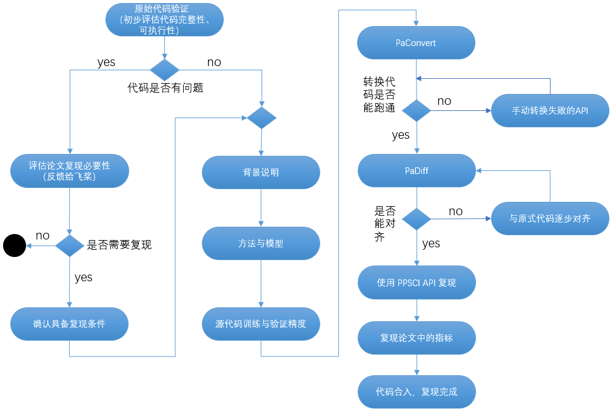

# 模型复现流程及验收标准

本文档介绍如何基于 PaddleScience 套件进行模型复现并最终贡献到 PaddleScience 套件中

## 1. 背景说明

### 1.1 复现目标

在 AI for Science (以下简称 AI4S) 领域的模型复现任务中，通常需要对标准论文中的原始代码基于飞桨进行复现，同时也可能会涉及一些开放性的任务，如会提供建设目标，选手自行使用飞桨进行全部代码的创建。围绕以上任务，制定如下模型复现流程、验收标准与方法，其中**每个阶段的每个过程均需要形成对应的说明文档**。

### 1.2 飞桨与 PaddleScience

除特殊说明外，模型复现默认要求基于 PaddleScience

- PaddleScience

    基于飞桨的 AI4S 套件，提供面向 AI4S 领域通用功能，如复杂几何形状解析、通用微分方程、数据驱动/物理机理/数理融合等求解器，方便开发 AI4S 领域相关模型，具体参考 [PaddleScience 文档](https://paddlescience-docs.readthedocs.io/zh/latest/)

- 飞桨PaddlePaddle

    国产开源深度学习平台，提供面向深度学习的基础功能与通用API，方便开发深度学习模型，具体参考 [Paddle API 文档](https://www.paddlepaddle.org.cn/documentation/docs/zh/develop/api/index_cn.html)

## 2. 复现步骤

优先基于 PaddleScience 复现，如复现代码的实现逻辑和 PaddleScience 存在严重冲突，可考虑使用 PaddlePaddle API 复现。



### 2.1 基准论文理解、原始代码跑通、论文结果复现

该阶段需选手认真理解原始论文与提供的代码，并按照背景、方法与模型、训练与验证、结果、展望与致谢等分章节说明论文。过程中需要验证论文提供的代码，确认代码完整且可执行，且能够得到论文中列出的结果。 **此部分主要目的是为了其他用户更好的理解该复现工作的意义*- 。关键示意如下：

1. 原始代码验证

    初步对照基准论文中提供的结果，评估提供的代码是否完整、可执行，具体为：

    - 若有问题，则需要与飞桨团队反馈论文问题，由飞桨团队评估论文/模型复现的必要性，若该论文/模型价值较高，且具备了复现的条件后，则可重新进入复现流程；
    - 若无问题，则正式进入论文/模型的复现阶段

2. 背景说明

    结合给定的论文，需解释论文描述的领域问题（eg. 流体、材料等）、介绍自己的复现/开发工作，即对基准论文中摘要、简介有完整的介绍（开放课题则描述该课题的背景），之后对论文的方法，应用的模型进行说明。

3. 方法与模型

    解释基准论文所用到的理论、方法以及所用网络模型的原理等，即对论文的核心技术部分进行说明，同时说明论文中该方法、模型所体现的价值（或相对于传统求解方法的优势等）。

4. 训练与验证

    对基准论文中提供的典型案例，整体说明案例的原理（eg. 流体 N-S 方程求解）、说明训练的过程（如数据集来源、内容，超参数设定，硬件环境及训练时间等）。

### 2.2 基于 PaddleScience 的代码复现

1. 如果源代码使用 pytorch 实现，可优先使用 [PaConvert](https://github.com/PaddlePaddle/PaConvert#%E6%9C%80%E8%BF%91%E6%9B%B4%E6%96%B0) 一键自动转换 pytorch 代码为 paddle 代码，配合 [PaDiff](https://github.com/PaddlePaddle/PaDiff#%E7%AE%80%E4%BB%8B) 验证转换前后模型的精度对齐情况；如果源代码使用非 pytorch 实现（如 tensorflow），则需要列出需要基于飞桨复现的 API，同时需要形成 API 映射表，基于该映射表手动转换 tensorflow API 为 paddle API，若飞桨缺少对应的API可着重说明。

2. 飞桨代码跑通

    完成基于 API 复现后，需要结合论文中的模型，实现基于飞桨的代码跑通，并针对前反向使能能对齐使用 PaDiff 工具进行迭代、修正（如可能需要与原始代码逐步对齐）。

3. 飞桨代码转换成 PaddleScience 代码

    提高代码复用性和简洁性，需要将 Paddle 实现转换成 PaddleScience 套件提供的 API 实现，PaddleScience 提供了面向 AI4S 领域通用功能。具体流程请参考：[PaddleScience 开发指南](./development.md)

4. 复现论文中指标结果

    结合论文中提到的典型 demo，进行关键指标复现，即能够基于飞桨复现论文中的指标，如图表、数据等，其收敛趋势、数值等应基本一致（与作者提供指标的相对误差在 ±10% 以内即可）

5. 代码合入，完成复现

    若以上活动均完全达成，则可以将论文/模型复现的代码按照下文中“代码规范”的要求，提交 PR 合入到指定的 Repo，通过评审后即可认为完成 90% 的复现工作，并可进行验收。

## 3 验收标准

### 3.1 交付产物列表

| 产物 | 具体内容 |
| ----- | ---- |
| 模型 | 基于 PaddleScience 复现的代码、模型预训练参数 |
| 文档     | AIStudio 文档、PaddleScience 文档 |

### 3.2 具体评估标准

#### 3.2.1 模型正确性评估

定性分析：模型收敛曲线、最终效果图示与论文能够保持一致
定量分析：如果论文包含定量指标，则复现指标与论文指标相对误差需满足： $\dfrac{|复现指标-源代码指标|}{源代码指标} \le 10\%$

#### 3.2.2 代码规范

整体代码规范遵循 PEP8 [https://peps.python.org/pep-0008/](https://peps.python.org/pep-0008/) ，除此之外需要注意：

- 文件和文件夹命名中，尽量使用下划线 `_` 代表空格，不要使用 `-`。
- 模型定义过程中，需要有一个统一的变量（parameter）命名管理手段，如尽量手动声明每个变量的名字并支持名称可变，禁止将名称定义为一个常数（如 "embedding"），避免在复用代码阶段出现各种诡异的问题。
- 重要文件，变量的名称定义过程中需要能够通过名字表明含义，禁止使用含混不清的名称，如 net.py, aaa.py 等。
- 在代码中定义文件(夹)路径时，需要使用 `os.path.join` 完成，禁止使用 `string` 相加的方式，这会导致模型对 `windows` 环境缺乏支持。
- 对于代码中重要的部分，需要加入注释介绍功能，帮助用户快速熟悉代码结构，包括但不仅限于：

  - Dataset、DataLoader的定义。
  - 整个模型定义，包括input，运算过程，loss等内容。
  - init，save，load，等io部分。
  - 运行中间的关键状态，如print loss，save model等。
- 一个比较符合代码规范的例子如下。

    ``` py
    from paddle import io
    from paddle.vision import transforms as T
    from PIL import Image
    import numpy as np


    IMAGE_SIZE = 256


    class PetDataset(io.Dataset):
        """
        Pet 数据集定义
        """

        def __init__(self, mode="train"):
            """
            构造函数
            """
            if mode not in ["train", "test", "predict"]:
                raise ValueError(
                    f"mode should be 'train' or 'test' or 'predict', but got {mode}"
                )
            self.image_size = IMAGE_SIZE
            self.mode = mode
            self.train_images = []
            self.label_images = []
            with open(f"./{self.mode}.txt", "r") as f:
                for line in f.readlines():
                    image, label = line.strip().split("\t")
                    self.train_images.append(image)
                    self.label_images.append(label)

        def _load_img(self, path, color_mode="rgb", transforms=[]):
            """
            统一的图像处理接口封装，用于规整图像大小和通道
            """
            img = Image.open(path)
            if color_mode == "grayscale":
                # if image is not already an 8-bit, 16-bit or 32-bit grayscale image
                # convert it to an 8-bit grayscale image.
                if img.mode not in ("L", "I;16", "I"):
                    img = img.convert("L")
            elif color_mode == "rgba":
                if img.mode != "RGBA":
                    img = img.convert("RGBA")
            elif color_mode == "rgb":
                if img.mode != "RGB":
                    img = img.convert("RGB")
            else:
                raise ValueError(
                    f"color_mode should be 'grayscale', 'rgb', or 'rgba', but got {color_mode}"
                )
            return T.Compose([T.Resize(self.image_size)] + transforms)(img)

        def __getitem__(self, idx):
            """
            返回 image, label
            """
            train_image = self._load_img(
                self.train_images[idx],
                transforms=[T.Transpose(), T.Normalize(mean=127.5, std=127.5)],
            )  # 加载原始图像
            label_image = self._load_img(
                self.label_images[idx], color_mode="grayscale", transforms=[T.Grayscale()]
            )  # 加载Label图像
            # 返回image, label
            train_image = np.array(train_image, dtype="float32")
            label_image = np.array(label_image, dtype="int64")
            return train_image, label_image

        def __len__(self):
            """
            返回数据集总数
            """
            return len(self.train_images)
    ```

- 提供的代码能正常跑通训练、评估。

#### 3.2.3 文档规范

AIStudio 文档参考：[PaddleScience-DarcyFlow - 飞桨AI Studio](https://aistudio.baidu.com/aistudio/projectdetail/6184070)

PaddleScience 官网文档需满足：

- 复现完成后需撰写模型文档，需包含模型简介、问题定义、问题求解（逐步讲解训练评估以及可视化代码的编写过程）、完整代码、结果展示图等章节。
- 在文档的开始，需要添加复现的论文题目、论文地址以及参考代码的链接，同时建议对参考代码的作者表示感谢。
- 代码封装得当，易读性好，不用一些随意的变量/类/函数命名。
- 注释清晰，不仅说明做了什么，也要说明为什么这么做。
- 如果模型依赖 PaddlePaddle 未涵盖的依赖（如 pandas），则需要在文档开头对说明需安装哪些依赖项。
- 随机控制，需要尽量固定含有随机因素模块的随机种子，保证模型可以正常复现（PaddleScience 套件提供了 `ppsci.utils.misc.set_random_seed(seed_num)` 语句来控制全局随机数）。
- 超参数：模型内部超参数禁止写死，尽量都可以通过配置文件进行配置。
- 文档末尾附上参考论文、参考代码网址、复现训练好的模型参数下载链接。 整体文档撰写可以参考：[文档参考样例(darcy2d)](https://paddlescience-docs.readthedocs.io/zh/latest/zh/examples/darcy2d/)。
