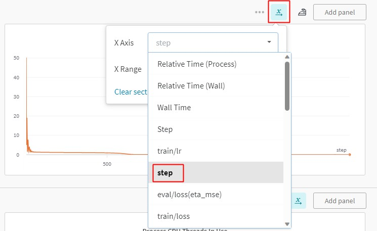

# 使用指南

本文档介绍如何使用 PaddleScience 中的常用基础功能和进阶功能，基础功能包括断点继续训练、迁移学习、模型评估、模型推理；进阶功能包括分布式训练(暂时只支持数据并行)、混合精度训练、梯度累加。

## 1. 基础功能

### 1.1 断点继续训练

在模型的日常训练中，可能存在机器故障或者用户手动操作而中断训练的情况，针对这种情况 PaddleScience 提供了断点继续训练的功能，即在训练时默认会保存**最近一个训练完毕的 epoch** 对应的各种参数到以下 5 个文件中：

1. `latest.pdparams`，该文件保存了神经网络模型的所有权重参数。
2. `latest.pdopt`，该文件保存了优化器（如 Adam 等一些带有动量记录功能的优化器）的所有参数。
3. `latest.pdeqn`，该文件保存了所有方程的参数，在一些逆问题中如果方程本身含有待估计（可学习）的参数，那么该文件就会保存这些参数。
4. `latest.pdstates`，该文件保存了 latest 对应 epoch 的所有评估指标以及 epoch 数。
5. `latest.pdscaler`（可选），在开启自动混合精度（AMP）功能时，该文件保存了 `GradScaler` 梯度缩放器内部的参数。

因此我们只需要在 `Solver` 时指定 `checkpoint_path` 参数为 `latest.*` 的所在路径，即可自动载入上述的几个文件，并从 `latest` 中记录的 epoch 开始继续训练。

``` py hl_lines="9"
import ppsci

...
...

solver = ppsci.solver.Solver(
    ...,
    ...,
    checkpoint_path="/path/to/latest"
)
```

???+ Warning "路径填写注意事项"

    此处只需将路径填写到 "latest" 为止即可，不需要加上其后缀，程序会根据 "/path/to/latest"，自动补充不同文件对应的后缀名来加载 `latest.pdparams`、`latest.pdopt` 等文件。

### 1.2 迁移学习

迁移学习是一种广泛使用、低成本提高模型精度的训练方式。在 PaddleScience 中，只需在 `model` 实例化完毕之后，手动为其载入预训练模型权重，即可进行迁移学习。

``` py hl_lines="9"
import ppsci
import ppsci.utils
from ppsci.utils import save_load

...
...

model = ...
save_load.load_pretrain(model, "/path/to/pretrain")
```

???+ Warning "路径填写注意事项"

    同样地，此处只需将路径填写到预训练文件的文件名为止即可，不需要加上其后缀，程序会根据 "/path/to/pretrain"，自动补充 `.pdparams` 后缀名来加载 `/path/to/pretrain.pdparams` 文件。

???+ info "迁移学习建议"

    在迁移学习时，相对于完全随机初始化的参数而言，载入的预训练模型权重参数是一个较好的初始化状态，因此不需要使用太大的学习率，而可以将学习率适当调小 2~10 倍以获得更稳定的训练过程和更好的精度。

### 1.3 模型评估

当模型训练完毕之后，如果想手动对某一个模型权重文件，评估其在数据集上的精度，则在 `Solver` 实例化时指定参数 `pretrained_model_path` 为该权重文件的路径，然后调用 `Solver.eval()` 即可。

``` py hl_lines="10"
import ppsci
import ppsci.utils

...
...

solver = ppsci.solver.Solver(
    ...,
    ...,
    pretrained_model_path="/path/to/model"
)
solver.eval()
```

???+ Warning "路径填写注意事项"

    同样地，此处只需将路径填写到预训练权重的文件名为止即可，不需要加上其后缀，程序会根据 "/path/to/model"，自动补充所需后缀名来加载 `/path/to/model.pdparams` 文件。

### 1.4 使用 WandB 记录实验

[WandB](https://wandb.ai/) 是一个第三方实验记录工具，能在记录实验数据的同时将数据上传到其用户的私人账户上，防止实验记录丢失。

PaddleScience 支持使用 WandB 记录基本的实验数据，包括 train/eval loss，eval metric，learning rate 等基本信息，可按如下步骤使用该功能

1. 安装 wandb

    ``` sh
    pip install wandb
    ```

2. 注册 wandb 并在终端登录

    ``` sh
    # 登录 wandb 获取 API key
    wandb login
    # 根据 login 提示，输入 API key 并回车确认
    ```

3. 在案例中开启 wandb

    ``` py hl_lines="3 4 5 6 7 8"
    solver = ppsci.solver.Solver(
        ...,
        use_wandb=True,
        wandb_config={
            "project": "PaddleScience",
            "name": "Laplace2D",
            "dir": OUTPUT_DIR,
        },
        ...
    )
    solver.train()
    ```

    如上述代码所示，指定 `use_wandb=True`，并且设置 `wandb_config` 配置字典中的 `project`、`name`、`dir` 三个字段，然后启动训练即可。训练过程会实时上传记录数据至 wandb 服务器，训练结束后可以进入终端打印的预览地址在网页端查看完整训练记录曲线。

    ???+ warning "注意"

        由于每次调用 `wandb.log` 会使得其自带的计数器 `Step` 自增 1，因此在 wandb 的网站上查看训练记录时，需要手动更改 x 轴的单位为 `step`(全小写)，如下所示。

        否则默认单位为 wandb 自带的 `Step` (S大写) 字段，会导致显示步数比实际步数多几倍。
        

## 2. 进阶功能

### 2.1 分布式训练

#### 2.1.1 数据并行

接下来以 `examples/pipe/poiseuille_flow.py` 为例，介绍如何正确使用 PaddleScience 的数据并行功能。分布式训练细节可以参考：[Paddle-使用指南-分布式训练-快速开始-数据并行](https://www.paddlepaddle.org.cn/documentation/docs/zh/develop/guides/06_distributed_training/cluster_quick_start_collective_cn.html)。

1. 在 constraint 实例化完毕后，将 `ITERS_PER_EPOCH` 重新赋值为经过自动多卡数据切分后的 `dataloader` 的长度（一般情况下其长度等于单卡 dataloader 的长度除以卡数，向上取整），如代码中黄色高亮行所示。

    ``` py linenums="146" title="examples/pipe/poiseuille_flow.py" hl_lines="22"
    ITERS_PER_EPOCH = int((N_x * N_y * N_p) / BATCH_SIZE)

    pde_constraint = ppsci.constraint.InteriorConstraint(
        equation["NavierStokes"].equations,
        {"continuity": 0, "momentum_x": 0, "momentum_y": 0},
        geom=interior_geom,
        dataloader_cfg={
            "dataset": "NamedArrayDataset",
            "num_workers": 1,
            "batch_size": BATCH_SIZE,
            "iters_per_epoch": ITERS_PER_EPOCH,
            "sampler": {
                "name": "BatchSampler",
                "shuffle": False,
                "drop_last": False,
            },
        },
        loss=ppsci.loss.MSELoss("mean"),
        evenly=True,
        name="EQ",
    )
    ITERS_PER_EPOCH = len(pde_constraint.data_loader) # re-assign to ITERS_PER_EPOCH

    # wrap constraints together
    constraint = {pde_constraint.name: pde_constraint}

    EPOCHS = 3000 if not args.epochs else args.epochs
    ```

2. 使用分布式训练命令启动训练，以 4 卡数据并行训练为例

    ``` sh
    # 指定 0,1,2,3 张卡启动分布式数据并行训练
    export CUDA_VISIBLE_DEVICES=0,1,2,3
    python -m paddle.distributed.launch --gpus="0,1,2,3" poiseuille_flow.py
    ```

<!-- #### 1.1.2 模型并行

TODO -->

### 2.2 自动混合精度训练

接下来介绍如何正确使用 PaddleScience 的自动混合精度功能。自动混合精度的原理可以参考：[Paddle-使用指南-性能调优-自动混合精度训练（AMP）](https://www.paddlepaddle.org.cn/documentation/docs/zh/develop/guides/performance_improving/amp_cn.html#amp)。

实例化 `Solver` 时加上 2 个参数: `use_amp=True`, `amp_level="O1"`(或`amp_level="O2"`)。如代码中黄色高亮行所示，通过指定 `use_amp=True`，开启自动混合精度功能，接着再设置 `amp_level="O1"`，指定混合精度所用的模式，`O1` 为自动混合精度，`O2` 为更激进的纯 fp16 训练模式，一般推荐使用 `O1`。

``` py hl_lines="5 6"
# initialize solver
solver = ppsci.solver.Solver(
    ...,
    ...,
    use_amp=True,
    amp_level="O1", # or amp_level="O2"
)
```

### 2.3 梯度累加

接下来介绍如何正确使用 PaddleScience 的梯度累加功能。梯度累加的原理可以参考：[Paddle-使用指南-性能调优-自动混合精度训练（AMP）-动态图下使用梯度累加](https://www.paddlepaddle.org.cn/documentation/docs/zh/develop/guides/performance_improving/amp_cn.html#dongtaituxiashiyongtiduleijia)。

实例化 `Solver` 时指定 `update_freq` 参数为大于 1 的正整数即可。如代码中黄色高亮行所示，`update_freq` 可以设置为 2 或者更大的整数，推荐使用 2、4、8，此时对于训练任务来说，全局 `batch size` 等价于 `update_freq * batch size`。梯度累加方法在大多数场景中能够让间接地扩大每个 batch 内的样本数量，从而让每个 batch 分布更接近真实数据分布，提升训练任务的性能。

``` py hl_lines="5"
# initialize solver
solver = ppsci.solver.Solver(
    ...,
    ...,
    update_freq=2, # or 4, 8
)
```

### 2.4 多任务学习

在机理驱动、数理融合场景中，往往会同时优化多个损失项，如控制方程残差损失、（初）边值条件损失等。在训练过程中这些损失项对参数的梯度方向可能会互相冲突，阻碍训练精度收敛，而这正是多任务学习方法能解决的问题。因此 PaddleScience 在多任务学习模块中引入了几种常见的算法，其主要通过对不同任务的权重和产生的梯度进行调整，从而缓解该问题，最终提升模型收敛精度。下面以 PCGrad 方法进行举例，使用方式如下：

1. 实例化一个多任务学习方法的对象

    ``` py hl_lines="3"
    from ppsci.loss import mtl
    model = ...
    loss_aggregator = mtl.PCGrad(model)
    ```

2. 将该对象作为 `Solver` 的实例化参数之一传入

    ``` py hl_lines="4"
    solver = ppsci.solver.Solver(
        ...,
        ...,
        loss_aggregator=loss_aggregator,
    )
    ```

3. 启动训练，训练过程中 `loss_aggregator` 会自动对获取到的多个损失项应用对应的多任务学习方法进行优化

    ``` py
    solver.train()
    ```

    ???+ info "影响说明"

        个别多任务学习方法（如weight based method）可能会改变**训练过程**中损失函数的计算方式，但仅限于影响训练过程，模型**评估过程**的损失计算方式保持不变。
