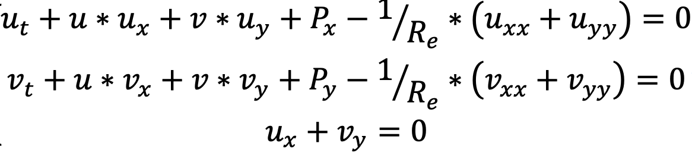
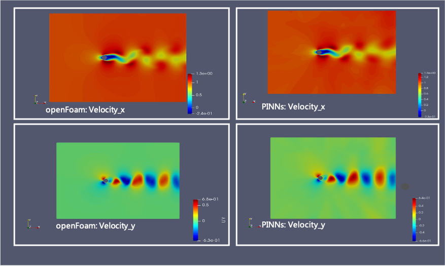
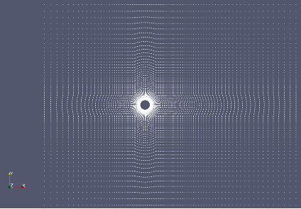

# 2D unsteady cylinder flow

This guide introduces how to build a PINN model with continuous time method to simulate 2d unsteady flow passing over a cylinder with PaddleScience.

## Use case introduction

This example presents an 2d unsteady flow over a cylinder simulating solution (velocity) of following equations.

    

The following graphs present the velocity in x and y direction simulated by OpenFOAM and PINN.

    

## How to run the model 

**Install PaddlePaddle**

The PaddlePaddle development version need to be installed in this problem. User can choose the appropriate version based on simulating platform (such as in linux os and cuda10.1 platform, 

    python -m pip install paddlepaddle-gpu==0.0.0.post101 -f https://www.paddlepaddle.org.cn/whl/linux/gpu/develop.html` can be used for installing), 
More details can refer to [PaddlePaddle](https://www.paddlepaddle.org.cn/install/quick?docurl=/documentation/docs/zh/develop/install/pip/linux-pip.html) 

 **Download PaddleScience code**
 
    git clone https://github.com/PaddlePaddle/PaddleScience.git

 **Install required libraries**
   
    cd PaddleScience
    pip install -r requirements 
    
 **Set PYTHONPATH**
 
    export PYTHONPATH=$PYTHONPATH:/user_path*/PaddleScience/
   
 **Preparing data**
   Before running the demo, the OpenFOAM dataset is required, run below script:
   
    cd examples/cylinder/2d_unsteady_continuous
    python download_dataset.py

 **Training**
   The trained model is saved under checkpoint path.
   
    cd examples/cylinder/2d_unsteady_continuous
    python cylinder2d_unsteady_train.py

 **Prediction**
 
    cd examples/cylinder/2d_unsteady_continuous
    python cylinder2d_unsteady_predict.py

 **Visualization**

 Open the vtk files with Paraview.
 
   
## Construct the model 
   Basically, the model is composed with 4 main parts: dataloader, pinn_solver, trainning and predicting logistic.  
   
   - **dataloader: loading data**
   
   The spatiotemporal data are carried from OpenFOAM in this demo, taking 9000 interior training points and 200 supervised points seperately with 30 random time steps.

    # Loading data from openfoam 
    path = './datasets/'
    dataloader = cfd.DataLoader(path=path, N_f=9000, N_b=1000, time_start=1, time_end=50, time_nsteps=50)
    training_time_list = dataloader.select_discretized_time(num_time=30)
    
   - **pinn_solver: define fluid properties**
   
   The flow domain grids are loaded from OpenFOAM for refering final results.
   

    

    
   The fluid viscosity `nu` represents fluid propery, according to the Reynolds number equation `Re=U*D/nu`, the default inlet velocity is 2, and the Reynolds number can be set through giving different viscosity. In this demo, the default Reynolds number is 100, the cylinder diameter is 1, and the viscosity equals to 0.02.
    
   - **pinn_solver: define respective loss weights**
   
  The loss function consist of weighted eq_loss, bc_loss, ic_loss, outlet_loss and supervised_data_loss. The weight of each loss can be self-defined before training.

    PINN = psolver.PysicsInformedNeuralNetwork(
        layers=6, nu=2e-2, bc_weight=10, eq_weight=1, ic_weight=10, supervised_data_weight=10, 
        outlet_weight=1, training_type='half-supervised', checkpoint_path='./checkpoint/', 
        net_params=net_params, distributed_env=distributed_env)

   - **pinn_solver: define the neural network**
   
   The fully connected neural network is used by default.

    def initialize_NN(self, num_ins=3, num_outs=3, num_layers=10, hidden_size=50):
        return psci.network.FCNet(
            num_ins=num_ins,
            num_outs=num_outs,
            num_layers=num_layers,
            hidden_size=hidden_size,
            dtype="float32",
            activation='tanh')
    
  - **Training**
   
   The adam optimizer is employed with learning rate 1e-5 are presented as below shown:

       adm_opt = paddle.optimizer.Adam(learning_rate=1e-5, parameters=PINN.net.parameters())
       PINN.train(num_epoch=10, optimizer=adm_opt)
   
   A well pre-trained model is provided in the checkpoint folder by defining ` net_params = './checkpoint/pretrained_net_params'` in the cylinder2d_unsteady_train.py,  otherwise the training process is spawned from scratch if `net_params = None`.
   
    net_params = './checkpoint/pretrained_net_params'
    train(net_params=net_params)
   
  - **Prediction**
   
   After training, the model is saved in the checkpoint foler, set `net_params` and execute `python cylinder2d_unsteady_predict.py` to get vtk results. The vtk files are generated and saved in the vtk folder. These *vtu* files can be visualized with [Paraview](https://www.paraview.org/).

    if __name__ == "__main__":
        net_params = './checkpoint/pretrained_net_params'
        vtk_filename = './vtk/uvp_t_'
        predict_once_for_all(net_params=net_params, vtk_filename=vtk_filename)

