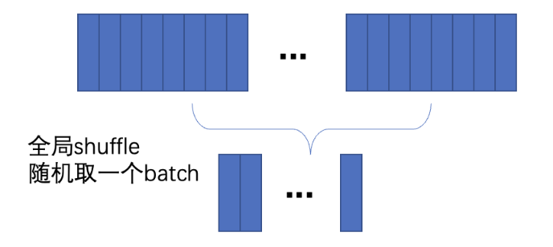
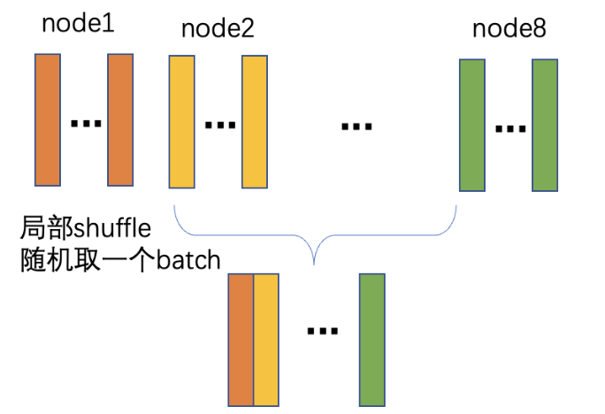

# FOURCASTNET

参考代码:
https://github.com/NVlabs/FourCastNet


## 下载数据集
从[此处](https://app.globus.org/file-manager?origin_id=945b3c9e-0f8c-11ed-8daf-9f359c660fbd&origin_path=%2F~%2Fdata%2F)下载数据集

## 模型训练
在配置文件中配置数据集路径:

```
  train_data_path:     # 训练集路径
  valid_data_path:     # 验证集路径
  inf_data_path:       # 测试集路径
  time_means_path:     # time_mean 文件路径（time_means.npy）
  global_means_path:   # mean 文件路径（global_means.npy）
  global_stds_path:    # std 文件路径（global_stds.npy）
  exp_dir:             # 输出路径
```
训练数据集总共需要5TB+的存储资源，需要的存储资源比较多，有以下的两种训练方式（实验证明两种训练方式的loss收敛曲线基本一致，当存储资源比较有限时，可以使用方式b）。

方式a： 当存储资源充足时，可以将全部训练数据存储到每台训练机器上，运行train.py启动训练程序，此时训练过程中数据的加载是使用全局shuffle的方式进行，如下图所示，每个batch中的训练数据数据是随机从全量数据集中抽取样本组成的。

<div align="center">    

</div>

方式b：在存储资源有限时，可以使用sample_trainer_data.py将数据集平均分配存储到每个训练机器上，运行train_sampled.py启动训练程序，此时训练过程中数据的加载是使用局部shuffle的方式进行。如下图所示，将训练数据平均分配到了8台机器上，训练时随机从每台机器上抽取1/8个batch的数据组成1个完整的batch进行训练。在8机条件下，这种方式pretraining阶段每台机器需要约1.2T的存储资源，finetuning阶段每台机器需要约1.8T的存储资源。


<div align="center">    

</div>

### 设置环境变量
```bash
# 设置训练GPU
export GPUS=0,1,2,3,4,5,6,7
# 多机分布式训练时，需要设置每台机器的IP地址，例如：
export TRAINER_IP_LIST=192.168.0.16,192.168.0.17
```


### 步骤 1 (风速模型预训练)

```python
# 全局shuffle
python3 -m paddle.distributed.launch --gpus ${GPUS} --ips="${TRAINER_IP_LIST}" train.py --config afno_backbone
# 局部 shuffle
# python3 -m paddle.distributed.launch --gpus ${GPUS} --ips="${TRAINER_IP_LIST}" train_sampled.py --config afno_backbone
```

### 步骤 2 (风速模型微调)

```python
# 需要先在配置文件中设置字段 pretrained_ckpt_path
# 全局shuffle
python3 -m paddle.distributed.launch --gpus ${GPUS} --ips="${TRAINER_IP_LIST}" train.py --config afno_backbone_finetune
# 局部shuffle
# python3 -m paddle.distributed.launch --gpus ${GPUS} --ips="${TRAINER_IP_LIST}" train_sampled.py --config afno_backbone_finetune
```


### 步骤 3 (降雨量模型训练)

```python
# 需要先在配置文件中设置字段 model_wind_path
# 全局shuffle
python3 -m paddle.distributed.launch --gpus ${GPUS} --ips="${TRAINER_IP_LIST}" train.py --config precip
# 局部shuffle
# python3 -m paddle.distributed.launch --gpus ${GPUS} --ips="${TRAINER_IP_LIST}" train_sampled.py --config precip
```


## 模型推理

### 风速模型推理

```python
# batch方式推理
python inference/inference_fast_batch.py --yaml_config 'your config file' --override_dir 'your output dir' --weights 'your training models'
```

### 降雨量模型推理

```python
python inference/inference_precip.py --yaml_config 'your config file' --override_dir 'your output dir' --weights 'your training models'
```
