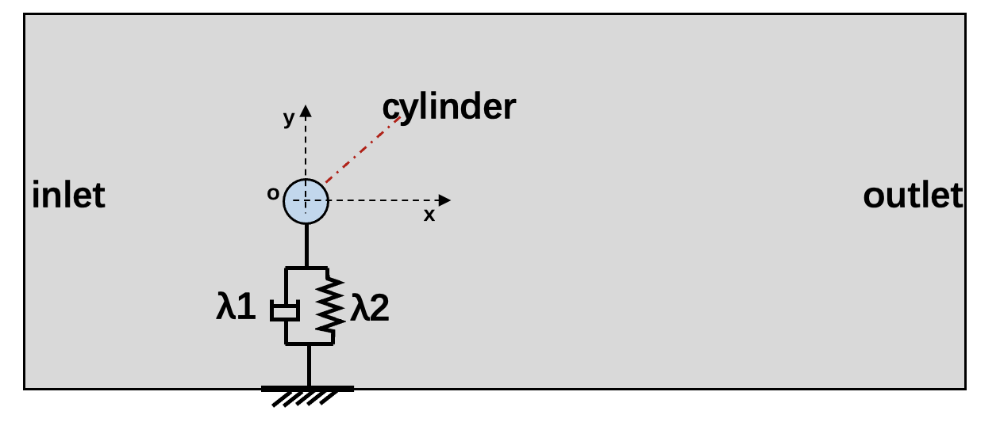
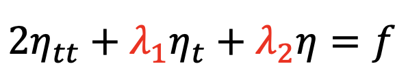
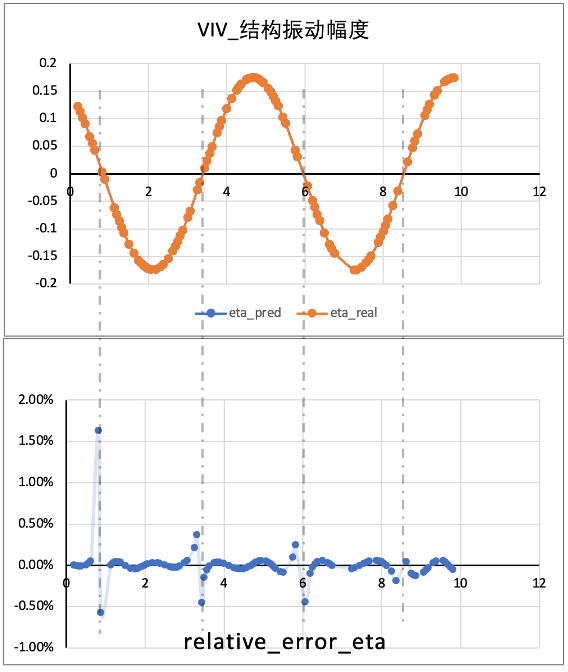
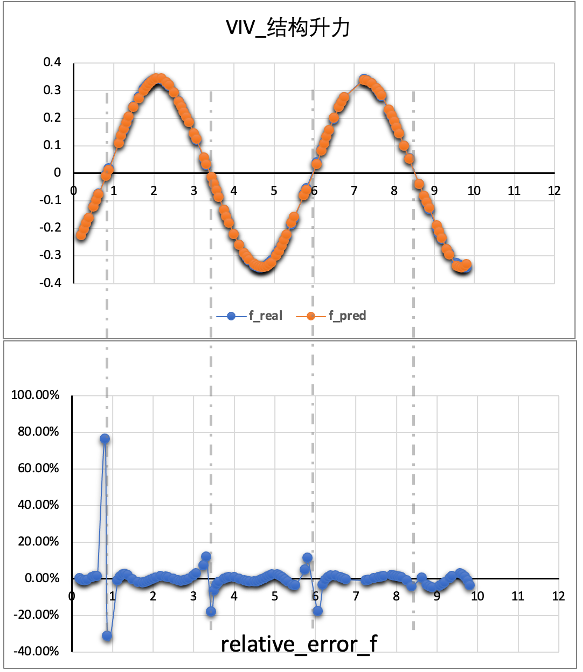

# VIV (vortex induced vibration)
This guide introduces to how to build a simple VIV model with PaddleScience.


## Use case introduction
This use case is a typical inverse problem application, vortex induced vibrations of bluff bodies occur when the vortex shedding frequency is close to the natural frequency of the structure, the VIV system is equivalent to a one-dimensional spring-damper system: 

<div align="center">

</div>

The *λ1* and *λ2* represent the natural damping and stiffness of the structure properties respectively, *ρ* is the mass. The problem is set up to discover values of *λ1* and *λ2*, and the governing equation is defined as shown below:

<div align="center">

</div>

To verify the feasibility of PINNs algorithm for solving such classical inverse problem, the ground truth of stiffness and damping of the system are fixed first（*λ1=0，λ2=1.093*）. Comparing the prediction of stiffness and damping achieved from PINN, the relative error is lower than 5%, which inidicates that the trained model can well simulate the one-dimensional vibration phenomenon of VIV and can predict the physical properties of unknown complicated structure.

The model is based o the assumption that the constant reduction velocity is `Ur=8.5（Ur=u/(fn*d))` corresponding to `Re=500`. The lateral amplitude of cylinder vibration(*η*) induced by the velocity fluid passing over the cylinder and the corresponding lift force（*f*） are given in this problem. We laveraged these data as supervised data during training. 


## How to run the model

### Install PaddlePaddle and PaddleScience

**Install PaddlePaddle**

The PaddlePaddle development version need to be installed in this problem. User can choose the appropriate version based on simulating platform (such as in linux os and cuda10.1 platform, `python -m pip install paddlepaddle-gpu==0.0.0.post101 -f https://www.paddlepaddle.org.cn/whl/linux/gpu/develop.html` can be used for installing) on the [PaddlePaddle](https://www.paddlepaddle.org.cn/install/quick?docurl=/documentation/docs/zh/develop/install/pip/linux-pip.html) 

**Download PaddleScience code**
       
  - clone paddlescience source code:
       
   git clone https://github.com/PaddlePaddle/PaddleScience.git

**Install required libraries**
   
  -  `pip install -r requirements` 
   
**Set environment variables**
   
  **-Set PYTHONPATH** 
   
  Set environment with `%env PYTHONPATH=/user_path*/PaddleScience`, or use `export PYTHONPATH=$PYTHONPATH:/user_path*/PaddleScience/` instead

**Training**
  The trained model is saved under checkpoint path.
  - cd paddlescience/examples/fsi/
  - python viv_inverse_train.py

**Predict**
  - cd paddlescience/examples/fsi/
  - python viv_inverse_predict.py
  
## How to define the model 

### Model composition

  Basically, the model is composed with 4 main parts: dataloader, pinn_solver, trainning and predicting logistic.  
     
**-Load data for training**
For training, *η* and *f* were obtained from CFD tools and saved in the *./examples/fsi/VIV_Training.mat* file, they are loaded as shown below:

```
t_eta, eta, t_f, f, tmin, tmax = data.build_data()
``` 

**-pinn_solver: define the pinn neural network**
     
Since only the lateral vibration of the structure is considered and the inlet velocity is constant, time(*t*) is the only input dimension of the neural network and the output is the vibration amplitude of the structure.

FCNet is employed by default as the neural network with 6 layers and 30 neurons  built for each layer, and the Neural Network is defined in the file `./examples/fsi/viv_inverse_train.py` as shown below:

```
PINN = psolver.PysicsInformedNeuralNetwork(layers=6, hidden_size=30, num_ins=1, num_outs=1, 
        t_max=tmax, t_min=tmin, N_f=f.shape[0], checkpoint_path='./checkpoint/', net_params=net_params)
```

**-pinn_solver: define the PDE**
PDE is defined in `./paddlescience/module/fsi/viv_pinn_solver.py` as shown below:
```
def neural_net_equations(self, t, u=None):
    eta = self.net.nn_func(t)
    eta_t = self.autograd(eta, t)
    eta_tt = self.autograd(eta_t, t, create_graph=False)

    rho = 2.0
    k1_ = paddle.exp(self.k1)
    k2_ = paddle.exp(self.k2)
    f = rho*eta_tt + k1_*eta_t + k2_*eta
    return eta, f
```     

**-pinn_solver: define the loss weights**
In this demo, the eta_weight and eq_weight are set as 100 and 1 respectively.
```
self.eta_weight = 100
```

**-Training**

```
# Training
batchsize = 150
scheduler = paddle.optimizer.lr.StepDecay(learning_rate=1e-3, step_size=20000, gamma=0.9)
adm_opt = paddle.optimizer.Adam(scheduler, weight_decay=None,parameters=PINN.net.parameters())
PINN.train(num_epoch=100000, batchsize=batchsize, optimizer=adm_opt, scheduler=scheduler)
adm_opt = psci.optimizer.Adam(learning_rate=1e-5, weight_decay=None,parameters=PINN.net.parameters())
PINN.train(num_epoch=100000, batchsize=batchsize, optimizer=adm_opt)
```

**-Prediction**
After training, the model is saved in the checkpoint foler, set `net_params` and execute `python viv_inverse_predict.py` is enough to get results. 

```
net_params = './checkpoint/net_params_100000'
predict(net_params=net_params)
```
The result is shown as below:
<div align="center">


</div>
