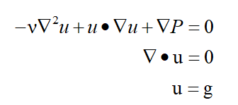
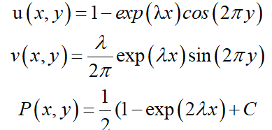
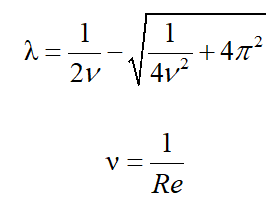
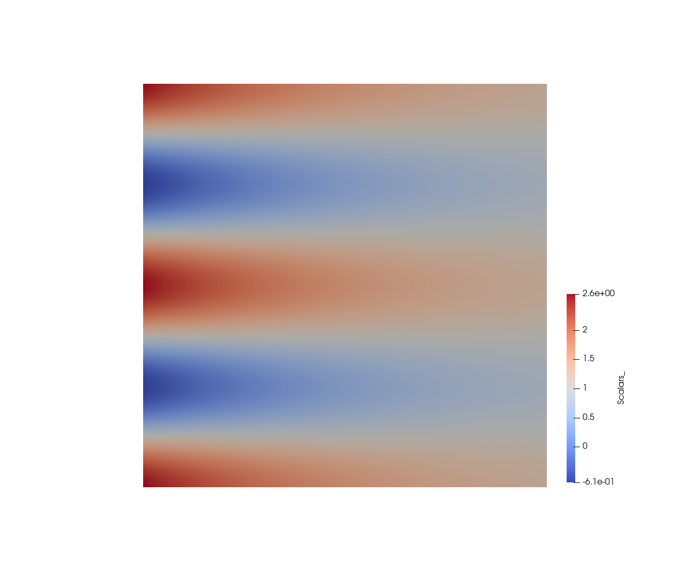
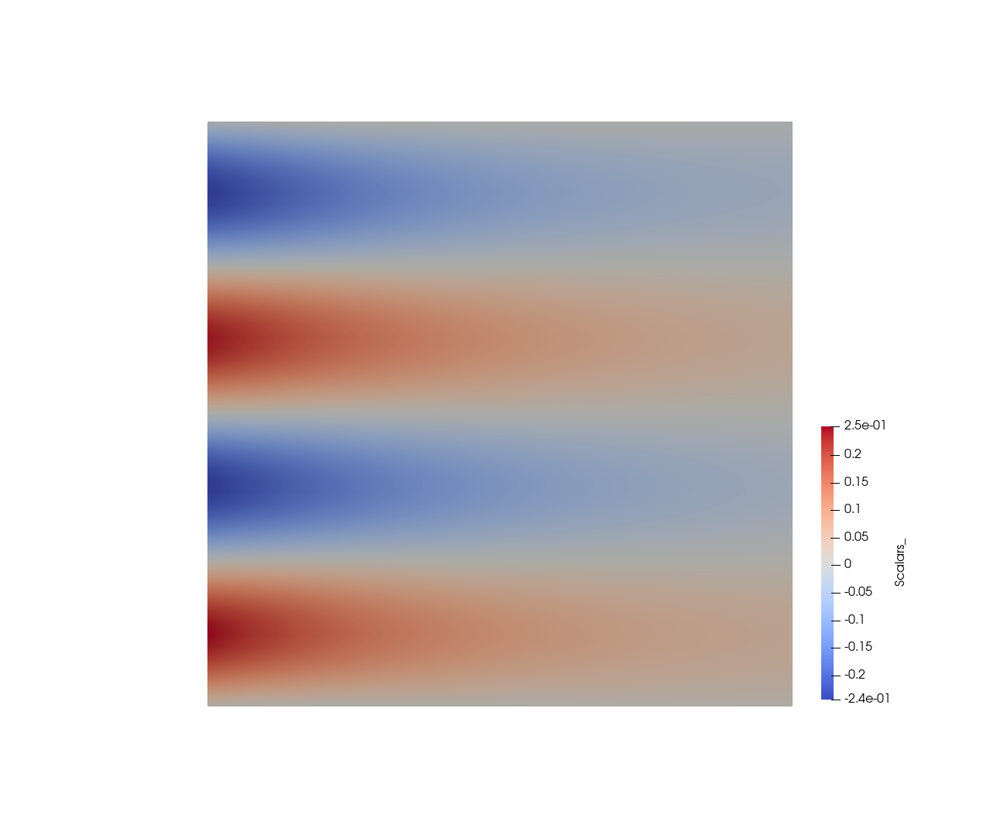

# Kovasznay Flow #

This is a demo of Kovasznay flow contributing by "XYM-1" in PR-17.

The Navier-Stokes equation describing Kovasznay flows is:

The analytical solution is 

where the parameters are

The computation domain is [-0.5,1.5] x [-0.5,1.5]. The simulation results of u and v are as following

