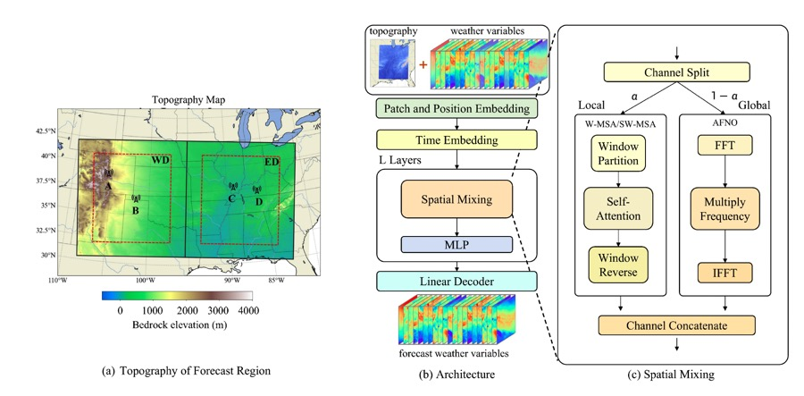

# A Study of Data-driven Limited Area Model for Weather Forecasting

Recently, artificial intelligence-based models for forecasting global weather have been rapidly developed. Most of the global models are trained on reanalysis datasets with a spatial resolution of 0.25◦ × 0.25◦. However, study on artificial intelligence-based limited area weather forecasting models is still limited. In this study, an artificial intelligence-based limited area weather forecasting model (YingLong) is developed. YingLong utilizes a parallel structure of global and local blocks to capture multiscale meteorological features. Its predictability on surface temperature, humidity and wind speed is comparable to the predictability of the dynamical limited area model WRF-ARW, but with a much faster running speed. YingLong is also applied to investigate the issues related to the lateral boundary condition of artificial intelligence-based limited area models. The difference between artificial intelligence-based limited area models and dynamical limited area models is also discussed.

This code is the implementation of YingLong. We select the southeastern region of the United States, which is around the range of 80-110W, 30-42N, with 440 × 408 grid points in Lambert projection.

<div align=center>
    
</div>

## Installation

### 1. Install PaddlePaddle

Please install the <font color="red"><b>2.6.0</b></font>  or <font color="red"><b>develop</b></font> version of PaddlePaddle according to your environment on the official website of [PaddlePaddle](https://www.paddlepaddle.org.cn/en/install/quick?docurl=/documentation/docs/en/develop/install/pip/linux-pip_en.html).

For example, if your environment is linux and CUDA 11.2, you can install PaddlePaddle by the following command.

``` shell
python -m pip install paddlepaddle-gpu==2.6.0.post112 -f https://www.paddlepaddle.org.cn/whl/linux/mkl/avx/stable.html
```

After installation, run the following command to verify if PaddlePaddle has been successfully installed.

``` shell
python -c "import paddle; paddle.utils.run_check()"
```

If `"PaddlePaddle is installed successfully! Let's start deep learning with PaddlePaddle now."` appears, to verify that the installation was successful.

### 2. Install PaddleScience

Clone the code of PaddleScience from [here](https://github.com/PaddlePaddle/PaddleScience.git) and install requirements.

``` shell
git clone -b develop https://github.com/PaddlePaddle/PaddleScience.git
cd PaddleScience
pip install -r requirements.txt -i https://pypi.tuna.tsinghua.edu.cn/simple
export PYTHONPATH=$PWD
```

## Example Usage

### 1. Download the data and model weights

``` shell
cd examples/yinglong
wget https://paddle-org.bj.bcebos.com/paddlescience/datasets/yinglong/western_valid_data.tar
tar -xvf western_valid_data.tar
wget https://paddle-org.bj.bcebos.com/paddlescience/datasets/yinglong/eastern_valid_data.tar
tar -xvf eastern_valid_data.tar
wget https://paddle-org.bj.bcebos.com/paddlescience/models/yinglong/inference.tar
tar -xvf inference.tar
```

### 2. Run the code

The following code runs the YingLong model, and the model output will be saved in `outputs_yinglong_eastern(western)/result.npy`.

``` shell
# yinglong_eastern
python predict.py -cn=yinglong_eastern.yaml
# yinglong_western
python predict.py -cn=yinglong_western.yaml
```

We also visualized the predicted wind speed at 10 meters above ground level, with an initial field of 0:00 on January 1, 2022. Click [eastern](https://paddle-org.bj.bcebos.com/paddlescience/docs/Yinglong/result_eastern.gif)/[western](https://paddle-org.bj.bcebos.com/paddlescience/docs/Yinglong/result_western.gif) to view the prediction results.

## License

YingLong was released by Shanghai Zhangjiang Institute of Mathematics, Baidu inc.

The commercial use of these models is forbidden.
