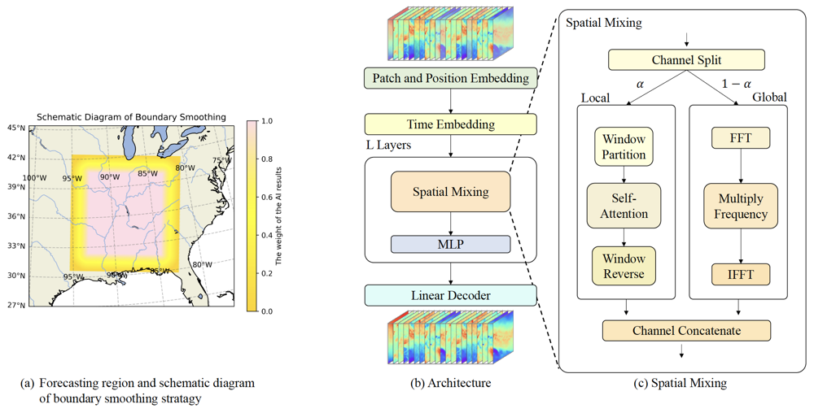

# Skillful High Resolution Regional Short Term Forecasting with Boundary Smoothing

YingLong, a high-resolution, short-term regional weather forecasting, artificial-intelligence-based model, which is capable of hourly predicting weather fields including wind speed, temperature, and specific humidity at a 3km resolution. YingLong utilizes a parallel structure of global and local blocks to capture multiscale meteorological features and is trained on analysis dataset. Additionally, the necessary information around the regional boundary is introduced to YingLong through the boundary smoothing strategy, which significantly improves the regional forecasting results. By comparing forecast results with those from WRF-ARW, one of the best numerical prediction models, YingLong demonstrates superior forecasting performances in most cases, especially on surface variables.

This code is the implementation of YingLong. We select the southeastern region of the United States, which is around the range of 110-130E, 15-35N, with 440 × 408 grid points in Lambert projection.

<div align=center>
    
</div>

## Installation

### 1. Install PaddlePaddle

Please install the <font color="red"><b>2.6.0</b></font>  or <font color="red"><b>develop</b></font> version of PaddlePaddle according to your environment on the official website of [PaddlePaddle](https://www.paddlepaddle.org.cn/en/install/quick?docurl=/documentation/docs/en/develop/install/pip/linux-pip_en.html).

For example, if your environment is linux and CUDA 11.2, you can install PaddlePaddle by the following command.

``` shell
python -m pip install paddlepaddle-gpu==2.6.0.post112 -f https://www.paddlepaddle.org.cn/whl/linux/mkl/avx/stable.html
```

After installation, run the following command to verify if PaddlePaddle has been successfully installed.

``` shell
python -c "import paddle; paddle.utils.run_check()"
```

If `"PaddlePaddle is installed successfully! Let's start deep learning with PaddlePaddle now."` appears, to verify that the installation was successful.

### 2. Install PaddleScience

Clone the code of PaddleScience from [here](https://github.com/PaddlePaddle/PaddleScience.git) and install requirements.

``` shell
git clone -b develop https://github.com/PaddlePaddle/PaddleScience.git
cd PaddleScience
pip install -r requirements.txt -i https://pypi.tuna.tsinghua.edu.cn/simple
export PYTHONPATH=$PWD
```

## Example Usage

### 1. Download the data and model weights

``` shell
cd examples/yinglong
wget https://paddle-org.bj.bcebos.com/paddlescience/datasets/yinglong/hrrr_example_24vars.tar
tar -xvf hrrr_example_24vars.tar
wget https://paddle-org.bj.bcebos.com/paddlescience/datasets/yinglong/hrrr_example_69vars.tar
tar -xvf hrrr_example_69vars.tar
wget https://paddle-org.bj.bcebos.com/paddlescience/models/yinglong/inference.tar
tar -xvf inference.tar
```

### 2. Run the code

The following code runs the Yinglong model, and the model output will be saved in 'output/result.npy'.

``` shell
# YingLong-12 Layers
python predict_12layers.py mode=infer
# YingLong-24 Layers
python predict_24layers.py mode=infer
```

We also visualized the predicted wind speed at 10 meters above ground level, with an initial field of 0:00 on January 1, 2022. Click [here](https://paddle-org.bj.bcebos.com/paddlescience/docs/Yinglong/result.gif) to view the prediction results.
