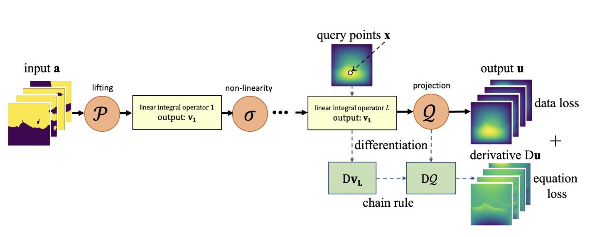
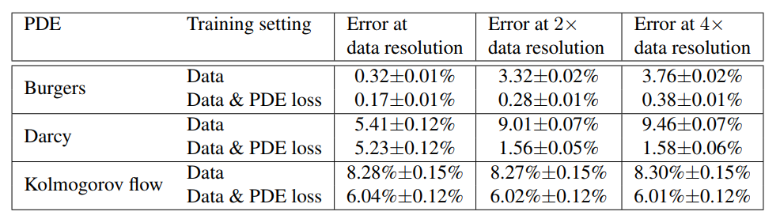

# OSPP2023--飞桨PaddleScience-PDE方程求解模型开发设计文档
| API名称 | 新增API名称 |
| --- | --- |
| 提交作者 | zlynna |
| 提交时间 | 2023-10-12 |
| 版本号 | V1.0 |
| 依赖CINN版本 | PaddlePaddle2.5.0 |
| 文件名 | PINO.md |
# 1. 概述
## 1.1 相关背景
在参考论文中提出了物理信息神经算子（PINO），它利用数据和/或物理约束来学习一组参数化偏微分方程（PDE）的解算子。这种混合方法使PINO能够克服纯粹基于数据和基于物理的方法的限制。例如，基于数据的方法在数据数量和/或质量有限时无法学习，而基于物理的方法无法优化具有挑战性的PDE约束。通过结合数据和PDE约束，PINO克服了所有这些挑战。此外，PINO相对于其他混合学习方法享有的一个独特特性是它能够在不同分辨率下合并数据和PDE约束。这使我们能够将来自数值求解器的低分辨率数据与更高分辨率的PDE约束相结合，而得到的PINO即使在高分辨率的测试实例上也不会失去准确性。PINO的这种离散不变性属性是由神经算子框架引起的，该框架学习了函数空间之间的映射，而无需重新训练即可在不同分辨率下进行评估。此外，PINO在纯粹的物理环境中也取得了成功，即没有可用的数据，而其他方法，如基于物理的神经网络（PINN），由于优化挑战而失败，例如在多尺度动态系统中。这是因为PINO通过在多个实例上优化PDE约束来学习解算子，而PINN则通过优化单个PDE实例的PDE约束。此外，在PINO中，我们还整合了傅立叶神经算子（FNO）架构，它在数值求解器上实现了数量级的加速，并且还能够高效地计算函数空间上的显式梯度。
## 1.2 功能目标
本任务中，作者依据文章[Physics-informed neural operator for learning partial differential equations](https://arxiv.org/abs/2111.03794),完成以下任务：
- 根据论文代码，基于PaddlePaddle复现论文中相关结果，并与参考结果进行比较。
## 1.3 意义
基于PaddlePaddle实现Physics informed neural operator (PINO)，拓展PaddlePaddle科学计算模型。
# 2. 飞桨现状
PaddlePaddle目前无相关模型实现。
# 3. 业内方案调研
## 3.1 解决的问题
本项目基于嵌入物理信息的神经算子求解偏微分方程，方程主要以以下形式出现：
$$
P(u,a)=0,\: in \ D \in \mathbf \R^d \\
u=g, \: in \ \partial D
$$

## 3.2 解决的方法
参考模型结构如下：

首先构建傅里叶卷积层：
```python
class FactorizedSpectralConv(nn.Layer):
    def __init__(
        self,
        in_channels,
        out_channels,
        n_modes,
        n_layers=1,
        scale="auto",
        separable=False,
        fft_norm="backward",
        bias=False,
        implementation="reconstructed",
        joint_factorization=False,
        rank=0.5,
        factorization="cp",
        fixed_rank_modes=False,
        decomposition_kwargs=dict(),
    ):
    ...
```
对于二维问题来说，构建模型FNO2D：
```python
class FNO2d(nn.Layer):
    def __init__(self, modes1, modes2,
                 width=64, fc_dim=128,
                 layers=None,
                 in_dim=3, out_dim=1,
                 act='gelu', 
                 pad_ratio=[0., 0.]):
        super(FNO2d, self).__init__()

        ...
```
对于物理信息嵌入部分，以burgers方程为例：
```python
def FDM_Burgers(u, v, D=1):
    batchsize = u.shape[0]
    nt = u.shape[1]
    nx = u.shape[2]

    u = u.reshape([batchsize, nt, nx])
    dt = D / (nt-1)
    dx = D / (nx)

    u_h = paddle.fft.fft(u, axis=2)
    # Wavenumbers in y-direction
    k_max = nx//2
    k_x = paddle.concat((paddle.arange(start=0, end=k_max, step=1, dtype='float32'),
                     paddle.arange(start=-k_max, end=0, step=1, dtype='float32')), 0).reshape([1,1,nx])
    ux_h = 2j *np.pi*k_x*u_h
    uxx_h = 2j *np.pi*k_x*ux_h
    ux = paddle.fft.irfft(ux_h[:, :, :k_max+1], axis=2, n=nx)
    uxx = paddle.fft.irfft(uxx_h[:, :, :k_max+1], axis=2, n=nx)
    ut = (u[:, 2:, :] - u[:, :-2, :]) / (2 * dt)
    Du = ut + (ux*u - v*uxx)[:,1:-1,:]
    return Du
```

## 3.3 复现目标

## 3.4 可能存在的难点
- PaddlePaddle中已有相关Fourier Neural Operator (FNO)实现，使得模型复现过程较为简单。
# 4. 设计思路与实现方案
参考参考[PaddleScience复现指南](https://paddlescience-docs.readthedocs.io/zh/latest/zh/reproduction/#2)，复现步骤如图所示：


## 4.1 基于PaddlePaddle复现
根据**参考文献：Physics informed neural operator**，基于Paddle API实现该模型的设计思路与实现步骤如下：
1. 导入依赖
2. 导入数据
3. 构造网络模型
5. 定义基于物理信息的损失函数$R$
6. 定义模型的前向传播方法forward
7. 模型训练及推理
8. 实现PINO，进行对比分析
9. 计算误差


完整复现代码见：
[PINO](https://aistudio.baidu.com/projectdetail/6625305)

# 5. 测试和验收的考量
测试与验收参考[PaddleScience模型复现流程及验收标准](https://paddlescience-docs.readthedocs.io/zh/latest/zh/reproduction/)。

1. 提供完整的基于Paddle API的复现方法
# 6. 可行性分析和排期规划

## 6.1 可行性分析

- 根据已有项目[FNO论文复现](https://aistudio.baidu.com/projectdetail/6733508?contributionType=1)可以顺利实现PINO中SpectralConv卷积层。

可行

## 6.2 排期规划

- 202308 : 调研
- 202309 ：基于Paddle API的复现
- 202310 ：整理项目产出，撰写案例文档