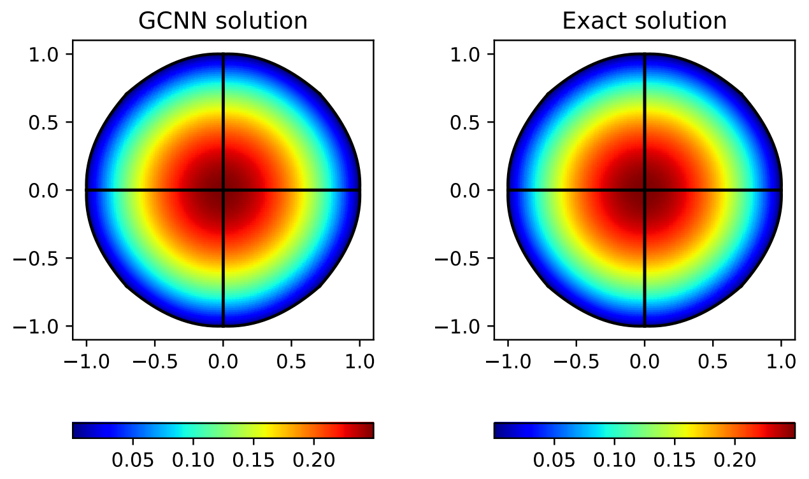

# OSPP2023--飞桨PaddleScience-PDE方程求解模型开发设计文档
| API名称 | 新增API名称 |
| --- | --- |
| 提交作者 | zlynna |
| 提交时间 | 2023-10-12 |
| 版本号 | V1.0 |
| 依赖CINN版本 | PaddlePaddle2.5.0 |
| 文件名 | graphGalerin.md |
# 1. 概述
## 1.1 相关背景
尽管物理信息神经网络（PINNs）在解决正向和反向问题方面具有巨大的潜力，但存在一些技术挑战，阻碍了其在更复杂和现实应用中的应用。首先，大多数现有的PINNs基于点对点的表达方式，使用全连接网络来学习连续函数，但这种方法在可扩展性和硬边界实施方面存在问题。其次，无限的搜索空间使网络训练的非凸优化变得过于复杂。第三，尽管基于卷积神经网络（CNN）的离散学习可以显著提高训练效率，但CNN难以处理不规则几何形状和无结构网格。

为了妥善解决这些问题，文章提出了一种基于图卷积网络（GCN）和PDE的变分结构的新型离散PINN框架，以统一的方式解决正向和反向偏微分方程（PDE）。使用分段多项式基可以减小搜索空间的维度，有助于训练和收敛。在不需要调整经典PINNs中的损失函数的情况下，所提出的方法可以严格强制边界条件，并在正向和反向设置中加入稀疏数据。GCN的灵活性用于处理不规则的几何形状和无结构的网格。所提出的方法的有效性和优点在各种由线性和非线性PDEs管理的正向和反向计算力学问题上得到了证明。
## 1.2 功能目标
本任务中，作者依据文章[Physics-informed graph neural Galerkin networks: A unified framework for solving PDE-governed forward and inverse problems](https://www.sciencedirect.com/science/article/pii/S0045782521007076),完成以下任务：
- 根据论文代码，基于PaddlePaddle复现论文中相关结果，并与参考结果进行比较。
## 1.3 意义
基于PaddlePaddle实现物理信息嵌入的图神经网络（GNN）求解偏微分方程（PDE），拓展PaddlePaddle科学计算模型。
# 2. 飞桨现状
PaddlePaddle目前无相关模型实现。
# 3. 业内方案调研
## 3.1 解决的问题
本项目基于嵌入物理信息的图神经网络求解偏微分方程，方程主要以以下形式出现：
$$ \nabla \cdot F(u, \nabla u; \boldsymbol\mu) = S(u, \nabla u; \boldsymbol\mu) \: in \:  \Omega $$
边界条件为：
$$ \mathbf\R_u(U_u(\boldsymbol\mu),U_e;\boldsymbol\mu)=0$$
## 3.2 解决的方法
| Algorithm 1 : Solve forward PDE-governed problems via GCN|
| ------|
|Input: PDE parameter $\overline \mu$ , node coordinates $\chi$ and adjacency matrix A|
|Output: The solution $\hat U$|
1. Pre-compute the matrix basis function $\Phi$ on the qudrature points to obtain $\Phi(\widetilde x^v)$, $\Phi(\widetilde x^s)$, $\nabla \Phi(\widetilde x^v)$,$\nabla \Phi(\widetilde x^s)$;
2. Formulate the residual function $R(\widetilde U;\mu)$;
3. Apply the static condensation;
4. Partition the degrees of freedom $\hat U(\Theta)=(\hat U_u(\Theta)^T,\hat {U_e}^T)^T$ and enforce the essential condition, $\hat U_e=U_e$, to formulate the physics-informed loss function;
5. Solve the optimization problem to obtain $\hat U=(\hat U_u(\Theta^*)^T,{U^T}_e)^T$;
## 3.3 复现目标

## 3.4 可能存在的难点
- PaddlePaddle中没有torch_geomitric中有关Chebconv图卷积层的相关API实现
# 4. 设计思路与实现方案
参考参考[PaddleScience复现指南](https://paddlescience-docs.readthedocs.io/zh/latest/zh/reproduction/#2)，复现步骤如图所示：

## 4.1 基于PaddlePaddle复现
根据**参考文献：graphGalerkin**，基于Paddle API实现该模型的设计思路与实现步骤如下：
1. 导入依赖
2. 生成数据
3. 构造网络模型
5. 定义基于物理信息的损失函数$R$
6. 定义模型的前向传播方法forward
7. 模型训练及推理
8. 实现graphGalerkin，进行对比分析
9. 绘制结果

完整复现代码见：
[graphGalerkin](https://aistudio.baidu.com/projectdetail/6625305)

# 5. 测试和验收的考量
测试与验收参考[PaddleScience模型复现流程及验收标准](https://paddlescience-docs.readthedocs.io/zh/latest/zh/reproduction/)。

1. 提供完整的基于Paddle API的复现方法
# 6. 可行性分析和排期规划

## 6.1 可行性分析

- 根据torch_geomitric中有关Chebconv图卷积层的相关API实现转换为Paddle API以实现原始论文模型结构。

可行

## 6.2 排期规划

- 202307 : 调研
- 202308 ：基于Paddle API的复现
- 202309 ：整理项目产出，撰写案例文档