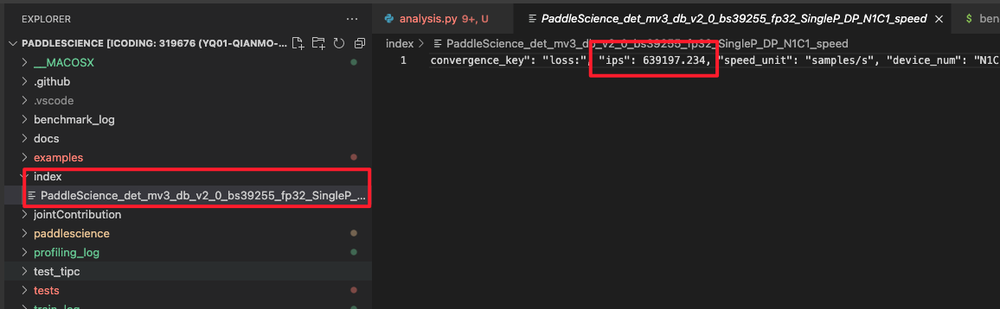

# PaddleScience TIPC benchmark test script 
TIPC功能测试的主程序为benchmark_train.sh，可以测试基于Python的模型训练性能测试功能，包括裁剪、量化、蒸馏。
## 1. Docker enviroment (运行环境)
- docker image: registry.baidubce.com/paddlepaddle/paddle:latest-dev-cuda11.2-cudnn8-gcc82
- paddle = 0.0.0
- paddlescience = v1.0 Beta
- python = 3.7
## 2. 测试结论汇总
| 算法名称 | 模型名称 | 单机单卡 | 单机多卡 | 多机多卡 | 模型压缩（单机多卡） |
|  :----  |   :----  |    :----  |  :----   |  :----   |  :----   |
|  PINNs  | train_2d_unsteady_continuous.py | 正常训练 <br> FP32 | TBD <br> TBD | TBD <br> TBD | TBD <br> TBD |
## 3. 测试流程(以2d非定常圆柱绕流为例子)
安装PaddlePaddle == 0.0.0

Process of running TIPC test (运行benchmark测试步骤)
```
git clone https://github.com/PaddlePaddle/PaddleScience.git
```
```
cd PaddleScience
```
对于benchmark使用的数据有以下要求：
- 训练数据不应过大，过大的数据会导致下载很慢，延长了benchmark的训练时间；
- 训练数据样本数不能过少，至少要保证训练过程稳定，能获取到稳定的ips；

修改此目录下对应案例的txt参数文件，来生成不同log，注意对于训练epoch要修改训练py文件，

```
/workspace/PaddleScience/tests/test_tipc/configs
```
单卡:自动运行打开Profiling
```
export CUDA_VISIBLE_DEVICES=0 
```
```
bash tests/test_tipc/benchmark_train.sh /workspace/PaddleScience/tests/test_tipc/configs/train_2d_unsteady_continuous.txt benchmark_train
```
benchmark训练得到训练日志后，会自动保存训练日志并解析得到ips等信息，日志解析代码位于：
- https://console.cloud.baidu-int.com/devops/icode/repos/baidu/paddle/benchmark-frame/blob/master/tools/scripts/analysis.py
```
wget https://paddle-qa.bj.bcebos.com/benchmark/tools.tar.gz

export BENCHMARK_ROOT=$PWD/tools
```
如果运行成功会生成index文件夹，该目录下面生成jason文件，其中可以找到对应的ips数值

